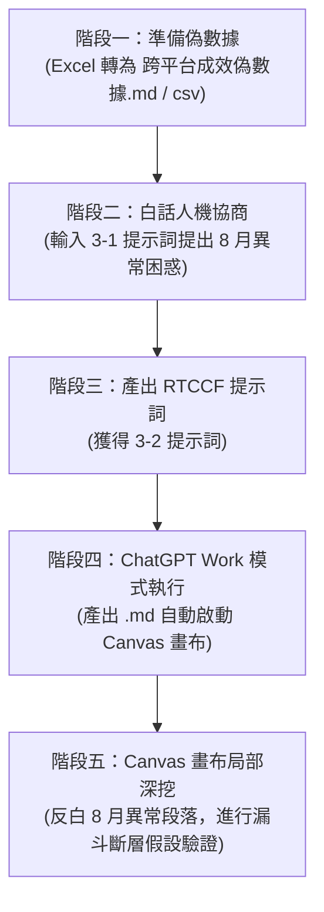

# 實戰範例 03：跨平台成效數據交叉分析與異常診斷

> 🟢 **採用代理平台**：ChatGPT Agent 平台  
> 🛠️ **建議執行模式**：**Work 模式**（將報表儲存為 `.md` 檔案自動啟動 **Canvas 雙欄互動畫布**，讓學員可針對單案異常或特定月報表圈選反白，直接深入對話探討，不影響整份報告結構）

---

## ⚡ 30 秒極速體驗：一鍵複製白話 Prompt 貼給 AI

學員可以直接**一鍵複製**下方這段極簡白話文字（已內嵌省 Token 的 CSV 數據），貼給任何 AI 即可立即體驗「AI 自動架構 RTCCF」：

```text
這是我從 Excel 轉出來的 4~9 月 GA4、FB、IG 行銷數據：

月份,官網工作階段,官網轉換率,官網營業額,FB觸及人數,FB互動率,IG曝光次數,IG個人檔案點擊,廣告預算,備註
2026-04,28500,1.8%,385000,85000,3.2%,142000,1850,30000,春季宣傳
2026-05,31200,2.1%,460000,92000,3.5%,168000,2100,45000,母親節
2026-06,25000,1.6%,310000,78000,2.9%,135000,1600,20000,淡季
2026-07,48000,2.8%,720000,165000,5.8%,310000,4200,80000,夏季芒果季
2026-08,42000,1.9%,520000,190000,6.2%,340000,5100,60000,短影音暴衝但轉換率暴跌
2026-09,33500,2.2%,490000,105000,3.8%,185000,2450,35000,開學常態

老闆問我：為什麼 8 月 FB、IG 觸及創整年新高，但官網轉換率卻從 2.8% 崩跌到 1.9%？錢花去哪了？

請幫我用「RTCCF 框架」寫出專業的跨平台分析提示詞，並指定產出為 Markdown 檔案，方便我在 ChatGPT Canvas 畫布微調。
```

---

## 🎯 案例情境與教學目標

許多職場工作者在彙整跨平台行銷數據（Google Analytics 4 官網流量、Facebook 粉專、Instagram 商業帳號）時，習慣將原始報表整理在 **Excel (.xlsx)** 試算表中。

然而，在 AI 應用實務上有一個極為重要的**關鍵觀念（Best Practice）**：
* ❌ **直接上傳肥大的 `.xlsx` 檔案給 AI**：
  * 會消耗極大量解析 Token 與運算成本。
  * 二進位試算表結構龐雜，AI 容易在工作表（Sheets）或隱藏欄位中「迷航」或格式誤讀。
* ✅ **省 Token 高效工作流**：
  * **先在本地（Excel / 外部工具）將數據另存為 `.csv`，或轉換為極簡的 `Markdown (.md)` 表格**。
  * 複製文字直接貼入對話框，體積縮小 90%、Token 省 80% 以上，且 AI 辨識欄位更精準！

本單元的**核心教學目標**：
1. **傳授 Token 節省心法**：學會將 Excel 試算表轉換為輕量文字數據（`.csv` / `.md`）。
2. **白話人機協商**：學生提出商業異常困惑（8 月社群流量創歷史新高，但官網轉換率為何大跌崩盤？），由 AI 自動提煉架構出專業 **RTCCF 數據分析提示詞**。
3. **Canvas 畫布深挖**：在 ChatGPT 中生成報告後，利用 Canvas 雙欄畫布圈選「8 月異常診斷」段落，直接進行假說驗證與行動清單微調。

---

## 📂 教學模組與素材清單

本資料夾內已備妥完整跨平台數據與提示詞檔案，學生可依序使用：

| 檔案名稱 | 類型 | 說明 |
| :--- | :--- | :--- |
| [`跨平台成效偽數據.xlsx`](./跨平台成效偽數據.xlsx) | 原始檔案 | 職場常見的 Excel 試算表（含 2026 年 Q2～Q3 官網 GA4、FB、IG 原始指標與廣告費）。 |
| [`跨平台成效偽數據.csv`](./跨平台成效偽數據.csv) | 輕量素材 | 從 Excel 另存的 CSV 格式，純文字逗點分隔，省 Token 且通用。 |
| [`跨平台成效偽數據.md`](./跨平台成效偽數據.md) | 輕量素材 | 轉換為 Markdown 表格版本，含指標對照定義與 8 月異常痛點說明。 |
| [`3-1_白話自然語言發想提示詞.txt`](./3-1_白話自然語言發想提示詞.txt) | 提示詞 (輸入) | 學生第一步發送給 AI 的極簡白話指令（已內嵌 CSV 數據，可一鍵複製貼入）。 |
| [`3-2_AI產出之RTCCF數據分析提示詞.txt`](./3-2_AI產出之RTCCF數據分析提示詞.txt) | 提示詞 (成果) | AI 協商產出的標準 RTCCF 交叉分析提示詞，可直接於 ChatGPT 執行。 |

---

## 🚀 完整四階段教學工作流（Step-by-Step）



### 階段一：準備省 Token 數據
打開 [`跨平台成效偽數據.md`](./跨平台成效偽數據.md)（或複製 [`跨平台成效偽數據.csv`](./跨平台成效偽數據.csv) 的純文字）：
* **指標涵蓋**：2026/04 ～ 2026/09 共 6 個月跨平台指標（GA4 工作階段、轉換率、營業額、FB 觸及、FB 互動、IG 曝光、IG 個人檔案點擊、廣告費）。
* **核心異常**：
  * **8 月份「流量繁榮陷阱」**：FB 觸及（19 萬）與 IG 曝光（34 萬）雙雙衝上年度歷史新高，IG 主頁點擊突破 5,100 次，但官網轉換率卻從 7 月的 2.8% 崩跌至 1.9%！

---

### 階段二：白話人機協商（自然語言 ➔ RTCCF）
請學生在任何 AI 對話框直接貼上 [`3-1_白話自然語言發想提示詞.txt`](./3-1_白話自然語言發想提示詞.txt) 的內容。

---

### 階段三：獲取專業 RTCCF 數據分析提示詞
AI 將會迅速提煉出高階結構化提示詞（如 [`3-2_AI產出之RTCCF數據分析提示詞.txt`](./3-2_AI產出之RTCCF數據分析提示詞.txt)）：
* **[Role]**：全通路行銷漏斗與跨平台數據交叉歸因顧問。
* **[Task]**：產出 2026 Q2～Q3 跨平台漏斗分析報告，專題診斷 8 月社群暴衝但轉換脫節異常。
* **[Context]**：高密度省 Token 數據集、三大通路指標對應定義、各月廣告費用。
* **[Constraint]**：拒絕主觀通靈猜測、跨平台指標不可隨意相加、需精準計算 ROAS 與 MoM 成長率。
* **[Format]**：儲存為 `2026_Q2_Q3_跨平台行銷成效交叉分析報告.md`，啟動 Canvas 雙欄畫布。

---

### 階段四：在 ChatGPT Work 模式執行分析
1. 開啟 ChatGPT，切換至 **Work 模式**。
2. 貼入步驟三產出的 RTCCF 提示詞並執行。
3. **體驗亮點**：
   * AI 將會快速產出計算清晰的跨平台漏斗報告與 ROAS 投資報酬分析。
   * 右側視窗將會**自動彈出 Canvas 雙欄互動畫布**！

---

### 階段五：Canvas 畫布實戰深挖（教學核心體驗）

當右側 Canvas 畫布展開後，老師可引導學生體驗**「局部深挖診斷」**：

1. **反白圈選「8 月異常專題深度診斷」**：
   * 在右側畫布中，選取 8 月份轉換率崩跌的分析段落。
   * 在浮動指令框輸入：  
     *「請針對這個現象，補充列出 3 個『可能導致社群高點擊但官網零轉換』的前端技術與行銷漏斗死因（例如手機版購物車載入過久、IG 廣告受眾太泛、登陸頁折扣碼失效）。」*
2. **即時局部擴充**：
   * ChatGPT 會直接在右側畫布上**補充這 3 點漏斗排查清單**，左側對話框同時提供後續 GA4 事件追蹤（Events）的埋設建議。
   * 學生能立刻明白：**透過 Canvas 畫布，AI 不只是一次性給答案，而是成為可以反覆對話打磨的商業顧問！**

---

[← 返回實戰範例庫總覽](../README.md) ｜ [前往範例 01：門市排班檢核](../01_門市人力排班與規則檢核/README.md) ｜ [前往範例 02：社群多格式素材](../02_社群行銷素材多格式產出/README.md)
