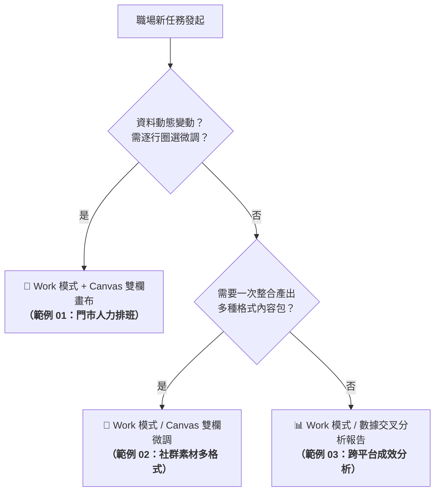

# 🎯 現代職場實戰範例庫

本範例庫精選現代職場高頻常見的真實任務，全面涵蓋**對話排程、多格式行銷內容生成、跨平台數據交叉分析**等場景。所有範例皆依據任務特性，採用最合適的 **AI 代理平台（ChatGPT、Claude.ai、Google Antigravity）** 進行落地示範，並清楚標註每個範例所屬的代理平台與操作模式！

---

## 📚 實戰範例導覽總表

| 範例編號 | 範例主題 | 採用代理平台 | 推薦操作模式 | 核心業務情境 | 交付成品與素材 |
| :---: | :--- | :---: | :--- | :--- | :--- |
| **01** | **[便利超商門市排班與規則檢核](./01_門市人力排班與規則檢核/README.md)** | 🟢 **ChatGPT Agent 平台** | Work 模式 / Canvas 雙欄畫布 | 24 小時三班制、勞基法 11 小時輪班間隔、專職大夜防開天窗、早晚尖峰雙人制 | <ul><li>[門市排班偽素材.md](./01_門市人力排班與規則檢核/門市排班偽素材.md)</li><li>[1-1 白話自然語言提示詞](./01_門市人力排班與規則檢核/1-1_白話自然語言發想提示詞.txt)</li><li>[1-2 AI產出RTCCF提示詞](./01_門市人力排班與規則檢核/1-2_AI產出之RTCCF排班提示詞.txt)</li></ul> |
| **02** | **[社群行銷素材多格式產出](./02_社群行銷素材多格式產出/README.md)** | 🟢 **ChatGPT Agent 平台** | Work 模式 / Canvas 雙欄畫布 | 咖啡新品上市宣傳照、品牌調性、禁用詞、一次產出 IG/FB/官網/短影音分鏡 | <ul><li>[社群行銷活動偽素材.md](./02_社群行銷素材多格式產出/社群行銷活動偽素材.md)</li><li>[2-1 白話自然語言提示詞](./02_社群行銷素材多格式產出/2-1_白話自然語言發想提示詞.txt)</li><li>[2-2 AI產出RTCCF提示詞](./02_社群行銷素材多格式產出/2-2_AI產出之RTCCF行銷提示詞.txt)</li></ul> |
| **03** | **[跨平台成效數據交叉分析](./03_跨平台成效數據交叉分析/README.md)** | 🟢 **ChatGPT Agent 平台** | Work 模式 / Canvas 雙欄畫布 | Excel 轉文字省 Token、GA4/FB/IG 跨平台漏斗比對、8 月流量暴衝但轉換暴跌異常診斷 | <ul><li>[跨平台成效偽數據.md](./03_跨平台成效數據交叉分析/跨平台成效偽數據.md)</li><li>[3-1 白話自然語言提示詞](./03_跨平台成效數據交叉分析/3-1_白話自然語言發想提示詞.txt)</li><li>[3-2 AI產出RTCCF提示詞](./03_跨平台成效數據交叉分析/3-2_AI產出之RTCCF數據分析提示詞.txt)</li></ul> |

---

## ⚡ 核心人機協商工作流示範（以範例 03 數據分析為例）

為協助學生掌握「白話發想 ➔ 讓 AI 自動提煉專業 RTCCF」的精髓，下方提供可直接 **一鍵複製（Copy）** 的 Markdown 代碼區塊：

### 階段二：白話人機協商（自然語言 ➔ RTCCF）
> 學生只需複製以下白話內容（已內嵌 Excel 轉出的省 Token CSV 數據），貼給任何 AI（ChatGPT、Claude 均可）：

```text
這是我從 Excel 轉出來的 4~9 月 GA4、FB、IG 行銷數據：

月份,官網工作階段,官網轉換率,官網營業額,FB觸及人數,FB互動率,IG曝光次數,IG個人檔案點擊,廣告預算,備註
2026-04,28500,1.8%,385000,85000,3.2%,142000,1850,30000,春季宣傳
2026-05,31200,2.1%,460000,92000,3.5%,168000,2100,45000,母親節
2026-06,25000,1.6%,310000,78000,2.9%,135000,1600,20000,淡季
2026-07,48000,2.8%,720000,165000,5.8%,310000,4200,80000,夏季芒果季
2026-08,42000,1.9%,520000,190000,6.2%,340000,5100,60000,短影音暴衝但轉換率暴跌
2026-09,33500,2.2%,490000,105000,3.8%,185000,2450,35000,開學常態

老闆問我：為什麼 8 月 FB、IG 觸及創整年新高，但官網轉換率卻從 2.8% 崩跌到 1.9%？錢花去哪了？

請幫我用「RTCCF 框架」寫出專業的跨平台分析提示詞，並指定產出為 Markdown 檔案，方便我在 ChatGPT Canvas 畫布微調。
```

---

### 階段三：獲取專業 RTCCF 數據分析提示詞
> 執行階段二後，AI 會自動產出如下結構完整的 RTCCF 提示詞。學生可直接**整段複製**，貼入 ChatGPT 的 **Work 模式** 執行：

```text
[Role]
你是一位專精於電商增長、全通路行銷漏斗（Full-Funnel Marketing）與跨平台數據交叉歸因分析的「資深商業數據分析顧問（Senior Marketing Data Analyst）」。你具備敏銳的商業直覺，能跳脫單一數字表象，從跨平台指標落差中精準診斷行銷斷層。

[Task]
請針對提供的品牌 2026 年 Q2～Q3（4月～9月）跨平台行銷成效數據，進行深度的「跨平台漏斗交叉對比」與「異常波動診斷報告」，特別鎖定 8 月份「社群流量暴衝但官網轉換率暴跌」的脫節現象，並提出可落地的優化行動清單。

[Context]
本數據為從 Excel 轉化之高密度、省 Token 數據集，涵蓋 6 個月份之三個核心行銷通路：
- 通路一：品牌官網（GA4 工作階段、轉換率 CR%、營業額）
- 通路二：Facebook（不重複觸及 Reach、互動率 Engagement%）
- 通路三：Instagram（曝光次數 Impressions、個人檔案點擊 Profile Clicks）
- 附加資訊：各月份廣告花費與重大行銷事件（如 5 月母親節、7 月芒果季爆款、8 月短影音暴衝）。

指標對照定義：
1. 頂部流量漏斗：官網工作階段 ↔ FB 觸及 ↔ IG 曝光
2. 中部興趣互動：FB 貼文互動率 ↔ IG 主頁連結點擊
3. 底部轉換營收：官網轉換率 ↔ 營業額 ↔ ROI (營業額 / 廣告花費)

[Constraint]
1. 嚴禁無依據通靈猜測：不要空泛推測原因，分析必須基於數據事實，提出至少 3 個具體的「可能漏斗斷層假說」與後續「建議驗證方法（如檢查 GA4 流量來源管道、手機版載入速度或跳出率）」。
2. 指標口徑嚴禁混淆：三個平台定義不同，絕對不可直接將「FB 觸及」與「IG 曝光」相加作為單一指標。
3. 計算精確性：需計算各月行銷投資回報（ROAS / 簡易 ROI）與關鍵指標月增長率 (MoM%)。

[Format]
請直接將產出內容儲存為 Markdown 檔案（檔名：`2026_Q2_Q3_跨平台行銷成效交叉分析報告.md`），以啟動雙欄畫布（Canvas），方便進行逐項診斷與決策微調。
檔案內容結構必須包含：
1. 【跨平台成效總覽與 ROI 矩陣表】（整合計算各月 ROAS 與關鍵指標）
2. 【漏斗交叉比對分析】（頂部觸及、中部興趣到最終下單轉換的流失點）
3. 【8 月異常專題深度診斷：流量繁榮陷阱】（深度剖析為何社群創歷史新高但官網轉換大跌）
4. 【7 月爆款 vs 5 月檔期成效對比與啟示】
5. 【下一步行銷檢討與數據埋設改善清單】（條列式可執行步驟）
```

---

## 💡 三大範例的工具選型心法



---

[← 返回常見的 AI 應用總覽](../README.md) ｜ [前往 ChatGPT Canvas 畫布雙欄協作實戰](../../chatGPT/03_Canvas/README.md)
