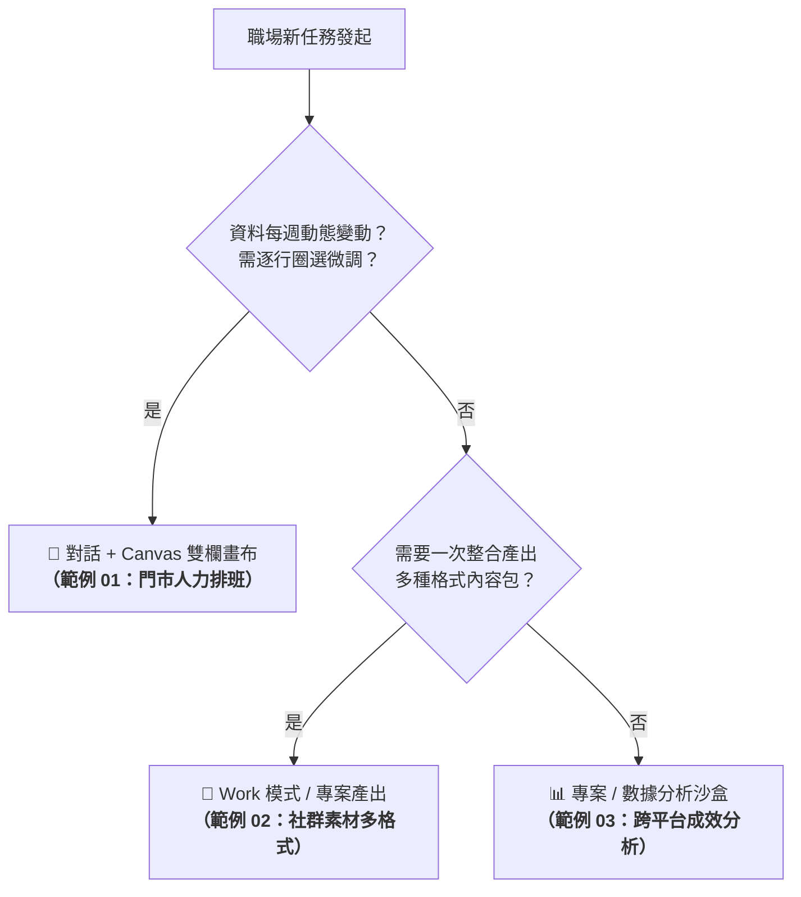

# 🎯 現代職場實戰範例庫

本範例庫精選現代職場高頻常見的真實任務，全面涵蓋**對話排程、多格式行銷內容生成、跨平台數據交叉分析**等場景。所有範例皆依據任務特性，採用最合適的 **AI 代理平台（ChatGPT、Claude.ai、Google Antigravity）** 進行落地示範，並清楚標註每個範例所屬的代理平台與操作模式！

---

## 📚 實戰範例導覽總表

| 範例編號 | 範例主題 | 採用代理平台 | 推薦操作模式 | 核心業務情境 | 交付成品與素材 |
| :---: | :--- | :---: | :--- | :--- | :--- |
| **01** | **[門市人力排班與規則檢核](./01_門市人力排班與規則檢核/README.md)** | 🟢 **ChatGPT Agent** | 對話 (Chat) / Canvas 雙欄畫布 | 每週多員工可排時段、證照限制、勞基法工時上限與防呆檢核 | <ul><li>[素材檢核表.md](./01_門市人力排班與規則檢核/素材檢核表.md)</li><li>[排班提示詞.txt](./01_門市人力排班與規則檢核/門市人力排班提示詞.txt)</li></ul> |
| **02** | **[社群行銷素材多格式產出](./02_社群行銷素材多格式產出/README.md)** | 🟢 **ChatGPT Agent** | 專案 (Projects) / Work 模式 | 一次產出 IG 貼文、FB 故事文、官網 3 標題、短影音 15s/30s 腳本與封面文案 | <ul><li>[多格式產出提示詞.txt](./02_社群行銷素材多格式產出/社群素材多格式產出提示詞.txt)</li></ul> |
| **03** | **[跨平台成效數據交叉分析](./03_跨平台成效數據交叉分析/README.md)** | 🟢 **ChatGPT Agent** | 專案 (Projects) / ADA 數據分析沙盒 | GA4、FB、IG 三平台指標對齊、CSV 趨勢交叉比對與 ±30% 異常波動診斷 | <ul><li>[成效分析專案指令.txt](./03_跨平台成效數據交叉分析/跨平台成效分析專案指令.txt)</li></ul> |

---

## 💡 三大範例的工具選型心法

---

[← 返回常見的 AI 應用總覽](../README.md) ｜ [前往 ChatGPT Canvas 畫布雙欄協作實戰](../../chatGPT/03_Canvas/README.md)
