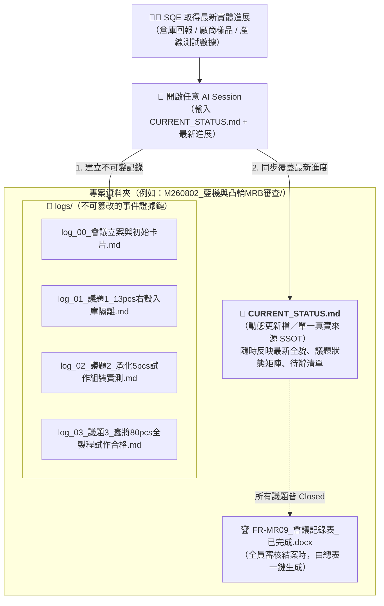

# 步驟 5：多日專案狀態保存與事件記錄機制（文件快照保存法）

> 💡 **核心架構定位**：  
> 在前面步驟中，我們學會了 **Human-in-the-Loop（人機審核中斷點）**，解決了「單次對話中 AI 不得越權直接產檔」的風險控制問題。  
> 然而在真實製造業與品質工程實務中，**一場 MRB 會議或品質異常案絕非一天就能結案**：
> - 零件外觀泛黃需要生管／倉管實體盤點與入庫隔離。
> - 公差問題需要供應商重新送 5pcs 樣品，並排定產線組裝實測。
> - 熱處理與電鍍問題需要跑 80pcs 全製程試作，往往歷時 1~2 週。
> 
> **若將專案進度完全寄託在 AI 的聊天視窗（Chat Session），將面臨瀏覽器關閉、上下文長度遺忘、下班無法交接的致命風險！**  
> 本篇所提供的**「文件快照保存法（專案資料夾 ＋ 事件記錄檔 ＋ 狀態更新檔）」**，正是解決多日跨期專案狀態保存的最佳解法。

---

## 🏗️ 核心架構思維：解耦對話視窗，以實體檔案為單一真實來源



### 兩大核心支柱：
1. **事件記錄檔（`logs/log_XX_事件名稱.md`，只增不減的證據鏈）**：  
   每推進或完成一件問題，就由 AI 產出一個獨立的 Markdown 檔。記錄時間、執行人員、實體物料動作與檢驗數據，符合 ISO 9001 / IATF 16949 的稽核追溯（Audit Trail）要求。
2. **動態更新檔（`CURRENT_STATUS.md`，隨時保持最新的總表）**：  
   整個專案永遠只有一份總表作為單一真實來源（Single Source of Truth, SSOT）。每當產出一個新的 log 記錄檔，AI 便同步更新總表。無論隔幾天或換誰接手，任何人打開此檔便能 1 秒看懂目前最新戰況。

---

## 📁 標準案件資料夾目錄結構

建議為每一次獨立的 MRB 或品質異常案件，建立專屬資料夾：

```text
M260802_藍機與凸輪MRB異常審查/
│
├── 📌 CURRENT_STATUS.md           <-- 【更新檔】永遠保持最新狀態的總表
├── 00_原始會議逐字稿素材.md       <-- 會議當天的原始逐字稿（存檔備查，不變動）
│
├── 📂 logs/                      <-- 【記錄檔資料夾】每推進或解決一個問題建立一個
│   ├── log_00_會議立案與初始卡片.md
│   ├── log_01_議題1_13pcs右殼入庫隔離完成.md
│   ├── log_02_議題2_承化5pcs試作組裝實測.md
│   └── log_03_議題3_鑫將80pcs全製程試作檢驗合格.md
│
└── 🏆 FR-MR09_會議記錄表_已完成.docx  <-- 當全部議題結案時，由 CURRENT_STATUS 一鍵生成
```

---

## 📄 兩大檔案之標準格式範本

### 範本 1：動態更新檔 `CURRENT_STATUS.md`（隨時被最新狀態覆蓋）

```markdown
# MRB 品質審查案件追蹤總表：M260802
* **案件主旨**：藍機右殼 / 黏結凸輪 / 黏結下齒板異常審查
* **主責 SQE**：楊子賢（資材處 SQE）
* **最後更新時間**：2026-08-16 16:30
* **案件進度**：🟡 處理中（共 3 項議題：1 項已結案、1 項組裝測試中、1 項排單試作中）
* **最新事件記錄**：`logs/log_02_議題2_承化5pcs試作組裝實測.md`

---

## 📊 議題最新推進矩陣

| 議題編號與零件 | 當前狀態 | 最新推進進展與數據依據 | 待決事項 / 下一步行動 |
| :--- | :---: | :--- | :--- |
| **議題 1：藍機右殼**<br/>`L93XXAR1` | 🟢 **已結案 (Closed)** | 13pcs 泛黃不良品已全數貼標移入 B2 保留管制倉隔離；其餘正常庫存已放行配套出貨。依據：`log_01` | 無後續風險。 |
| **議題 2：黏結凸輪**<br/>`92XX079` | 🟡 **驗證中 (In Progress)** | 承化已交樣 5pcs（19.5°-20°），生管組裝手感順暢；啟動行程量測為 1.82mm（規格上限 1.85mm）。依據：`log_02` | 待研發主管進行邊界尺寸安全性判定簽核。 |
| **議題 3：黏結下齒板**<br/>`93XXAO2` | ⏳ **等待試作 (Pending)** | 鑫將排定 80pcs 試作批，預計走完「加工 ➔ 熱處理 ➔ 噴砂 ➔ 電鍍」全製程。 | 追蹤 08/20 全製程尺寸檢驗報告。 |

---

## 📋 待辦事項清單追蹤（Action Items）
- [x] **AI-1**：13pcs 泛黃右殼實施隔離管制並鎖定系統（負責人：倉管課 / 完成日：08/14）
- [x] **AI-2**：承化交樣 5pcs 凸輪試作件（負責人：承化、資材處 / 完成日：08/15）
- [ ] **AI-3**：量測 5pcs 凸輪開關啟動行程並簽核（負責人：品保處、研發處 / 預計：08/17）
- [ ] **AI-4**：鑫將完成 80pcs 下齒板試作與報告（負責人：鑫將、二廠加工組 / 預計：08/20）
```

---

### 範本 2：單一事件記錄檔 `logs/log_01_議題1_13pcs右殼入庫隔離完成.md`（只增不減）

```markdown
# 事件記錄 Log 01：議題 1 藍機右殼隔離完成
* **事件記錄時間**：2026-08-14 10:30
* **記錄人員**：楊子賢 (SQE)
* **關聯議題**：議題 1 藍機右殼（料號：`L93XXAR1`）
* **涉及單位**：資材處、倉管課、生管課

---

### 一、執行動作與實體證據
1. 倉庫已完成庫存實體全面盤點，確認泛黃貼面板共計 13pcs。
2. 實體物料已張貼黃色品管不合格/保留標籤（標籤單號：`MRB-HOLD-2608-01`）。
3. 實體物料已全數移轉至 B2 樓保留管制倉，ERP 系統已完成批號鎖定，防止產線誤領。
4. 白色斑點部分（經查歷史接收標準允收）與正常外觀庫存已解除管控，正常調撥組裝配套出貨。

### 二、判定結論
* ✅ **議題 1 處置正式完畢並結案（Status: CLOSED）**。
* 後續待辦：品保處將於 2026 年底前針對長期庫存材料制定定期防老化複驗機制。
```

---

## 🤖 實戰提示詞：雙向同步與新記錄生成

當專案進行數天後，您收到任何進展（例如產線量測數據回報、供應商樣品到料），只要開啟任何一個**全新的 AI 對話**，上傳或貼上 `CURRENT_STATUS.md`，並執行以下提示詞：

```markdown
【SQE 跨日專案事件推進與雙向同步提示詞】

我是資材處 SQE 楊子賢。
這是我手邊正在進行的 MRB 品質案件最新總表（請參考附檔/上方 CURRENT_STATUS.md）。

今天（2026-08-15）收到產線與廠商的最新回報如下：
「
承化已於今日下午送達 5pcs 黏結凸輪（加工角度 19.5°~20°）試作件。
生管與製造課組裝人員於現場完成對照組裝，回報手感平順無干涉；
品保處使用投影機量測開關啟動行程，實測數據平均為 1.82mm（規格極限為 1.85mm），
雖未超差但接近上限，需請研發主管進一步評估。
」

請協助我執行以下兩項任務：
1. 【生成不可變事件記錄檔】：
   請產出 `logs/log_02_議題2_承化5pcs試作組裝實測.md` 的完整 Markdown 內容，記錄人事時地物、量測數值與當前結論。
2. 【同步更新狀態總表】：
   請根據上述事件，同步產生一份最新的 `CURRENT_STATUS.md` 內容：
   - 更新案件進度與最後更新時間。
   - 更新議題矩陣中「議題 2」的最新進展、數值依據與下一步行動。
   - 將 Action Items 中 AI-2 勾選完成，並維持或更新其餘事項。
```

---

## 🏆 結案時刻：一鍵產出正式 Word 驗收表

當專案經過數天或數週推進，所有議題在 `CURRENT_STATUS.md` 中均已顯示為 **🟢 已結案 (Closed)** 且所有 Action Items 皆已勾選完成：

直接將最新的 `CURRENT_STATUS.md` 交付給 [**`步驟 4 的 Python 產檔程式碼`**](./6-4_生成MRB會議記錄表Word發布檔提示詞.md)，即可在一秒之內將這份歷經數天追蹤、數據扎實完整的案件總表，自動排版轉換成製造業正式核准發布的 **《FR-MR09 會議記錄表.docx》**！

---

## 💡 總結：兩種機制的完美分工

| 評比維度 | Human-in-the-Loop（步驟 3） | 文件快照保存法（步驟 5） |
| :--- | :--- | :--- |
| **核心目的** | 單次工作流程中的**決策權限控制**與防呆 | 跨多天、多議題的**專案生命週期與記憶持久化** |
| **解決痛點** | 避免 AI 未經人類授權擅自發布正式公文 | 避免跨天、換電腦或關閉瀏覽器造成對話遺失 |
| **操作形式** | 暫停中斷點（Breakpoint）＋ 核准/微調/駁回 | 專案資料夾 ＋ 事件 logs/ ＋ 單一更新總表 |
| **產物特性** | 暫時性核對卡片 | 永久性稽核證據鏈（Audit Trail）與最新總表（SSOT） |
