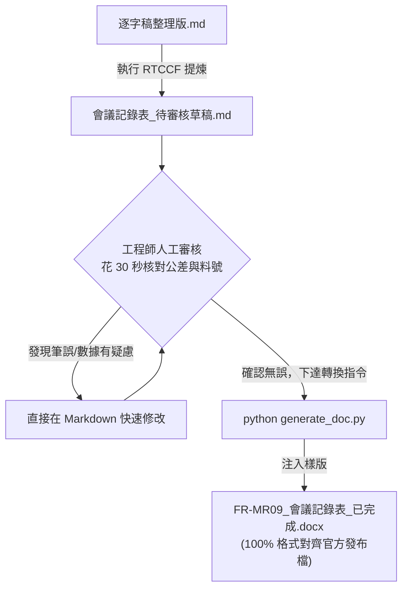

# SQE 品保會議記錄與表單自動化實戰

> 🛠️ **完整工作流閉環**：  
> **下載辦公室原始檔 ➔ 轉化為人類易讀逐字稿 ➔ 複製自然語言生成 RTCCF 提示詞 ➔ AI 產出 Markdown 草稿人機核對 ➔ 官方 Word 樣版無損注入 ➔ 100% 完全對齊正式公文**

---

## 📥 學員實戰素材下載專區

學生在進行本單元實作時，可直接點擊下方連結下載原始素材與樣版檔案進行操作：

* **原始會議錄音逐字稿 Word 檔**：[下載 20260813_MRB會議逐字稿_原始檔.docx](./原始檔/20260813_MRB會議逐字稿_原始檔.docx)（8,665 字連續口語無換行文字牆）
* **公司官方最後輸出格式 Word 檔**：[下載 FR-MR09 v01 會議記錄表-最後輸出格式.doc](./原始檔/FR-MR09%20v01%20會議記錄表-最後輸出格式.doc)（官方排版規範與 11 處室會簽標準）
* **已改製之 Jinja2 官方 Word 樣版**：[下載 FR-MR09_v01_會議記錄表_樣版.docx](./FR-MR09_v01_會議記錄表_樣版.docx)（含動態表格行迴圈）
* **一鍵自動注入產檔 Python 腳本**：[下載 generate_doc.py](./generate_doc.py)
* **最終 100% 完全對齊正式發布成果**：[下載 FR-MR09_會議記錄表_已完成.docx](./FR-MR09_會議記錄表_已完成.docx)

---

## 🎯 專案核心價值與痛點解方

在製造業與企業辦公室中，SQE（供應商品質工程師）整理會議記錄面臨三大痛點：
1. **逐字稿宛如文字牆**：語音辨識輸出的原始逐字稿充斥大量口語、同音錯字與情緒字眼，且無斷行，人類通讀費時，直接餵給 AI 又浪費 70% Token 且容易看漏關鍵料號。
2. **AI 手刻 Word 必定跑版**：若叫 AI 用程式碼從空白頁手刻 Word 表格，字型、欄寬、跨頁與 11 處室會簽框每次都走樣，無法作為正式發布公文。
3. **品質數據絕不能有幻覺**：公差差 0.5 度或料號記錯會導致產線停線或退貨，絕不能讓 AI 盲目產檔直接發布，必須有「人機協同核對閘門（Human-in-the-Loop）」。

---

## 📂 重構後專案檔案結構清單

```text
SQE品保會議與表單自動化/
├── README.md                           # 專案實戰教學總指引（本文件）
├── 原始檔/                              # 學生操作原始檔案
│   ├── 20260813_MRB會議逐字稿_原始檔.docx  # 現場錄音逐字稿原始 Word 檔
│   └── FR-MR09 v01 會議記錄表-最後輸出格式.doc # 公司官方格式標準檔
├── 20260813_MRB會議逐字稿_整理版.md          # 【任務 1】重整為段落分明、人類易讀的優質逐字稿
├── FR-MR09_v01_會議記錄表_樣版.docx         # 【任務 2】將輸出格式改製之 Jinja2 佔位符 Word 樣版
├── 會議記錄表_待審核草稿.md                 # 【任務 3 前置】結構化 Markdown 草稿，供人工檢查核對
├── generate_doc.py                     # 【任務 3 轉換】使用者確認無誤後，一鍵轉換產檔腳本
└── FR-MR09_會議記錄表_已完成.docx          # 【最終成果】100% 格式完全對齊官方規範之 Word 正式公文檔
```

---

## 🚀 核心實戰流程教學

### 實戰 1：將原始逐字稿 docx 轉成「人類可以看的 Markdown」

#### 1. 為什麼要轉為 Markdown？
* **消除 8,665 字文字牆**：原始錄音檔無斷句換行，經由 AI 重整後依主題分章、依發言輪替切段，人類工程師 3 分鐘即可通讀掌握全貌。
* **校正語音辨識同音錯字**：將「幼可」校正為「右殼」、「屁子」校正為「pcs」、「新醬」校正為「鑫將」、「成花」校正為「承化」、「主響」校正為「竹翔」。
* **節省 70% Token 且掃除二進位雜訊**：去除 Word 二進位封裝的隱藏標籤，大幅提升後續 AI 結構化擷取的精準度。

#### 2. 轉換提示詞範例（可直接複製給 AI 執行）
```text
請讀取「原始檔/20260813_MRB會議逐字稿_原始檔.docx」，將其轉換為結構清晰、段落分明、適合人類通讀的 Markdown 檔：
1. 嚴格保留所有發言細節、工程料號與公差數字，嚴禁刪減或捏造內容。
2. 辨識語意並修正語音辨識常見錯字（幼可改為右殼、屁子改為 pcs、成花改為承化、主響改為竹翔、新醬改為鑫將）。
3. 依照會議三大討論主軸劃分章節（議題一：藍機右殼外觀、議題二：黏結下齒板長度修整與全製程試作、議題三：黏結凸輪公差與組裝驗證）。
4. 每一段對話明確標注發言角色（品保/SQE 楊子賢、技術長 謝華賢、資材/採購、生產/組裝），段落分明。
5. 輸出存檔為「20260813_MRB會議逐字稿_整理版.md」。
```

---

### 實戰 2：學生複製「白話自然語言」➔ 讓 AI 產生包含 RTCCF 格式的 Prompt

許多初學者不知道如何撰寫結構嚴謹的 Prompt。本工作流教學生先用一段「白話自然語言」向 AI 發問，讓 AI 自動產生符合 **RTCCF（Role 角色, Task 任務, Context 背景, Constraints 限制, Format 格式）** 的專業提示詞。

#### 步驟 A：學生複製以下「白話自然語言」丟給 AI（ChatGPT / Claude / Gemini）
```text
你是一位資深的企業 AI 流程架構師與品質工程（SQE）自動化專家。

我是製造業資深品保工程師，剛開完一場跨部門 MRB（材料審查委員會）會議。我手邊有一份現場錄音整理的逐字稿「20260813_MRB會議逐字稿_整理版.md」，以及一份公司標準的 Word 表單「FR-MR09_v01_會議記錄表_樣版.docx」。

我希望你能幫我設計一個符合專業「RTCCF」框架（Role 角色、Task 任務、Context 背景、Constraints 限制、Format 格式）的高品質提示詞。

這個提示詞的目的是：
1. 讓 AI 扮演資深 SQE 主任稽核員，閱讀會議逐字稿。
2. 去除口語贅詞，嚴禁捏造數據，提煉出三大議題（現況、主要問題/品質風險、結論）與待辦事項清單。
3. 輸出一個乾淨的 Markdown 草稿（會議記錄表_待審核草稿.md），讓工程師在產出 Word 前先花 30 秒核對公差與料號是否正確。
4. 格式必須能精準對應官方 Word 樣版的欄位，確認無誤後能透過 Python 腳本自動填入。

請幫我產出這份包含完整 RTCCF 格式的提示詞！
```

#### 步驟 B：AI 產生之標準「RTCCF 提煉提示詞」（學生可直接複製拿去執行提煉）
```markdown
# Role (角色定位)
你是一位擁有 25 年製造業經驗的資深供應商品質工程師（SQE）與品質管理系統（QMS）主任稽核員。你極度熟悉 MRB 材料審查、進料管制、公差分析與工程變更流程。你的文字嚴謹、客觀、具專業工程說服力。

# Task (核心任務)
請詳細閱讀《20260813_MRB會議逐字稿_整理版.md》，進行深度工程語意提煉與結構化整理。
產出一份供工程師審查確認的 Markdown 文件《會議記錄表_待審核草稿.md》，內容包含表頭資訊、三大核心工程決策核對點、結構化議題段落，以及待辦事項清單。

# Context (背景情境)
本次會議為跨部門 MRB 緊急會議，針對藍機右殼（L93XXAR1）外觀泛黃、黏結下齒板（93XXAO2）長度 24.1mm 修整、黏結凸輪（92XX079）19° 公差放寬進行處置判定。會議發言充斥口語與爭論，需去蕪存菁，轉化為符合品保稽核要求的正式公文記錄。

# Constraints (嚴格防呆限制)
1. 【零臆測（Zero Hallucination）】：料號（L93XXAR1、93XXAO2、92XX079）、數量（13pcs、5pcs、80pcs）、尺寸與公差（19° ±0.5°、19.5°-20°、24.1mm）必須 100% 忠於原始發言，嚴禁任何捏造。
2. 【術語專業化】：去除口語情緒詞，轉化為品質標準術語（如「外觀泛黃劣質品先行管制入保留倉」、「小批量對照組裝功能驗證」）。
3. 【決策邊界防呆】：凸輪決策為「暫不放寬公差，先以 19.5°-20° 取 5pcs 對照組裝驗證」，嚴禁誤寫為「正式放寬公差」。下齒板 80pcs 必須走完「加工 ➔ 熱處理 ➔ 噴砂 ➔ 電鍍 ➔ 檢驗」完整製程。
4. 【人機核對卡設計】：在文件最上方設計「SQE 三大核心工程數據核對卡」，讓工程師能在 30 秒內完成關鍵數值驗證。

# Format (輸出 Markdown 格式)
請輸出包含以下章節的 Markdown 格式：
1. 📋 表頭基本資訊（會議名稱、主旨、編號、時間、地點、主席、記錄人）
2. 🔍 SQE 三大核心工程數據核對卡（核對清單 Checkbox）
3. 📝 會議詳細內容（依序包含 3 個議題之 1.1 現況、1.2 主要問題/品質風險、1.3 會議結論）
4. 📌 三、待辦事項追蹤表（Markdown 表格：任務內容、負責人、預計完成時間）
5. 🏢 11 處室官方會簽核准欄標記
```

---

### 實戰 3：如何將「最後輸出格式.doc」轉成有佔位字符樣版的方式

#### 1. 核心理念：版面歸 Word 樣版，數據歸 AI
不要讓 AI 用 Python 程式碼手刻 Word 表格！由 Word 樣版鎖死官方格式（Logo、邊距、字體、11 處室會簽框線），程式僅負責將資料填入佔位符，達到 100% 零跑版。

#### 2. 樣版改製四步驟（以官方 FR-MR09 表單為例）：
1. **格式另存為 `.docx`**：
   原始檔 `FR-MR09 v01 會議記錄表-最後輸出格式.doc` 為舊版 Word 97-2003 格式，先用 Word 開啟，選擇「另存新檔」為 `.docx`（`docxtpl` 依賴現代 docx 之 XML 架構）。
2. **固定表頭欄位標籤化**：
   * 開會日期：`{{ year }} 年 {{ month }} 月 {{ day }} 日`
   * 主旨與編號：`{{ subject }}`、`{{ meeting_no }}`
   * 時間：`{{ start_h }} 時 {{ start_m }} 分至 {{ end_h }} 時 {{ end_m }} 分`
   * 人員地點：`{{ chair }}`（主持人）、`{{ location }}`（地點）、`{{ recorder }}`（記錄人）
3. **議題表格動態列迴圈（`docxtpl` 專屬標籤）**：
   * **整列迴圈**：在議題列最前端填入 ``，最末端填入 ``（`tr` 代表 table row，表示該列會依議題數量動態複製）。
   * **段落迴圈**：在儲存格內使用 `` 與 ``（`p` 代表 paragraph，動態產生段落）。
   * **條列清單迴圈**：使用 `{{ b }}` 動態輸出條列內容。
4. **待辦事項表格動態列迴圈**：
   在待辦表格的資料列填入：
   * 開頭：``
   * 欄位：`{{ d.task }}` | `{{ d.owner }}` | `{{ d.due }}`
   * 結尾：``
5. **固定表格完整保留**：
   「11 處室會簽欄」（總經理、技術長、品保處、資材處、生產處、製造課、生管課、業務課、行銷處、標準課、倉管課）原封不動保留，不放任何動態標籤。

#### 3. 樣版排坑技巧：
在 Word 中輸入 `{{` 變數 `}}` 時，若中斷或改字型，Word 會在底層 XML 中切碎標籤，造成無法辨識。**最佳做法：在純文字記事本打好整組標籤，再一次複製貼入 Word 儲存格**。

---

### 實戰 4：逐字稿輸出 Word 前的人機審核機制（確認無誤才轉換）



#### 步驟 1：產出審核草稿 Markdown
AI 執行 RTCCF 提示詞後，產出結構化的「會議記錄表_待審核草稿.md」。

#### 步驟 2：工程師 30 秒重點檢查（三大核心決策）
工程師開啟該草稿檔案，重點確認核對卡的三大判定：
1. **藍機右殼（L93XXAR1）**：管制數量是否為 13 pcs？處置方式是否為「先行管制，納入保留倉」（嚴禁直接報廢）？
2. **黏結凸輪（92XX079）**：是否「暫不直接放寬公差」，而是以 19.5°-20° 取 5 pcs 進行小批量組裝驗證？
3. **黏結下齒板（93XXAO2）**：試作數量是否為 80 pcs？長度修整 24.1mm？熱處理改由鑫將執行且需完整走完全製程？

#### 步驟 3：使用者確認可以轉換，執行產檔
當工程師檢查完畢並確認可以轉換時，在終端機執行轉換腳本：
```bash
python generate_doc.py
```
（若使用 uv 套件管理環境，可執行：`uv run --with docxtpl python generate_doc.py`）

程式讀取確認後的資料，1 秒內無損注入「FR-MR09_v01_會議記錄表_樣版.docx」，輸出正式的「FR-MR09_會議記錄表_已完成.docx」！

---

## 🏆 效益成果對照

| 評估面向 | 傳統人工手打 | 讓 AI 從空白手刻 Word | 本專案重構後工作流 |
| :--- | :--- | :--- | :--- |
| **作業耗時** | 手工整理打字需 3 ~ 4 小時 | 調程式排版需 1 ~ 2 小時 | **全程不到 1 分鐘（秒級自動產檔）** |
| **排版穩定度** | 易因手動調整導致欄寬走樣 | ❌ 嚴重跑版、會簽欄破碎消失 | ✅ **100% 繼承官方樣版，完全不跑版** |
| **數據安全性** | 容易人工眼花筆誤 | ❌ AI 幻覺難以即時發現 | ✅ **Markdown 核對卡把關，確保零幻覺** |
| **動態擴充性** | 表格行數變動需手動增刪 | ❌ 程式寫死行數容易溢出邊界 | ✅ **`` 動態行迴圈，彈性極高** |
| **維護成本** | 每次開會都重新排版 | ❌ 表單微調程式碼全部重寫 | ✅ **直接在 Word 修改樣版，代碼零改動** |
