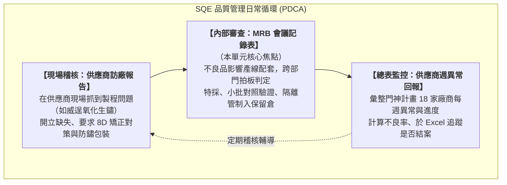
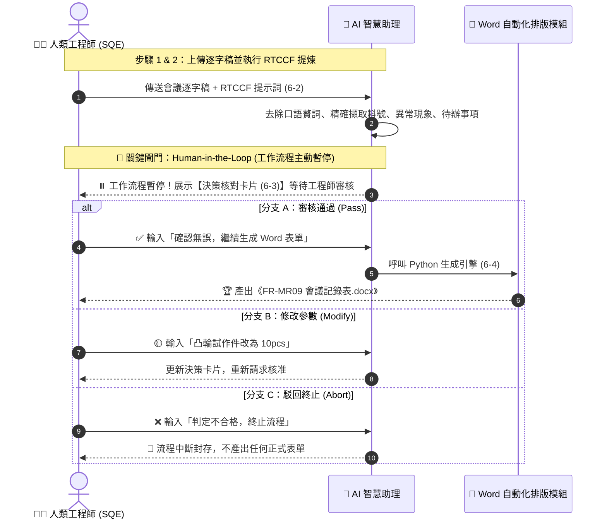

# 實戰範例：SQE 品保會議記錄與表單自動化（Human-in-the-Loop 人在迴路／人機協同）

> 🟢 **採用代理平台**：ChatGPT / Claude / Google Antigravity  
> 🛠️ **建議執行模式**：**語音逐字稿結構化擷取 ＋ Human-in-the-Loop 審核中斷點 ＋ Python 自動產檔**  

---

## 🏆 最終完成作品展示（實作成果搶先看）

> 📥 **驗收完成品直接下載與檢視**：  
> 👉 [**`FR-MR09_會議記錄表_已完成.docx`**](./FR-MR09_會議記錄表_已完成.docx)  
> *（這是本專案經過「現場會議錄音 ➔ 逐字稿 ➔ 語意提煉 ➔ **Human-in-the-loop 人工審核確認** ➔ Python 自動生成」後產出的製造業標準 MRB 材料審查委員會正式會議記錄表）*

本專案針對電子與精密製造業中最關鍵的「MRB 材料審查委員會（Material Review Board）」，精準提煉 3 項重大零件異常議題，並輸出 100% 符合品保稽核標準的正式表單：
1. **完整基本資訊與 11 處室會簽欄**：精確記錄會議主旨（`M260802`）、時間地點、主持人、記錄人，並生成包含「總經理、技術長、品保處、資材處、生產處、製造課、生管課、業務課、行銷處、標準課、倉管課」之完整會簽表格。
2. **三大異常議題結構化決策**：
   - **藍機右殼（`L93XXAR1`）**：外觀泛黃與白色斑點問題 ➔ 決議 13pcs 管制入保留倉，合格品加速配套出貨。
   - **黏結凸輪（`92XX079`）**：角度公差原 `19° ±0.5°` 申請放寬至 `±1°` ➔ 決議嚴禁直接放寬，改採 `19.5°-20°` 進行 5pcs 小批量對照組裝功能驗證。
   - **黏結下齒板（`93XXAO2`）**：熱處理黑痕改善 ➔ 決議執行 80pcs 全製程試作驗證批（加工 ➔ 熱處理 ➔ 噴砂 ➔ 電鍍 ➔ 最終尺寸確認）。
3. **待辦事項追蹤表（Action Items）**：以深藍高質感排版（#2B4C7E）清晰條列 6 項後續行動、主責人員與截止期限。

---

## 📊 完成作品外觀預覽

### 表格 1：【MRB 會議基本資料與跨部門會簽欄】
*深藍標題（#1A365D）與淺灰底色（#EDF2F7），呈現跨部門嚴謹管制氛圍：*

| 欄位名稱 | 填寫內容 | 欄位名稱 | 填寫內容 |
| :---: | :--- | :---: | :--- |
| **會議日期** | 2026年08月13日 | **會議主旨** | 藍機右殼 / 黏結凸輪 / 下齒板異常審查 (M260802) |
| **開會時間** | 15:30 ~ 16:06 | **開會地點** | 泛源會議室 |
| **會 主 持** | 謝華賢 (技術長) | **記    錄** | 楊子賢 (資材處SQE) |

*跨部門會簽簽核框（11 個單位權責清楚）：*
`[總經理]` `[技術長]` `[品保處]` `[資材處]` `[生產處]` `[製造課]` `[生管課]` `[業務課]` `[行銷處]` `[標準課]` `[倉管課]`

---

### 表格 2：【議題深入分析與決策】

| 議題編號與零件 | 核心爭議與品質風險 | 驗證方案與對照條件 | 最終 MRB 決策結論 |
| :--- | :--- | :--- | :--- |
| **議題 1：藍機右殼** `L93XXAR1` | 庫存久放外觀泛黃，3pcs 貼面色差，影響出貨套數與備品庫存 | 比對客戶過往接收標準，白色斑點可允收，泛黃屬老化劣化 | ✅ **13pcs 泛黃件隔離入保留倉，禁止出貨；其餘正常品加速出貨** |
| **議題 2：黏結凸輪** `92XX079` | 廠商申請將 `19° ±0.5°` 放寬至 `±1°`，將直接改變開關行程導致卡死 | 嚴禁盲目放寬！以 `19.5°-20°` 製作 5pcs 試作件進行對照組裝試驗 | 🔄 **小批量驗證組裝時間與手感；若不達標責令承化自費改善或啟動竹翔開模備案** |
| **議題 3：黏結下齒板** `93XXAO2` | 原國泰熱處理有黑痕，轉移至鑫將；3pcs 樣品初步 OK 但穩定度未定 | 熱處理影響形狀尺寸甚鉅，不可單看外觀，需走完噴砂電鍍全製程 | ✅ **核准 80pcs 試作驗證批繼續執行，全製程檢驗合格後方能作為量產依據** |

---

### 表格 3：【待辦事項追蹤表 (Action Items)】

| 序號 | 任務內容說明 | 負責單位／人員 | 預計完成時間 |
| :---: | :--- | :---: | :--- |
| **1** | 確認長期庫存零件是否有變色、老化或其他品質風險 | 品保處／倉庫 | 2026 年底前 |
| **2** | 完成 80pcs 下齒板試作，並完整走完全製程 | 資材處／供應商／二廠加工組 | 依專案排程 |
| **3** | 完成 80pcs 熱處理、噴砂後之尺寸及外觀檢驗報告 | 品保處 | 80pcs 完成後 |
| **4** | 針對凸輪 19.5°-20° 角度條件進行 5pcs 小批量對照組裝 | 承化／資材處／品保處 | 儘速安排 |
| **5** | 量測角度變化對開關啟動行程之實際影響數據 | 生產處／品保處／研發處 | 小批量試驗後 |
| **6** | 若承化改善仍無法達標，啟動第二供應商（竹翔）開模方案 | 資材處／研發處 | 第一階段評估後 |

---

## 🎯 案例背景與品質管理循環（PDCA）

資深 SQE（供應商品質工程師）在日常工廠營運中，手邊往往同時處理三種層級的任務：

> ⚠️ **學生的原始誤區與架構解方**：  
> 學生在原始需求中試圖寫一個超大 Prompt，叫 AI「同時生成訪廠 Word、MRB Word、以及跨 18 家廠商的 Excel 週報」。  
> 這是企業落地時最常見的「貪多嚼不爛」陷阱。正確的做法是**「拆解模組、聚焦高風險決策點」**：
> - **核心示範（本篇）**：以最考驗工程判定與會簽權責的 **MRB 會議記錄表** 為主要實作。
> - **延伸套用（同架構）**：學員掌握這套 Human-in-the-Loop（暫停 ➔ 審核 ➔ 產檔）後，可將完全相同的流程套用至另一份 **「供應商訪廠報告（8D 改善對策）」**！

---

## 📋 學生原始需求精準對齊檢核表

| 學生原始痛點與需求（節錄自學員檔案） | 本範例之架構落實與解決方案 |
| :--- | :--- |
| **①「我不會寫 RTCCF，請給我樣板」** | 在 [**`6-1`**](./6-1_白話自然語言發想提示詞.md) 示範白話發想，並於 [**`6-2`**](./6-2_AI產出之RTCCF審查與結構化提示詞.md) 提供製造業標準 RTCCF 提示詞範本。 |
| **②「【一定要人來判斷的是】最終輸入內容檢查」** | 建立 **Human-in-the-Loop** 機制，在產檔前強制暫停，產出 [**`6-3 決策核對卡片`**](./6-3_人機審核與決策核對卡片.md) 供工程師核准/微調/駁回。 |
| **③「最花時間的是整理重點與輸入 Word 檔」** | 透過語意結構化提煉 ＋ Python `python-docx` 程式碼，**審核通過後 1 秒全自動生成符合公司排版規範的正式 Word 表單**。 |
| **④「禁止捏造數據，需使用標準品管術語」** | 在 Constraints 明訂「數據零臆測／零捏造」、「料號公差 100% 忠於原音」，模糊不清處主動列入問題清單發問。 |

---

## 💡 職場實戰兩大核心心法

### 心法一：Human-in-the-Loop（人在迴路／人機協同）中斷審核閘門
在一般文章或翻譯情境中，AI 直接產出結果沒關係；但在製造業與品保領域，**絕對不能讓 AI「直接越權生成正式放行公文」**！
- 一個角度公差看錯（19° ±0.5° 誤寫為 ±1°），整條產線可能裝出幾千台瑕疵品。
- 一個處置判定寫錯（把「管制保留」誤寫為「特採出貨」），會造成極嚴重的客戶退貨。

👉 **解決方案：設計工作流程暫停中斷點（Breakpoint）**  
AI 讀完雜亂的錄音逐字稿後，**必須強制暫停**，先產出一份「決策核對卡片」，並向工程師發出審核確認詢問：
- 🟢 **核准繼續**：人類確認數字完全正確，輸入「確認無誤」➔ 工作流程繼續，秒級生成正式 Word。
- 🟡 **修改數據**：人類發現樣本數有微調，直接補充指令 ➔ AI 更新卡片後重新核准。
- 🔴 **駁回終止**：人類發現該批料號有偽造嫌疑，輸入「判定不合格，終止工作流程」➔ 流程立刻中斷（Abort），絕不產出任何放行文件！

---

### 心法二：數據零幻覺（Zero Hallucination）與邊界防呆
會議錄音中常充斥大量口語贅詞（「大家怕得要死」、「那個應該沒救了」）或語焉不詳的數字。  
👉 **解決方案**：在 Prompt 中設下三道防線：
1. **嚴格禁止憑空捏造**：料號、尺寸、件數必須與發言 100% 吻合，聽不清楚的必須列入「待確認問題」向工程師發問。
2. **決策邊界嚴格防呆**：明確區分「小批量試作對照驗證」與「正式放寬規格」，嚴禁 AI 擅自下結論。
3. **工程語言標準化**：自動去除情緒性口語，轉化為標準品管術語。

---

## ⚡ 核心人機協同審核流程

---

## 📁 範例交付成品與素材清單

| 檔案名稱 | 檔案類型 | 說明與用途 |
| :--- | :---: | :--- |
| [**FR-MR09_會議記錄表_已完成.docx**](./FR-MR09_會議記錄表_已完成.docx) | 📘 **最終成品** | 經過 HITL 人機審核後全自動生成之製造業標準會議記錄表（含 11 處室會簽框） |
| [**MRB會議逐字稿素材.md**](./MRB會議逐字稿素材.md) | 📄 **核心素材** | 原始會議錄音逐字稿素材（包含藍機右殼、凸輪公差與下齒板議題） |
| [**6-1_白話自然語言發想提示詞.md**](./6-1_白話自然語言發想提示詞.md) | 💬 **白話發想** | 口語化表達業務痛點，並指導 AI 建立中斷審核規則之提示詞 |
| [**6-2_AI產出之RTCCF審查與結構化提示詞.md**](./6-2_AI產出之RTCCF審查與結構化提示詞.md) | 🎯 **五要素 Prompt** | 嚴格防幻覺、設定中斷點與決策選單之專業執行提示詞 |
| [**6-3_人機審核與決策核對卡片.md**](./6-3_人機審核與決策核對卡片.md) | 🛑 **HITL 實戰卡片** | 示範工作流程暫停時，AI 產出之核對內容與「核准 / 修改 / 駁回」三種實戰分支 |
| [**6-4_生成MRB會議記錄表Word發布檔提示詞.md**](./6-4_生成MRB會議記錄表Word發布檔提示詞.md) | ⚙️ **產檔提示詞** | 透過 Python `python-docx` 生成高質感 Word 報表之完整提示詞與程式碼 |

---

[← 返回實戰範例導覽總表](../README.md) ｜ [前往工程監造白板照片辨識範例](../工程監造白板照片辨識/README.md)

