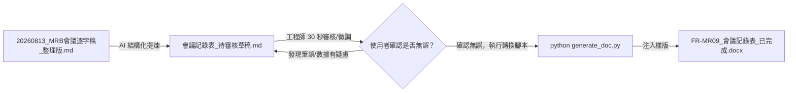

# SQE 品保會議記錄與表單自動化實戰

> 🛠️ **核心工作流閉環**：  
> **辦公室原始檔 ➔ 轉化為人類易讀逐字稿 Markdown ➔ 官方 Word 佔位符樣版製作 ➔ 產出 Markdown 草稿供人工審核 ➔ 使用者確認無誤後一鍵轉換為正式 Word 文件**

---

## 一、專案核心價值與痛點解方

在製造業與企業辦公室中，會議記錄與品質表單的痛點非常顯著：
1. **逐字稿宛如文字牆**：語音辨識直接匯出的原始檔（如 8,600 多字無換行、無標點的 docx）充斥錯字與口語贅詞，人類眼睛難以通讀，AI 直接吃二進位 Word 檔又浪費大量 Token 且容易看漏關鍵細節。
2. **AI 手刻 Word 必定跑版**：若叫 AI 用程式碼從空白頁手刻 Word 表格，欄寬、字型、跨頁與 11 處室會簽格線每次都走樣，無法達到正式公文的要求。
3. **品質數據絕不能有幻覺**：公差差 0.5 度或料號記錯可能導致產線停線或退貨，絕不能讓 AI 盲目產檔直接發布，必須具備「人機協同核對閘門（Human-in-the-Loop）」。

---

## 二、重構後乾淨專案架構清單

專案目錄已全面重構，去除冗餘零碎文檔，結構直觀清晰：

```text
SQE品保會議與表單自動化/
├── README.md                           # 專案總說明與實戰教學指南（純淨無連結版）
├── 原始檔/                              # 學生提供的原始輸入檔
│   ├── 20260813_MRB會議逐字稿_原始檔.docx  # 現場錄音轉文字原生 Word 檔（8,665 字無斷行文字牆）
│   └── FR-MR09 v01 會議記錄表-最後輸出格式.doc # 公司官方規定之最後輸出 Word 樣式標準檔
├── 20260813_MRB會議逐字稿_整理版.md          # 【第一步】AI 整理為段落分明、工程師易讀的逐字稿
├── FR-MR09_v01_會議記錄表_樣版.docx         # 【第二步】將最後輸出格式改製之 Jinja2 佔位符 Word 樣版
├── 會議記錄表_待審核草稿.md                 # 【第三步前置】結構化 Markdown 草稿，供使用者人工檢查核對
├── generate_doc.py                     # 【第三步轉換】使用者確認無誤後，一鍵注入樣版產檔之 Python 腳本
└── FR-MR09_會議記錄表_已完成.docx          # 【最終成品】100% 格式完全對齊官方規範之 Word 正式公文檔
```

---

## 三、三大實戰操作指引

### 實戰 1：將原始逐字稿 docx 轉成「人類可以看的 Markdown」

#### 1. 為什麼要轉？
* **消除文字牆，提升可讀性**：原始錄音檔是 8,665 字連續未換行的文字牆，透過 AI 依據發言者輪替、討論主題切分章節，並校正語音辨識的同音錯字（如：「幼可」校正為「右殼」、「屁子」校正為「pcs」、「新醬」校正為「鑫將」）。
* **節省 70% Token 並掃除二進位雜訊**：docx 內部有大量 XML 樣式標籤，轉成乾淨的 Markdown 能讓後續 AI 提煉數據時大幅降低成本並提升準確度。

#### 2. AI 轉換提示詞範例（Prompt）
```text
請讀取「原始檔/20260813_MRB會議逐字稿_原始檔.docx」內容，將其轉換為結構清晰、適合人類通讀的 Markdown 檔：
1. 嚴格保留所有發言細節、工程料號與公差數字，嚴禁刪減或捏造內容。
2. 辨識語意並修正語音辨識常見錯字（如：幼可改為右殼、屁子改為 pcs、成花改為承化、主響改為竹翔、新醬改為鑫將）。
3. 依照會議三大討論主軸劃分章節（議題一：藍機右殼、議題二：黏結下齒板、議題三：黏結凸輪）。
4. 每一段對話明確標注發言角色（如：品保/SQE、技術長、資材/採購、生產/組裝），段落分明。
5. 完成後輸出為「20260813_MRB會議逐字稿_整理版.md」。
```

---

### 實戰 2：如何將「最後輸出格式.doc」轉成有佔位字符樣版的方式

#### 1. 核心理念：版面歸 Word 樣版，數據歸 AI
讓 Word 樣版負責所有外觀細節（公司 Logo、邊距、新細明體/微軟正黑體、表格網格寬度、跨頁設定、11 處室會簽欄），Python 腳本只負責將資料填入佔位符，保證 100% 不跑版！

#### 2. 樣版製作四步驟（以 FR-MR09 表單為例）：
1. **格式升級另存**：
   原始檔「FR-MR09 v01 會議記錄表-最後輸出格式.doc」為舊版 Word 97-2003 二進位格式，先使用 Microsoft Word 開啟，選擇「另存新檔」為標準「.docx」格式（docxtpl 套件需要現代 docx 架構）。
2. **單一欄位替換為 Jinja2 變數**：
   在需要動態填寫的文字處加上雙大括號：
   * 開會日期：`{{ year }} 年 {{ month }} 月 {{ day }} 日`
   * 會議編號：`{{ meeting_no }}`
   * 會議主旨：`{{ subject }}`
   * 開會時間：`{{ start_h }} 時 {{ start_m }} 分至 {{ end_h }} 時 {{ end_m }} 分`
   * 主持人：`{{ chair }}`、地點：`{{ location }}`、記錄：`{{ recorder }}`
3. **表格動態列迴圈（議題與子段落）**：
   因為議題可能有 1 個或多個，子段落（現況、主要問題、結論）也是動態的，在表格列中使用 docxtpl 專屬標籤：
   * **表格整列迴圈**：在議題列最前端加入 ``，在該列最後加入 ``（`tr` 代表 table row，表示整列會依議題數量動態複製）。
   * **段落動態迴圈**：在內容儲存格內，使用 `` 與 `` 動態產生段落。
   * **條列項目迴圈**：使用 `{{ b }}` 動態印出清單項目。
4. **待辦追蹤事項動態列迴圈**：
   在待辦事項表格的資料列填入：
   * 開頭：``
   * 任務欄位：`{{ d.task }}`
   * 負責人欄位：`{{ d.owner }}`
   * 期限欄位：`{{ d.due }}`
   * 結尾：``
5. **固定格式完整保留**：
   表頭下方的「11 處室會簽欄」（總經理、技術長、品保處、資材處、生產處、製造課、生管課、業務課、行銷處、標準課、倉管課）完全不放變數，維持原汁原味官方表格網格。

#### 3. 樣版製作避坑技巧：
* **避免 XML 斷裂**：在 Word 中輸入 `{{` 變數 `}}` 時，若中途切換輸入法或修改字型，Word 可能在 XML 內部將字串切成多個標籤，導致 docxtpl 找不到變數。**最佳做法是先在純文字記事本中打好整句變數，一次複製貼入 Word 中**。

---

### 實戰 3：逐字稿輸出 Word 前的人機審核機制（確認無誤才轉換）

品質工程中，數據正確性高於一切。因此工作流不直接從逐字稿跳到 Word，而是設計了「人機協同核對閘門」：



#### 步驟 1：建立 Markdown 審核草稿
AI 根據整理後的逐字稿，萃取出標準格式，先存成純文字的「會議記錄表_待審核草稿.md」。

#### 步驟 2：工程師 30 秒重點檢查（三大核心決策）
工程師開啟「會議記錄表_待審核草稿.md」，快速確認以下三個最關鍵的決策：
1. **藍機右殼（L93XXAR1）**：是否確認管制數量為 13 pcs？處置方式是否為「先行管制，納入保留倉」（嚴禁直接報廢）？
2. **黏結凸輪（92XX079）**：是否確認「暫不直接放寬公差」，而是先以 19.5°-20° 取 5 pcs 進行小批量組裝驗證？
3. **黏結下齒板（93XXAO2）**：是否確認試作數量為 80 pcs？修整長度 24.1mm？熱處理改由鑫將執行？是否註明必須走完完整製程？

若有文字微調，直接在 Markdown 檔案內修改即可，極其直覺方便。

#### 步驟 3：使用者確認無誤，執行轉換產檔
當工程師檢查完畢並確認可以轉換時，在終端機執行：
```bash
python generate_doc.py
```
（若使用 uv 環境，可執行：`uv run --with docxtpl python generate_doc.py`）

腳本將會讀取已核對的內容，精準填入「FR-MR09_v01_會議記錄表_樣版.docx」，瞬間產出「FR-MR09_會議記錄表_已完成.docx」！

---

## 四、效益成果比較

| 項目 | 傳統人工做法 | AI 盲目手刻 Word | 本專案重構後工作流 |
| :--- | :--- | :--- | :--- |
| **作業耗時** | 聽錄音邊打字 3 ~ 4 小時 | 調程式碼版面 1 ~ 2 小時 | **全程不到 1 分鐘** |
| **排版外觀** | 手動微調容易忽寬忽窄 | ❌ 嚴重跑版、會簽欄破碎 | ✅ **100% 繼承官方樣版，完全不跑版** |
| **數據安全性** | 容易人工眼花打錯料號 | ❌ AI 幻覺難以抓出 | ✅ **Markdown 審核閘門，把關零幻覺** |
| **動態彈性** | 表格行數變動需手動增減 | ❌ 程式寫死行數容易溢出 | ✅ **docxtpl 表格迴圈，隨議題動態擴展** |
| **維護成本** | 格式改版需重新排版 | ❌ 程式碼全部重寫 | ✅ **直接在 Word 修改樣版，程式碼零改動** |
