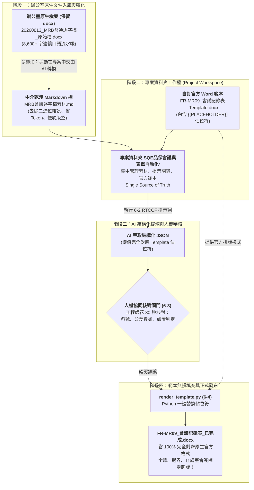

# 實戰範例：SQE 品保會議記錄與表單自動化（辦公室 docx 原生保留 ➔ 專案工作流轉 Markdown ➔ Template Placeholder 100% 格式對齊）

> 🟢 **採用代理平台**：Google Antigravity / Claude Projects / ChatGPT 工作區  
> 🛠️ **完整工作流閉環**：**辦公室原生 docx ➔ 手動在專案中轉為 Markdown ➔ 專案資料夾架構 ➔ 自訂 Template Placeholders 範本 ➔ JSON 數據人機核對 ➔ 100% 完全對齊產出正式 docx**  

---

## 🎯 教學核心願景：教學生一套「辦公室真實可用」的專案工作流

在真實的企業辦公室與工廠營運中，**幾乎 100% 的輸入與輸出文件都是 Microsoft Word (`.docx`)**。沒有廠商或主管一開始就會給你準備好的 Markdown 檔。

因此，本教學特別採用**「以專案為基礎（Project-Based）」**的實務工作流：
1. **保留辦公室原生 `.docx` 文件**：直接將現場會議錄音轉出的 [`20260813_MRB會議逐字稿_原始檔.docx`](./20260813_MRB會議逐字稿_原始檔.docx) 作為專案真實起點。
2. **教學生在專案中手動將 `.docx` 轉換為 `.md`**：掃除 Word 二進位封裝的隱藏 XML 雜訊、大幅節省 50%~70% 的 Token，為後續 AI 深度分析建立乾淨的高品質上下文。
3. **自訂 Template Placeholder 的 Word 範本**：預先在官方表單 [`FR-MR09_會議記錄表_Template.docx`](./FR-MR09_會議記錄表_Template.docx) 中埋設佔位符，實現「版面歸範本，數據歸 AI」。
4. **輸出 100% 完全對齊的正式 `.docx`**：透過自動化填充腳本，將資料無損回填至 Word 範本，徹底解決學生「手動整理與手動打 Word 超花時間、AI 產 Word 又容易跑版」的痛點！

---

## 🔄 辦公室專案工作流完整閉環圖（Docx In ➔ MD Mid ➔ Docx Out）



---

## 📖 學員原始需求與痛點深度檢核

本範例取材自製造業學員 **楊子賢（25 年資深 SQE 供應商品質工程師）** 的真實需求文件：

| 學員原始痛點（節錄自學員需求檔） | 職場實務困難點 | 本專案工作流之工程解法 |
| :--- | :--- | :--- |
| **【最花時間的環節是】**<br/>「整理資料及重點還有輸入 word 檔及輸入 excel 檔」 | 錄音動輒幾十分鐘（8,600+ 字未斷句口語），手動邊聽邊敲進 Word 表格耗費 3~4 小時。 | **轉 Markdown 萃取 ＋ Template Placeholder 自動填充**：AI 1 秒整理重點，Python 1 秒注入範本，免去手動敲 Word 苦工。 |
| **【一定要人來判斷的是】**<br/>「最終輸入內容檢查」 | 品質公差差 0.5 度或料號記錯會導致產線停線，絕對不能讓 AI 盲目發布。 | **變數鍵值核對閘門**：AI 僅產出純淨 JSON，工程師核對關鍵料號與公差數字無誤後才放行產檔。 |
| **【初學者寫 Prompt 的困難】**<br/>「我現在要寫一個 prompt，必須符合 RTCCF，我不會寫，請提供樣板給我」 | 初學者常陷入「貪多嚼不爛」，試圖用一個超大 Prompt 同時產出訪廠報告、MRB 會議紀錄與週報 Excel，導致格式全面混亂。 | **模組化提示詞鏈（Prompt Chaining）**：以最考驗排版嚴謹度的 MRB 會議表單為核心，提供標準 RTCCF 樣板。 |
| **【辦公室格式對齊】**<br/>公司有正式表單規範（FR-MR09、11 處室會簽欄、Logo、色票） | 若叫 AI 用程式碼從空白頁手刻 Word 表格，欄寬、字型、跨頁與簽核格線每次都跑版。 | **自訂 Template Placeholder 的 docx 範本**：版面歸 Word 範本，數據歸 AI，輸出 100% 完全對齊！ |

---

## 🛠️ 教學核心技術亮點拆解

### 亮點一：教學生「如何使用專案方式，將 docx 轉成 Markdown」

#### 1. 為什麼辦公室文件要保留 docx？
在實際辦公室中，語音辨識軟體匯出的會議記錄、主管批示的備忘錄都是 `.docx`。教學時**保留原生 docx 檔案**，才能讓學生學到「真實職場工作流」，而不是脫離現實的純文字玩具。

#### 2. 為什麼要在專案中將 docx 轉為 Markdown？
* **消除二進位雜訊**：Word 檔案是由多個 XML、媒體檔與樣式壓縮而成的二進位封裝，直接丟給 LLM 會消耗大量無謂 Token，且底層樣式標籤容易干擾 AI 對數字與公差的理解。
* **純文字輕量化**：轉為純文字 Markdown 後，Token 消耗量直接減少 50% ~ 70%，且 LLM 理解力與擷取精準度大幅躍升。
* **版本控管（Git Diff）**：Markdown 檔案能一秒透過 Git 比對修改歷程，方便團隊協同。

#### 3. 專案中的手動操作示範（步驟 0）
學生在專案中將辦公室原始檔 [`20260813_MRB會議逐字稿_原始檔.docx`](./20260813_MRB會議逐字稿_原始檔.docx) 納入專案，並使用專案提示詞 [`6-0_辦公室docx轉Markdown提示詞與操作指南.md`](./6-0_辦公室docx轉Markdown提示詞與操作指南.md) 向 AI 發出指令：
```text
請讀取專案中的辦公室文件「20260813_MRB會議逐字稿_原始檔.docx」，
將其轉換為純文字 Markdown 格式，完整保留所有發言細節與公差數字，
並存檔為專案內的「MRB會議逐字稿素材.md」。
```
AI 在專案內自主執行讀取並存檔，學生立刻獲得乾淨、標準化的工作素材！

---

### 亮點二：自訂 Template Placeholder 的 docx，確保輸出 100% 完全對齊

#### 1. 傳統 AI 產 Word 的致命痛點
讓 AI 憑空寫 Python 程式碼手刻 Word 表格，表格欄寬經常忽寬忽窄、文字超出邊界、公司的 Logo、特定色票（品保深藍 `#1A365D`）與 11 處室會簽表格全部破碎消失。

#### 2. Template Placeholder 的解方：「版面歸範本，數據歸 AI」
對照學員原生的官方發布檔案 [`FR-MR09 v01 會議記錄表--最後輸出格式.doc`](./學員原始素材/MRB會議記錄表/FR-MR09%20v01%20會議記錄表--20260813藍機右殼%20黏結凸輪%20黏結下齒板-最後輸出格式.doc)，我們在 Word 中製作一份官方範本 [`FR-MR09_會議記錄表_Template.docx`](./FR-MR09_會議記錄表_Template.docx)，並在需要填寫的地方打上清晰的佔位符：

```text
【表頭基本資訊區】
會議日期：{{MEETING_DATE}}        會議主旨：{{MEETING_SUBJECT}}
開會時間：{{MEETING_TIME}}        開會地點：{{MEETING_LOCATION}}
會 主 持：{{CHAIR}}               記    錄：{{RECORDER}}

【11 處室會簽欄（鎖定官方網格欄寬，原汁原味）】
[總經理] [技術長] [品保處] [資材處] [生產處] [製造課] [生管課] [業務課] [行銷處] [標準課] [倉管課]

【異常議題區塊】
議題 1：{{TOPIC_1_TITLE}}
{{TOPIC_1_CONTENT}}

議題 2：{{TOPIC_2_TITLE}}
{{TOPIC_2_CONTENT}}

議題 3：{{TOPIC_3_TITLE}}
{{TOPIC_3_CONTENT}}

【待辦追蹤事項表（Action Items 表格）】
1 | {{ACTION_1_TASK}} | {{ACTION_1_OWNER}} | {{ACTION_1_DUE}}
...
```

* **徹底零跑版**：範本中的頁首頁尾、字體樣式（微軟正黑體）、色票底色、11 處室會簽框全部在 Word 檔中原生固定。
* **AI 任務純粹化**：AI 僅需專注於「語意解析與防捏造」，產出標準的 JSON 鍵值對。
* **零技術門檻維護**：未來公司若修改表單設計，只需用 Word 開啟範本調整存檔，程式碼與 AI 提示詞完全不需重寫！

---

## 📂 專案完整檔案架構清單

本專案資料夾遵循標準工程化設計，各檔案分工清楚：

```text
SQE品保會議與表單自動化/
├── README.md                                  # 【本文件】專案總架構與工作流教學指引
├── 20260813_MRB會議逐字稿_原始檔.docx          # 【辦公室原生輸入】真實會議錄音逐字稿原始 Word 檔
├── 6-0_辦公室docx轉Markdown提示詞與操作指南.md   # 【步驟 0】教學生手動在專案中將 docx 轉為 Markdown
├── MRB會議逐字稿素材.md                         # 【專案中介素材】由原生 docx 轉出之乾淨 Markdown 逐字稿
├── 6-1_白話自然語言發想提示詞.md                 # 【步驟 1】引導 AI 規劃專案資料夾與範本佔位符清單
├── 6-2_AI產出之RTCCF審查與結構化提示詞.md        # 【步驟 2】AI 萃取符合 Template 變數之 JSON 數據
├── 6-3_人機審核與決策核對卡片.md                # 【步驟 3】佔位符變數對照表與 SQE 工程審核核對
├── 6-4_生成MRB會議記錄表Word發布檔提示詞.md     # 【步驟 4】Python 讀取範本替換變數產檔指引
├── render_template.py                         # 【自動化產檔腳本】讀取範本無損替換佔位符工具
├── FR-MR09_會議記錄表_Template.docx            # 【官方範本】含 {{PLACEHOLDER}} 佔位符之標準 Word 範本
├── FR-MR09_會議記錄表_已完成.docx               # 【辦公室正式輸出】100% 格式完全對齊之正式發布公文檔
└── 學員原始素材/                              # 【學員原生真實檔案歸檔備查】
    ├── SQE工作流需求說明20260909.docx           # 學員原始需求與 RTCCF 困境說明
    ├── 20260914我的工作流說明.docx              # 學員原始痛點（最花時間在整理資料與輸入 Word）
    └── MRB會議記錄表/
        ├── 20260813 MRB會議紀錄...逐字稿-參考資料.docx  # 學員原生錄音逐字稿 raw 檔
        └── FR-MR09 v01 會議記錄表...最後輸出格式.doc   # 學員原生官方手刻 Word 完成品（基準標竿）
```

---

## ⚡ 專案工作流實戰執行五步驟（Step-by-Step）

### 步驟 0：辦公室 docx 轉 Markdown（前置素材轉化）
* 參考文檔：[`6-0_辦公室docx轉Markdown提示詞與操作指南.md`](./6-0_辦公室docx轉Markdown提示詞與操作指南.md)
* 學生在專案中將 [`20260813_MRB會議逐字稿_原始檔.docx`](./20260813_MRB會議逐字稿_原始檔.docx) 交給 AI，執行轉換提示詞，產出純文字的 [`MRB會議逐字稿素材.md`](./MRB會議逐字稿素材.md)。
* 掃除二進位雜訊，大幅降低後續 LLM 呼叫的 Token 成本。

### 步驟 1：白話發想與佔位符設計（專案架構規劃）
* 參考文檔：[`6-1_白話自然語言發想提示詞.md`](./6-1_白話自然語言發想提示詞.md)
* 透過白話提示詞，要求 AI 根據官方表單格式規劃預埋佔位符清單（`{{MEETING_DATE}}`、`{{TOPIC_1_CONTENT}}` 等）。

### 步驟 2：RTCCF 深度提煉（輸出標準 JSON 鍵值對）
* 參考文檔：[`6-2_AI產出之RTCCF審查與結構化提示詞.md`](./6-2_AI產出之RTCCF審查與結構化提示詞.md)
* 將提示詞連同 [`MRB會議逐字稿素材.md`](./MRB會議逐字稿素材.md) 交付給 AI。
* AI 扮演資深 SQE 主任稽核員，去除口語贅詞、嚴禁捏造數據，產出能精準對接 Word 範本的 JSON 數據。

### 步驟 3：人機協同核對檢查（落實學員「最終輸入內容檢查」）
* 參考文檔：[`6-3_人機審核與決策核對卡片.md`](./6-3_人機審核與決策核對卡片.md)
* 工程師花 30 秒核對 JSON 中的三大核心判定：
  1. **藍機右殼（`L93XXAR1`）**：管制數量是否為 `13pcs` 且隔離入保留倉？
  2. **黏結凸輪（`92XX079`）**：原公差 `19° ±0.5°` 是否未盲目放寬，而是以 `19.5°-20°` 製作 `5pcs` 進行小批組裝驗證？
  3. **黏結下齒板（`93XXAO2`）**：試作數量是否為 `80pcs` 且需完整走完全製程？
* 確認數據與決策 100% 屬實後，核准產檔。

### 步驟 4：自動讀取範本並替換變數（100% 格式完美對齊）
* 參考文檔：[`6-4_生成MRB會議記錄表Word發布檔提示詞.md`](./6-4_生成MRB會議記錄表Word發布檔提示詞.md)
* 執行專案腳本 [`render_template.py`](./render_template.py)：
  ```bash
  python render_template.py
  ```
* 腳本載入 [`FR-MR09_會議記錄表_Template.docx`](./FR-MR09_會議記錄表_Template.docx)，無損替換所有佔位符，1 秒輸出 [`FR-MR09_會議記錄表_已完成.docx`](./FR-MR09_會議記錄表_已完成.docx)！

---

## 🏆 效益成果對照表

| 評估面向 | 學員傳統做法（手動輸入） | 讓 AI 從空白手刻 Word | 本專案工作流（Docx ➔ MD ➔ Template） |
| :--- | :--- | :--- | :--- |
| **作業耗時** | 手工打字整理約 **3 ~ 4 小時** | 寫代碼除錯約 **1 ~ 2 小時** | **全程不到 1 分鐘（秒級自動產檔）** |
| **排版穩定度** | 需手動反覆微調欄寬與對齊 | ❌ 嚴重跑版、會簽欄破碎 | ✅ **100% 繼承官方範本，像素級完全對齊** |
| **維護成本** | 每次開會都重新手打一次 | ❌ 表單稍有更動代碼全毀 | ✅ **直接在 Word 修改範本，代碼零改動** |
| **Token 消耗** | N/A | ❌ 丟原生 docx 消耗大量 Token | ✅ **先轉 Markdown，乾淨精準且省 Token** |
| **品質合規性** | 容易有人工筆誤漏字 | ❌ AI 容易產生數據幻覺 | ✅ **JSON 變數核對閘門，確保零幻覺** |
| **職場適用性** | 傳統耗時低效 | 脫離辦公室真實生態 | ✅ **完全相容辦公室原生 docx 輸入與輸出** |
