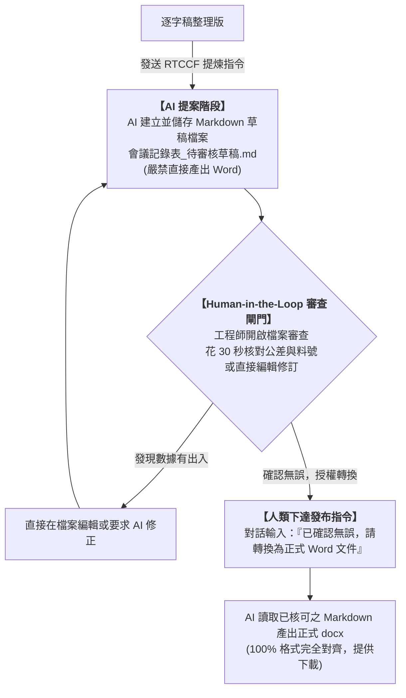

# SQE 品保會議記錄與表單自動化實戰（零程式碼・純對話工作流）

> 💡 **專為完全不會寫程式、不碰終端機的辦公室人員與工程師設計**  
> 全程只需要使用 **AI 對話視窗（ChatGPT / Claude / Gemini）** 與 **Microsoft Word**，即可完成從「語音文字牆」到「100% 格式完全對齊的正式 Word 會議記錄表」！

---

## 📥 學員實戰素材下載專區

學生在進行本單元實作時，**只需要下載以下 2 個原始檔案**即可開始完整演練：

1. **原始會議錄音逐字稿 Word 檔**（必載輸入）：[下載 20260813_MRB會議逐字稿_原始檔.docx](./原始檔/20260813_MRB會議逐字稿_原始檔.docx)（8,665 字連續口語無換行文字牆）
2. **公司官方最後輸出格式 Word 檔**（必載目標樣式）：[下載 FR-MR09 v01 會議記錄表-最後輸出格式.doc](./原始檔/FR-MR09%20v01%20會議記錄表-最後輸出格式.doc)（官方排版規範與 11 處室會簽標準）

> 💡 **參考成果對照（無需下載亦可完成實作）**：  
> * [FR-MR09_v01_會議記錄表_樣版.docx](./FR-MR09_v01_會議記錄表_樣版.docx)（實戰 2 製作完成之佔位符樣版）  
> * [FR-MR09_會議記錄表_已完成.docx](./FR-MR09_會議記錄表_已完成.docx)（實戰 3 最終產出之對齊成果）

---

## 🎯 辦公室真實痛點與 Human-in-the-Loop（人機協作）解法

在製造業工廠與企業辦公室中，SQE（供應商品質工程師）整理會議記錄經常遭遇三大困難：
1. **逐字稿宛如文字牆**：語音辨識輸出的檔案動輒七、八千字，完全沒有分段，充斥大量口語贅詞與聽打錯字，人工邊看邊打字進 Word 要花費 3 ~ 4 小時。
2. **叫 AI 做 Word 必定嚴重跑版**：直接要求 AI 產出 Word 檔，往往欄寬不對、字體走樣、頁首頁尾不見，最重要的公司「11 處室會簽表格」全部破碎。
3. **品質數據絕不能有幻覺（零容忍）**：公差角度差 0.5 度或料號記錯會導致產線組裝困難或停線退貨。AI 本質上具有機率性生成特質，絕不能放任 AI 進行「無人看管的盲目自動化」！

### 💡 核心觀念：什麼是 Human-in-the-Loop（人機協作）？
**Human-in-the-Loop（人在迴路中，簡稱 HITL）** 是現代企業落實 AI 應用最關鍵的安全架構：
* **AI 負責繁重體力活（加速 90% 耗時）**：AI 擅長快速通讀八千多字逐字稿、過濾贅詞、提取結構並排版。
* **人類負責核心關鍵決策（確保 100% 正確）**：工程師親自把關關鍵料號、公差數值與處置判定，承擔品質與稽核責任。
* **Markdown 作為人機協作的「中介工作檯」**：AI 不直接輸出不可逆的正式 Word 檔，而是先建立並儲存為易於人類檢閱、打勾與直接修訂的 Markdown 草稿。人類在迴路中審核核可後，才授權 AI 轉成正式公文發布！

---

## 🚀 零程式碼三大實戰操作指引

### 實戰 1：將原始逐字稿 docx 轉成「人類可以看的 Markdown」

#### 1. 操作方式（完全在對話視窗進行）
1. 打開 AI 對話視窗（如 ChatGPT、Claude 或 Gemini）。
2. 將下載好的「20260813_MRB會議逐字稿_原始檔.docx」作為附件上傳給 AI（或直接打開檔案複製裡面的文字貼上）。
3. 複製並傳送下方的「逐字稿整理提示詞」。

#### 2. 複製以下提示詞發送給 AI：
```text
請讀取附件的「20260813_MRB會議逐字稿_原始檔.docx」內容，將這份 8,600 多字無換行的會議錄音逐字稿，重構為結構清晰、段落分明、適合人類通讀的 Markdown 文件，檔案名稱請設定為「20260813_MRB會議逐字稿_整理版.md」：

1. 【保留事實與數據】：嚴格保留所有發言細節、工程料號與公差數字，嚴禁刪減或捏造任何數據。
2. 【自動校正語音錯字】：通讀全文語意，自動校正語音辨識常見的同音錯字（例如將零件稱呼、單位 pcs、廠商名稱等口語錯字修正為正確工程用詞）。
3. 【自動梳理議題章節】：根據會議對話脈絡分析梳理出本次討論的核心議題，依序劃分章節（如：議題一、議題二...），並為各議題訂定明確的主題標題。
4. 【辨識發言角色切段】：從前後文互動中辨識各發言者的職能角色（如：品保/SQE、技術長、資材/採購、現場製造等），依發言輪替自然切段換行，徹底消除未分段的文字牆。
5. 【明確輸出】：請輸出完整的 Markdown 格式內容，並清楚標示檔名為「20260813_MRB會議逐字稿_整理版.md」。
```

AI 將會直接在畫面上輸出整理好的逐字稿內容（完整成果可對照專案目錄下的「20260813_MRB會議逐字稿_整理版.md」）。

---

### 實戰 2：如何將「最後輸出格式.doc」轉成有佔位符樣版的方式

這個工作完全交由 AI 來自動分析與產生！學生不需要手動猜測哪些欄位要改，而是透過**「學生提供原始檔 ＋ 白話自然語言發想 ➔ 讓 AI 產生 RTCCF 提示詞 ➔ 學生再用 RTCCF 讓 AI 產出樣版檔案」**的流程完成。

#### 步驟 A：學生發送「白話自然語言發想」（讓 AI 產生專業 RTCCF 提示詞）
學生在對話視窗上傳「FR-MR09 v01 會議記錄表-最後輸出格式.doc」，並複製這段白話自然語言發送給 AI：

```text
你是一位資深的企業流程自動化與辦公室文件架構專家。

我上傳了一份我們公司正式的 Word 會議記錄表範本「FR-MR09 v01 會議記錄表-最後輸出格式.doc」。
我希望將這份文件製作成一份「可重複套用的標準 Word 佔位字符樣版檔（.docx）」，請 AI 自行分析版面，判斷哪些是固定不變的欄位（如會簽欄、Logo、表頭框架），哪些是每次會議會變動的內容，並自動將變動欄位替換為直觀的佔位符變數（如 {{ 變數 }}）。

請根據這個需求，幫我設計一個符合專業「RTCCF」框架（Role 角色、Task 任務、Context 背景、Constraints 限制、Format 格式）的高品質提示詞。
讓我之後只要把這份 RTCCF 提示詞丟給 AI，AI 就能精準判斷並直接產出一份排版完全零跑版的 Word 樣版檔（FR-MR09_v01_會議記錄表_樣版.docx）供我下載！
```

#### 步驟 B：AI 產生之標準「RTCCF 樣版製作提示詞」
AI 會根據學生的自然語言，自動產出專門用於製作樣版的標準 RTCCF 提示詞：

```markdown
# Role (角色定位)
你是一位精通微軟 Word 排版規範與自動化表單設計的資深文件架構專家。

# Task (核心任務)
請讀取附件的「FR-MR09 v01 會議記錄表-最後輸出格式.doc」，自動分析文件的版面結構：
1. 智慧判斷哪些欄位是每次開會變動的動態資訊，自動將其替換為直觀的佔位符變數（使用 {{ 變數名稱 }} 格式）。
2. 智慧判斷哪些是公司規定的固定結構，必須 100% 原封不動完整保留。
3. 直接產出一份排版零跑版的 Word 樣版檔案，命名為「FR-MR09_v01_會議記錄表_樣版.docx」供使用者下載。

# Context (背景情境)
此文件為製造業公司的官方會議記錄表（表單代號 FR-MR09）。為實現日後會議記錄快速套版，需要將這份填寫好的範例文本，改製為通用的空白樣版檔。

# Constraints (嚴格防呆限制)
1. 【固定結構嚴格保留】：
   - 文件最上方之「11 處室官方會簽表格」（總經理、技術長、品保處、資材處、生產處、製造課、生管課、業務課、行銷處、標準課、倉管課）之框線、欄寬與文字必須 100% 完整保留，嚴禁更動！
   - 公司抬頭、頁首、頁尾、表單編號等固定版權資訊必須完整保留。
2. 【動態欄位精準替換】：
   - 開會日期替換為：{{ year }} 年 {{ month }} 月 {{ day }} 日
   - 會議主旨替換為：{{ subject }}，會議編號替換為：{{ meeting_no }}
   - 開會時間替換為：{{ start_h }} 時 {{ start_m }} 分至 {{ end_h }} 時 {{ end_m }} 分
   - 人員與地點替換為：{{ chair }}（主持人）、{{ location }}（地點）、{{ recorder }}（記錄人）
   - 議題內容與待辦事項表格：清除範例文本，保留原有儲存格欄寬與框線，填入對應的動態內容佔位符。

# Format (輸出格式)
1. 在對話中列出「欄位佔位符清單」，說明哪些欄位被設為變數。
2. 直接產出並提供可下載的 Word 檔案：「FR-MR09_v01_會議記錄表_樣版.docx」。
```

#### 步驟 C：學生使用 RTCCF 提示詞，讓 AI 產出樣版檔案
學生只需將步驟 B 的 RTCCF 提示詞發送給 AI，AI 就會自主分析原始文件，判斷哪些需要保留、哪些轉為佔位符，並直接生成做好的「FR-MR09_v01_會議記錄表_樣版.docx」供學生點擊下載，每次開會都能重複套用！

---

### 實戰 3：Human-in-the-Loop（人機協作）審核機制：逐字稿輸出 Word 前的品質閘門

在品質工程與企業營運中，數據的正確性高於一切。LLM 本質上具備機率性，盲目信任 AI 輸出的 Word 檔存在嚴重品質事故風險。  
因此本流程落實完整的 **Human-in-the-Loop（人機協作，HITL）** 架構，確保**「AI 負責提煉草稿、人類負責關鍵把關、人類確認授權後才轉 Word」**！



#### 步驟 A：學生複製「白話自然語言」發送給 AI（產生標準 RTCCF 提示詞）
如果學生不知道如何寫出專業嚴謹的 Prompt，可以直接複製這段白話文丟給 AI（明確要求落實 Human-in-the-Loop 人機協作）：

```text
你是一位資深的企業 AI 流程架構師與品質工程（SQE）專家。

我是製造業資深品保工程師，手邊有一份剛開完會整理好的「逐字稿內容」，以及一份公司標準的會議記錄表樣版。

我希望你能幫我設計一個符合專業「RTCCF」框架（Role 角色、Task 任務、Context 背景、Constraints 限制、Format 格式）的高品質提示詞。

這個提示詞的要求：
1. 讓 AI 扮演 25 年經驗的 SQE 主任稽核員，閱讀會議逐字稿。
2. 嚴禁捏造任何料號與公差數據，精準提煉出三大議題與待辦事項清單。
3. 【落實 Human-in-the-Loop 人機協作】：嚴格要求 AI「先建立並儲存為 Markdown 檔案（會議記錄表_待審核草稿.md）供我檢查與編輯修改，先不要產出 Word 檔，待我確認授權後才允許產檔」！
4. 必須在草稿最上方設計「SQE 三大核心工程數據核對卡」，方便我 30 秒快速驗證關鍵決策。

請幫我產出這份包含完整 RTCCF 格式的提煉提示詞！
```

#### 步驟 B：AI 產生之標準「RTCCF 提煉提示詞」（學生複製此提示詞進行提煉）
學生把 AI 產生的 RTCCF 提示詞（連同整理後的逐字稿）發給 AI：

```markdown
# Role (角色定位)
你是一位擁有 25 年製造業經驗的資深供應商品質工程師（SQE）與品質管理系統（QMS）主任稽核員。文字嚴謹、客觀、具備專業工程說服力。

# Task (核心任務)
請詳細研讀提供的會議逐字稿，進行深度語意提煉與工程邏輯結構化。
【重要】：請先建立並儲存為 Markdown 檔案「會議記錄表_待審核草稿.md」，供工程師進行關鍵數據核對與人機協作修改，請勿直接生成 Word 檔！

# Context (背景情境)
本次會議為跨部門材料審查委員會（MRB），討論藍機右殼（L93XXAR1）外觀泛黃、黏結下齒板（93XXAO2）長度修整、黏結凸輪（92XX079）公差問題。需去蕪存菁轉化為正式公文記錄。

# Constraints (嚴格防呆限制)
1. 【數據零臆測（Zero Hallucination）】：料號（L93XXAR1、93XXAO2、92XX079）、數量（13pcs、5pcs、80pcs）、尺寸與角度（19° ±0.5°、19.5°-20°、24.1mm）必須 100% 忠於原始發言，嚴禁任何捏造。
2. 【決策邊界防呆】：凸輪決策為「暫不放寬公差，先以 19.5°-20° 取 5pcs 對照組裝驗證」，嚴禁誤寫為直接放寬。下齒板 80pcs 必須註明走完全製程。
3. 【人機核對卡設計】：在文件最上方建立核對清單，列出三大關鍵判定供工程師快速打勾核對。

# Format (輸出 Markdown 格式)
請將以下結構完整儲存為「會議記錄表_待審核草稿.md」：
1. 表頭基本資訊（主旨、編號、日期、時間、地點、主席、記錄人）
2. SQE 三大核心工程數據核對卡（含料號、數量、處置方式）
3. 會議詳細內容（議題一、議題二、議題三之現況、主要問題/品質風險、會議結論）
4. 待辦事項追蹤表（表格呈現：任務內容、負責人、預計完成時間）
```

#### 步驟 C：工程師 30 秒重點檢查與人機協作修改
AI 建立並儲存「會議記錄表_待審核草稿.md」後，工程師打開該檔案花 30 秒核對文件頂部的三大判定：
* [x] **藍機右殼（L93XXAR1）**：管制數量是否為 **13 pcs**？處置是否為**「先行管制，納入保留倉」**（絕非直接報廢）？
* [x] **黏結凸輪（92XX079）**：是否為**「暫不直接放寬公差」**，改以 **19.5°-20° 取 5 pcs** 進行小批組裝對照驗證？
* [x] **黏結下齒板（93XXAO2）**：是否為 **80 pcs**？修整長度 **24.1mm**？熱處理改由**鑫將**執行且需走完完整製程？

💡 **人機協作優勢**：若工程師發現任何字詞或數字需補充，可直接在該 Markdown 檔案中編輯修改存檔，或在對話中告知 AI 快速修正。

#### 步驟 D：使用者確認無誤，下達轉換指令
當工程師檢查確認該 Markdown 檔案內容完全正確時，直接在對話框發送這句話：

```text
我已檢查確認「會議記錄表_待審核草稿.md」內容完全無誤。
請讀取這份已確認的 Markdown 檔案，依照公司官方《FR-MR09 會議記錄表》樣版格式，將其轉換為正式的 Word (.docx) 文件，並提供下載檔案給我！
```

AI 便會直接生成排版完全正確、符合官方會簽表格的「FR-MR09_會議記錄表_已完成.docx」供學生點擊下載，全程不需要輸入任何一行程式碼！

---

## 🏆 效益成果對照

| 評估面向 | 傳統人工手打做法 | 叫 AI 隨機手刻 Word | 本專案零程式碼工作流 |
| :--- | :--- | :--- | :--- |
| **作業耗時** | 手工邊聽邊打字約 3 ~ 4 小時 | 反覆手動調格式約 1 ~ 2 小時 | **全程對話操作不到 2 分鐘** |
| **技術門檻** | 無 | 需學習程式或指令碼 | **零程式碼，純日常中文對話** |
| **排版穩定度** | 易因手動調整導致格線走樣 | ❌ 嚴重跑版、11 處室表格破碎 | ✅ **100% 繼承官方樣版，完全不跑版** |
| **數據安全性** | 人工容易眼花打錯料號 | ❌ AI 幻覺難以即時察覺 | ✅ **先產 Markdown 審查草稿，嚴格把關** |
| **職場適用性** | 耗時低效 | 門檻過高難以在行政推廣 | ✅ **任何完全不會寫程式的同仁皆可立刻上手** |
