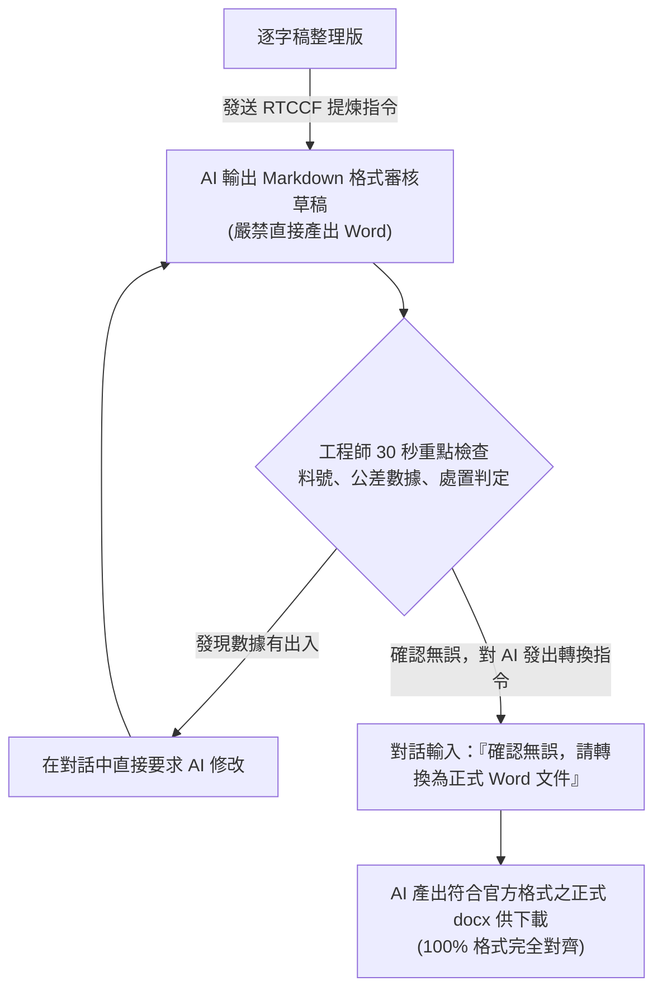

# SQE 品保會議記錄與表單自動化實戰（零程式碼・純對話工作流）

> 💡 **專為完全不會寫程式、不碰終端機的辦公室人員與工程師設計**  
> 全程只需要使用 **AI 對話視窗（ChatGPT / Claude / Gemini）** 與 **Microsoft Word**，即可完成從「語音文字牆」到「100% 格式完全對齊的正式 Word 會議記錄表」！

---

## 📥 學員實戰素材下載專區

學生在進行本單元實作時，可直接點擊下方連結下載原始素材與樣版檔案：

* **原始會議錄音逐字稿 Word 檔**：[下載 20260813_MRB會議逐字稿_原始檔.docx](./原始檔/20260813_MRB會議逐字稿_原始檔.docx)（8,665 字連續口語無換行文字牆）
* **公司官方最後輸出格式 Word 檔**：[下載 FR-MR09 v01 會議記錄表-最後輸出格式.doc](./原始檔/FR-MR09%20v01%20會議記錄表-最後輸出格式.doc)（官方排版規範與 11 處室會簽標準）
* **已改製之官方 Word 佔位符樣版**：[下載 FR-MR09_v01_會議記錄表_樣版.docx](./FR-MR09_v01_會議記錄表_樣版.docx)（固定版面與欄位框線）
* **最終 100% 完全對齊正式發布成果**：[下載 FR-MR09_會議記錄表_已完成.docx](./FR-MR09_會議記錄表_已完成.docx)

---

## 🎯 辦公室真實痛點與零代碼解法

在製造業工廠與企業辦公室中，SQE（供應商品質工程師）整理會議記錄經常遭遇三大困難：
1. **逐字稿宛如文字牆**：語音辨識輸出的檔案動輒七、八千字，完全沒有分段，充斥大量口語贅詞與聽打錯字，人工邊看邊打字進 Word 要花費 3 ~ 4 小時。
2. **叫 AI 做 Word 必定嚴重跑版**：直接要求 AI 產出 Word 檔，往往欄寬不對、字體走樣、頁首頁尾不見，最重要的公司「11 處室會簽表格」全部破碎。
3. **品質數據絕不能有幻覺**：公差角度差 0.5 度或料號記錯會導致產線組裝困難或停線，絕不能讓 AI 盲目產出文件就發布，必須由工程師親自核對把關。

---

## 📂 專案檔案結構說明

```text
SQE品保會議與表單自動化/
├── README.md                           # 專案實戰教學總指引（本文件）
├── 原始檔/                              # 學生操作練習的原始檔案
│   ├── 20260813_MRB會議逐字稿_原始檔.docx  # 現場錄音轉文字原生 Word 檔
│   └── FR-MR09 v01 會議記錄表-最後輸出格式.doc # 公司官方格式標準檔
├── 20260813_MRB會議逐字稿_整理版.md          # 【任務 1】重整為段落分明、人類易讀的優質逐字稿
├── FR-MR09_v01_會議記錄表_樣版.docx         # 【任務 2】將輸出格式改製之佔位符 Word 樣版
├── 會議記錄表_待審核草稿.md                 # 【任務 3 前置】結構化 Markdown 草稿，供工程師人工核對
└── FR-MR09_會議記錄表_已完成.docx          # 【最終成果】100% 格式完全對齊官方規範之 Word 正式公文檔
```

---

## 🚀 零程式碼三大實戰操作指引

### 實戰 1：將原始逐字稿 docx 轉成「人類可以看的 Markdown」

#### 1. 操作方式（完全在對話視窗進行）
1. 打開 AI 對話視窗（如 ChatGPT、Claude 或 Gemini）。
2. 將下載好的「20260813_MRB會議逐字稿_原始檔.docx」作為附件上傳給 AI（或直接打開檔案複製裡面的文字貼上）。
3. 複製並傳送下方的「逐字稿整理提示詞」。

#### 2. 複製以下提示詞發送給 AI：
```text
請讀取附件的「20260813_MRB會議逐字稿_原始檔.docx」內容，將其轉換為結構清晰、段落分明、適合人類通讀的 Markdown 格式：

1. 嚴格保留所有發言細節、工程料號與公差數字，嚴禁刪減或捏造任何數據。
2. 辨識語意並修正語音辨識的常見同音錯字（例如：幼可 ➔ 右殼、屁子 ➔ pcs、新醬 ➔ 鑫將、成花 ➔ 承化、主響 ➔ 竹翔）。
3. 依照會議三大討論主軸劃分章節：
   - 議題一：藍機右殼（L93XXAR1）外觀泛黃與保留倉管制
   - 議題二：黏結下齒板（93XXAO2）長度 24.1mm 修整與 80pcs 全製程試作
   - 議題三：黏結凸輪（92XX079）19° 公差放寬評估與 5pcs 組裝試驗
4. 每一段對話明確標注發言角色（如：品保/SQE 楊子賢、技術長 謝華賢、資材/採購、生產/組裝），段落分明，徹底消除無換行文字牆。
```

AI 將會直接在畫面上輸出整理好的逐字稿內容（成果如專案內的「20260813_MRB會議逐字稿_整理版.md」）。

---

### 實戰 2：如何將「最後輸出格式.doc」轉成有佔位符樣版的方式

#### 1. 核心理念：版面歸 Word 樣版，數據歸 AI
不要讓 AI 憑空生成 Word 表格！由我們在 Microsoft Word 軟體中建立一份固定好所有外觀的「空白樣版」，把會變動的內容替換成「佔位標籤」。這樣一來，版面、公司 Logo、字型、邊距與 11 處室會簽框永遠固定，絕對零跑版！

#### 2. 在 Microsoft Word 中的圖解製作步驟：
1. **格式另存新檔**：
   用 Word 打開「FR-MR09 v01 會議記錄表-最後輸出格式.doc」，點選「檔案」➔「另存新檔」，將存檔類型改為現代標準的「.docx」。
2. **清除既有文字，填入佔位標籤**：
   把表單內已經寫死的一般文字刪除，換上直觀的標籤符號（例如用雙大括號 `{{ ... }}` 包覆）：
   * 開會日期位置改為：`{{ 開會日期 }}`
   * 會議編號位置改為：`{{ 會議編號 }}`
   * 會議主旨位置改為：`{{ 會議主旨 }}`
   * 開會時間位置改為：`{{ 開始時間 }} 至 {{ 結束時間 }}`
   * 主持人改為：`{{ 主持人 }}`、地點改為：`{{ 地點 }}`、記錄人改為：`{{ 記錄人 }}`
3. **議題與待辦事項表格區**：
   * 保留原本的表格格線與欄寬。
   * 在內容格中填入 `{{ 議題內容 }}` 與 `{{ 待辦事項清單 }}` 作為預留位置。
4. **11 處室官方會簽欄完全不動**：
   最上方的「總經理、技術長、品保處、資材處、生產處、製造課、生管課、業務課、行銷處、標準課、倉管課」框線全部保留原樣，不需要填入任何標籤。
5. **儲存樣版**：
   存檔為「FR-MR09_v01_會議記錄表_樣版.docx」，日後每次開會都可以重複套用！

---

### 實戰 3：逐字稿輸出 Word 前的人機審核機制（確認無誤才轉換）

品質工程中，數據正確性高於一切。學生與工程師最怕 AI 產生「幻覺」亂寫數字。因此工作流嚴格遵循：**「先產出 Markdown 草稿 ➔ 人工花 30 秒審核確認 ➔ 使用者下令才轉換為 Word」**。



#### 步驟 A：學生複製「白話自然語言」發送給 AI（產生標準 RTCCF 提示詞）
如果學生不知道如何寫出專業嚴謹的 Prompt，可以直接複製這段白話文丟給 AI：

```text
你是一位資深的企業 AI 流程架構師與品質工程（SQE）專家。

我是製造業資深品保工程師，手邊有一份剛開完會整理好的「逐字稿內容」，以及一份公司標準的會議記錄表樣版。

我希望你能幫我設計一個符合專業「RTCCF」框架（Role 角色、Task 任務、Context 背景、Constraints 限制、Format 格式）的高品質提示詞。

這個提示詞的要求：
1. 讓 AI 扮演 25 年經驗的 SQE 主任稽核員，閱讀會議逐字稿。
2. 嚴禁捏造任何料號與公差數據，精準提煉出三大議題與待辦事項清單。
3. 【關鍵要求】：要求 AI「先以 Markdown 格式輸出會議記錄表草稿給我檢查，先不要產出 Word 檔」！
4. 必須在草稿最上方設計「SQE 三大核心工程數據核對卡」，方便我 30 秒快速驗證關鍵決策。

請幫我產出這份包含完整 RTCCF 格式的提煉提示詞！
```

#### 步驟 B：AI 產生之標準「RTCCF 提煉提示詞」（學生複製此提示詞進行提煉）
學生把 AI 產生的 RTCCF 提示詞（連同整理後的逐字稿）發給 AI：

```markdown
# Role (角色定位)
你是一位擁有 25 年製造業經驗的資深供應商品質工程師（SQE）與品質管理系統（QMS）主任稽核員。文字嚴謹、客觀、具備專業工程說服力。

# Task (核心任務)
請詳細研讀提供的會議逐字稿，進行深度語意提煉與工程邏輯結構化。
【重要】：請先以 Markdown 格式輸出「會議記錄表_待審核草稿」，供工程師進行關鍵數據檢查，請勿直接生成 Word 檔！

# Context (背景情境)
本次會議為跨部門材料審查委員會（MRB），討論藍機右殼（L93XXAR1）外觀泛黃、黏結下齒板（93XXAO2）長度修整、黏結凸輪（92XX079）公差問題。需去蕪存菁轉化為正式公文記錄。

# Constraints (嚴格防呆限制)
1. 【數據零臆測（Zero Hallucination）】：料號（L93XXAR1、93XXAO2、92XX079）、數量（13pcs、5pcs、80pcs）、尺寸與角度（19° ±0.5°、19.5°-20°、24.1mm）必須 100% 忠於原始發言，嚴禁任何捏造。
2. 【決策邊界防呆】：凸輪決策為「暫不放寬公差，先以 19.5°-20° 取 5pcs 對照組裝驗證」，嚴禁誤寫為直接放寬。下齒板 80pcs 必須註明走完全製程。
3. 【人機核對卡設計】：在文件最上方建立核對清單，列出三大關鍵判定供工程師快速打勾核對。

# Format (輸出 Markdown 格式)
請依序輸出：
1. 表頭基本資訊（主旨、編號、日期、時間、地點、主席、記錄人）
2. SQE 三大核心工程數據核對卡（含料號、數量、處置方式）
3. 會議詳細內容（議題一、議題二、議題三之現況、主要問題/品質風險、會議結論）
4. 待辦事項追蹤表（表格呈現：任務內容、負責人、預計完成時間）
```

#### 步驟 C：工程師 30 秒重點檢查（人機核對）
AI 在對話框中輸出 Markdown 草稿後，工程師花 30 秒核對文件頂部的三大判定：
* [x] **藍機右殼（L93XXAR1）**：管制數量是否為 **13 pcs**？處置是否為**「先行管制，納入保留倉」**（絕非直接報廢）？
* [x] **黏結凸輪（92XX079）**：是否為**「暫不直接放寬公差」**，改以 **19.5°-20° 取 5 pcs** 進行小批組裝對照驗證？
* [x] **黏結下齒板（93XXAO2）**：是否為 **80 pcs**？修整長度 **24.1mm**？熱處理改由**鑫將**執行且需走完完整製程？

若發現任何字詞或數字有誤，直接在對話框跟 AI 說：「請將第 2 項的樣品數量改為 5 pcs」。

#### 步驟 D：使用者確認無誤，下達轉換指令
當工程師檢查完畢並確認完全正確時，直接在對話框發送這句話：

```text
我已檢查確認 Markdown 草稿內容完全無誤。
請依照公司官方《FR-MR09 會議記錄表》樣版格式，將這份會議記錄轉換為正式的 Word (.docx) 文件，並提供下載檔案給我！
```

AI 便會直接生成排版完全正確、符合官方會簽表格的「FR-MR09_會議記錄表_已完成.docx」供學生點擊下載，全程不需要輸入任何一行程式碼！

---

## 🏆 效益成果對照

| 評估面向 | 傳統人工手打做法 | 叫 AI 隨機手刻 Word | 本專案零程式碼工作流 |
| :--- | :--- | :--- | :--- |
| **作業耗時** | 手工邊聽邊打字約 3 ~ 4 小時 | 反覆手動調格式約 1 ~ 2 小時 | **全程對話操作不到 2 分鐘** |
| **技術門檻** | 無 | 需學習程式或指令碼 | **零程式碼，純日常中文對話** |
| **排版穩定度** | 易因手動調整導致格線走樣 | ❌ 嚴重跑版、11 處室表格破碎 | ✅ **100% 繼承官方樣版，完全不跑版** |
| **數據安全性** | 人工容易眼花打錯料號 | ❌ AI 幻覺難以即時察覺 | ✅ **先產 Markdown 審查草稿，嚴格把關** |
| **職場適用性** | 耗時低效 | 門檻過高難以在行政推廣 | ✅ **任何完全不會寫程式的同仁皆可立刻上手** |
