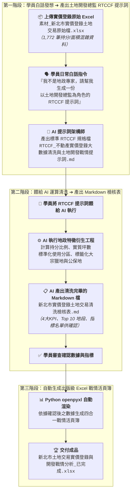

# 11-1 白話自然語言發想提示詞（生成土地開發分析師 RTCCF 規格與特徵工程）

> 💡 **核心精神**：學員**並不是地政估價專家或資料科學家**，手邊往往只有一張從內政部下載、混雜了 1,772 筆持分分子分母與代碼的原始 Excel！  
> 學員**不需要自己手動去按 1,772 次計算機換算坪數**，只要上傳這份 Excel 檔，用日常的大白話向 AI 下達發想指令：  
> 1. 請 AI 幫忙架構一份**以「資深土地開發投資總監」為角色（Role）的 RTCCF 格式 Markdown 提示詞規格檔**。  
> 2. 再將這份 RTCCF 提示詞餵給 AI，**AI 就會自動執行嚴謹的地政特徵衍生工程（持分比例、實質移轉坪數、使用分區標準化、大宗獵地篩選），並產出一份計算完畢的 Markdown 檢核檔讓學員確認**！  
> 3. 學員確認數據無誤後，再自動生成具備頂級商業儀表板美化的 4 合 1 Excel 戰情發布檔。

---

## 🎯 核心工作流：從白話指令到大數據戰情檢核



---

## 💬 複製即可使用之白話發想指令（一般學員真實口吻）

學員在 AI 對話視窗（ChatGPT Plus / Claude / Gemini Advanced）中，**先上傳《素材_新北市實價登錄土地交易原始檔.xlsx》**，並直接貼上以下這段最純粹的大白話發想指令：

```text
你好，主管剛剛丟給我一份從內政部地政司「實價登錄」下載的 Excel 檔案《素材_新北市實價登錄土地交易原始檔.xlsx》，裡面有 1,772 筆新北市最新的土地交易清冊。

主管要我做出一份「新北市土地交易戰情分析儀表板與大宗獵地評估總表」給土地開發投資委員會審核。但我根本不是地政專家或資料工程師，面對裡面的資料非常頭痛：
1. 資料只有「全基地面積」跟複雜的「持分分子/分母」（例如基地 5,000 平方公尺，持分 100000 分之 255），完全看不出到底實質買了「幾坪」土地！
2. 裡面大部分是大樓預售屋交屋的 1~3 坪小持分，但也有大建商全筆買下幾百坪的真正大案子，全部混在一起。
3. 使用分區寫著「都市：其他:住宅區」、「非都市：山坡地保育區...」，名稱太亂沒有歸納。
4. 主管特別想知道有沒有投資人在收購「道路用地」或「公共設施保留地」當作未來推案的容積移轉籌碼。

請你扮演頂級的提示詞架構師，以一位「資深土地開發投資總監」的專業角度，幫我寫一份標準的 RTCCF 格式 Markdown 提示詞規格檔：
1. 這份提示詞要指示 AI 建立精準的特徵計算公式（計算持分比例、換算實質移轉坪數、清理使用分區、標籤化大宗獵地與公保地）。
2. 特別注意：提示詞裡一定要規定 AI「運算完成後，先整理成一份結構化的 Markdown 檢核檔案給我確認數據」，等我確認沒問題之後，才可以幫我生成專業的 Excel 報表。

請直接產出完整的 Markdown 規格內容，讓我能直接儲存為 Markdown 檔案格式（建議檔名：`RTCCF_不動產實價登錄大數據清洗與土地開發戰情提示詞.md`），方便我在本地儲存、檢視與人機協作微調，謝謝！
```

---

## 💾 步驟成果：儲存為 Markdown 檔案格式（.md）

AI 回覆產出標準 RTCCF 提示詞後，學員請進行以下操作：
1. **複製 AI 產出內容**：點擊 AI 對話框右上角的複製按鈕。
2. **儲存為 Markdown 檔案**：在本地專案資料夾中新建檔案，儲存為 [**`RTCCF_不動產實價登錄大數據清洗與土地開發戰情提示詞.md`**](./RTCCF_不動產實價登錄大數據清洗與土地開發戰情提示詞.md)。
3. **進行人機協作（Human-in-the-loop）**：學員可在任何文字編輯器（VS Code / 筆記軟體）中開啟這份 `.md` 檔案，自由檢視、補充備註或微調門檻參數（如調整大宗獵地面積門檻為 50 坪）。
4. **進入步驟 11-2**：確認內容後，將該 Markdown 提示詞整段餵給 AI，AI 就會自動執行特徵工程運算，並先產生一份 Markdown 數據檢核檔供您確認！

---

## 💡 為什麼要儲存為 Markdown 檔案格式？

1. **落實人機協作（Human-in-the-loop）**：  
   儲存為 `.md` 檔案後，學員可以在本地直接檢閱修改公式與分類邏輯，不需要每次都重新向 AI 溝通，讓提示詞成為可被版本控管與反覆優化的專業資產。
2. **標準化提示詞資產沉澱**：  
   這份 `.md` 檔案能作為地產投資團隊內部的標準作業規格（SOP）。未來如果有台中、高雄或其他季度的實價登錄原始檔，只要換上新檔案，重複使用這份 Markdown 提示詞即可一鍵完成大數據清洗！
3. **清晰的兩階段執行防線**：  
   Markdown 檔案格式讓 AI 能夠以最結構化的方式理解「先產 Markdown 檢核表讓人類確認 ➔ 人類確認無誤後才生成 Excel」，徹底杜絕 AI 算錯面積或產生數據通靈！
