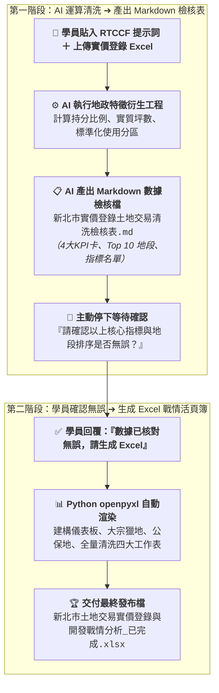

# 11-2 AI 產出之 RTCCF 實價登錄清洗與特徵工程提示詞（特徵衍生與人機協作）

> 💡 **核心定位**：本文件是由學員在 [步驟 11-1](./11-1_白話自然語言發想提示詞.md) 輸入白話指令後，由 AI 自動架構生成的標準 **RTCCF 提示詞規格檔**。  
> 
> * 🎯 **角色設定**：將 AI 賦予為「**擁有 15 年不動產土地開發投資總監經驗與 Python 資料科學家背景的專家**」。  
> * 🌐 **核心能力**：指示 AI 讀取原始 Excel 中 1,772 筆土地交易，自動建立精準的持分比例計算模型、換算實質買賣坪數、正規化土地使用分區，並標籤化大宗獵地案與容積移轉公保地。  
> * 📋 **數據防錯機制**：**AI 運算完成後，必須先產出 1 份 Markdown 檔案供學員確認數據與地段排序**，確認後才執行步驟 11-3 生成 Excel 戰情發布檔！  
> 
> 📁 獨立規格檔下載：👉 [**`RTCCF_不動產實價登錄大數據清洗與土地開發戰情提示詞.md`**](./RTCCF_不動產實價登錄大數據清洗與土地開發戰情提示詞.md)

---

## 🎯 兩階段執行流程圖



---

## 📋 RTCCF 提示詞全文（可直接儲存或複製貼給 AI）

```markdown
## Role｜角色

你是一位同時具備 15 年不動產土地開發投資總監（Chief Land Acquisition Officer）經驗與 Python 資料科學家背景的專家。精通台灣地政法規、都市計畫法、土地使用分區管制自治條例、公共設施保留地容積移轉辦法，以及 Pandas / OpenPyXL 商業級戰情報表工程。

## Task｜任務

我已經上傳了來自內政部實價登錄的土地交易原始工作表：《素材_新北市實價登錄土地交易原始檔.xlsx》（共 1,772 筆資料）。  
由於原始資料僅有代碼、持分分子/分母與全基地面積，請扮演土地開發投資總監，為我執行「特徵工程清洗 ➔ Markdown 檢核確認 ➔ 產出 4 合 1 Excel 戰情活頁簿」的兩階段任務：

### 階段一：執行地政特徵衍生運算，並產出 Markdown 檢核表（人類確認關卡）
1. 嚴謹的地政特徵衍生工程（Feature Engineering）：
   - 持分比例計算 (Share Ratio)：
     * 公式：$\text{Share Ratio} = \frac{\text{權利人持分分子}}{\text{權利人持分分母}}$
     * 例外保護機制：若分母為 0、空值或非數值，預設為 1.0；若分子為空值，預設為 1.0；持分比例最高不超過 1.0。
   - 實質移轉面積換算 (Actual Area Conversion)：
     * 實質移轉平方公尺：$\text{實質平方公尺} = \text{土地移轉面積平方公尺} \times \text{Share Ratio}$
     * 實質移轉坪數：$\text{實質坪數} = \text{實質平方公尺} \times 0.3025$（精確四捨五入至小數點後兩位）。
   - 土地使用分區標準化 (Zoning Normalization)：
     * 去除「都市：其他:」、「都市：」、「非都市：」等行政雜訊前綴。
     * 標準化歸納為宏觀大類：住宅區、商業區、工業/產業專用、公共設施/道路、農業/保護區、其他分區。
   - 商業投資分群標籤 (Transaction Segmentation)：
     * 【大宗獵地/開發指標】：移轉情形 == "全筆移轉" 且 實質坪數 >= 30.0 坪。
     * 【容積移轉/公保地籌碼】：使用分區包含 道路、公園、學校、機關 等公保地。
     * 【一般持分/集合住宅】：其餘一般微型持分買賣。
2. 提煉高階戰情指標與決策備忘錄：
   - 彙整 4 大核心 KPI：總交易件數（筆）、總實質移轉坪數（坪）、大宗獵地指標案（筆）、公保/容積移轉籌碼（筆）。
   - 統計 Top 10 熱門地段排行榜（依實質移轉坪數排序）與土地使用分區佔比。
   - 撰寫土地開發與投資決策委員會核心觀點摘要（Executive Takeaways）。
3. 產出結構化 Markdown 檔案：
   - 將上述所有清洗數據整理為一份完整的《新北市實價登錄土地交易清洗檢核表.md》。
4. 停下來等待審核：
   - 在對話框中輸出該 Markdown 檔案，並主動詢問我：「新北市實價登錄 1,772 筆資料已完成地政特徵衍生運算與分群統計，請確認指標與地段排序是否無誤？確認後將為您自動生成包含四大工作表的正式 Excel 戰情發布檔」。
   - 在使用者確認前，嚴禁直接產出 Excel 檔案！

### 階段二：確認後自動生成出版級 Excel 戰情發布檔
當我回覆「確認數據無誤」之後，請撰寫並執行 Python openpyxl 腳本，產出包含 4 個專屬工作表的高質感發布檔《新北市土地交易實價登錄與開發戰情分析_已完成.xlsx》：
1. 工作表 1【土地開發戰情儀表板】：頂部 4 大 KPI 卡、Top 10 熱門地段排行榜、使用分區分佈表、投資決策備忘錄卡片。
2. 工作表 2【建商大宗獵地清單】：56 筆全筆大面積指標案，依實質坪數排序與高亮。
3. 工作表 3【容積移轉與公保地清單】：80 筆道路/公園/機關公保地籌碼明細。
4. 工作表 4【實價登錄全量清洗資料】：1,772 筆 12 欄完整清洗後大數據資料庫。

## Context｜背景與情境

- 土地開發部每週需向董事會、投資審議委員會與私募基金合夥人彙報新北市全區的交易熱度。
- 主管與投資人極度重視「實質買賣土地坪數」，痛恨將集合住宅 1 坪微型持分與數百坪大宗獵地混為一談的粗糙報表。
- 最終成果需具備外商不動產投資顧問之專業視覺排版與數據嚴謹度。

## Constraints｜限制與規則

1. 嚴格禁止數據通靈與省略：
   - 1,772 筆資料之原始面積、地號、地段與代碼必須 100% 忠實對齊原始 Excel，嚴禁隨意剔除資料。
   - 所有統計數據必須完全基於特徵工程公式實質算出。
2. 嚴格落實兩階段流程：
   - 必須先輸出 Markdown 檢核表讓使用者確認，嚴禁在第一階段跳過確認直接產出 Excel 檔。
3. 地政運算與數值精度要求：
   - 坪數必須精確四捨五入至小數點後 2 位；持分比例精確至小數點後 6 位。
4. 視覺與色彩規範：
   - 採用大地產深海軍藍（#1A365D）與土地琥珀金（#C05621）雙主色，全面套用微軟正黑體、凍結窗格與自動調校欄寬。

## Format｜輸出格式規範

1. 第一階段輸出：Markdown 數據檢核表（新北市實價登錄土地交易清洗檢核表.md）
2. 第二階段輸出：包含四大工作表之出版級 Excel 活頁簿（新北市土地交易實價登錄與開發戰情分析_已完成.xlsx）。
```

---

## 🔍 第一階段交付示範：AI 產出之 Markdown 數據檢核表

當學員將上述 RTCCF 提示詞貼給 AI 後，AI **第一步會自動執行地政特徵衍生運算，並產出如下的 Markdown 檢核表，停下來讓學員確認**：

```markdown
# 📊 新北市實價登錄土地交易清洗檢核表（共 1,772 筆）

## 一、土地開發四大核心 KPI 摘要
* 🏢 **總交易件數**：`1,772 筆`（新北全市移轉樣本數）
* 📐 **總實質移轉坪數**：`19,988.25 坪`（折合約 66,076.85 m²）
* 🎯 **大宗獵地指標案**：`56 筆`（篩選標準：全筆移轉 ≧ 30 坪）
* 🛣️ **公保/容積移轉籌碼**：`80 筆`（道路用地、公園、學校、公共設施）

---

## 二、新北市土地交易熱門地段 TOP 10（依實質移轉坪數排序）

| 排名 | 地段名稱 | 交易筆數 | 實質移轉面積 (m²) | 實質移轉坪數 (坪) | 全市坪數佔比 | 主要土地屬性 |
| :---: | :--- | :---: | ---: | ---: | :---: | :--- |
| **1** | **頂角段倒照湖小段** | 9 | 17,641.00 | **5,336.40 坪** | 26.70% | 農業區 / 農牧用地 |
| **2** | **大坪段** | 3 | 10,112.90 | **3,059.15 坪** | 15.30% | 農業區 / 農牧用地 |
| **3** | **萬西段** | 6 | 3,352.59 | **1,014.16 坪** | 5.07% | 農業區 / 農牧用地 |
| **4** | **東和段** | 16 | 3,167.95 | **958.31 坪** | 4.79% | 交通用地 / 農業區 |
| **5** | **興化店段牛埔子小段**| 2 | 3,085.00 | **933.21 坪** | 4.67% | 住宅區 |
| **6** | **中湖段** | 4 | 2,626.54 | **794.53 坪** | 3.97% | 農業區 / 保護區 |
| **7** | **新小坑段** | 4 | 2,544.24 | **769.63 坪** | 3.85% | 保安保護區 |
| **8** | **新頭湖段** | 1 | 2,153.96 | **651.57 坪** | 3.26% | 第三之二種產業專用區 |
| **9** | **北港段新山小段** | 4 | 1,918.92 | **580.47 坪** | 2.90% | 農業區 / 農牧用地 |
| **10**| **十三添一段** | 14 | 1,904.94 | **576.24 坪** | 2.88% | 乙種建築用地 / 鄉村區 |

---

## 三、土地使用分區總體分佈概況

| 使用分區大類 | 交易筆數 | 筆數佔比 | 實質移轉坪數 (坪) | 坪數佔比 | 投資屬性解讀 |
| :--- | :---: | :---: | ---: | :---: | :--- |
| **農業/保護區** | 230 筆 | 13.0% | **15,031.00 坪** | 75.2% | 外圍大面積全筆交易，長線資產佈局或休閒休閒農地 |
| **住宅區** | 1,036 筆 | 58.5% | **2,707.39 坪** | 13.5% | 核心重劃區預售大樓交屋，多為 1~3 坪微型持分 |
| **工業/產業專用** | 49 筆 | 2.8% | **1,192.80 坪** | 6.0% | 廠房改建、科技園區擴廠用地需求穩健 |
| **其他分區** | 128 筆 | 7.2% | **798.82 坪** | 4.0% | 非都市特定目的事業用地等零星交易 |
| **公共設施/道路** | 80 筆 | 4.5% | **208.76 坪** | 1.0% | 建商收購容積移轉籌碼，集中於成熟精華市區 |
| **商業區** | 249 筆 | 14.1% | **49.48 坪** | 0.2% | 都會蛋黃區高容積商業大樓持分分割 |

---

## 四、建商大宗獵地指標案精選（前 5 筆示範）

| 交易編號 | 土地位置 (地段) | 地號 | 實質移轉坪數 (坪) | 原始面積 (m²) | 土地使用分區 | 移轉情形 |
| :--- | :--- | :---: | ---: | ---: | :--- | :---: |
| RPQNMLQLQHLGFDF98DA | 大坪段 | 01160000 | **2,957.85 坪** | 9,778.02 | 農牧用地 | 全筆移轉 |
| RPTNMLLKQHLGFDF68DA | 頂角段倒照湖小段 | 00260000 | **1,155.85 坪** | 3,821.00 | 農牧用地 | 全筆移轉 |
| RPUOMLPLQHLGFIF27DA | 東和段 | 02260000 | **950.62 坪** | 3,142.54 | 農牧用地 | 全筆移轉 |
| RPTNMLLKQHLGFDF68DA | 頂角段倒照湖小段 | 00230000 | **773.19 坪** | 2,556.00 | 農牧用地 | 全筆移轉 |
| RPTNMLLKQHLGFDF68DA | 頂角段倒照湖小段 | 00280000 | **739.31 坪** | 2,444.00 | 農牧用地 | 全筆移轉 |

---

🛑 **AI 停下等待審核回覆**：  
「以上新北市實價登錄 1,772 筆資料已完成地政特徵衍生運算與分群統計，請開啟確認數據與地段排序是否無誤？確認後將為您自動生成包含四大工作表的正式 Excel 發布檔。」
```
