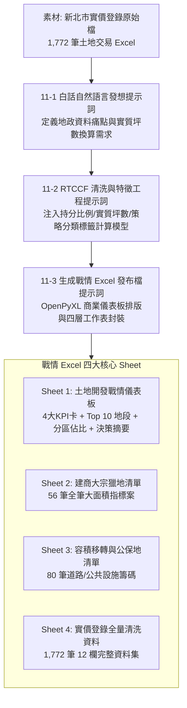

# 不動產實價登錄大數據清洗與土地開發戰情分析自動化 (Real Estate Land Transaction Big Data Cleaning & Land Banking Dashboard)

> **專案背景**：在土地開發、建商獵地、不動產估價與資產管理領域，內政部地政司定期釋出的實價登錄開放資料是極為重要的第一手市場情資。然而，原始匯出的土地交易清冊往往長達數千筆，充滿代碼、全筆/持分混雜的數字，且無法直觀看出「實質買賣坪數」；建商難以從大樓預售屋交屋的微型持分過戶（1~3 坪）中，快速過濾出大面積「全筆獵地」個案與「道路用地/公保地容積移轉籌碼」。  
> 本專案展示如何運用 AI 與 Python 大數據特徵工程，將新北市 1,772 筆實價登錄土地交易一鍵清洗轉化為具備「投資戰情儀表板」、「建商大宗獵地名單」與「公保地容移清單」之頂級商業決策 Excel 總表。

---

## 📥 專案檔案下載快速導覽（實作素材 vs 完成成果）

> 💡 **學習建議**：想要親自動手實作的學員，請下載 **「實作必備原始素材」** 原始實價登錄土地交易 Excel 檔至專案中；想直接檢視最終 4 合 1 戰情發布成果，請下載 **「完成成果活頁簿」**。
>
> * 📦 **【實作起點】練習必備原始素材（請下載此檔案開始實作）**：  
>   👉 [**`素材_新北市實價登錄土地交易原始檔.xlsx`**](./素材_新北市實價登錄土地交易原始檔.xlsx) *(新北市 1,772 筆實價登錄土地交易原始清冊，含代碼、持分分子/分母與全基地面積，請下載此檔開始實作)*
>
> * 🏆 **【對照標準答案】最終完成發布檔**：  
>   👉 [**`新北市土地交易實價登錄與開發戰情分析_已完成.xlsx`**](./新北市土地交易實價登錄與開發戰情分析_已完成.xlsx) *(自動產出之出版級 Excel 戰情發布檔，內含土地開發戰情儀表板、建商大宗獵地名單、公保地容移清單與全量清洗庫)*

---

## 學習重點與核心心法 (Learning Objectives)

### 1. 地政特殊結構之特徵衍生（Feature Engineering for Real Estate）
- 原始資料僅有「全基地面積（平方公尺）」與「持分分子/分母」，無法直觀看出交易規模。
- 本工作流示範如何建立精準計算模型：
  $$\text{持分比例 (Share Ratio)} = \frac{\text{權利人持分分子}}{\text{權利人持分分母}}$$
  $$\text{實質移轉坪數} = (\text{土地移轉面積} \times \text{Share Ratio}) \times 0.3025$$
- 建立異常值保護機制（分母為 0 或空值處理、持分上限 100% 防呆）。

### 2. 商業分群過濾思維（建商大宗獵地 vs 散戶預售過戶）
- 從 1,772 筆交易中，精準抽離出兩大核心投資指標：
  - **建商大宗獵地/整併指標（共 56 筆）**：篩選 `全筆移轉` 且 `實質移轉坪數 >= 30 坪`，掌握實質大型土地交易。
  - **容積移轉/公保地籌碼（共 80 筆）**：過濾使用分區為 `道路用地`、`公園用地`、`學校用地`，提供建商高層評估爭取最高容積獎勵之買賣動向。

### 3. 使用分區文字標準化與板塊統計（Zoning Normalization）
- 自動去除政府原始字串前綴（如「都市：其他:」、「非都市：」），分類至**住宅區、商業區、工業/產業專用區、公共設施/道路、農業/保護區**等宏觀大類。
- 揭露市場深層結構：市區核心段（江翠段、仁愛段、五谷王段）雖筆數最多，但多為大樓持分；外圍（石門、萬里、三峽）則為大面積農保地全筆交易。

### 4. 頂級地產戰情儀表板排版美學（Dashboard Styling）
- 採用不動產私募基金專屬之「大地產深海軍藍 `#1A365D` ＋ 土地金 `#C05621`」配色。
- 頂部設計 4 大核心 KPI 指標卡、熱門地段 TOP 10 排行榜、使用分區分佈佔比表與高層決策備忘錄（Executive Takeaways），實現高層彙報一目了然。

---

## 工作流程與架構圖 (Workflow Architecture)

---

[← 返回實戰範例導覽總表](../README.md)

