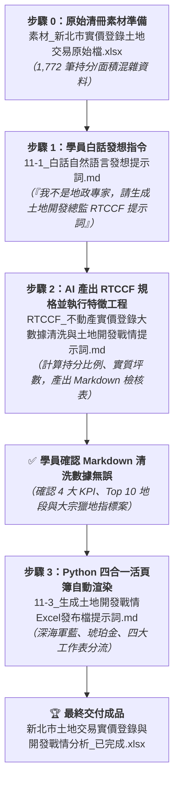

# 實戰範例：不動產實價登錄大數據清洗與土地開發戰情分析自動化

> 🟢 **採用代理平台**：ChatGPT Agent / Claude.ai / Google Antigravity  
> 🛠️ **建議執行模式**：**雙軌人機協商**（**白話需求發想 ➔ RTCCF 土地開發專家提示詞 ➔ Markdown 數據檢核確認 ➔ Python openpyxl 四合一戰情活頁簿自動渲染**）

---

## 📥 專案檔案下載快速導覽（實作素材 vs 完成成果 vs 中繼產物）

> 💡 **學習建議**：想要親自動手實作的學員，請下載 **「實作必備原始素材」** 原始實價登錄土地交易 Excel 檔至專案中；想直接檢視最終 4 合 1 戰情發布成果，請下載 **「完成成果活頁簿」**。
>
> * 📦 **【實作起點】練習必備原始素材（請下載此檔案開始實作）**：  
>   👉 [**`素材_新北市實價登錄土地交易原始檔.xlsx`**](./素材_新北市實價登錄土地交易原始檔.xlsx) *(新北市 1,772 筆實價登錄土地交易原始清冊，含代碼、持分分子/分母與全基地面積，請下載此檔開始實作)*
>
> * 🏆 **【對照標準答案】最終完成發布檔**：  
>   👉 [**`新北市土地交易實價登錄與開發戰情分析_已完成.xlsx`**](./新北市土地交易實價登錄與開發戰情分析_已完成.xlsx) *(自動產出之出版級 Excel 戰情發布檔，內含土地開發戰情儀表板、建商大宗獵地名單、公保地容移清單與全量清洗庫)*
>
> * 📄 **【中繼確認成果】獨立規格檔**：  
>   👉 [**`RTCCF_不動產實價登錄大數據清洗與土地開發戰情提示詞.md`**](./RTCCF_不動產實價登錄大數據清洗與土地開發戰情提示詞.md) *(包含嚴謹地政特徵衍生數學模型、異常值防呆與兩階段確認規範之標準提示詞規格檔)*

---

## 🏆 最終完成作品展示（實作成果搶先看）

在土地開發、建商獵地、不動產估價與資產管理領域，內政部地政司定期釋出的實價登錄開放資料是極為重要的第一手市場情資。然而，原始匯出的土地交易清冊往往長達數千筆，充滿代碼、全筆/持分混雜的數字，且無法直觀看出「實質買賣坪數」；建商難以從大樓預售屋交屋的微型持分過戶（1~3 坪）中，快速過濾出大面積「全筆獵地」個案與「道路用地/公保地容積移轉籌碼」。

本專案展示如何運用 AI 與 Python 大數據特徵工程，將新北市 1,772 筆實價登錄土地交易一鍵清洗轉化為包含 **4 個專業工作表（Sheet）** 的頂級商業決策 Excel 總表：

1. **工作表 1【土地開發戰情儀表板】**：高層視角。包含頂部 4 大核心 KPI 統計卡（總移轉坪數、大宗獵地筆數、公保地筆數、持分筆數）、熱門地段 TOP 10 交易排行榜、土地使用分區總體分佈佔比表，以及土地開發部主管決策備忘錄（Executive Takeaways），3 秒掌握全市熱點。
2. **工作表 2【建商大宗獵地清單】**：投資精準視角。過濾出全筆移轉且實質坪數 ≧ 30 坪的大宗土地指標案（共 56 筆），排除散戶持分雜訊，供獵地團隊鎖定地主。
3. **工作表 3【容積移轉與公保地清單】**：法規籌碼視角。萃取使用分區為道路用地、公園、學校之交易（共 80 筆），提供高層評估爭取最高法定容積獎勵之買賣動向。
4. **工作表 4【實價登錄全量清洗資料】**：數據工程底座。完整收錄 1,772 筆資料與 12 個計算欄位（含持分比例、實質移轉坪數、策略分類標籤），支援後續樞紐分析與稽核查驗。

---

### 📊 完成作品外觀預覽 1：【土地開發戰情儀表板】（4 大 KPI 卡與宏觀全景）

#### 🏢 頂部四大核心 KPI 指標卡
| 指標名稱 | 總交易件數 | 總實質移轉坪數 | 大宗獵地指標案 | 公保/容積移轉籌碼 |
| :--- | :---: | :---: | :---: | :---: |
| **數值** | **1,772 筆** | **19,988.2 坪** | **56 筆** | **80 筆** |
| **基準/附註** | 新北全市移轉樣本數 | 約 66,077 m² | 全筆移轉 ≧ 30 坪 | 道路/公園/機關公保地 |

#### 📊 新北市土地交易熱門地段 TOP 10（依實質移轉坪數排序）
| 排名 | 地段名稱 | 交易筆數 | 實質移轉面積 (m²) | 實質移轉坪數 (坪) | 全市坪數佔比 | 主要土地屬性 |
| :---: | :--- | :---: | ---: | ---: | :---: | :--- |
| **1** | **頂角段倒照湖小段** | 9 | 17,641.00 | **5,336.40 坪** | 26.7% | 農業區 / 農牧用地 |
| **2** | **大坪段** | 3 | 10,112.90 | **3,059.15 坪** | 15.3% | 農業區 / 農牧用地 |
| **3** | **萬西段** | 6 | 3,352.59 | **1,014.16 坪** | 5.1% | 農業區 / 農牧用地 |
| **4** | **東和段** | 16 | 3,167.95 | **958.31 坪** | 4.8% | 交通用地 / 農業區 |
| **5** | **興化店段牛埔子小段** | 2 | 3,085.00 | **933.21 坪** | 4.7% | 住宅區 |
| **6** | **中湖段** | 4 | 2,626.54 | **794.53 坪** | 4.0% | 農業區 / 保護區 |
| **7** | **新小坑段** | 4 | 2,544.24 | **769.63 坪** | 3.9% | 保安保護區 |
| **8** | **新頭湖段** | 1 | 2,153.96 | **651.57 坪** | 3.3% | 第三之二種產業專用區 |
| **9** | **北港段新山小段** | 4 | 1,918.92 | **580.47 坪** | 2.9% | 農業區 / 農牧用地 |
| **10** | **十三添一段** | 14 | 1,904.94 | **576.24 坪** | 2.9% | 乙種建築用地 / 鄉村區 |

#### 🏷️ 土地使用分區總體分佈概況
| 使用分區大類 | 交易筆數 | 筆數佔比 | 實質移轉坪數 (坪) | 坪數佔比 | 投資屬性解讀 |
| :--- | :---: | :---: | ---: | :---: | :--- |
| **農業/保護區** | 230 筆 | 13.0% | **15,031.00 坪** | 75.2% | 外圍大面積全筆交易，長線資產佈局或休閒休閒農地 |
| **住宅區** | 1,036 筆 | 58.5% | **2,707.39 坪** | 13.5% | 核心重劃區預售大樓交屋，多為 1~3 坪微型持分 |
| **工業/產業專用** | 49 筆 | 2.8% | **1,192.80 坪** | 6.0% | 廠房改建、科技園區擴廠用地需求穩健 |
| **其他分區** | 128 筆 | 7.2% | **798.82 坪** | 4.0% | 非都市特定目的事業用地等零星交易 |
| **公共設施/道路** | 80 筆 | 4.5% | **208.76 坪** | 1.0% | 建商收購容積移轉籌碼，集中於成熟精華市區 |
| **商業區** | 249 筆 | 14.1% | **49.48 坪** | 0.2% | 都會蛋黃區高容積商業大樓持分分割 |

---

### 📈 完成作品外觀預覽 2：【建商大宗獵地精選清單】（微觀對標）

| 交易編號 | 土地位置 (地段) | 地號 | 實質移轉坪數 (坪) | 原始面積 (m²) | 土地使用分區 | 移轉情形 |
| :--- | :--- | :---: | ---: | ---: | :--- | :---: |
| **RPQNMLQLQHLGFDF98DA** | **大坪段** | 01160000 | **2,957.85 坪** | 9,778.02 | 農牧用地 | 全筆移轉 |
| **RPTNMLLKQHLGFDF68DA** | **頂角段倒照湖小段** | 00260000 | **1,155.85 坪** | 3,821.00 | 農牧用地 | 全筆移轉 |
| **RPUOMLPLQHLGFIF27DA** | **東和段** | 02260000 | **950.62 坪** | 3,142.54 | 農牧用地 | 全筆移轉 |
| **RPTNMLLKQHLGFDF68DA** | **頂角段倒照湖小段** | 00230000 | **773.19 坪** | 2,556.00 | 農牧用地 | 全筆移轉 |
| **RPTNMLLKQHLGFDF68DA** | **頂角段倒照湖小段** | 00280000 | **739.31 坪** | 2,444.00 | 農牧用地 | 全筆移轉 |

---

## 🎯 案例情境與四大核心職場心法

在不動產私募基金、建商土地開發部或地政估價機構中，分析師面對從政府開放平台下載的數千筆原始清冊時，通常會遭遇以下痛點：
1. **面積指標虛胖誤導**：原始清冊標記「全基地面積 5,000 平方公尺」，但該筆交易實際上只是某大樓住戶交屋，土地持分僅萬分之 255（實質不到 4 坪）。若直接按基地面積統計，數據嚴重失真！
2. **獵地訊號被雜訊淹沒**：1,772 筆資料中有高達 93% 是集合住宅微型持分，只有 7% 是大建商或法人「全筆買斷數百坪」的大宗收購案。
3. **分區名稱凌亂無序**：行政前綴充斥（「都市：其他:住宅區」、「非都市：山坡地保育區...」），無法進行樞紐分析或跨區比對。

### 💡 職場實戰四大核心心法

#### 心法一：地政持分結構之「特徵工程衍生運算（Feature Engineering）」
* **問題**：只有「全基地面積（m²）」與「權利人持分分子/分母」，無法直觀看出實質買賣規模。
* **解法**：建立嚴謹的數學衍生模型：
  $$\text{持分比例 (Share Ratio)} = \frac{\text{權利人持分分子}}{\text{權利人持分分母}}$$
  $$\text{實質移轉坪數} = (\text{土地移轉面積} \times \text{Share Ratio}) \times 0.3025$$
  並加入異常值防護機制（分母為 0/空值保護、持分比例上限 100% 防呆）。

#### 心法二：非結構化文字之「使用分區本體論標準化（Taxonomy）」
* **問題**：政府資料字串包含過多行政前綴雜訊，同一分區有數種寫法。
* **解法**：運用字串正規化演算法去除前綴，歸納為「住宅區、商業區、工業/產業專用、公共設施/道路、農業/保護區」五大宏觀大類，使分佈佔比一目了然。

#### 心法三：商業投資分群過濾（Clustering & Segmentation）
* **問題**：散戶大樓過戶與建商獵地混在一起，無法評估真正的土地整合熱度。
* **解法**：建立多維度標籤分類：
  - **【建商大宗獵地】**：篩選 `全筆移轉` 且 `實質移轉坪數 ≧ 30 坪`（共 56 筆）。
  - **【容積移轉/公保地籌碼】**：過濾使用分區為 `道路用地`、`公園`、`學校` 等公保地（共 80 筆）。
  - **【一般持分/集合住宅】**：標記為微型持分，供獨立觀察交屋潮。

#### 心法四：超越純數據——提煉土地開發投資委員會「Executive Takeaways」決策備忘錄
* **問題**：高階主管與投資審議合夥人無暇翻閱千筆明細，需要明確的「So What?」觀點。
* **解法**：在戰情儀表板卡片直指核心洞察：外圍大面積農保地為主要坪數支撐（頂角段、大坪段、萬西段合計逾 9,400 坪）、市區重劃區（江翠、五谷王）以大樓持分為主、道路用地浮現收購訊號。

---

## ⚡ 核心人機協商閉環（原始清冊 ➔ RTCCF 清洗 ➔ Markdown 檢核 ➔ openpyxl 渲染）

### 1. 步驟 0：素材準備
* 數據素材：[**`素材_新北市實價登錄土地交易原始檔.xlsx`**](./素材_新北市實價登錄土地交易原始檔.xlsx)（新北市 1,772 筆土地交易實價登錄原始檔）

### 2. 步驟 1：白話自然語言發想（一般學員視角）
* 文件連結：[**`11-1_白話自然語言發想提示詞.md`**](./11-1_白話自然語言發想提示詞.md)
* 核心亮點：學員不是地政專家或資料科學家，手邊只有混雜持分分子分母的清冊。透過大白話引導 AI 產出一份以「資深土地開發投資總監」為角色的 RTCCF 提示詞規格，並指示 AI 計算完畢後先產出 Markdown 檢核檔讓學員確認！

### 3. 步驟 2：AI 產出之 RTCCF 實價登錄清洗與特徵工程（特徵衍生與人機協作）
* 文件連結：[**`11-2_AI產出之RTCCF實價登錄清洗與特徵工程提示詞.md`**](./11-2_AI產出之RTCCF實價登錄清洗與特徵工程提示詞.md)
* 獨立規格檔：[**`RTCCF_不動產實價登錄大數據清洗與土地開發戰情提示詞.md`**](./RTCCF_不動產實價登錄大數據清洗與土地開發戰情提示詞.md)
* 核心亮點：AI 角色設定為資深土地開發總監，執行持分比例計算、實質移轉坪數換算與商業分群，並輸出《新北市實價登錄土地交易清洗檢核表.md》供學員審查確認。

### 4. 步驟 3：Python openpyxl 四合一多工作表自動渲染
* 文件連結：[**`11-3_生成土地開發戰情Excel發布檔提示詞.md`**](./11-3_生成土地開發戰情Excel發布檔提示詞.md)
* 核心技術：提示詞內嵌完整生產級 `openpyxl` 渲染腳本，建立大地產深海軍藍表頭、4 大 KPI 指標卡、TOP 10 熱門地段排行榜與四工作表分流架構。

---

[← 返回實戰範例導覽總表](../README.md)
