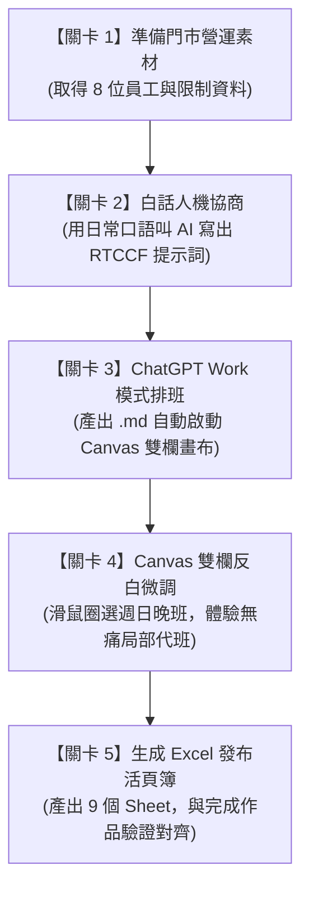

# 實戰範例：便利超商門市排班與規則檢核

> 🟢 **採用代理平台**：ChatGPT Agent 平台  
> 🛠️ **建議執行模式**：**Work 模式**（當 AI 儲存檔案為 `.md` 時，系統將自動開啟 **Canvas 雙欄互動畫布**，方便即時檢核與圈選微調）

---

## 🏆 最終完成作品展示（實作成果搶先看）

> 📥 **完成品直接下載與檢視**：  
> 👉 [**`便利超商捷運站前門市_排班發布表_20261012-20261018.xlsx`**](./便利超商捷運站前門市_排班發布表_20261012-20261018.xlsx)  
> *（這是本單元經過「白話自然語言 ➔ RTCCF 人機協商 ➔ Canvas 雙欄畫布微調 ➔ Python Code Interpreter」後全自動生成的企業級排班發布活頁簿）*

為了讓學生在開始學習前就能**清楚掌握最終完成目標**，本專案最終產出為包含 **9 個工作表（Sheet）** 的專業 Excel 活頁簿：
1. **工作表 1【門市排班總表】**：供店長全局掌控 8 位員工排班、每日各班次人數與缺額合規燈號。
2. **工作表 2～9【員工個人專屬工作表】**：為每位同仁（A 店長、B 副店長、C 專職大夜、G 正職店員、D 大三工讀、E 大四工讀、H 早班兼職、F 假日兼職）建立專屬 Sheet，手機點開一目了然！

---

### 📊 完成作品外觀預覽 1：【門市排班總表】
*包含全店排班矩陣、出勤天數統計、自動累計工時，以及底部每日人數與缺額驗證：*

| 員工姓名與代號 | 職稱 / 身分 | 10/12(週一) | 10/13(週二) | 10/14(週三) | 10/15(週四) | 10/16(週五) | 10/17(週六) | 10/18(週日) | 本週累計工時 | 本週出勤天數 |
| :--- | :--- | :---: | :---: | :---: | :---: | :---: | :---: | :---: | :---: | :---: |
| **A 店長** | 店長 | **D** | **D** | **E** | **E** | **N** | 休 | 休 | 40 小時 | 5 天 |
| **B 副店長** | 副店長 | 休 | **E** | 休 | **D** | **D** | **E** | **N** | 40 小時 | 5 天 |
| **C 專職大夜** | 專職大夜 | **N** | **N** | **N** | **N** | 休 | **N** | 休 | 40 小時 | 5 天 |
| **G 正職店員** | 正職店員 | **D** | **D** | **D** | **E** | **E** | 休 | 休 | 40 小時 | 5 天 |
| **D 大三工讀** | 大三工讀 | **E** | 休 | 休 | 休 | **E** | **E** | 休 | 24 小時 | 3 天 |
| **E 大四工讀** | 大四工讀 | 休 | **E** | **E** | 休 | 休 | 休 | **D** | 24 小時 | 3 天 |
| **H 早班兼職** | 早班兼職 | 休 | 休 | **D** | **D** | **D** | 休 | 休 | 24 小時 | 3 天 |
| **F 假日兼職** | 假日兼職 | 休 | 休 | 休 | 休 | 休 | **D** | **E** | 16 小時 | 2 天 |
| **早班 (D) 當值人數** | *平日需 2 人；週末需 1 人* | **2** | **2** | **2** | **2** | **2** | **1** | **1** | *(COUNTIF 公式)* | - |
| **晚班 (E) 當值人數** | *每日需 2 人* | **1** *(⚠️缺1)* | **2** | **2** | **2** | **2** | **2** | **1** *(⚠️缺1)* | *(COUNTIF 公式)* | - |
| **大夜 (N) 當值人數** | *每日需 1 人* | **1** | **1** | **1** | **1** | **1** | **1** | **1** | *(COUNTIF 公式)* | - |
| **缺額檢核狀態** | *門市防缺額自動判斷* | ⚠️ 缺額 | **達標** | **達標** | **達標** | **達標** | **達標** | ⚠️ 缺額 | **全週缺額即時警示** | - |

---

### 👤 完成作品外觀預覽 2：【員工個人專屬 Sheet】（以 `A_店長` 為例）
*讓員工直接切換到自己名字的 Sheet，清晰查閱當週每天的起訖時段、營運重點與工時上限檢核：*

| 日期 | 星期 | 班別代碼 | 班別名稱 | 出勤起訖時段 | 當日工時 | 當班工作重點與營運注意事項 |
| :---: | :---: | :---: | :---: | :---: | :---: | :--- |
| **2026/10/12** | 週一 | **D** | 早班 | 07:00 – 15:00 | 8 | 捷運通勤早餐、咖啡尖峰；日配鮮食進貨驗收 |
| **2026/10/13** | 週二 | **D** | 早班 | 07:00 – 15:00 | 8 | 捷運通勤早餐、咖啡尖峰；日配鮮食進貨驗收 |
| **2026/10/14** | 週三 | **E** | 晚班 | 15:00 – 23:00 | 8 | 下班人潮、晚餐熱食與網購包裹取件尖峰 |
| **2026/10/15** | 週四 | **E** | 晚班 | 15:00 – 23:00 | 8 | 下班人潮、晚餐熱食與網購包裹取件尖峰 |
| **2026/10/16** | 週五 | **N** | 大夜班 | 23:00 – 翌日 07:00 | 8 | 物流進貨、全店清潔消毒與日盤點 |
| **2026/10/17** | 週六 | **休** | 例休 | 免出勤 | 0 | 休假，免出勤 |
| **2026/10/18** | 週日 | **休** | 例休 | 免出勤 | 0 | 休假，免出勤 |
| **本週合計** | - | - | - | - | **40 小時** | **本週出勤天數：5 天** |
| **每週工時上限** | - | - | - | - | **40 小時** | **✅ 工時合規（=IF(F9<=F10,"工時合規","⚠️ 超過工時上限")）** |

---

### ✨ 完成作品核心亮點（學生學完能做到的事）
* 🎨 **視覺化專業設計**：各班別自動套用色塊區分（早班薄荷綠、晚班溫暖橘、大夜淡紫、休假淺灰），清晰易讀。
* 📐 **動態公式自動串接**：工時計算、出勤天數、當日當值人數統計全面採用 Excel 原生公式（`COUNTIF`、`SUM`、`IF` 邏輯檢驗），非死板文字。
* 📱 **行動端與列印雙友善**：個人 Sheet 專為員工手機查閱優化；總表欄寬已自適應微調，便於直接印出張貼於門市後台公佈欄。

---

## 🎯 案例情境與核心學習價值

在台灣，連鎖便利商店（如 7-ELEVEN、全家等）是標準的 **24 小時三班制** 營運環境。門市店長在每週排班時，面臨高度複雜的雙重挑戰：
1. **台灣《勞動基準法》硬性規範**：
   * **輪班間隔 11 小時**：絕對嚴禁「晚班接早班」（前一天 23:00 下班，隔天 07:00 上班，中間僅休息 8 小時，違法重罰）。
   * **一例一休**：每 7 天必須有 1 天例假與 1 天休息日，不得連續工作超過 6 天。
   * **工時上限**：兼職人員每週打工時數上限管控（如 16H 或 24H）。
2. **超商門市現實營運痛點**：
   * **24 小時守護與大夜防開天窗**：大夜班必須由具備獨立當班資格的正職留守；當專職大夜週五排休時，店長或幹部必須無縫接替。
   * **尖峰雙人制**：早晨通勤早餐咖啡尖峰、晚間下班人潮與包裹取件巔峰，皆需雙人當值，否則現場直接癱瘓。
   * **兼職課表限制**：大學生工讀生平日白天有課或補習，只能排晚班或週末。

> 💡 **本單元核心精神**：  
> 拒絕讓學生手刻複雜生硬的提示詞！我們將帶領學生體驗**「白話發想 ➔ AI 幫你寫 RTCCF 提示詞 ➔ Canvas 雙欄圈選微調 ➔ Python 自動生成 Excel」**的現代化人機協商閉環。

---

## 🧭 5 分鐘通關地圖（SOP 流程總覽）



---

## 🚀 學生手把手實戰操作手冊（5 步通關）

---

### 🟢 關卡 1：準備門市營運素材（取得假資料）

* 📌 **操作動作**：閱讀並複製門市的營運條件。這是模擬台北某捷運站出口 24 小時超商一週（10/12～10/18）的真實假資料。
* 📂 **對應檔案**：[`門市排班偽素材.md`](./門市排班偽素材.md)

<details open>
<summary><b>📋 點擊展開／一鍵複製：門市排班偽素材（包含 8 位同仁條件與排班規則）</b></summary>

```text
【便利超商 捷運站前門市 一週排班偽素材】

一、門市基本資料
- 門市名稱：便利超商 捷運站前門市
- 營業型態：24 小時全年無休
- 排班週期：2026 年 10 月 12 日（週一）～ 2026 年 10 月 18 日（週日），共 7 天
- 每日班別時段：
  * 早班 (D)：07:00 – 15:00（8小時，捷運通勤早餐、咖啡與鮮食進貨高峰）
  * 晚班 (E)：15:00 – 23:00（8小時，下班人潮、晚餐熱食與網購包裹取件高峰）
  * 大夜班 (N)：23:00 – 07:00（8小時，冷藏麵包物流進貨、全店大清潔消毒、日盤點）

二、門市人力配置與出勤條件（共 8 人）
1. A (店長)：正職幹部，每週工時上限 40 小時。全時段可排（具大夜與幹部資格），週日固定需陪家人休假；平日機動留守，週五支援專職大夜代班。
2. B (副店長)：正職幹部，每週工時上限 40 小時。全時段可排（具大夜與幹部資格），週三需參加總部店主管線上例會（限排休）。
3. C (專職大夜)：正職人員，每週工時上限 40 小時。專職大夜班 (N)（具大夜獨立當班資格），每週最多連上 5 天大夜；週五固定預排特休，週末擇一日排例休。
4. G (正職店員)：正職人員，每週工時上限 40 小時。早班 (D) / 晚班 (E) 皆可排，門市正職支援主力，每週排休 2 天（符合一例一休）。
5. D (工讀生-大三)：兼職計時，每週工時上限 24 小時。平日僅可排晚班 (E)，週末全天可排；週二、週四晚上有補習課程（不可排班）。
6. E (工讀生-大四)：兼職計時，每週工時上限 24 小時。平日僅可排晚班 (E)，週末全天可排；週一、週三白天學校專題，晚上可排晚班。
7. H (早班兼職)：兼職計時，每週工時上限 24 小時。平日專職支援早班 (D)，上午配合捷運通勤早餐尖峰出勤，每週排 3 天。
8. F (假日兼職)：兼職計時，每週工時上限 16 小時。僅限週六與週日排班（早班 D 或晚班 E），平日在外縣市上班，週末返鄉兼職打工，每週排 2 天。

三、門市硬性排班規則（勞動基準法 ＋ 超商營運紅線）
1. 24 小時最低留守與尖峰雙人原則：
   - 大夜班 (N)：每天固定需 1 人值班（必須為具大夜資格的幹部或正職：A、B、C）。
   - 早班 (D)：週一至週五平日為捷運通勤咖啡尖峰，每天需 2 人；週六日可維持 1～2 人。
   - 晚班 (E)：下班與網購取件巔峰，每天需 2 人（週五、週六、週日包裹尖峰必須配置至少 2 人）。
2. 勞基法輪班間隔（嚴禁晚接早、夜接早）：
   - 班次更換時，原則必須有連續 11 小時以上之休息時間。
   - 絕對禁止「花班」：當天排晚班 (23:00 下班) 者，隔天嚴禁排早班 (07:00 上班，間隔僅 8 小時，違法開罰！)。
   - 大夜班 (07:00 下班) 者，當天嚴禁排晚班或隔天早班，須隔滿至少 24 小時調時差。
3. 勞基法一例一休原則：
   - 連續工作天數不得超過 6 天，每人連續 7 天週期內必須安排至少 1 天例假及 1 天休息日（每週至少休假 2 天）。
4. 專職大夜保護與防開天窗機制：
   - C (專職大夜) 週五預排特休，當天大夜班必須由正職幹部（A 店長或 B 副店長）輪替接替，絕不能讓超商無人值守。
5. 兼職員工工時上限：
   - 計時人員（D、E、H、F）每週總排班時數不得超過其「每週最高工時上限」。
```
</details>

* 🔍 **成果檢查點**：
  * [ ] 確認掌握 8 位員工的身份（正職 4 人、兼職 4 人）。
  * [ ] 確認已知專職大夜 C「週五請特休」、店長 A「週日固定陪家人休假」。

---

### 🟢 關卡 2：白話人機協商（叫 AI 幫你寫出專業 RTCCF 提示詞）

* 📌 **操作動作**：打開任何 AI 對話框（如 ChatGPT 免費版、GPT-4o、Claude 或 Gemini），將下方的「白話指令」連同「偽素材」一起貼入送出。
* 📂 **對應檔案**：[`1-1_白話自然語言發想提示詞.md`](./1-1_白話自然語言發想提示詞.md)

<details open>
<summary><b>📋 點擊展開／一鍵複製：白話發想提示詞指令</b></summary>

```text
我是台灣一家 24 小時營業的便利商店（捷運站前門市）店長。我手邊有一份下週（10/12～10/18）的門市排班資料與員工出勤規則。

我們店是三班制（早班 07-15、晚班 15-23、大夜班 23-07），店裡有正職店長、副店長、專職大夜、正職店員，還有配合課表的晚班大學生工讀生、早班通勤兼職與假日兼職等共 8 位夥伴。

因為超商常有勞檢稽查，且有許多現實限制（例如：勞基法規定換班必須間隔 11 小時，絕對不能昨天排晚班 23 點下班、今天早上 7 點就上早班；專職大夜週五要請特休不能開天窗；平日早晚通勤尖峰需要 2 個人值班等），我每次自己排班都排得頭昏眼花還常常排錯違法。

以下是我的門市偽素材資料：
--------------------------------------------------
[請在此處貼入上方關卡 1 複製的偽素材內容]
--------------------------------------------------

我想請你扮演「AI 提示詞工程專家（Prompt Engineer）」。請依據上述的素材與痛點，幫我設計一份專業、嚴謹且符合《AI提示詞工程指南》之「Role + Task + Context + Constraints + Format」（五要素提示詞框架）的完整提示詞。

這份提示詞的目的是要給 ChatGPT 執行，讓它自動排出一份超商一週班表，並且在產出時能自動做好「勞基法法規與超商營運規則檢核報告」，而且要求它產出為 Markdown 檔案（檔名：超商門市一週排班與檢核表_20261012-20261018.md），以便我在 Canvas 雙欄畫布中直接圈選微調。

請直接產出該份標準提示詞內容即可，不要有多餘的客套解說。
```
</details>

* 🔍 **成果檢查點**：
  * [ ] AI 回應產出一份包含 `Role`、`Task`、`Context`、`Constraints`、`Format` 的完整排班提示詞。
  * [ ] 這份由 AI 生成的提示詞，與本資料夾中的 [`1-2_AI產出之RTCCF排班提示詞.md`](./1-2_AI產出之RTCCF排班提示詞.md) 架構相同。
* 💡 **小撇步**：如果課堂時間有限，學生也可以直接跳到關卡 3，直接複製已整理好的標準 RTCCF 提示詞！

---

### 🟢 關卡 3：ChatGPT Work 模式執行排班（喚醒 Canvas 雙欄畫布）

* 📌 **操作動作**：
  1. 開啟 **ChatGPT** 對話視窗。
  2. 點選對話框上方的模式選單，確認切換至 **Work 模式**（此模式支援 Canvas 畫布功能）。
  3. 複製下方標準 RTCCF 提示詞，直接貼入對話框發送！
* 📂 **對應檔案**：[`1-2_AI產出之RTCCF排班提示詞.md`](./1-2_AI產出之RTCCF排班提示詞.md)

<details open>
<summary><b>📋 點擊展開／一鍵複製：標準 RTCCF 排班提示詞（直接貼入 ChatGPT）</b></summary>

```markdown
## Role
你是一位精通台灣《勞動基準法》與連鎖便利商店（24 小時營運門市）店務管理的資深營運店長與排班專家。你對三班制輪替、通勤尖峰人力配置、輪班間隔法規（嚴禁晚接早）及防呆備援機制有極高敏銳度。

## Task
請依據下方提供的門市人力現況與出勤規則，排定一份「2026/10/12（週一）至 2026/10/18（週日）」共 7 天的 24 小時門市輪值班表，並針對班表進行嚴格的「勞動基準法合規性」與「超商營運規則」雙重檢核。

## Context
本門市為 24 小時全年無休的「便利超商 捷運站前門市」。門市班別為三班制：
- 早班 (D)：07:00 – 15:00（8 小時，捷運通勤、早餐咖啡、鮮食日配進貨）
- 晚班 (E)：15:00 – 23:00（8 小時，下班尖峰、晚餐熱食、網購包裹取件高峰）
- 大夜班 (N)：23:00 – 07:00（8 小時，冷藏麵包乳品驗收、全店大清潔消毒、日盤點）

現有人力名單與條件（共 8 人）：
- A (店長)：正職幹部，每週 40H，全時段可排（具大夜與幹部資格），週日固定陪家人休假，平日機動留守支援，週五支援大夜代班。
- B (副店長)：正職幹部，每週 40H，全時段可排（具大夜與幹部資格），週三參加總部店主管線上例會（限排休）。
- C (專職大夜)：正職人員，每週 40H，專職大夜班 (N)（具獨立當班資格），每週最多連上 5 天；週五固定預排特休，週末擇一日排例休。
- G (正職店員)：正職人員，每週 40H，早班 (D) 與晚班 (E) 皆可排，門市正職支援主力，每週排休 2 天（符合一例一休）。
- D (工讀生-大三)：兼職計時（上限 24H），平日限晚班 (E)，週二與週四晚上有補習不可排班，週末全天可排。
- E (工讀生-大四)：兼職計時（上限 24H），平日限晚班 (E)，週一與週三白天學校專題（晚上可排晚班），週末全天可排。
- H (早班兼職)：兼職計時（上限 24H），平日專職支援早班 (D) 通勤早餐尖峰，每週排 3 天。
- F (假日兼職)：兼職計時（上限 16H），僅限週六與週日排班（早班 D 或晚班 E），每週排 2 天。

## Constraints
排班必須 100% 滿足下列硬性法規與門市規則，絕不容許違規：
1. 輪班間隔法律底線（嚴禁花班）：班次與班次更換間隔必須滿 11 小時以上。絕對不可出現「前一天晚班 (23:00 下班) ➔ 隔天早班 (07:00 上班)」或「大夜下班當天接晚班」。
2. 大夜守護與絕不開天窗：每天大夜班 (N) 必須且僅能有 1 人值守，且必須是具大夜資格正職（A、B、C）。週五 C 特休時，必須由具資格幹部（A 或 B）替補。
3. 通勤與包裹尖峰雙人制：週一至週五早班 (D) 必須至少 2 人；每天晚班 (E) 必須至少 2 人（特別是週五～週日包裹高峰必須滿 2 人）。若遇特殊人力瓶頸無法滿足雙人，必須於檢核表中明確標示人力缺口警示。
4. 勞基法一例一休：每人每 7 天必須有 1 天例假與 1 天休息日，不得連續工作超過 6 天。
5. 工時上限管控：兼職計時人員（D、E、H、F）排班總工時絕對不得超過上限。

## Format
請嚴格將成果儲存為獨立 Markdown 檔案，檔名為 `超商門市一週排班與檢核表_20261012-20261018.md`。內容必須依序包含：
1. 【門市一週排班矩陣總表】：橫向為日期（10/12～10/18）與星期，縱向為 8 位同仁班別（D、E、N、休），最後兩欄計算「本週工時」與「出勤天數」。
2. 【每日各班當值人數與缺額驗證表】：逐日列出早班、晚班、大夜當值人數與狀態（達標 / ⚠️ 缺額）。
3. 【全員工時與休假統計表】：列出 8 人排班時數、休假天數與合規判斷。
4. 【四大硬性規則檢核報告】：逐項針對「11 小時輪班間隔」、「大夜資格與替補」、「一例一休」、「尖峰雙人制」提出詳細通過分析。
```
</details>

* 🔍 **成果檢查點（關鍵體驗！）**：
  * [ ] ChatGPT 執行後，畫面**右側是否自動滑出 Canvas 雙欄畫布**？
  * [ ] 畫布頂部是否顯示檔名 `超商門市一週排班與檢核表_20261012-20261018.md`？
* ⚠️ **避坑提醒**：如果右側沒有滑出畫布，而是文字直接打印在對話框中，請檢查右上角是否未切換至「Work」模式，或對話中重新下達指令：*「請將上述內容儲存為 Markdown 檔案並開啟畫布」*。

---

### 🟢 關卡 4：Canvas 畫布實戰圈選微調（體驗免重新打字的魔力）

* 📌 **操作動作**：在右側滑出的 Canvas 畫布中進行**「局部反白微調」**。
* 🎭 **情境模擬：週日突發代班**：
  > *「排班剛產出，大三工讀生 D 突然打電話來說週日臨時想跟學校社團出遊。身為店長，你決定將週日晚班調整為由假日兼職 F 與副店長 B 搭配。」*

```text
               【Canvas 雙欄畫布微調示範】
 ┌───────────────────────────┬──────────────────────────────────────────┐
 │ 左側：對話視窗            │ 右側：Canvas 互動編輯畫布                │
 │                           │                                          │
 │ 💬 輸入微調指令：         │ | 員工 | ... | 10/18(週日) | 本週工時 |  │
 │ 「工讀生 D 週日臨時想跟   │ |------|-----|-------------|----------|  │
 │  學校出遊，請將週日晚班   │ | B    | ... |     N       |  40 小時 |  │
 │  調整為由假日兼職 F 與    │ | D    | ... | 【反白圈選】|  24 小時 |  │
 │  副店長 B 搭配，並重新    │ | F    | ... | 【此處儲存格】16 小時 |  │
 │  檢核 F 的每週總工時。」  │                                          │
 └───────────────────────────┴──────────────────────────────────────────┘
```

1. **滑鼠圈選**：在右側畫布的總表中，用滑鼠直接**反白圈選**「週日晚班相關同仁的欄位」。
2. **輸入指令**：在跳出的浮動文字框中貼入下方指令：
   ```text
   工讀生 D 週日臨時想跟學校出遊，請將週日晚班調整為由假日兼職 F 與副店長 B 搭配，並重新檢核 F 的每週總工時是否違規。
   ```
3. **即時微調觀察**：
   * ChatGPT 會直接在右側畫布上**只替換該儲存格並重新計算週日人數**！
   * 左側對話框則迅速確認 F 的累計工時剛好符合上限。
* 🔍 **成果檢查點**：
  * [ ] 畫布只針對反白修改處即時局部更新，其他週一至週六的內容 100% 保持完好。
  * [ ] 學生深刻體會到：**Canvas 雙欄微調徹底解決了傳統對話「改一個字就要重印整篇 2000 字表格」的巨大痛點！**

---

### 🟢 關卡 5：生成企業級 Excel 發布活頁簿（對齊完成品）

* 📌 **操作動作**：班表在 Canvas 畫布微調確認後，直接在同一個對話視窗貼入發布指令，讓 AI 調用 Python（openpyxl）產出包含 9 個工作表的專業試算表。
* 📂 **對應檔案**：[`1-3_生成門市排班Excel發布檔提示詞.md`](./1-3_生成門市排班Excel發布檔提示詞.md)

<details open>
<summary><b>📋 點擊展開／一鍵複製：Excel 發布檔生成提示詞（直接貼入 ChatGPT）</b></summary>

```markdown
## Role
你是一位精通 Excel 資料自動化與門市營運行政管理的專家，擅長使用 Python（openpyxl / pandas）製作版面專業、易於閱讀的排班試算表。

## Task
請根據剛才最終確認的「超商門市一週排班表（2026/10/12～10/18）」，編寫 Python 程式碼直接生成一份可供直接下載的 Excel 活頁簿檔案（檔名：`便利超商_捷運站前門市_排班發布表_20261012-20261018.xlsx`）。

## Structure & Requirements
這份 Excel 活頁簿必須滿足下列結構，以便門市公告與員工個人查閱：

1. **工作表架構（多 Sheet 設計，共 9 個 Sheet）**：
   - **第一個 Sheet（門市排班總表）**：
     * 工作表名稱：`門市排班總表`
     * 內容：直欄包含「日期（10/12～10/18）」與「星期（週一～週日）」，橫列包含 8 位員工姓名與當日班別（D、E、N、休），底部附上「每日各班當值人數」與「缺額檢核」。
   - **其餘獨立 Sheet（每位員工各 1 個專屬工作表，共 8 個 Sheet）**：
     * 工作表名稱分別為：`A_店長`、`B_副店長`、`C_專職大夜`、`G_正職店員`、`D_工讀大三`、`E_工讀大四`、`H_早班兼職`、`F_假日兼職`。
     * 每個員工的專屬 Sheet 必須有清楚的個人排班明細清單，並包含「日期」與「星期」欄位。

2. **個人 Sheet 必備欄位（每一橫列代表一天）**：
   - 日期（如：2026/10/12）
   - 星期（如：週一）
   - 班別代碼（D / E / N / 休）
   - 班別名稱（早班 / 晚班 / 大夜班 / 例休 / 特休）
   - 出勤起訖時段（如：07:00 – 15:00、15:00 – 23:00、23:00 – 07:00、免出勤）
   - 當日工時（8 小時 / 0 小時）
   - 當班工作重點與營運注意事項（如：通勤早餐咖啡尖峰、包裹取件高峰、大夜進貨清潔、幹部例會排休等）
   - 表尾加總列：以公式自動統計「本週累計總工時（小時）」與「本週出勤天數（天）」，並驗證每週工時上限。

3. **視覺與版面美化要求**：
   - 表頭標題列使用沉穩專業背景色（如超商綠色或深藍），搭配白色粗體字。
   - 資料儲存格文字水平置中，格線清晰完整。
   - 班別適度加上柔和條件樣式底色（早班薄荷綠、晚班溫暖橘、大夜淡紫、休假淺灰）。
   - 自動設定欄寬自適應（Auto-fit column width），確保在手機或電腦開啟時不會出現 `###` 或文字被截斷。

請直接執行 Python 程式產出 `.xlsx` 檔案，並在回覆中提供該檔案的直接下載連結！
```
</details>

* 🔍 **最終驗收檢查點**：
  * [ ] ChatGPT 回覆中提供 `.xlsx` 檔案下載按鈕。
  * [ ] 點開下載的檔案，確認具備 **9 個 Sheet**（1 個總表 ＋ 8 位同仁獨立 Sheet）。
  * [ ] 將產出的 Excel 與最上方的 🏆 [**`便利超商捷運站前門市_排班發布表_20261012-20261018.xlsx`**](./便利超商捷運站前門市_排班發布表_20261012-20261018.xlsx) 比對，恭喜你成功完成現代 AI 辦公室排班自動化全流程！

---

## 📂 完整教學模組與素材工具包清單

本資料夾內已備妥完整教學檔案，學生可依序對照使用：

| 檔案名稱 | 類型 | 說明 |
| :--- | :---: | :--- |
| 🏆 [**`便利超商捷運站前門市_排班發布表_20261012-20261018.xlsx`**](./便利超商捷運站前門市_排班發布表_20261012-20261018.xlsx) | **完成作品** | **最終成果檔**：含總表與 8 位同仁獨立 Sheet、動態公式與工時檢核的 Excel 發布檔。 |
| [`門市排班偽素材.md`](./門市排班偽素材.md) | 偽素材 | 「便利超商 捷運站前門市」8 位員工、三班制、法規限制與出勤限制之真實假資料。 |
| [`1-1_白話自然語言發想提示詞.md`](./1-1_白話自然語言發想提示詞.md) | 提示詞 (輸入) | 學生關卡 2 使用的白話指令，請 AI 將素材轉化為 RTCCF 框架。 |
| [`1-2_AI產出之RTCCF排班提示詞.md`](./1-2_AI產出之RTCCF排班提示詞.md) | 提示詞 (成果) | AI 協商產出的標準 RTCCF 排班提示詞，可於關卡 3 直接貼入執行。 |
| [`1-3_生成門市排班Excel發布檔提示詞.md`](./1-3_生成門市排班Excel發布檔提示詞.md) | 提示詞 (發布) | 關卡 5 使用之提示詞，請 AI 自動以 Python 生成多工作表 Excel 活頁簿。 |
| [`門市排班標準格式模板(含Placeholder).md`](./門市排班標準格式模板(含Placeholder).md) | 格式規範 | 定義包含 `{{佔位符}}` 之 Markdown 與 Excel 輸出規格，確保未來輸出 100% 一致。 |
| [`超商門市一週排班與檢核表_20261012-20261018.md`](./超商門市一週排班與檢核表_20261012-20261018.md) | 參考範例 | 最終排班矩陣總表、人數統計與法規檢核標準成果範例檔（檔名含日期範圍）。 |
| [`素材檢核表.md`](./素材檢核表.md) | 參考清單 | 檢驗門市素材是否備妥（工時、輪班間隔、兼職限制等關鍵項）。 |

---

## 💡 教師引導要點與進階關鍵心法

### 1. 為什麼推薦「白話發想 ➔ RTCCF」而不是直接手寫提示詞？
職場真實資料通常繁雜瑣碎，一般人手寫容易掛一漏萬。先用自己的「口語日常痛點」請 AI 擔任提示詞工程師，AI 能主動將法規間隔、防開天窗、尖峰雙人制拆解為 Role/Task/Context/Constraints/Format 五要素，**讓 AI 幫人類寫提示詞**，效率大幅提高。

### 2. 為什麼 Canvas 畫布微調能改變工作型態？
在傳統純對話框中，若想改動某一天的一個班次，AI 往往會重新打印整份 2000 字表格，不僅耗時、容易破版，還常常在重打時動到原本排好的正確班別。**Canvas 雙欄畫布讓文字與表格具備了「局部儲存格編輯」的生命力**，用滑鼠圈選反白就能秒修，是現代人機協作最具革命性的功能。

### 3. 使用 Placeholder（佔位符）確保每次輸出格式 100% 一致
在 [`門市排班標準格式模板(含Placeholder).md`](./門市排班標準格式模板(含Placeholder).md) 中，我們規劃了標準佔位符：
* **跨週期重複使用**：未來門市更換為 10/19～10/25 或更換員工，只要保留 `{{門市名稱}}`、`{{日期}}`、`{{班別代碼}}` 骨架，產出的格式永遠整齊劃一。
* **行政歸檔自動化**：格式固定後，無論後續串接公司 ERP、打卡系統或自動發布至員工群組，都能避免程式解析出錯。

---

[← 返回實戰範例庫總覽](../README.md) ｜ [前往範例：跨平台成效數據交叉分析](../跨平台成效數據交叉分析/README.md) ｜ [前往範例：社群行銷素材多格式產出](../社群行銷素材多格式產出/README.md)
