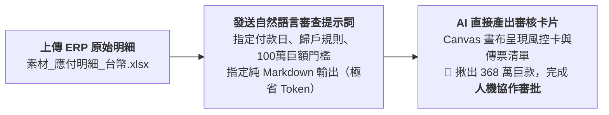

# 7-2 自然語言一步到位：出納付款風控審查與人機協作卡片

> 💡 **核心精神**：單一審核工作**完全不需要大費周章先產生 RTCCF 框架再二次發送**！  
> 只要**「上傳 ERP 明細 ＋ 清楚的自然語言提示詞 ➔ AI 直接在 Canvas 雙欄畫布產出 Markdown 審核卡片」**，一次到位完成人機協作（Human-in-the-loop）審批！

---

## 🎯 核心工作流（極簡一步到位）



---

## 📋 自然語言審查提示詞（直接複製發送）

學生在 AI 對話視窗（ChatGPT Plus / Claude / Gemini Advanced）中，**上傳原始資料《素材_應付明細_台幣.xlsx》**，並直接貼上以下這段指令：

```text
你是一位精通企業財務內控與出納作業審查的資深稽核專家。

這是我上傳的 ERP 原始應付明細檔「素材_應付明細_台幣.xlsx」。
請幫我針對付款到期日「2026/09/30」執行第一階段的「出納付款風控審核與傳票資料歸戶」：

1. 【傳票群組歸戶】：
   - 篩選付款到期日為 2026/09/30 的所有資料列。
   - 依「傳票編號 ＋ 帳款對象代號」進行群組彙總（GroupBy），計算每筆傳票所含的發票張數與應付總金額。
   - 摘要格式請統一為：應付 [廠商代號]（N筆發票）。
2. 【內控風控檢核】：
   - 巨額示警：單筆傳票金額超過 NT$ 1,000,000 者，特別標註「🚨 巨額支付特別覆核」。
   - 防呆檢查：檢查是否有重複發票號碼、金額為零或負數。
   - 沖平驗證：確認「原幣未付金額」與「本幣應付金額」完全一致平帳。
3. 【輸出格式限制（極度重要）】：
   - 請直接在 Canvas 畫布（或以純 Markdown 格式）產出審核卡片，【嚴禁產出 xlsx 檔案】，以求極簡、好閱讀且大幅節省 Token！
   - 輸出內容請包含：
     (1) 本期付款作業風控摘要卡（統計日期、發票總張數、傳票筆數、實付總額、大額筆數、異常狀態）
     (2) 傳票級放行明細清單（序號、傳票編號、廠商代號、發票張數、本期應付金額、風控評級、摘要、合計列）
     (3) 巨額單據備忘說明（列出大額傳票明細與合約期程提醒）
     (4) 審批結論與人機協作下一步指示
```

---

## 🛡️ AI 直接產出之「風控審核卡片」成果（Markdown 格式）

發送上述提示詞後，AI 會在 Canvas 雙欄畫布（或對話視窗）中**直接產出**以下標準審查卡片：

### 一、本期付款作業風控摘要卡
| 檢核項目 | 數值 / 結果 | 狀態 |
| :--- | :--- | :---: |
| 指定付款日期 | 2026/09/30 | 🟢 正常 |
| 涉及原始發票總數 | 10 張 | 🟢 已核對 |
| 彙整傳票筆數 | 5 筆 | 🟢 已歸戶 |
| 本期實付總額 | NT$ 4,040,257 | 🟢 算式平衡 |
| 巨額付款筆數 (>100萬) | 1 筆 (NT$ 3,685,681) | 🚨 需加強審核 |
| 異常單據 (重號/負數/空白) | 0 筆 | 🟢 無異常 |

### 二、傳票級放行明細清單
| 序號 | 傳票編號 | 廠商代號 | 發票張數 | 本期應付金額 | 風控評級 | 摘要 |
| :---: | :--- | :---: | :---: | ---: | :---: | :--- |
| 1 | F1-GL01-260619001 | AA08062 | 1 | NT$ 24,252 | 🟢 一般款項 | 應付 AA08062（1筆發票） |
| 2 | F1-GL01-260717020 | TB0001 | 5 | NT$ 326,937 | 🟢 一般款項 | 應付 TB0001（5筆發票） |
| 3 | F1-GL01-260722013 | TB0001 | 2 | NT$ 3,685,681 | 🚨 巨額支付 | 應付 TB0001（2筆發票） |
| 4 | F1-GL01-260708037 | TE0277 | 1 | NT$ 2,550 | 🟢 一般款項 | 應付 TE0277（1筆發票） |
| 5 | F1-GL01-260717026 | TB0001 | 1 | NT$ 837 | 🟢 一般款項 | 應付 TB0001（1筆發票） |
| **合計** | **5 筆傳票** | - | **10 張** | **NT$ 4,040,257** | - | - |

### 三、巨額與特殊單據備忘說明
- 🚨 **傳票 `F1-GL01-260722013` (廠商 TB0001)**：包含發票 `CA36795506`（NT$ 3,153,459）與 `CA36795519`（NT$ 532,222），單筆金額佔本期總撥付金額 91.2%，請務必請覆核主管複查進口單據或合約期程。

### 四、審批放行結論（人機協作閘門）
- 判定：【🟢 可送主管審核，巨額款項需提醒覆核人】。
- 人機協同動作：出納人員核對上述數據無誤後，即可進入 [**`7-3_樣板佔位符規範與Python自動套表提示詞.md`**](./7-3_樣板佔位符規範與Python自動套表提示詞.md) 啟動 Python 自動套表！

---

## 💡 職場核心觀念：人機協作與架構精粹

### 觀念一：為什麼「人機協作（Human-in-the-loop）」一定要有這張審核卡片？
在企業流程自動化與 AI 系統架構中，**「人機協作」就是實踐 Human-in-the-loop（人類在環 / 人機審查閘門）的典範**：
1. **拒絕「黑箱全自動盲奔」**：若讓 AI 直接從原始 ERP 數據跳到最終的放行單產檔甚至放款，一旦 AI 發生計算誤差、選錯日期或資料幻覺，368 萬巨款將在無人察覺下溜出，形成嚴重的內控破口。
2. **審核卡片扮演「安全風控閘門（Quality Gate）」**：AI 承擔 99% 繁重的加總、歸戶比對與異常排查（算力與勞力），並將結果濃縮成一張人類在 **5~10 秒內即可快速掃描**的「審核卡片」。
3. **AI 賦能、人類做最終決策**：卡片明確呈現「平帳狀態」、「總發票張數」與「🚨 巨額支付警示」，由人類出納與主管擔任核心決策把關者（The "Human" in the loop），確認無誤後**才放行進入下一個自動化階段**。

### 觀念二：為什麼最後產出的審核卡片是 Markdown 而非 xlsx？
1. **極度節省 Token，大幅提升響應速度**：  
   Excel 檔（.xlsx）本質上是由數十個龐大 XML 檔案壓縮而成的二進制結構，若讓模型在第一階段生成 xlsx 檔案，將消耗數千至上萬個 Token 來建構樣式與儲存格屬性；反之，**Markdown 純文字表格僅需極少數 Token**，能瞬間秒回，大幅降低推論成本與等待時間。
2. **兩階段職責解耦（Decoupling）**：  
   * **第一階段（本單元 7-2）**：任務是「風控檢核與商業邏輯決策」，用最輕量、人類肉眼最好讀的 Markdown 卡片確認平帳。  
   * **第二階段（後續單元 7-3）**：任務才是「實體 Excel 套表產檔」，交由 Python openpyxl 引擎精準套入樣板。

### 觀念三：為什麼不需要先轉 RTCCF 框架？
實務上，許多初學者會陷入「每一步都要套用 RTCCF 或其他複雜提示詞框架」的教條主義。  
然而，對於**目標單純、邊界明確的任務（如：出納風控審核）**，只要提示詞中清楚交代了「角色、篩選條件、內控檢核點與輸出限制」，一般自然語言就能達到 100% 精準的效果。**過度工程化只會徒增轉譯成本與操作疲勞，直覺有效才是職場自動化的最高原則！**
