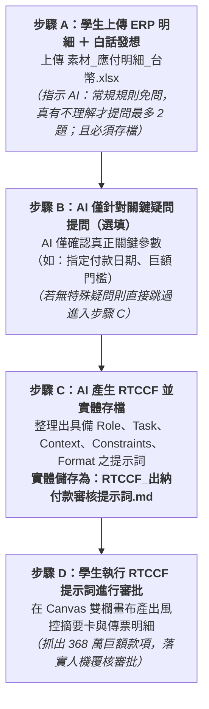

# 7-2 白話發想 ➔ 一問一答 ➔ 產生 RTCCF 審查提示詞（必須存檔）

> 💡 **核心精神**：使用者**只會一般的自然語言**，不需要懂專業的提示詞工程或 RTCCF 框架！  
> 透過**「上傳 ERP 明細 ＋ 白話發想 ➔ 關鍵規則確認 ➔ AI 自動整理出標準 RTCCF 並實體存檔 ➔ 產出審核卡片落實『人機協作（Human-in-the-loop）』審查」**，全程由 AI 引導完成！

---

## 🎯 核心工作流（由自然語言到 RTCCF 實體存檔）



---

## 📋 步驟 A：學生發送「白話自然語言發想指令」

學生在 AI 對話視窗（ChatGPT / Claude / Gemini）上傳 ERP 原始資料 **《素材_應付明細_台幣.xlsx》**，並複製發送以下這段純白話指令：

```text
你是一位資深的企業財務主管與 AI 流程架構專家。

我上傳了一份我們公司剛從 ERP 匯出的原始應付明細「素材_應付明細_台幣.xlsx」。
我只會一般的自然語言，不懂提示詞工程與 RTCCF 架構。
我希望對這份資料進行第一階段的「出納付款風控審核與傳票資料歸戶」，例如：依傳票彙總金額、檢查有沒有重複發票、檢查有沒有超過 100 萬的巨額款項需要呈報老闆等。

【重要指示】：
1. 常規規則自行推斷：一般財務出納審核的標準規則（如發票號碼檢查重複、防呆、傳票加總沖平、常規欄位對照），請直接依專業常理推斷，不需要向我提問。
2. 真有不理解才問（最多 2 題）：只有遇到真正不理解、業務邏輯高度模糊或需要特定自訂參數的地方，才使用「一問一答」向我提問，且提問總數不可超過 2 個關鍵問題。若無特殊疑問請直接產出。
3. 待確認無誤後，請幫我整理並設計出一個符合專業「RTCCF」框架（Role、Task、Context、Constraints、Format）的高品質審核提示詞。
4. 【必須存檔】：請務必將整理完成的 RTCCF 提示詞，實際建立並儲存為 Markdown 格式的檔案「RTCCF_出納付款審核提示詞.md」，讓我可以直接下載留存！
```

---

## 💬 步驟 B：AI 與學生的「精準提問」互動範例（真有疑問才問）

AI 收到指令並讀取表格後，常規的防呆與發票重複檢查會自行設定完畢；僅針對真正需要使用者決定的業務參數（如日期或門檻）提出 1~2 個關鍵問題：

> 🤖 **AI 提問 1**：請問本次需要審查哪一個「付款到期日」的款項？  
> 👤 **學生回答**：**「請幫我審核 2026/09/30 這一天到期的所有款項。」**  
> 
> 🤖 **AI 提問 2**：請問公司內部控制對於「巨額款項特別示警」的金額門檻是多少？  
> 👤 **學生回答**：**「單筆傳票金額超過 NT$ 1,000,000（一百萬）就要特別標示 🚨 巨額支付，提醒總經理簽核。」**  
> 
> *(其餘發票防重、摘要格式「應付 [廠商代號]（N筆發票）」等常規邏輯，AI 已自動依專業經驗推斷納入，不需使用者逐一回答)*  

---

## 📄 步驟 C：AI 自動產出 RTCCF 格式並「實體存檔」

AI 根據確認後的問答內容，自動整理出標準的 RTCCF 提示詞，並**直接在專案中建立實體檔案供下載留存**：  
👉 [**`RTCCF_出納付款審核提示詞.md`**](./RTCCF_出納付款審核提示詞.md)

以下為該檔案所儲存的完整內容：

```markdown
# Role (角色定位)
你是一位具備 15 年企業財務內控、出納作業審查及銀行資金調度經驗的「資深財務出納稽核主管」。你精通應付帳款核銷、多筆發票傳票歸戶、大額資金風控審批與銀行放行作業。

# Task (核心任務)
請讀取上傳之《素材_應付明細_台幣.xlsx》，針對指定付款到期日「2026/09/30」執行第一階段的「出納風控審查與結構化彙總」，並在 Canvas 雙欄畫布中產出供財務出納與高階主管覆核的「審批檢核卡片」：
1. 篩選付款到期日為 2026/09/30 的所有明細列，統計總發票張數與原始金額。
2. 依「傳票號碼 ＋ 帳款對象代號」進行群組彙總（GroupBy），計算每筆傳票所包含的發票張數與應付未付總金額。
3. 自動格式化摘要文字：規則為「應付 [廠商代號]（N筆發票）」。
4. 執行四重內控風控檢核：
   - 檢核一【大額款項示警】：單筆傳票金額超過 NT$ 1,000,000 者，列為「🚨 巨額支付特別覆核」。
   - 檢核二【發票異常檢核】：檢查是否有重複發票號碼、發票號碼空白或零元/負數款項。
   - 檢核三【沖平檢核】：確認「原幣未付金額」是否與「本幣應付金額」完全一致。
   - 檢核四【幣別與性質】：確認單據性質為「發票應付單」或「其他應付款單」，幣別皆為 TWD。
5. 產出人機協商審批結論：明確給出「可送主管簽核」或「部分需確認」。

# Context (背景情境)
- 企業出納日常實務中，ERP 匯出資料為原始發票明細（共 270 筆），而呈送主管簽核之「銀行放行總表」係以傳票為單位（多筆發票歸戶至單一傳票）。
- 為避免因 AI 幻覺導致金額算錯，第一階段必須在 Canvas 畫布中以文字表格呈現完整計算與檢核軌跡，待人類出納確認無誤後，方可進入第二階段 Python Excel 樣板套表。

# Constraints (限制與防呆規則)
1. 金額計算必須 100% 精準勾稽，嚴格禁止任何形式的虛構或估算；所有金額一律以千分位整數顯示（NT$ #,##0）。
2. 對於單筆金額 > NT$ 1,000,000 之傳票，必須在報告中特別提示「需符合公司核決權限表由總經理/董事長簽核」。
3. 摘要中的發票張數必須與 ERP 原始資料逐列對齊，不可漏計。
4. 全程使用繁體中文，格式設計必須高質感、專業、利於高階主管決策審閱。

# Format (輸出格式：Canvas 雙欄畫布)
請依序輸出以下四大區塊：
1. 【本期付款作業風控摘要卡】：包含付款日期、涉及發票張數、彙整傳票筆數、實付總額、巨額付款筆數、異常單據狀態。
2. 【傳票級放行明細清單】：欄位包含「序號、傳票編號、廠商代號、發票張數、本期應付金額、風控評級、摘要」，最後附上合計列。
3. 【巨額與特殊單據備忘說明】：針對超過 100 萬之傳票，條列列出所含發票號碼、金額與佔比提示。
4. 【審批放行結論】：給出判定結論與人機協商下一步指示。
```

---

## 🛡️ 步驟 D：學生發送 RTCCF 檔案，AI 在 Canvas 產出審核卡片

學生只要將**「步驟 C」**產出的 `RTCCF_出納付款審核提示詞.md` 內容丟給 AI（建議開啟 ChatGPT Canvas 雙欄畫布或 Claude Artifacts），AI 就會執行嚴謹計算並產出如下的審查結論：

### 一、本期付款作業風控摘要卡
| 檢核項目 | 數值 / 結果 | 狀態 |
| :--- | :--- | :---: |
| 指定付款日期 | 2026/09/30 | 🟢 正常 |
| 涉及原始發票總數 | 10 張 | 🟢 已核對 |
| 彙整傳票筆數 | 5 筆 | 🟢 已歸戶 |
| 本期實付總額 | NT$ 4,040,257 | 🟢 算式平衡 |
| 巨額付款筆數 (>100萬) | 1 筆 (NT$ 3,685,681) | 🚨 需加強審核 |
| 異常單據 (重號/負數/空白) | 0 筆 | 🟢 無異常 |

### 二、傳票級放行明細清單
| 序號 | 傳票編號 | 廠商代號 | 發票張數 | 本期應付金額 | 風控評級 | 摘要 |
| :---: | :--- | :---: | :---: | ---: | :---: | :--- |
| 1 | F1-GL01-260619001 | AA08062 | 1 | NT$ 24,252 | 🟢 一般款項 | 應付 AA08062（1筆發票） |
| 2 | F1-GL01-260717020 | TB0001 | 5 | NT$ 326,937 | 🟢 一般款項 | 應付 TB0001（5筆發票） |
| 3 | F1-GL01-260722013 | TB0001 | 2 | NT$ 3,685,681 | 🚨 巨額支付 | 應付 TB0001（2筆發票） |
| 4 | F1-GL01-260708037 | TE0277 | 1 | NT$ 2,550 | 🟢 一般款項 | 應付 TE0277（1筆發票） |
| 5 | F1-GL01-260717026 | TB0001 | 1 | NT$ 837 | 🟢 一般款項 | 應付 TB0001（1筆發票） |
| **合計** | **5 筆傳票** | - | **10 張** | **NT$ 4,040,257** | - | - |

### 三、巨額與特殊單據備忘說明
- 🚨 **傳票 `F1-GL01-260722013` (廠商 TB0001)**：包含發票 `CA36795506`（NT$ 3,153,459）與 `CA36795519`（NT$ 532,222），單筆金額佔本期總撥付金額 91.2%，請務必請覆核主管複查進口單據或合約期程。

### 四、審批放行結論（人機協作閘門）
- 判定：【🟢 可送主管審核，巨額款項需提醒覆核人】。
- 人機協同動作：出納人員核對上述數據無誤後，即可進入 [**`7-3_樣板佔位符規範與Python自動套表提示詞.md`**](./7-3_樣板佔位符規範與Python自動套表提示詞.md) 啟動 Python 自動套表！

---

## 💡 職場核心觀念：為什麼出現「審核卡片」就是標準的「人機協作（Human-in-the-loop）」？

在企業流程自動化與 AI 系統架構中，**「人機協作」就是實踐 Human-in-the-loop（人類在環 / 人機審查閘門）的典範**：

1. **拒絕「黑箱全自動盲奔」**：  
   若讓 AI 直接從原始 ERP 數據跳到最終的放行單產檔甚至放款，一旦 AI 發生計算誤差、選錯日期或資料幻覺，368 萬巨款將在無人察覺下溜出，形成嚴重的內控破口。
2. **審核卡片扮演「安全風控閘門（Quality Gate）」**：  
   AI 的強項是承擔 99% 繁重的加總、歸戶比對與異常排查（算力與勞力），並將結果濃縮成一張人類在 **5~10 秒內即可快速掃描**的「審核卡片」。
3. **AI 賦能、人類做最終決策**：  
   卡片明確呈現「平帳狀態」、「總發票張數」與「🚨 巨額支付警示」，由人類出納與主管擔任核心決策把關者（The "Human" in the loop），確認無誤後**才放行進入下一個自動化階段**。這正是最具實戰價值的人機協作模式！
