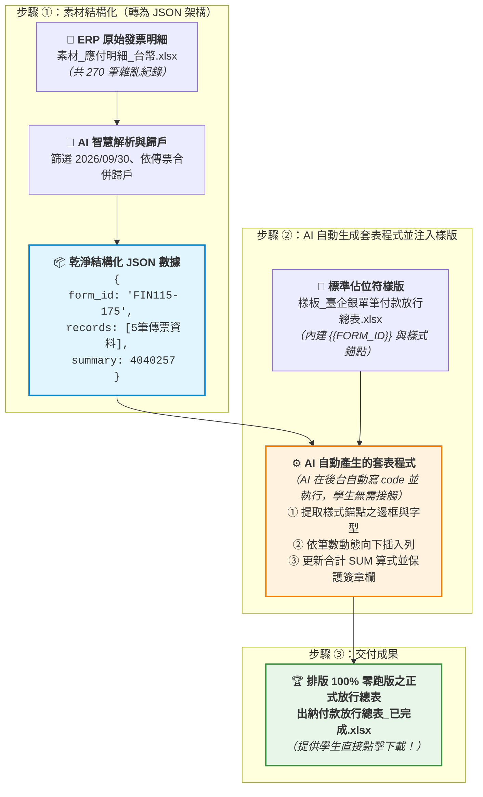

# 7-3 樣板佔位符規範與 AI 自動套表核心流程

> 🏆 **本單元核心靈魂**：**Template Placeholder（樣板佔位符）與動態資料列擴展（Dynamic Row Expansion）**  
> 告別「業餘寫死儲存格座標（Hardcoded Coordinates）」的脆弱腳本，邁向能隨意適應 5 筆、50 筆甚至 100 筆傳票的企業級高強韌度自動套表！

---

## 💡 為什麼專業的自動化必須具備「Template Placeholder」觀念？

在企業實務中，出納或行政人員常常需要將 ERP 資料填入公司固定的銀行樣板。許多人初學自動化時，最常犯的致命錯誤就是**寫死座標（例如第 4 列到第 8 列放資料）**：
* ❌ **致命盲點 1：資料筆數變動即崩潰**  
  若樣板原本預留 5 行空白，第 9 列是「合計」，第 11 列是「簽核欄」。如果本次批次有 20 筆傳票，寫死座標的做法會**直接把「合計列」與「老闆簽名欄」硬生生覆蓋抹消**！
* ❌ **致命盲點 2：財務調整樣式即報銷**  
  如果財務主管哪天在表頭上方插入一列「公司統一編號」，所有寫死行號的規則全部偏移一列，整個流程徹底故障！
* ✅ **Template Placeholder 解法（樣板驅動文件生成）**：
  1. **職責分離**：樣板視覺（字型、色彩、Logo、簽核欄位）100% 由業務人員在 Excel 裡維護；AI 只認**佔位符（Placeholder）**。
  2. **動態行擴展（Dynamic Row Insertion）**：在資料區設定一行「樣式錨點（Anchor Row）」，AI 依實際筆數動態向下推移，自動繼承字型與邊框，並動態改寫合計 SUM 算式！

---

## 📐 樣板佔位符設計規範（以《樣板_臺企銀單筆付款放行總表.xlsx》為例）

| 佔位符層次 | 標記欄位 | 說明與作用 |
| :--- | :--- | :--- |
| **純量佔位符**<br/>*(Scalar Placeholder)* | `{{FORM_ID}}`<br/>`{{NOTE}}` | 位於表頭或備註。全表字串搜尋替換，不論儲存格搬到何處皆能自動命中。 |
| **動態樣板行錨點**<br/>*(Row Template Anchor)* | `{{SEQ}}`<br/>`{{VOUCHER_NO}}`<br/>`{{PAY_DATE}}`<br/>`{{SUMMARY}}`<br/>`{{INCOME}}`<br/>`{{UNPAID}}`<br/>`{{FEE}}`<br/>`{{TOTAL_PAYABLE}}` | 位於明細列起點（如 Row 4）。該行已預先設定好**微軟正黑體、薄灰邊框、置中/靠右、千分位格式（`#,##0`）**。AI 會提取其格式作為樣板，動態複製並擴展至 N 筆資料。 |
| **動態公式錨點**<br/>*(Dynamic Formula)* | `=SUM(E4:E4)` | 合計列的 SUM 公式。AI 根據動態推移後的起始與結束列，自動改寫為 `=SUM(E{start}:E{end})`。 |

---

## 📋 自然語言套表提示詞（獨立執行版，傳送給 AI 執行）

學生在 AI 對話視窗（ChatGPT Plus / Claude / Gemini Advanced）中，**同時上傳《素材_應付明細_台幣.xlsx》與《樣板_臺企銀單筆付款放行總表.xlsx》**，並直接貼上以下這段指令：

```text
你是一位精通微軟 Excel 自動化與資料處理的專家。

我上傳了兩份檔案：
1. ERP 原始資料：「素材_應付明細_台幣.xlsx」
2. 已設好佔位符的放行表樣板：「樣板_臺企銀單筆付款放行總表.xlsx」

請幫我完成出納放行總表的自動套表：
1. 篩選付款到期日為「2026/09/30」的款項，並依「傳票號碼＋帳款對象」合併歸戶（摘要格式為：應付 [帳款對象]（N筆發票））。
2. 將歸戶後的傳票資料填入樣板的資料佔位符（Row 4 的樣式錨點），有幾筆傳票就動態插入幾列，千萬不能覆蓋或破壞底部的合計公式與「核准/覆核/審核/經辦」主管簽章格線。
3. 表頭表單代號填入 FIN115-175，備註填入「本期手續費由公司負擔；單筆大額款項請主管覆核放行。」
4. 合計列請維持 SUM 自動加總公式，並完整傳承原本的字型、邊框與千分位格式。
5. 請直接執行並產出一份排版完全零跑版的 Excel 檔案「出納付款放行總表_已完成.xlsx」供我下載！
```

---

## 🗺️ AI 後台自動套表運作架構圖（不用懂代碼，秒懂原理！）

學生**完全不需要學習或閱讀任何一行 Python 程式碼**！AI 在背景之所以能產出排版零跑版的檔案，核心運作原理如下圖所示：



### 💡 核心三步驟白話圖解：

1. **第一步：素材轉為 JSON 架構（數據乾淨化）**  
   AI 讀取上傳的 270 筆 ERP 明細後，先在後台將其整理為電腦最容易精準處理的 **JSON 結構化資料**（包含表單代號、歸戶後的 5 筆傳票與總金額），徹底擺脫原始雜亂數據。
2. **第二步：JSON 傳送給「AI 產生的程式 ＋ 樣版」**  
   AI 在背景自動撰寫一段資料套表程式，將剛剛整理好的「JSON 數據」注入「樣板檔」。程式只認佔位符，並自動透過**動態向下擴展**把資料填入，保證合計公式與主管簽章欄永遠順暢推移、絕不變形覆蓋！
3. **第三步：直接產出最終結果供下載**  
   套表完成後，AI 直接交付 [**`出納付款放行總表_已完成.xlsx`**](./出納付款放行總表_已完成.xlsx) 實體檔案供學生下載，完成整個企業級自動化閉環！
