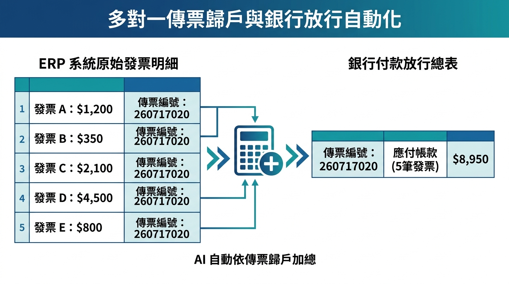
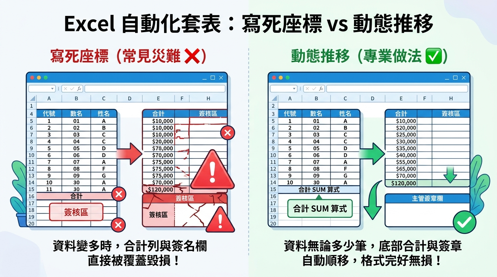
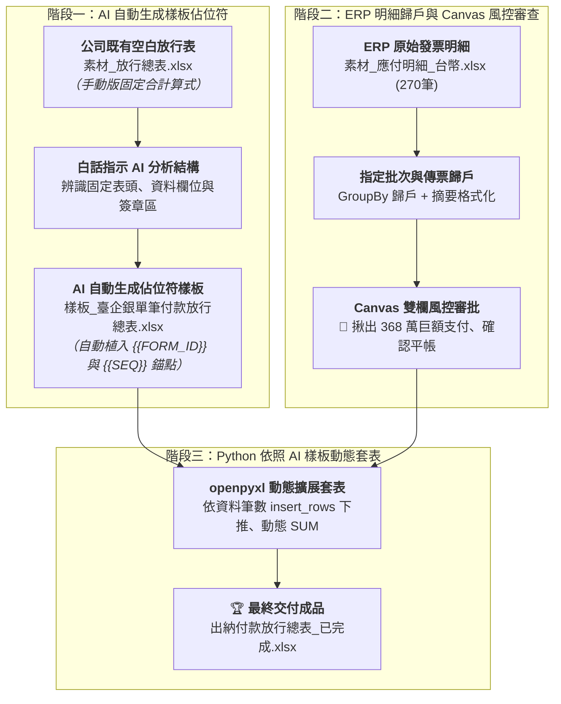

# 實戰範例：出納付款審核與銀行放行總表自動化

> 🟢 **採用代理平台**：ChatGPT Agent / Claude.ai / Google Antigravity  
> 🛠️ **建議執行模式**：**雙軌人機協商**（**Canvas 雙欄畫布風控審核** ➔ **Python Code Interpreter 樣板動態套表**）

---

## 📥 學員實戰素材下載專區

學生在進行本單元實作時，**只需要下載以下 2 個原始檔案**即可開始完整演練：

1. **原始 ERP 應付帳款明細 Excel 檔**（必載輸入數據）：  
   👉 [**`素材_應付明細_台幣.xlsx`**](./素材_應付明細_台幣.xlsx) *(包含 270 筆 ERP 原始發票明細數據)*
2. **公司既有銀行放行總表 Excel 檔**（必載原始樣式）：  
   👉 [**`素材_放行總表.xlsx`**](./素材_放行總表.xlsx) *(公司既有之空白放行總表，尚未加入佔位符之最初原檔)*

> 💡 **參考成果對照（由 AI 產生，無需下載亦可完成實作）**：  
> * [**`樣板_臺企銀單筆付款放行總表.xlsx`**](./樣板_臺企銀單筆付款放行總表.xlsx) *(由 AI 讀取原始放行表後自動分析並植入佔位符之樣板檔)*  
> * [**`出納付款放行總表_已完成.xlsx`**](./出納付款放行總表_已完成.xlsx) *(經過 AI 雙軌審批與 Python 自動套表之最終完成活頁簿)*

---

## 🏆 最終完成作品展示（實作成果搶先看）

本專案解決企業出納每月 6 日、16 日或月底最耗費時間的「應付帳款核對與銀行批次放行表製作」工作，產出具備**財務內控稽核軌跡、動態計算公式與主管簽章保護**的高水準成果：
1. **多筆發票傳票自動歸戶**：將 ERP 匯出的多列發票明細，自動依「傳票編號＋廠商代號」合併為單一放行項目，並於摘要精準標註「`應付 TB0001（5筆發票）`」。
2. **Template Placeholder 樣板動態擴展**：徹底告別傳統寫死儲存格座標（Hardcoded Coordinates）的陋習，利用樣式錨點動態插入列（`ws.insert_rows`），資料筆數無論是 5 筆或 50 筆，底部的「合計 SUM 算式」與「核准/覆核/審核/經辦簽章區」永遠整齊推移、格式 100% 不變形！
3. **百萬巨額付款自動示警（Human-in-the-loop）**：單筆金額超過 NT$ 1,000,000 自動在審核卡片標註「🚨 巨額支付特別覆核」，避免錯付與內控漏洞。

---

### 📊 完成作品外觀預覽：【臺企銀 臺幣單筆付款 放行總表】

*保留公司既有銀行版面樣式、自動計算應付金額、合計動態公式，並將簽核區域完整保留：*

| 序號 | 傳票編號 | 支付日 | 摘要 | 本期收入 | 本期未付 | 手續費 | 本期應付 (含手續費) | 結餘 | 銀行交易序號 |
| :---: | :--- | :---: | :--- | :---: | ---: | :---: | ---: | :---: | :---: |
| **1** | F1-GL01-260619001 | 2026/09/30 | 應付 AA08062（1筆發票） | - | 24,252 | 0 | 24,252 | - | - |
| **2** | F1-GL01-260717020 | 2026/09/30 | 應付 TB0001（5筆發票） | - | 326,937 | 0 | 326,937 | - | - |
| **3** | F1-GL01-260722013 | 2026/09/30 | <mark style="background-color: #FFF2CC;">應付 TB0001（2筆發票）</mark> | - | **3,685,681** | 0 | **3,685,681** | - | - |
| **4** | F1-GL01-260708037 | 2026/09/30 | 應付 TE0277（1筆發票） | - | 2,550 | 0 | 2,550 | - | - |
| **5** | F1-GL01-260717026 | 2026/09/30 | 應付 TB0001（1筆發票） | - | 837 | 0 | 837 | - | - |
| **合計** | - | - | - | - | **4,040,257** | **0** | **4,040,257** | - | - |

> 📝 **備註**：本期手續費由公司負擔；單筆大額款項請主管覆核放行。  
> ✍️ **簽核**：核准：__________　覆核：__________　審核：__________　經辦：__________

---

## 🎯 案例情境與三大核心職場心法

在企業出納作業中，「匯出 ERP 應付帳款 ➔ 依廠商手動算發票總額 ➔ 複製貼至銀行放行表 ➔ 印給老闆蓋章」是每個月最耗時且壓力最大的工作。本範例原始數據來自真實製造業 ERP 系統（270 筆應付單），存在以下三大痛點：
1. **多對一傳票歸戶耗時**：ERP 是一張發票一列，但銀行放行表是「一張傳票一筆」，出納必須用計算機手動將同一傳票的 5 張發票加總，極易算錯。
   
   
   *▲ 圖解白話說明：左側 ERP 系統匯出的 5 筆發票（發票 A~E）雖然各有不同金額，但都隸屬同一張傳票編號（260717020）。過去出納必須人工拿計算機逐筆加總，自動化後則能依傳票編號自動 Group By，直接將 5 筆發票彙整為右側銀行放行表中的「單一筆總額與歸戶項目（合計 $8,950）」，省時又零失誤！*

2. **缺乏防呆與巨額風控**：若遇到單筆高達幾百萬的款項（如 TB0001 高達 368 萬），傳統手工製表無法在送簽前自動示警老闆注意核決權限。
   
   
   *▲ 圖解白話說明（學生秒懂版）：*
   * * **左邊（危險）**：就像班費平時都買 50 元粉筆、100 元抹布，幹部閉著眼睛蓋章就放行；突然夾帶一張「3 萬元」請款，如果沒看仔細隨手蓋章，班費直接被掏空！在公司也是，368 萬巨款混在小錢中，容易被疲勞的主管「順手蓋章」溜出去。*
   * * **右邊（安全）**：AI 扮演聰明守衛，一旦看到單筆超過 100 萬，立刻亮黃燈 🚨「暫停攔截！」，提醒這筆大錢必須找最高主管（董事長/校長）親自確認才能放行！*

3. **樣板套表脆弱性**：一般初學者寫的 Python 腳本會「寫死座標（Hardcode Row Index）」，一旦資料筆數增加，下方的合計列與簽章欄直接被蓋掉毀損。
   
   
   *▲ 圖解白話說明（學生秒懂版）：*
   * * **左邊（寫死座標的災難 ❌）**：初學者通常把程式寫成「合計固定在第 15 列、簽名在第 18 列」。但如果這個月發票特別多（比如從 5 筆暴增到 20 筆），資料就會像推土機一樣硬生生往下碾壓，把原本排好的「合計」和「主管簽名區」直接覆蓋摧毀！*
   * * **右邊（專業動態推移 ✔️）**：專業寫法會使用「樣板錨點與動態插入列（`insert_rows`）」。資料有多少筆，中間就自動長出多少列，底部的「合計 SUM 公式」與「簽名區」就像彈簧一樣順暢往下推移，版面 100% 完美不變形！*

### 💡 職場實戰三大核心心法

#### 心法一：Template Placeholder（AI 自動分析產生樣板佔位符，徹底解耦版面與程式）
* **問題**：許多自動化程式將表格樣式、字型與儲存格座標寫死在 Python 程式碼中，只要財務主管想在 Excel 表頭多加一列資訊或調整 Logo，整個程式全部壞死；初學者更常誤以為必須「手動逐格修改 Excel 來建立樣板」。
* **解法**：**這個工作完全交由 AI 來自動分析與產生！** 出納只需要將公司原本的【`素材_放行總表.xlsx`】上傳給 AI，用白話指令要求 AI 分析版面，AI 就會自動區分「固定表頭資訊（植入 `{{FORM_ID}}`、`{{NOTE}}`）」與「動態資料列（植入 `{{SEQ}}` 等樣式錨點）」，自動產出【`樣板_臺企銀單筆付款放行總表.xlsx`】！後續 Python 程式只認佔位符並使用 `insert_rows` 動態順推，100% 保持樣式與公式強韌度！

#### 心法二：雙軌人機協商（Human-in-the-loop 畫布審核 ➔ 落地產檔）
* **問題**：若直接叫 AI 生成 Excel，人類無法快速一眼看出 AI 有沒有算錯金額、漏計發票或將非本期款項算進去。
* **解法**：先透過 **RTCCF 在 Canvas 雙欄畫布產出「財務審批核對卡片」**，出納與主管花 10 秒快速核對「發票總張數」、「總放行金額」與「巨額付款警示」，確認完全平帳後，再發動 Python 執行套表，打造零錯帳的安全防護網！

#### 心法三：批次參數化設計（動態指定付款到期日）
* **問題**：提示詞如果把規則寫死為「僅限 6 日或 16 日」，遇到月底 30 日撥款或特定交期時就會直接報錯中斷。
* **解法**：在 Prompt 中將付款到期日設計為動態參數（如 `target_date='2026/09/30'` 或 `2026/09/16'`），一套工作流即可通吃全年所有付款批次！

---

## ⚡ 核心人機協商閉環（原始放行表 ➔ AI 生成佔位符樣板 ➔ Canvas 風控審查 ➔ Python 動態套表）

### 1. 步驟 0 & 1：白話自然語言發想 ➔ 一問一答確認 ➔ 產生 RTCCF ➔ 產出佔位字符樣版
* 文件連結：[**`7-1_白話自然語言發想提示詞.md`**](./7-1_白話自然語言發想提示詞.md)
* 核心操作：**使用者完全不需要懂程式語法，只懂「佔位字符樣版」的觀念！** 學生只要上傳公司既有的《素材_放行總表.xlsx》，發送白話指令；若 AI 對欄位不了解，指示 AI 採「一問一答」方式提問確認，再由 AI 整理出「製作樣版的 RTCCF 提示詞」。最後學生將該 RTCCF 貼給 AI，AI 就會自動產出標準的 [**`樣板_臺企銀單筆付款放行總表.xlsx`**](./樣板_臺企銀單筆付款放行總表.xlsx)（內建 `{{FORM_ID}}`、`{{NOTE}}` 與 Row 4 的資料列樣式錨點 `{{SEQ}}`）！*(不想重跑樣板製作的學員，亦可直接使用專案內已由 AI 產出之樣板對照檔)*。

### 2. 步驟 2：精煉 RTCCF 專業財務風控審查執行
* 文件連結：[**`7-2_AI產出之RTCCF審查與結構化提示詞.md`**](./7-2_AI產出之RTCCF審查與結構化提示詞.md)
* 核心亮點：在 AI 雙欄畫布（Canvas）中生成風控卡片，列出 5 筆傳票、10 張發票，並成功揪出傳票 `F1-GL01-260722013` 高達 **368 萬巨額支出**，完成人機審核！

### 4. 步驟 3：Template Placeholder 規範與 Python 自動套表
* 文件連結：[**`7-3_樣板佔位符規範與Python自動套表提示詞.md`**](./7-3_樣板佔位符規範與Python自動套表提示詞.md)
* 核心技術：提示詞內建完整生產級 openpyxl 套表引擎源碼，讀取樣板錨點樣式、動態向下插入列、寫入公式 `=F{row}+G{row}`、動態更新合計 `=SUM(...)`，完整保護簽章欄。

---

## 📁 範例交付成品與素材清單

| 檔案名稱 | 檔案類型 | 角色與說明 |
| :--- | :---: | :--- |
| 📦 [**素材_應付明細_台幣.xlsx**](./素材_應付明細_台幣.xlsx) | 📁 **實作原始數據** | **【實作起點】** ERP 匯出的原始應付明細（含 270 筆應付發票紀錄，請下載此檔開始練習） |
| 📦 [**素材_放行總表.xlsx**](./素材_放行總表.xlsx) | 📁 **實作原始樣式** | **【實作起點】** 公司原本手工使用的原始空白放行總表（尚未加入佔位符之最初原檔，請下載此檔供對照與改造） |
| 📐 [**樣板_臺企銀單筆付款放行總表.xlsx**](./樣板_臺企銀單筆付款放行總表.xlsx) | 📐 **標準套表樣板** | **【樣板設計參考】** 由 AI 依原始放行表自動分析並植入佔位符之樣板（無需手刻，亦可供 Python 套表直接讀取） |
| 📗 [**出納付款放行總表_已完成.xlsx**](./出納付款放行總表_已完成.xlsx) | 🏆 **最終完成成果** | **【對照標準答案】** 經過 Python 自動套表生成、合計動態推移且簽章區完好的正式活頁簿 |
| 💬 [**7-1_白話自然語言發想提示詞.md**](./7-1_白話自然語言發想提示詞.md) | 💬 **人機協商** | 引導 AI 自動分析原始放行表生成佔位符樣板，以及出納審核需求之純白話 Prompt |
| 📋 [**7-2_AI產出之RTCCF審查與結構化提示詞.md**](./7-2_AI產出之RTCCF審查與結構化提示詞.md) | 📋 **風控審批** | Canvas 雙欄畫布風控檢核卡片，防範 AI 幻覺與錯帳盲點 |
| ⚙️ [**7-3_樣板佔位符規範與Python自動套表提示詞.md**](./7-3_樣板佔位符規範與Python自動套表提示詞.md) | ⚙️ **核心教學** | 詳細解說 Template Placeholder 概念與 openpyxl 動態插入列技巧，內嵌完整執行腳本 |

---

[← 返回實戰範例導覽總表](../README.md)

