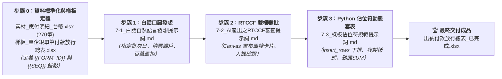

# 實戰範例：出納付款審核與銀行放行總表自動化

> 🟢 **採用代理平台**：ChatGPT Agent / Claude.ai / Google Antigravity  
> 🛠️ **建議執行模式**：**雙軌人機協商**（**Canvas 雙欄畫布風控審核** ➔ **Python Code Interpreter 樣板動態套表**）

---

## 🏆 最終完成作品展示（實作成果搶先看）

> 📥 **完成品直接下載與檢視**：  
> 👉 [**`出納付款放行總表_已完成.xlsx`**](./出納付款放行總表_已完成.xlsx)  
> *（這是本專案經過「白話自然語言 ➔ RTCCF 人機協商 ➔ Canvas 雙欄風控審批 ➔ Template Placeholder 動態套表」後全自動產出之銀行撥款簽核正式活頁簿）*

本專案解決企業出納每月 6 日、16 日或月底最耗費時間的「應付帳款核對與銀行批次放行表製作」工作，產出具備**財務內控稽核軌跡、動態計算公式與主管簽章保護**的高水準成果：
1. **多筆發票傳票自動歸戶**：將 ERP 匯出的多列發票明細，自動依「傳票編號＋廠商代號」合併為單一放行項目，並於摘要精準標註「`應付 TB0001（5筆發票）`」。
2. **Template Placeholder 樣板動態擴展**：徹底告別傳統寫死儲存格座標（Hardcoded Coordinates）的陋習，利用樣式錨點動態插入列（`ws.insert_rows`），資料筆數無論是 5 筆或 50 筆，底部的「合計 SUM 算式」與「核准/覆核/審核/經辦簽章區」永遠整齊推移、格式 100% 不變形！
3. **百萬巨額付款自動示警（Human-in-the-loop）**：單筆金額超過 NT$ 1,000,000 自動在審核卡片標註「🚨 巨額支付特別覆核」，避免錯付與內控漏洞。

---

### 📊 完成作品外觀預覽：【臺企銀 臺幣單筆付款 放行總表】

*保留公司既有銀行版面樣式、自動計算應付金額、合計動態公式，並將簽核區域完整保留：*

| 序號 | 傳票編號 | 支付日 | 摘要 | 本期收入 | 本期未付 | 手續費 | 本期應付 (含手續費) | 結餘 | 銀行交易序號 |
| :---: | :--- | :---: | :--- | :---: | ---: | :---: | ---: | :---: | :---: |
| **1** | F1-GL01-260619001 | 2026/09/30 | 應付 AA08062（1筆發票） | - | 24,252 | 0 | 24,252 | - | - |
| **2** | F1-GL01-260717020 | 2026/09/30 | 應付 TB0001（5筆發票） | - | 326,937 | 0 | 326,937 | - | - |
| **3** | F1-GL01-260722013 | 2026/09/30 | <mark style="background-color: #FFF2CC;">應付 TB0001（2筆發票）</mark> | - | **3,685,681** | 0 | **3,685,681** | - | - |
| **4** | F1-GL01-260708037 | 2026/09/30 | 應付 TE0277（1筆發票） | - | 2,550 | 0 | 2,550 | - | - |
| **5** | F1-GL01-260717026 | 2026/09/30 | 應付 TB0001（1筆發票） | - | 837 | 0 | 837 | - | - |
| **合計** | - | - | - | - | **4,040,257** | **0** | **4,040,257** | - | - |
| **備註** | \multicolumn{9}{l|}{本期手續費由公司負擔；單筆大額款項請主管覆核放行。} |
| **簽核** | \multicolumn{9}{l|}{核准：\underline{\hspace{3cm}} 複核:\underline{\hspace{3cm}} 審核：\underline{\hspace{3cm}} 經辦:\underline{\hspace{3cm}}} |

---

## 🎯 案例情境與三大核心職場心法

在企業出納作業中，「匯出 ERP 應付帳款 ➔ 依廠商手動算發票總額 ➔ 複製貼至銀行放行表 ➔ 印給老闆蓋章」是每個月最耗時且壓力最大的工作。本範例原始數據來自真實製造業 ERP 系統（270 筆應付單），存在以下三大痛點：
1. **多對一傳票歸戶耗時**：ERP 是一張發票一列，但銀行放行表是「一張傳票一筆」，出納必須用計算機手動將同一傳票的 5 張發票加總，極易算錯。
2. **缺乏防呆與巨額風控**：若遇到單筆高達幾百萬的款項（如 TB0001 高達 368 萬），傳統手工製表無法在送簽前自動示警老闆注意核決權限。
3. **樣板套表脆弱性**：一般初學者寫的 Python 腳本會「寫死座標（Hardcode Row Index）」，一旦資料筆數增加，下方的合計列與簽章欄直接被蓋掉毀損。

### 💡 職場實戰三大核心心法

#### 心法一：Template Placeholder（樣板佔位符）實現場景與程式徹底解耦
* **問題**：許多自動化程式將表格樣式、字型與儲存格座標寫死在 Python 程式碼中，只要財務主管想在 Excel 表頭多加一列資訊或調整 Logo，整個程式全部壞死。
* **解法**：在 Excel 樣板中設定「**純量佔位符（`{{FORM_ID}}`、`{{NOTE}}`）**」與「**資料樣式錨點列（`{{SEQ}}`）**」。財務人員可以在 Excel 中隨心所欲調整美化版面；Python 只認佔位符，並使用 `insert_rows` 動態推移列數，100% 保持樣式與公式強韌度！

#### 心法二：雙軌人機協商（Human-in-the-loop 畫布審核 ➔ 落地產檔）
* **問題**：若直接叫 AI 生成 Excel，人類無法快速一眼看出 AI 有沒有算錯金額、漏計發票或將非本期款項算進去。
* **解法**：先透過 **RTCCF 在 Canvas 雙欄畫布產出「財務審批核對卡片」**，出納與主管花 10 秒快速核對「發票總張數」、「總放行金額」與「巨額付款警示」，確認完全平帳後，再發動 Python 執行套表，打造零錯帳的安全防護網！

#### 心法三：批次參數化設計（動態指定付款到期日）
* **問題**：提示詞如果把規則寫死為「僅限 6 日或 16 日」，遇到月底 30 日撥款或特定交期時就會直接報錯中斷。
* **解法**：在 Prompt 中將付款到期日設計為動態參數（如 `target_date='2026/09/30'` 或 `2026/09/16'`），一套工作流即可通吃全年所有付款批次！

---

## ⚡ 核心人機協商閉環（ERP 明細 ➔ Canvas 風控卡片 ➔ 佔位符動態套表 ➔ 完成 xlsx）

### 1. 步驟 0：素材準備與 Template Placeholder 設計
* 數據素材：[**`素材_應付明細_台幣.xlsx`**](./素材_應付明細_台幣.xlsx)（270 筆 ERP 原始應付帳款明細）
* 樣板檔案：[**`樣板_臺企銀單筆付款放行總表.xlsx`**](./樣板_臺企銀單筆付款放行總表.xlsx)（內建 `{{FORM_ID}}`、`{{NOTE}}` 與 Row 4 的資料列樣式錨點 `{{SEQ}}`）

### 2. 步驟 1：白話自然語言發想（最真實的出納需求）
* 文件連結：[**`7-1_白話自然語言發想提示詞.md`**](./7-1_白話自然語言發想提示詞.md)
* 核心亮點：出納用口語描述：「**幫我整理 2026/09/30 批次、依傳票和廠商合併發票、算筆數、金額大於 100 萬要警示、套入樣板不要蓋掉簽名欄**」。

### 3. 步驟 2：精煉 RTCCF 專業財務風控審查執行
* 文件連結：[**`7-2_AI產出之RTCCF審查與結構化提示詞.md`**](./7-2_AI產出之RTCCF審查與結構化提示詞.md)
* 核心亮點：在 AI 雙欄畫布（Canvas）中生成風控卡片，列出 5 筆傳票、10 張發票，並成功揪出傳票 `F1-GL01-260722013` 高達 **368 萬巨額支出**，完成人機審核！

### 4. 步驟 3：Template Placeholder 規範與 Python 自動套表
* 文件連結：[**`7-3_樣板佔位符規範與Python自動套表提示詞.md`**](./7-3_樣板佔位符規範與Python自動套表提示詞.md)
* 核心技術：提示詞內建完整生產級 openpyxl 套表引擎源碼，讀取樣板錨點樣式、動態向下插入列、寫入公式 `=F{row}+G{row}`、動態更新合計 `=SUM(...)`，完整保護簽章欄。

---

## 📁 範例交付成品與素材清單

| 檔案名稱 | 檔案類型 | 說明與用途 |
| :--- | :---: | :--- |
| [**出納付款放行總表_已完成.xlsx**](./出納付款放行總表_已完成.xlsx) | 📗 **最終成品** | 經過 Python 自動套表生成的銀行放行正式活頁簿（可直接列印簽核） |
| [**樣板_臺企銀單筆付款放行總表.xlsx**](./樣板_臺企銀單筆付款放行總表.xlsx) | 📐 **標準樣板** | 內建 Template Placeholder 與動態擴展錨點的放行表 Excel 樣板 |
| [**素材_應付明細_台幣.xlsx**](./素材_應付明細_台幣.xlsx) | 📄 **數據素材** | ERP 匯出的原始應付明細數據（包含 270 筆應付發票紀錄） |
| [**7-1_白話自然語言發想提示詞.md**](./7-1_白話自然語言發想提示詞.md) | 💬 **人機協商** | 出納日常最自然口吻的業務需求與風控指令 |
| [**7-2_AI產出之RTCCF審查與結構化提示詞.md**](./7-2_AI產出之RTCCF審查與結構化提示詞.md) | 📋 **風控審批** | Canvas 雙欄畫布風控檢核卡片，防範 AI 幻覺與錯帳盲點 |
| [**7-3_樣板佔位符規範與Python自動套表提示詞.md**](./7-3_樣板佔位符規範與Python自動套表提示詞.md) | ⚙️ **核心教學** | 詳細解說 Template Placeholder 概念與 openpyxl 動態插入列技巧，內嵌完整執行腳本 |

