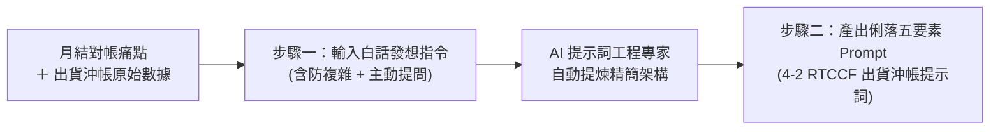

# 步驟一：白話自然語言發想提示詞（人機協商 ➔ 防繁瑣 ＋ 主動提問確認）

> 💡 **教學目標**：面對真實職場中的進銷存與財務對帳難題，學員往往不知道如何用專業術語下指令。本步驟引導學員扮演「商品營運與會計人員」，用最純粹的**日常白話自然語言**向 AI 描述任務邏輯。  
> 🌟 **本範例兩大核心實戰心法**：  
> 1. **避免 RTCCF 太過複雜**：很多 AI 一旦被要求轉成 RTCCF 框架，容易產出冗長、空泛的理論與多餘結構。因此在白話 Prompt 中必須明確加入**「不要太過於複雜、保持精要、聚焦執行步驟」**的負向限制。  
> 2. **主動提問確認機制（Clarification Prompting）**：在自然語言中明確告知 AI**「如果有什麼不知道或資料有缺失的，可以主動向我詢問確認」**。這能極高機率避免 AI 擅自通靈瞎猜（如遇到無進貨記錄的品號），效果非常顯著！  
> 🛠️ **適用平台**：ChatGPT 任何對話視窗、Claude、Gemini。

---

## 🎯 階段流程圖



---

## 📋 提示詞複製專區

請複製下方區塊內容貼入 AI 對話框，並記得將 [`出貨沖帳原始數據.md`](./出貨沖帳原始數據.md) 的內容貼在指定位置：

```text
我是公司的商品進銷存與帳務對帳人員。我手邊有一份「出貨沖帳與銷退月結報表」（從 Excel 轉出來的 Markdown 數據），裡面有各月份的進貨、退貨、POS銷售與結清紀錄。

我們目前遇到兩個核心對帳任務：
1. 結帳單和銷貨單空白的部份：請 AI 依據相對應的「品號」，去尋找該品號「有進貨數（進貨數不為 0）」的那一筆記錄，將那一筆有一樣的結帳單號與銷貨單號，完整填入空白處。
2. 沖帳平衡與狀態標記：計算相同品號的所有明細數量，公式為「進貨數 + 退貨數 + POS銷貨數量 + 結清數量」。如果總和等於 0，代表該商品進貨已全數沖抵平帳，請在「巳沖完」欄位填上「V」；如果總和不等於 0，表示尚未平帳或尚有庫存差異。

以下是我的出貨沖帳原始數據資料：
--------------------------------------------------
[請在此處完整貼入「出貨沖帳原始數據.md」的全部文字內容]
--------------------------------------------------

我想請你扮演「AI 提示詞工程專家（Prompt Engineer）」，幫我將上述任務提煉轉化為一份標準的「RTCCF（Role + Task + Context + Constraints + Format）專業提示詞」。

⚠️ 特別注意以下兩點要求（重要）：
1. 提示詞請保持「精簡、聚焦、直奔主題」，千萬不要太過於複雜或寫出一大堆假大空的理論套話！聚焦在欄位比對邏輯、沖帳公式與具體交付成果即可。
2. 在提示詞的限制條件中，請務必加入「主動提問確認機制」：告訴執行端 AI，如果有任何不知道、欄位定義不明，或是像某些品號在表中完全找不到進貨數的結帳單號時，絕對不要通靈瞎猜，必須主動列出向我詢問確認！

請直接產出該份標準、精練且不冗長的 RTCCF 提示詞內容即可。
```

---

## 💡 職場實戰心得點評

1. **為什麼要特別要求「不要太過於複雜」？**  
   部分大語言模型在聽到「專業提示詞框架（RTCCF）」時，會過度自我發揮，產出洋洋灑灑 5~8 頁的背景脈絡、市場分析與冗長背景，反而稀釋了核心資料處理邏輯。明確給予「保持精簡、聚焦執行步驟」的限制，能產出執行力最高、Token 消耗最少的高效 Prompt。
2. **主動詢問機制的力量（Human-in-the-loop）**：  
   在真實財務與庫存資料中，經常存在「系統缺漏」或「特例品項」（例如本表中品號 `816466` 與 `816481` 只有銷售卻無進貨）。若未授權 AI 提問，AI 常會隨機拿鄰近單號填入造成嚴重錯帳。加上一句「**有不知道的可以詢問我**」，AI 就會在報告中精準列出異常清單，邀請人類確認，形成完美的「人機協商核銷閉環」！
