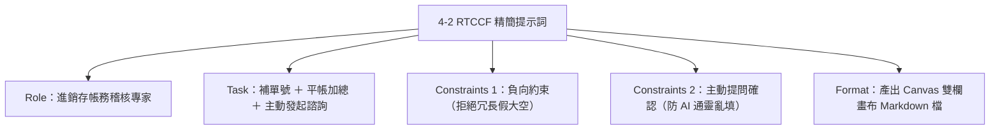

# 實戰範例 04：進銷存出貨沖帳與銷退核銷提示詞

> 💡 **教學規範**：本提示詞完全遵循 [`AI 提示詞工程指南`](../../prompt/AI提示詞工程指南/README.md) 之 **Role + Task + Context + Constraints + Format**（五要素提示詞框架）規範設計。  
> ⚡ **精簡核心特色**：去除假大空背景，結構短小精悍、直奔資料處理與核銷邏輯！  
> 🛠️ **建議執行模式**：**ChatGPT Work 模式**（因指定產出為 `.md` 檔案，系統將自動啟動 **Canvas 雙欄互動畫布**，方便即時比對檢核與線上微調）。

---

## 🎯 任務情境與五要素設計

依據《AI 提示詞工程指南》標準，將出貨沖帳需求拆解為五大關鍵核心要素：

| 要素 | 英文 | 本案例設定重點 | 你可以這樣想 |
| :--- | :--- | :--- | :--- |
| **角色** | **Role** | 精通 ERP 系統、進銷存會計與零售通路月結對帳的資深帳務稽核專家 | AI 要以什麼專家身分協助？ |
| **任務** | **Task** | 比對並補齊空白單號、計算各品號沖帳平衡、標記已沖完狀態，並提出待確認異常報告 | 明確交付什麼產出物？ |
| **背景** | **Context** | 實體通路銷售月報表；進貨數為負數（入庫），退貨/POS銷售/結清為正數（去化） | 資料結構與記帳慣例是什麼？ |
| **限制** | **Constraints** | 嚴禁冗贅假大空；依進貨列精準對應單號；遇到無進貨紀錄嚴禁通靈猜測，必須主動提問確認 | 業務底線與資料品質紅線？ |
| **格式** | **Format** | 產出 Markdown 檔案（`出貨沖帳_已核銷檢核表.md`），含補齊後總表、主動提問清單與品號沖帳彙總 | 長成什麼樣子、包含哪些結構？ |

---

## 📋 提示詞複製專區（直接點擊複製）

請直接整段複製下方內容，貼入 ChatGPT Work 模式或任何 AI 對話框中執行：

```markdown
## Role

你是一位專精於 ERP 系統、進銷存會計與通路銷退對帳的資深帳務稽核專家。你具備極高細膩度，擅長跨月份資料關聯比對、進銷平衡驗算與異常帳目診斷。

## Task

請針對提供的「出貨沖帳與銷退月結數據」，執行以下三項核心對帳任務：
1. **補齊單號**：依據相同「品號」，找出該品號「進貨數 ≠ 0」之明細列，將其對應之「結帳單」與「銷貨單」單號，完整填入該品號所有單號空白之列。
2. **沖帳加總與標記**：依「品號」分組加總計算 `進貨數 + 退貨數 + POS銷售數量 + 結清數量`。若該品號總和 = 0（進銷退完全平帳），請在明細表中該品號的「巳沖完」欄位填入 `V`；若總和 ≠ 0，則保留空白。
3. **主動發起異常諮詢**：若有品號在全表中完全查無任何進貨記錄（進貨數為 0 或空值），嚴禁私自猜測編造單號，請彙整成「待確認品號提問清單」，主動向我詢問。

## Context

本數據為連鎖通路門市之進銷存月結明細（Markdown 格式），欄位包含：
- 基本資訊：年/月、品號、品名、結帳單、銷貨單、大分類、DC開始日、DC結束日。
- 進退貨資訊：進貨數（記帳慣例為負數）、含稅進貨金額、退貨單、退貨數（正數）、含稅退貨金額。
- 門市銷貨資訊：POS銷售數量（正數）、單價、未稅/銷售稅額/含稅銷售淨額。
- 結清處理：結清數量（正數）、結清金額(含稅)、結清稅額、巳沖完（核銷狀態欄）。

## Constraints

1. **結構精簡，拒絕冗言贅字**：不需長篇大論闡述會計理論或空洞客套話，請直奔資料處理與核銷結論。
2. **單號唯一對應原則**：空白單號之填補，必須唯一對應同品號「有進貨數」的那筆單號，不得跨品號套用。
3. **主動提問機制（Human-in-the-loop）**：遇到無法確定或資料矛盾之品號（如僅有銷售無進貨之品號），必須在回覆中列出並主動向我提問，切勿自行編造虛假單號。
4. **數字精確性**：所有數量加總計算必須 100% 精準，不得遺漏任一月份列。
5. **語言風格**：繁體中文，專業俐落之財務對帳口吻。

## Format

請直接將產出內容儲存為處理完成的 Markdown 檔案（檔名：`出貨沖帳_已核銷檢核表.md`），以啟動雙欄畫布（Canvas）便於逐列檢視與微調，並作為下一步轉為完成版 xlsx 檔的基準。檔案結構包含：
1. **【核銷執行成果總結】**：簡明條列補齊單號筆數、已沖完品號數、未平帳品號數。
2. **【主動提問確認清單】**：特別列出在資料集中找不到進貨單號之品號清單與出現月份，主動向我詢問正確單號或處理方針。
3. **【補齊單號後之完整出貨沖帳明細表】**（Markdown 表格，保留 23 欄原始欄位，已填妥空白單號與已沖完欄位）。
4. **【品號沖帳平衡彙總表】**：各品號累計進貨數、累計退貨數、累計POS銷售、累計結清數、沖帳餘額（Net Balance）及是否沖完燈號。
```

---

## 💡 提示詞設計巧思解密



* **為什麼把「主動發起異常諮詢」列在 Task 與 Constraints？**  
  在實際職場中，AI 最致命的毛病是「不懂裝懂」或「假裝資料很完美」。將主動提問正式列入任務核心，AI 就會扮演嚴謹的專業稽核員，把異常品號（如 `816466`、`816481`）主動挑出並提出詢問，成為真正值得信賴的工作夥伴！
