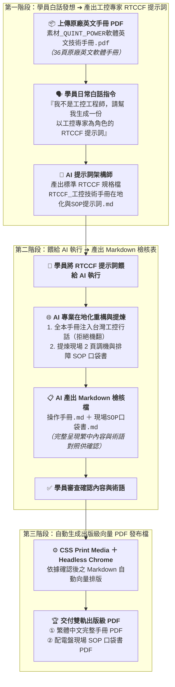

# 10-1 白話自然語言發想提示詞（生成工控專家 RTCCF 規格與雙軌在地化）

> 💡 **核心精神**：學員**並不是專業的「工控 FAE 工程師或技術翻譯專家」**，手邊往往只有外商原廠提供的幾十頁英文技術手冊（User Manual）！  
> 學員**不需要自己辛苦逐字手動翻譯與苦查工控行話**，只要上傳這份英文手冊 PDF，用日常的大白話向 AI 下達發想指令：  
> 1. 請 AI 幫忙架構一份**以「資深工控技術文檔與自動化 FAE 首席專家」為角色（Role）的 RTCCF 格式 Markdown 提示詞規格檔**。  
> 2. 再將這份 RTCCF 提示詞餵給 AI，**AI 就會自動去除版權雜訊、精準對齊台灣工控標準術語（嚴禁大陸機翻如默認/接口）、提煉出 2 頁現場調機排障 SOP 口袋書，並先產出 Markdown 檢核檔讓學員確認**！  
> 3. 學員確認內容與術語無誤後，再自動生成出版級高解析度向量 PDF 發布檔。
> 
> *註：本案例示範採用虛擬工控品牌「**德菱電氣（Aegis Contact）**」與「**APEX POWER 系列**」進行去識別化呈現。*

---

## 🎯 核心工作流：從白話指令到雙軌在地化檢核



---

## 💬 複製即可使用之白話發想指令（一般學員真實口吻）

學員在 AI 對話視窗（ChatGPT Plus / Claude / Gemini Advanced）中，**先上傳《素材_QUINT_POWER軟體英文技術手冊.pdf》**，並直接貼上以下這段最純粹的大白話發想指令：

```text
你好，主管剛剛丟給我一份原廠的英文軟體技術手冊《素材_QUINT_POWER軟體英文技術手冊.pdf》（共 36 頁），裡面是德菱電氣（Aegis Contact）APEX POWER 工業電源的配置軟體說明。主管要我做兩件事給半導體客戶驗收：
1. 把它完整翻譯成專業的「繁體中文操作手冊」。
2. 同時從裡面提煉出一份只有 2 頁 A4 的「現場工程師快速調機與故障排除 SOP 口袋書」，方便現場技師貼在機台配電盤門板上看。

但我根本不是工控自動化工程師，英文也不是特別好，很多電氣專有名詞我完全不懂，手動逐頁翻譯一定會出錯或翻成奇怪的大陸用語（像默認、接口）。

請你扮演頂級的提示詞架構師，以一位「資深工控技術文檔與自動化 FAE 首席專家」的專業角度，幫我寫一份標準的 RTCCF 格式 Markdown 提示詞規格檔：

1. 這份提示詞要指示 AI 去讀取英文 PDF 手冊，執行雙軌任務：
   - 任務一：去除版權雜訊，翻譯成符合台灣自動化產業標準的繁體中文完整手冊（必須嚴格採用台灣工控行話，例如一次側、SFB 選擇性斷路技術、乾接點、信號警示閾值，絕對嚴禁大陸機翻）。
   - 任務二：提煉出現場工程師專用的 2 頁 A4「調機與 LED 燈號排障 SOP 口袋書」。
2. 特別注意：提示詞裡一定要規定 AI「翻譯與提煉完成後，先整理成 Markdown 檔案給我確認內容與術語」，等我確認沒問題之後，才可以幫我生成出版級的 PDF 檔案。

請直接產出完整的 Markdown 規格內容，讓我能直接儲存為 Markdown 檔案格式（建議檔名：`RTCCF_工控技術手冊在地化與SOP提示詞.md`），方便我在本地儲存、檢視與人機協作微調，謝謝！
```

---

## 💾 步驟成果：儲存為 Markdown 檔案格式（.md）

AI 回覆產出標準 RTCCF 提示詞後，學員請進行以下操作：
1. **複製 AI 產出內容**：點擊 AI 對話框右上角的複製按鈕。
2. **儲存為 Markdown 檔案**：在本地專案資料夾中新建檔案，儲存為 [**`RTCCF_工控技術手冊在地化與SOP提示詞.md`**](./RTCCF_工控技術手冊在地化與SOP提示詞.md)。
3. **進行人機協作（Human-in-the-loop）**：學員可在任何文字編輯器（VS Code / 筆記軟體）中開啟這份 `.md` 檔案，自由檢視章節設定、補充特定客戶的品牌規範或增刪術語字典。
4. **進入步驟 10-2**：確認內容後，將該 Markdown 提示詞整段餵給 AI，AI 就會自動解析英文手冊，並先產生繁中完整手冊與現場 SOP 口袋書的 Markdown 檢核檔供您審核！

---

## 💡 為什麼要儲存為 Markdown 檔案格式？

1. **降低學員進入門檻（No-code / No-expert）**：  
   學員不需要一開始就懂複雜的電氣回路或工業通信協議，透過白話發想指令，讓 AI 幫忙構建「專家級 RTCCF 提示詞」，扮演了最佳的專業跳板。
2. **落實人機協作（Human-in-the-loop）**：  
   儲存為 `.md` 檔案後，學員可以在本地直接檢閱修改，方便隨時補充公司特有的術語對照，讓提示詞成為可被版本控管與反覆優化的企業資產。
3. **兩階段防通靈與質量防線**：  
   Markdown 格式讓 AI 嚴格遵守「先產 Markdown 檢核檔讓人類確認 ➔ 人類確認無誤後才生成向量 PDF」，徹底避免因機器硬翻錯誤術語導致半導體客戶驗收被打槍！
