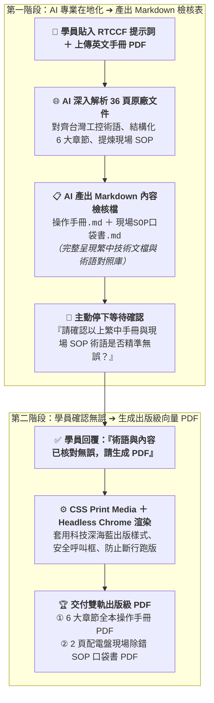

# 10-2 AI 產出之 RTCCF 手冊在地化與術語對齊提示詞（雙軌提煉與人機協作）

> 💡 **核心定位**：本文件是由學員在 [步驟 10-1](./10-1_白話自然語言發想提示詞.md) 輸入白話指令後，由 AI 自動架構生成的標準 **RTCCF 提示詞規格檔**。  
> 
> * 🎯 **角色設定**：將 AI 賦予為「**擁有 15 年跨國工業自動化與外商 FAE 經驗的資深工控技術文檔架構師**」。  
> * 🌐 **核心能力**：指示 AI 讀取 36 頁原廠英文手冊，強制貫徹**台灣工控標準術語（嚴禁大陸機翻如默認/接口/上位機）**，並同時提煉出專供配電盤前線技師使用的 2 頁現場 SOP 口袋書。  
> * 📋 **數據防錯機制**：**AI 翻譯提煉完成後，必須先產出 Markdown 檢核檔案供學員審查確認**，確認無誤後才執行步驟 10-3 生成出版級向量 PDF 發布檔！  
> 
> 📁 獨立規格檔下載：👉 [**`RTCCF_工控技術手冊在地化與SOP提示詞.md`**](./RTCCF_工控技術手冊在地化與SOP提示詞.md)

---

## 🎯 兩階段執行流程圖



---

## 📋 RTCCF 提示詞全文（可直接儲存或複製貼給 AI）

```markdown
## Role｜角色

你是一位具備 15 年跨國工業自動化、電子電力系統與外商現場應用工程（FAE）經驗的「資深工控技術文檔與在地化架構師」。你精通交換式電源供應器（Switching Power Supply）控制原理、NFC 近場通訊配置技術、SFB 選擇性斷路技術，以及符合台灣半導體與高階自動化產業標準的技術文檔規範。

## Task｜任務

我已經上傳了原廠 36 頁的英文軟體技術手冊：《素材_QUINT_POWER軟體英文技術手冊.pdf》。  
請針對「德菱電氣（Aegis Contact）」第四代 APEX POWER 工業電源配置軟體，執行「全本手冊專業在地化 ＋ 提煉 2 頁現場調機 SOP 口袋書 ➔ Markdown 檢核確認 ➔ 產出出版級向量 PDF」的兩階段任務：

### 階段一：建立工控術語對照庫、雙軌在地化重構，並產出 Markdown 檢核檔（人類確認關卡）
1. 建立台灣工控標準術語對照庫（Glossary）：
   - 提取手冊中的核心電氣與通訊專有名詞，強制對齊台灣半導體與自動化現場標準行話，嚴禁大陸機翻用語。
2. 全本操作手冊結構化在地化（Comprehensive Manual）：
   - 去除原廠版權頁與頁首頁尾重複字樣，保留完整的 6 大章節結構：
     * 第一章：電氣安全指引與高壓警示規範（含 LOTO 掛牌上鎖）
     * 第二章：系統需求與 APEX POWER 軟體安裝環境
     * 第三章：USB-NFC 傳輸器安裝與免送電無線配置架構
     * 第四章：輸出特徵曲線進階配置（U/I 恆壓恆流特性、SFB 脈衝觸發、智慧重啟模式）
     * 第五章：自訂信號警示閾值與 PLC 乾接點連鎖整合
     * 第六章：數據記錄匯出、批次複製與診斷故障排除
   - 完整保留規格參數對比表格、軟體功能選單路徑（如 `設定 > 輸出特徵 > SFB模式`）與安全警示方塊。
3. 提煉現場 2 頁調機與排障 SOP 口袋書（Field Quick SOP）：
   - 專為無暇翻閱 36 頁的現場機台調機與配電盤技師設計。
   - 濃縮為「現場五步調機流程」與「常見 6 大故障 LED 燈號排除對照表」，適合列印過膠貼於配電盤門板。
4. 產出結構化 Markdown 檔案：
   - 將上述內容產出為 Markdown 規格檔案（`APEX_POWER電源配置軟體_繁體中文操作手冊.md` 與 `APEX_POWER現場調試與故障排除SOP口袋書.md`）。
5. 停下來等待審核：
   - 在對話框中輸出 Markdown 檢核表，並主動詢問我：「繁體中文手冊與 2 頁現場 SOP 口袋書之內容與專業術語已整理完成，請確認內容是否無誤？確認後將為您自動生成出版級向量 PDF 檔案」。
   - 在使用者確認前，嚴禁直接產出 PDF 檔案！

### 階段二：確認後自動生成出版級向量 PDF 發布檔
當我回覆「確認內容與術語無誤」之後，請透過 Python markdown 與 Headless Chrome 列印引擎，套用科技深海藍出版樣式（CSS Print Media），自動編譯生成高解析度雙軌向量 PDF：
1. APEX_POWER電源配置軟體_繁體中文操作手冊_已完成.pdf（出版級全本手冊）
2. APEX_POWER現場調試與故障排除SOP口袋書_已完成.pdf（2 頁配電盤現場口袋書）

## Context｜背景與情境

- 企業主體為外商「德菱電氣（Aegis Contact）」，其旗艦型 APEX POWER 工業電源廣泛應用於台灣半導體晶圓廠、封測廠與面板自動化無人搬運系統（OHT / AMHS）。
- 本文件將直接作為半導體廠設備出廠驗收（FAT/SAT）之正式交付文件，任何生硬直翻的大陸用語（如「接口」、「默認」）均會被嚴格的廠務與品保工程師判定不合規。
- 現場施工環境緊湊吵雜，第一線調機人員極度依賴 2 頁精準的 SOP 口袋書快速排除故障。

## Constraints｜限制與規則

1. 強制貫徹「台灣工控行話標準」，嚴格禁用大陸直翻詞彙：
   - ❌ 默認 ➔ ✅ 預設（Default）
   - ❌ 接口 ➔ ✅ 介面 / 連接埠（Interface / Port）
   - ❌ 上位機 ➔ ✅ 主控端電腦 / 人機介面（Host PC / HMI）
   - ❌ 魯棒性 ➔ ✅ 強韌度 / 穩定度（Robustness）
   - ❌ 選擇性熔斷 ➔ ✅ SFB 選擇性斷路技術（Selective Fuse Breaking）
   - ❌ 初級開關電源 ➔ ✅ 一次側切換式工業電源（Primary-switched Power Supply）
   - ❌ 門檻值 ➔ ✅ 閾值（Threshold）
2. 電氣安全警示等級嚴格合規：
   - `> [!CAUTION]`：高壓電擊致命危險（深紅框）
   - `> [!WARNING]`：高溫燙傷與電氣過載（鮮橙框）
   - `> [!IMPORTANT]`：技師證照與安裝規範（深藍框）
   - `> [!TIP]`：NFC 感應免送電快捷秘訣（翠綠框）
3. 嚴格執行兩階段確認流程：
   - 必須先輸出 Markdown 檢核表讓學員確認專業術語與章節，確認後才執行 PDF 生成。

## Format｜輸出格式規範

1. 第一階段輸出：Markdown 內容檢核檔（操作手冊.md ＋ 現場SOP口袋書.md）
2. 第二階段輸出：出版級向量 PDF 檔案（全本操作手冊.pdf ＋ 現場SOP口袋書.pdf）。
```

---

## 🔍 第一階段交付示範：AI 產出之 Markdown 內容檢核檔

當學員將上述 RTCCF 提示詞貼給 AI 後，AI **第一步會輸出專業術語對照庫與雙軌 Markdown 草案，停下來等待學員確認**：

```markdown
# 📘 德菱電氣 APEX POWER 繁體中文技術手冊與現場 SOP 檢核表

## 一、台灣工控標準術語對照庫 (Glossary)
| 原廠英文術語 | 台灣工控標準行話 | 錯誤直翻 / 大陸用語 (嚴格禁用) | 應用情境與技術定義 |
| :--- | :--- | :--- | :--- |
| Primary-switched power supply | 一次側切換式工業電源 | 初級開關電源 | 高效率高頻切換電源架構 |
| SFB (Selective Fuse Breaking) | SFB 選擇性斷路技術 | 選擇性熔斷打破 | 短路時提供 6 倍額定電流快速跳脫保險絲 |
| NFC Interface | NFC 近場通訊介面 | NFC 接口 | 透過無線近場感應免送電配置參數 |
| Signaling threshold | 信號警示閾值 | 信號門檻值 | 自訂 DC OK、過載或溫度預警臨界點 |
| Dry contact / Relay output | 乾接點 / 繼電器輸出 | 乾接點 (OK) / 繼電器輸出 | 無電壓無源開關信號，供 PLC 採集 |
| Preventive function monitoring | 預防性功能監控 | 預防性機能監視 | 在故障停機前提前亮燈發出預警 |
| Protective coating | 防潮絕緣塗層 | 三防漆塗覆 | 用於惡劣環境防腐蝕與耐粉塵防護 |

## 二、全本操作手冊 6 大章節結構（已完成 Markdown 翻譯）
* 第一章：電氣安全指引與高壓警示規範（包含 LOTO 斷電上鎖與防護接地 PE 要求）
* 第二章：系統需求與 APEX POWER 軟體環境
* 第三章：USB-NFC 傳輸器安裝與無線通訊架構
* 第四章：輸出特徵曲線進階配置（恆壓恆流、SFB 脈衝觸發、智慧重啟）
* 第五章：信號警示閾值自訂與 PLC 乾接點連鎖
* 第六章：數據記錄匯出、批次複製與韌體升級

## 三、現場調機與故障排除 2 頁 SOP 口袋書精華
1. 步驟 1【免送電 NFC 感應】：USB-NFC 傳輸器緊貼電源正面天線標記，免接 AC 110V/220V 即可讀寫參數。
2. 步驟 2【自動識別連線】：點選「自動識別設備」，3 秒內自動匹配機型與當前設定。
3. 步驟 3【特徵曲線設定】：依機台負載設定 24V~29.5V 電壓及 SFB 斷路保護模式。
4. 步驟 4【乾接點預警連鎖】：將 13/14 乾接點設定為負載達到 90% 時提前通知 PLC。
5. 步驟 5【LED 燈號快速排障】：收錄 DC OK 綠燈熄滅、紅燈閃爍、黃燈過熱等 6 大常見燈號對應處理清單。

👉 **【請使用者確認】**：請審查以上台灣工控術語與手冊內容是否符合半導體現場驗收要求？確認無誤後，請回覆「確認內容與術語無誤」，我將立即啟動步驟 10-3 的 Python 腳本生成出版級雙軌 PDF！
```

---

## 🚀 第二階段：使用者確認回覆指令

當學員檢視上述 Markdown 內容無誤後，只要在對話視窗發送以下這句話，AI 即會啟動步驟 10-3 的轉換腳本產出高解析度向量 PDF：

```text
技術手冊翻譯非常專業，工控行話也完全符合台灣現場標準，已經核對無誤！
請依據 RTCCF 規範中的第二階段，開始執行 Python 與 Headless Chrome 列印腳本，為我產出包含封面、目錄、頁碼與出版樣式的雙軌 PDF 發布檔，謝謝！
```
