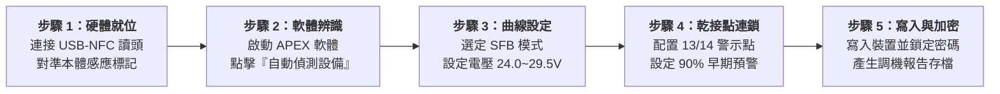

# APEX POWER 工業電源配置軟體
## 現場快速調試與故障排除 SOP 口袋書 (Quick Start Guide)

> **德菱電氣（Aegis Contact）技術工程支援部 監製**  
> 適用設備：第四代 APEX POWER 一次側切換式工業電源（單相／三相 24V DC 全系列）  
> 文件版本：v2.4 (繁體中文台灣工程版) ｜ 密級：現場工程師公開級

---

## ⚡ 一、現場五步快速調試流程（免送電 NFC 配置）

### 步驟 1：硬體連接與感應定位
- 將原廠 USB-NFC 通訊讀頭連接至工程筆電。
- 將讀頭感應面緊貼電源模組正面上方 **NFC 天線標記區**（距離需 $\le 5\text{ mm}$）。
> [!TIP]
> **免送電安全調機**：APEX POWER 內建無源 NFC 晶片，**模組完全無須接入 AC 110V/220V 電源**即可由讀頭供電進行參數讀取與寫入，大幅提升配電盤現場作業安全性！

### 步驟 2：啟動軟體與設備識別
- 啟動 `APEX POWER Software`，於主畫面點選 **【自動識別連線（Auto-Detect）】**。
- 軟體將於 3 秒內自動讀取並顯示：設備訂貨號、韌體版本、當前電壓/電流設定值與累計運轉時數。

### 步驟 3：輸出特徵曲線客製化（Output Characteristics）
- 進入 `設定 > 輸出模式`：
  - **一般自動化機台（預設建議）**：選取 **【SFB 模式（Selective Fuse Breaking）】**，在支路短路時提供高達 6 倍額定電流（120A, 15ms）瞬間熔斷下游保險絲，確保其他健全迴路不停機。
  - **重負載馬達啟動**：選取 **【Power Boost 動態功率提升】**，允許 5 秒內輸出 125% 額定電流（25A）。
  - **精密集控儀表保護**：選取 **【電子式熔絲模式（Electronic Fuse）】**，超過額定電流即刻切斷輸出。

### 步驟 4：信號警示閾值與 PLC 乾接點連鎖（Signaling & Interlock）
- 進入 `設定 > 信號配置`：
  - **DC OK 輸出（端子 13/14 乾接點）**：設定輸出電壓高於 90%（21.6V）時閉合。接入機台 PLC 數位輸入點，作為主迴路安全啟動條件。
  - **P_out > P_thr 預防性警示（端子 OUT1 晶體輸出）**：設定功率超過額定負載 90% 時送出警告訊號，供人機介面（HMI）提前提示操作員巡檢。

### 步驟 5：寫入設備與設定防竄改密碼鎖
- 點選主畫面 **【寫入模組（Write to Device）】**，等待綠色進度條完成 100%。
- 於彈出視窗勾選 **【啟用密碼防護】**，設定 4 位數工程密碼，防止現場非授權人員私自轉動旋鈕更動參數。
- 點選 **【匯出設定檔案（.cfg）】**，存入隨身碟作為設備出廠 FAT/SAT 備份。

---

## 🛠️ 二、現場常見 6 大故障代碼與 LED 燈號快速排除矩陣

現場遇到機台異常停機時，請先檢視電源本體正面之 **3 顆雙色 LED 指示燈**，依下表於 3 分鐘內快速定焦問題：

| 故障現象 | 本體 LED 狀態 | 內部狀態 / 根本原因 | 現場第一步處理措施 (SOP) | 預估處置時間 |
| :---: | :--- | :--- | :--- | :---: |
| **01. 正常運轉** | 🟢 **綠燈 (DC OK) 恆亮** | 輸出電壓正常，負載 $<100\%$ | 正常工作狀態，無須任何處置。 | 即時確認 |
| **02. 動態超載** | 🟡 **黃燈閃爍 (1 Hz)** | 負載介於 $100\%\sim125\%$ 啟動 Power Boost 短暫增強 | 1. 檢查下游是否有伺服軸卡阻或氣缸動作異常。 2. 檢視 HMI 瞬時功耗，若持續超載應評估擴充電源。 | 3 分鐘 |
| **03. 靜態過載** | 🟡 **黃燈恆亮** | 負載持續 $>125\%$ 電壓開始下拉保護機台 | 1. 機台進入限流保護，避免火災。 2. 使用勾表量測各分路電流，拔除異常負載端子。 | 5 分鐘 |
| **04. 支路短路** | 🔴 **紅燈閃爍 (2 Hz)** | 下游線路發生相間或對地短路 觸發 SFB 快速脈衝 | 1. 檢視哪一顆保險絲或斷路器已跳脫。 2. 排除短路後更換保險絲，電源將自動恢復送電。 | 5 分鐘 |
| **05. 過溫保護** | 🔴 **紅燈恆亮** | 內部散熱片溫度 $>85^\circ\text{C}$ 過溫自動強制關斷 | 1. 檢查控制箱冷氣/風扇是否故障濾網堵塞。 2. 確保電源模組上下各保留 $50\text{ mm}$ 散熱空間。 | 10 分鐘 |
| **06. 無法啟動** | ⚪ **全部燈號熄滅** | AC 輸入側斷電或電壓過低 (輸入 $<85\text{V AC}$) | 1. 使用三用電表量測輸入端子 L / N 間電壓。 2. 檢查配電盤上游無熔絲開關（NFB）是否跳脫。 | 2 分鐘 |

---

## ⚠️ 三、現場安全與電氣規範守則

> [!DANGER]
> **高壓電擊致命危險**：本設備一次側輸入端具備 110V~240V AC 致命高壓！**嚴禁於通電狀態下徒手觸摸 L、N 端子排**。進行接線檢修前，務必先切斷上游總開關並落實安全上鎖掛牌（LOTO）程序。

> [!WARNING]
> **短路火災防護**：本電源輸出功率高達 480W（24V/20A），二次側配線線徑不得小於 $2.5\text{ mm}^2$（AWG 14），且各分路負載必須配置匹配容量之斷路器或保險絲。

> [!NOTE]
> **技術支援專線**：若現場排障無法排除，請將軟體匯出之故障記錄檔（Diagnostic Log）發送至 `service@aegis-contact.com.tw`，德菱電氣 FAE 工程團隊將於 2 小時內提供技術支援。
