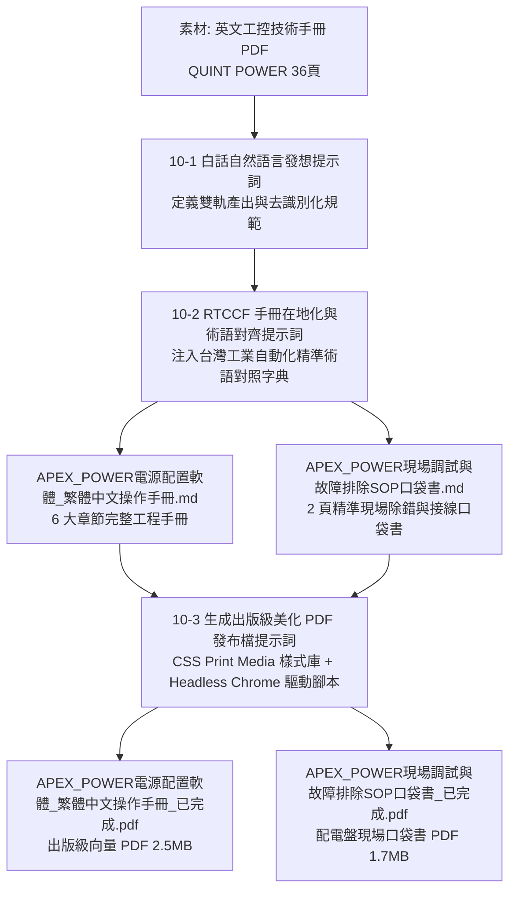

# 工控技術手冊跨國在地化與 SOP 出版級美化 (Industrial Manual Localization & SOP Publishing)

> **專案背景**：在製造業、智慧機械與自動化產線領域，原廠外文技術文件（如德國西門子、菲尼克斯、日本歐姆龍）往往長達數十頁至上百頁。傳統人工翻譯費時數週，且容易產生「機翻硬套」的生硬大陸用語或文意不通之問題；更嚴重的痛點是，**產線第一線的裝配配線與調試工程師在吵雜或緊湊的現場環境中，根本無暇翻閱數十頁的手冊，急需的是濃縮至 1~2 頁、包含關鍵接點代號、NFC 感應位置與 LED 故障判讀對照的「SOP 口袋書」**。  
> 本專案展示如何運用 AI 將厚重的英文技術手冊進行**雙軌在地化重構**：產出**繁體專業手冊**與**現場工程師 SOP 口袋書**，並透過 CSS Paged Media 與 Headless Chrome 自動化渲染引擎，生成符合國際工業安全規範與高質感企業識別的出版級向量 PDF。

---

## 學習重點與核心心法 (Learning Objectives)

### 1. 台灣工控在地術語精準對齊（Avoid Machine Translation Clichés）
- 工業領域有極高嚴謹度之標準術語，AI 翻譯若未經字典校準，容易出現嚴重誤導的大陸用語或生硬直譯。
- 本工作流示範如何建立「**工控專業對照字典**」，例如：
  - `Primary-switched` $\to$ **一次側切換式工業電源**（嚴禁翻為「初級開關」）。
  - `SFB Technology (Selective Fuse Breaking)` $\to$ **SFB 選擇性斷路技術**（嚴禁翻為「選擇性熔斷」）。
  - `Signaling threshold` $\to$ **信號警示閾值**（在控制理論與工控中統一使用「閾值」）。
  - `Dry contact` $\to$ **乾接點**（繼電器無電壓接點標準用語）。
  - `Default` $\to$ **預設**（在地化禁忌「默認」）。

### 2. 雙軌交付架構（Double-Track Delivery Architecture）
- **完整版技術手冊（Comprehensive Manual）**：提供系統整合商（SI）、研發工程師（RD）與客戶廠務人員深度查閱安全規範、通訊架構、特性曲線與日誌分析。
- **2 頁現場調試與排除 SOP 口袋書（Field Quick SOP）**：抽取最精華的核心引腳、NFC 快速配置與 4 種常見故障燈號排除對策，排版緊湊洗鍊，適合列印過膠直接貼在現場機台配電盤門板內側。

### 3. 工業安全規範等級轉換（Industrial Safety Callouts）
- 完整保留並強化國際工控標準（如 OSHA / CE / UL）之危險提示階層：
  - `[!CAUTION]`：高壓電氣感電致命危險（深紅底色，強制斷電掛牌上鎖 LOTO）。
  - `[!WARNING]`：熱表面高溫燙傷與電氣過載（鮮橙底色，防範散熱不良）。
  - `[!IMPORTANT]`：合格技師執照與保固規範。
  - `[!TIP]`：批量 NFC 感應快速複製技巧。

### 4. 無依賴 Headless Chrome 出版級渲染引擎（Zero-Dependency Publishing Pipeline）
- 捨棄排版簡陋的純文字列印，亦無需安裝龐大複雜的 LaTeX 或 Node/Puppeteer 肥大套件。
- 透過標準 Python 將 Markdown 轉化為含 CSS Print Media 樣式的 HTML，直接呼叫本機 Google Chrome 進行向量 PDF 列印，完美實現 A4 頁碼、表格斑馬紋、等寬原理圖與防止斷行跑版之出版級成果。

---

## 工作流程與架構圖 (Workflow Architecture)

---

## 目錄結構與檔案清單 (Directory Structure)

| 檔案名稱 | 說明 |
| :--- | :--- |
| [10-1_白話自然語言發想提示詞.md](file:///Users/roberthsu2003/Documents/GitHub/workflow-productivity/常見的AI應用/實戰範例/工控技術手冊跨國在地化與SOP出版級美化/10-1_白話自然語言發想提示詞.md) | 從企業痛點出發，引導 AI 釐清跨國手冊翻譯、雙軌 SOP 提煉與去識別化策略之口語 Prompt。 |
| [10-2_AI產出之RTCCF手冊在地化與術語對齊提示詞.md](file:///Users/roberthsu2003/Documents/GitHub/workflow-productivity/常見的AI應用/實戰範例/工控技術手冊跨國在地化與SOP出版級美化/10-2_AI產出之RTCCF手冊在地化與術語對齊提示詞.md) | 包含完整台灣工控在地術語對照表、6 大章節結構與電氣安全標註之嚴謹 RTCCF 框架 Prompt。 |
| [10-3_生成出版級美化PDF發布檔提示詞.md](file:///Users/roberthsu2003/Documents/GitHub/workflow-productivity/常見的AI應用/實戰範例/工控技術手冊跨國在地化與SOP出版級美化/10-3_生成出版級美化PDF發布檔提示詞.md) | 工業出版級 CSS 列印樣式規範與無外部套件依賴之 Python + Headless Chrome 自動化轉換腳本。 |
| [APEX_POWER電源配置軟體_繁體中文操作手冊_已完成.md](file:///Users/roberthsu2003/Documents/GitHub/workflow-productivity/常見的AI應用/實戰範例/工控技術手冊跨國在地化與SOP出版級美化/APEX_POWER電源配置軟體_繁體中文操作手冊_已完成.md) | 包含 6 大章節、電氣特性對比矩陣與事件日誌分析之完整繁體中文操作手冊（Markdown 源檔）。 |
| [APEX_POWER現場調試與故障排除SOP口袋書_已完成.md](file:///Users/roberthsu2003/Documents/GitHub/workflow-productivity/常見的AI應用/實戰範例/工控技術手冊跨國在地化與SOP出版級美化/APEX_POWER現場調試與故障排除SOP口袋書_已完成.md) | 專為配電盤前線工程師設計之 2 頁精準調試與燈號除錯口袋書（Markdown 源檔）。 |
| [APEX_POWER電源配置軟體_繁體中文操作手冊_已完成.pdf](file:///Users/roberthsu2003/Documents/GitHub/workflow-productivity/常見的AI應用/實戰範例/工控技術手冊跨國在地化與SOP出版級美化/APEX_POWER電源配置軟體_繁體中文操作手冊_已完成.pdf) | 運用出版級 CSS 樣式與 Headless Chrome 產出之高解析度向量發布檔（約 2.5 MB）。 |
| [APEX_POWER現場調試與故障排除SOP口袋書_已完成.pdf](file:///Users/roberthsu2003/Documents/GitHub/workflow-productivity/常見的AI應用/實戰範例/工控技術手冊跨國在地化與SOP出版級美化/APEX_POWER現場調試與故障排除SOP口袋書_已完成.pdf) | 適合隨身攜帶或張貼於控制箱門板之高質感 SOP 口袋書發布檔（約 1.7 MB）。 |
| [素材_QUINT_POWER軟體英文技術手冊.pdf](file:///Users/roberthsu2003/Documents/GitHub/workflow-productivity/常見的AI應用/實戰範例/工控技術手冊跨國在地化與SOP出版級美化/素材_QUINT_POWER軟體英文技術手冊.pdf) | 原始英文工控軟體技術操作手冊素材（1.6 MB，36 頁）。 |

> [!NOTE]
> 本範例素材已將真實品牌與型號進行去識別化處理，改以虛擬之**「德菱電氣（Aegis Contact）」**與**「APEX POWER 第四代工業電源」**呈現，保障企業隱私與技術合規。
