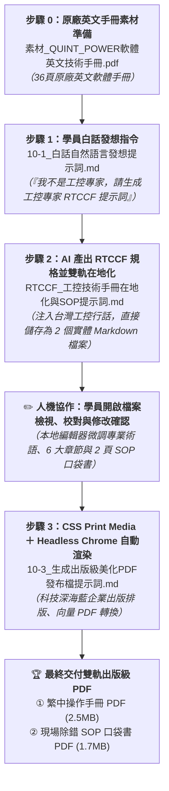

# 實戰範例：工控技術手冊跨國在地化與 SOP 出版級美化 (Industrial Manual Localization & SOP Publishing)

> 🟢 **採用代理平台**：ChatGPT Agent / Claude.ai / Google Antigravity  
> 🛠️ **建議執行模式**：**雙軌人機協商**（**白話需求發想 ➔ RTCCF 工控專家提示詞 ➔ Markdown 檢核確認 ➔ Headless Chrome 向量 PDF 渲染**）

---

## 📥 專案檔案下載快速導覽（實作素材 vs 完成成果 vs 中繼產物）

> 💡 **學習建議**：想要親自動手實作的學員，請下載 **「實作必備原始素材」** 英文技術手冊 PDF 至專案中；想直接檢視最終雙軌出版成果，請下載 **「完成成果發布檔」**。
>
> * 📦 **【實作起點】練習必備原始素材（請下載此檔案開始實作）**：  
>   👉 [**`素材_QUINT_POWER軟體英文技術手冊.pdf`**](./素材_QUINT_POWER軟體英文技術手冊.pdf) *(36 頁原廠英文工控軟體技術操作手冊原始素材，請下載此檔開始進行在地化翻譯與雙軌 SOP 提煉)*
>
> * 🏆 **【對照標準答案】最終完成發布檔**：  
>   1. 👉 [**`APEX_POWER電源配置軟體_繁體中文操作手冊_已完成.pdf`**](./APEX_POWER電源配置軟體_繁體中文操作手冊_已完成.pdf) *(6 大章節出版級繁體中文完整手冊，高解析度向量 PDF，約 2.5 MB)*  
>   2. 👉 [**`APEX_POWER現場調試與故障排除SOP口袋書_已完成.pdf`**](./APEX_POWER現場調試與故障排除SOP口袋書_已完成.pdf) *(2 頁配電盤現場除錯與接線 SOP 口袋書發布檔，約 1.7 MB)*
>
> * 📄 **【中繼確認成果】Markdown 檢核源檔**：  
>   1. 👉 [**`APEX_POWER電源配置軟體_繁體中文操作手冊_已完成.md`**](./APEX_POWER電源配置軟體_繁體中文操作手冊_已完成.md) *(包含 6 大章節與電氣參數矩陣之繁體中文完整手冊源檔)*  
>   2. 👉 [**`APEX_POWER現場調試與故障排除SOP口袋書_已完成.md`**](./APEX_POWER現場調試與故障排除SOP口袋書_已完成.md) *(適合列印過膠貼於機台控制箱門板之 2 頁 SOP 口袋書源檔)*

---

## 🏆 最終完成成果展示（雙軌出版級實作成果搶先看）

在製造業、智慧機械與自動化產線領域，原廠外文技術文件（如德國西門子、菲尼克斯、日本歐姆龍）往往長達數十頁。傳統人工翻譯費時數週，且容易產生生硬大陸用語；更嚴重的痛點是，**產線第一線的配線與調試工程師根本無暇翻閱數十頁手冊，急需濃縮至 1~2 頁、包含關鍵接點代號、NFC 感應位置與 LED 故障判讀的「SOP 口袋書」**。

本專案產出**「完整操作手冊」**與**「現場 SOP 口袋書」**雙軌成果，完美支援不同受眾：

1. **成果 1【繁體中文完整技術操作手冊 (2.5MB)】**：提供系統整合商（SI）、研發工程師（RD）與客戶廠務人員深度查閱安全規範、通訊架構、特性曲線與事件日誌分析。
2. **成果 2【2頁現場調試與故障排除 SOP 口袋書 (1.7MB)】**：抽取最精華的核心引腳、NFC 快速配置與 6 大常見故障燈號排除對策，排版緊湊洗鍊，適合列印過膠直接貼在現場機台配電盤門板內側。

---

## 🎯 學習重點與四大核心心法

#### 心法一：台灣工控在地術語精準對齊（拒絕生硬機器直翻）
* **問題**：AI 翻譯若未經術語校準，容易出現嚴重誤導的大陸用語（如「初級開關電源」、「選擇性熔斷」）。
* **解法**：建立工控專屬對照庫：
  - `Primary-switched` $\to$ **一次側切換式工業電源**（嚴禁翻為「初級開關」）。
  - `SFB Technology (Selective Fuse Breaking)` $\to$ **SFB 選擇性斷路技術**（嚴禁翻為「選擇性熔斷」）。
  - `Signaling threshold` $\to$ **信號警示閾值**（工控中統一使用「閾值」）。
  - `Dry contact` $\to$ **乾接點**（繼電器無電壓接點標準用語）。
  - `Default` $\to$ **預設**（在地化禁忌「默認」）。

#### 心法二：雙軌分流交付架構（全本手冊 ＋ 2 頁現場口袋書）
* **問題**：36 頁手冊太重，現場設備工程師在吵雜機台前根本找不到關鍵故障代碼。
* **解法**：雙軌交付——全本手冊供 FAT/SAT 驗收留檔；2 頁口袋書專攻現場 5 步快速調機與 LED 燈號除錯。

#### 心法三：國際工業安全規範等級轉換（Industrial Safety Callouts）
* **問題**：電氣安全警告若混淆，可能導致現場人員感電觸電危險。
* **解法**：完整保留並強化國際工控標準（OSHA / CE / UL）之危險提示階層：
  - `> [!CAUTION]`：高壓電氣感電致命危險（深紅底色，強制斷電掛牌上鎖 LOTO）。
  - `> [!WARNING]`：熱表面高溫燙傷與電氣過載（鮮橙底色，防範散熱不良）。
  - `> [!IMPORTANT]`：合格技師執照與保固規範。
  - `> [!TIP]`：免送電 NFC 感應快速複製密技。

#### 心法四：無依賴 Headless Chrome 出版級渲染引擎
* **問題**：純文字排版簡陋，安裝龐大 LaTeX 或 Node/Puppeteer 肥大套件容易環境報錯。
* **解法**：透過標準 Python 將 Markdown 轉化為含 CSS Print Media 樣式的 HTML，直接呼叫本機 Google Chrome 進行向量 PDF 列印，完美實現 A4 頁碼、表格斑馬紋與防止斷行跑版。

---

## ⚡ 核心人機協商閉環（原廠手冊 ➔ RTCCF 提煉 ➔ Markdown 檢核 ➔ 出版級 PDF 渲染）

### 1. 步驟 0：素材準備
* 數據素材：[**`素材_QUINT_POWER軟體英文技術手冊.pdf`**](./素材_QUINT_POWER軟體英文技術手冊.pdf)（36 頁原廠英文工控軟體技術操作手冊素材）

### 2. 步驟 1：白話自然語言發想（一般學員視角）
* 文件連結：[**`10-1_白話自然語言發想提示詞.md`**](./10-1_白話自然語言發想提示詞.md)
* 核心亮點：學員不是工控專家或專業翻譯，手邊只有原廠英文手冊。透過大白話引導 AI 產出一份以「資深工控技術文檔與自動化 FAE 首席專家」為角色的 RTCCF 提示詞規格，並指示 AI 翻譯後直接儲存為 2 個實體 Markdown 檔案供人機協作！

### 3. 步驟 2：AI 產出之 RTCCF 手冊在地化與術語對齊提示詞（雙軌提煉與人機協作）
* 文件連結：[**`10-2_AI產出之RTCCF手冊在地化與術語對齊提示詞.md`**](./10-2_AI產出之RTCCF手冊在地化與術語對齊提示詞.md)
* 獨立規格檔：[**`RTCCF_工控技術手冊在地化與SOP提示詞.md`**](./RTCCF_工控技術手冊在地化與SOP提示詞.md)
* 核心亮點：AI 角色設定為資深工控架構師，嚴格執行台灣工控行話標準（一次側、SFB斷路、乾接點），翻譯與提煉完成後直接儲存為 2 個實體 Markdown 檔案（全本操作手冊.md 與 現場SOP口袋書.md），供學員在本地編輯器直接開啟，進行人機協作微調與審查確認！

### 4. 步驟 3：生成出版級美化 PDF 發布檔
* 文件連結：[**`10-3_生成出版級美化PDF發布檔提示詞.md`**](./10-3_生成出版級美化PDF發布檔提示詞.md)
* 核心技術：提示詞內嵌完整生產級 Python ＋ Headless Chrome 轉換腳本與 CSS Print Media 樣式庫，一鍵將 Markdown 編譯為出版級高解析度向量 PDF。

---

## 📁 範例交付成品與素材清單

| 檔案名稱 | 檔案類型 | 角色與說明 |
| :--- | :---: | :--- |
| 📦 [**素材_QUINT_POWER軟體英文技術手冊.pdf**](./素材_QUINT_POWER軟體英文技術手冊.pdf) | 📁 **實作原始素材** | **【實作起點】** 原始原廠英文工控軟體技術操作手冊素材（36 頁，1.6 MB，請下載此檔開始實作） |
| 📕 [**APEX_POWER電源配置軟體_繁體中文操作手冊_已完成.pdf**](./APEX_POWER電源配置軟體_繁體中文操作手冊_已完成.pdf) | 🏆 **最終完成成果** | **【對照標準答案】** 6 大章節出版級繁體中文高解析度向量發布檔（約 2.5 MB） |
| 📘 [**APEX_POWER現場調試與故障排除SOP口袋書_已完成.pdf**](./APEX_POWER現場調試與故障排除SOP口袋書_已完成.pdf) | 🏆 **最終完成成果** | **【對照標準答案】** 專為配電盤前線工程師設計之 2 頁精準調試與燈號除錯口袋書發布檔（約 1.7 MB） |
| 📄 [**APEX_POWER電源配置軟體_繁體中文操作手冊_已完成.md**](./APEX_POWER電源配置軟體_繁體中文操作手冊_已完成.md) | 📄 **Markdown 源檔** | 包含 6 大章節、電氣特性對比矩陣與事件日誌分析之繁體中文完整手冊源檔 |
| 📄 [**APEX_POWER現場調試與故障排除SOP口袋書_已完成.md**](./APEX_POWER現場調試與故障排除SOP口袋書_已完成.md) | 📄 **Markdown 源檔** | 適合列印過膠貼於機台控制箱門板之 2 頁 SOP 口袋書源檔 |
| 💬 [**10-1_白話自然語言發想提示詞.md**](./10-1_白話自然語言發想提示詞.md) | 💬 **人機發想** | 一般學員日常口吻，上傳原廠手冊要求生成工控專家 RTCCF 提示詞 |
| 📋 [**10-2_AI產出之RTCCF手冊在地化與術語對齊提示詞.md**](./10-2_AI產出之RTCCF手冊在地化與術語對齊提示詞.md) | 📋 **提示詞架構** | 說明 RTCCF 架構、台灣工控行話字典與雙軌 Markdown 檢核流程 |
| 📄 [**RTCCF_工控技術手冊在地化與SOP提示詞.md**](./RTCCF_工控技術手冊在地化與SOP提示詞.md) | 📄 **可儲存規格檔** | 可獨立儲存之標準 RTCCF 提示詞，以工控 FAE 專家為角色並規範兩階段確認 |
| ⚙️ [**10-3_生成出版級美化PDF發布檔提示詞.md**](./10-3_生成出版級美化PDF發布檔提示詞.md) | ⚙️ **核心教學** | 詳細解說 CSS 列印樣式規範、Callout 轉換與 Headless Chrome 驅動腳本 |

> [!NOTE]
> 本範例素材已將真實品牌與型號進行去識別化處理，改以虛擬之**「德菱電氣（Aegis Contact）」**與**「APEX POWER 第四代工業電源」**呈現，保障企業隱私與技術合規。

---

[← 返回實戰範例導覽總表](../README.md)
