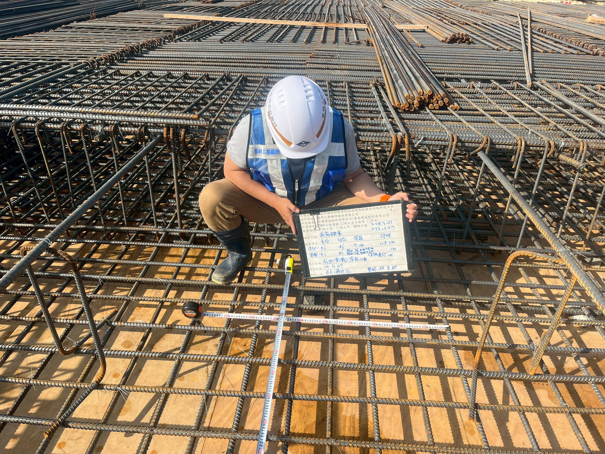
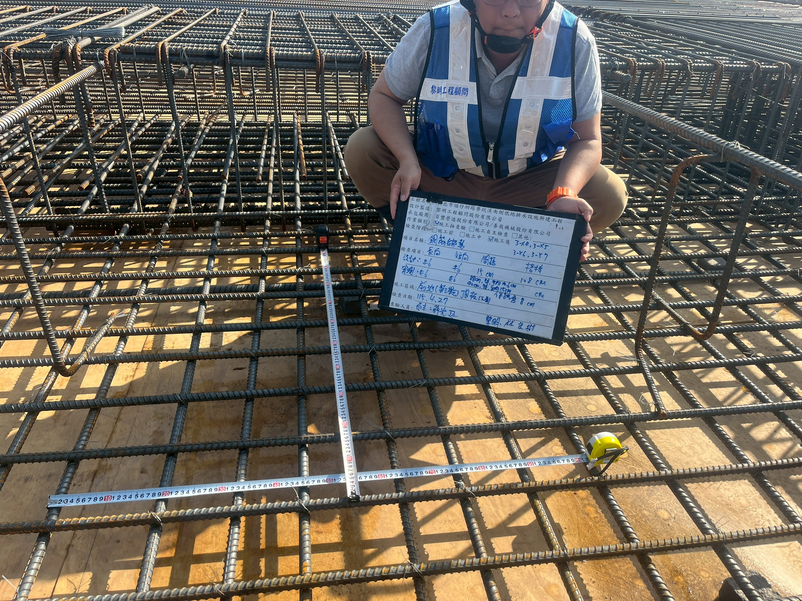
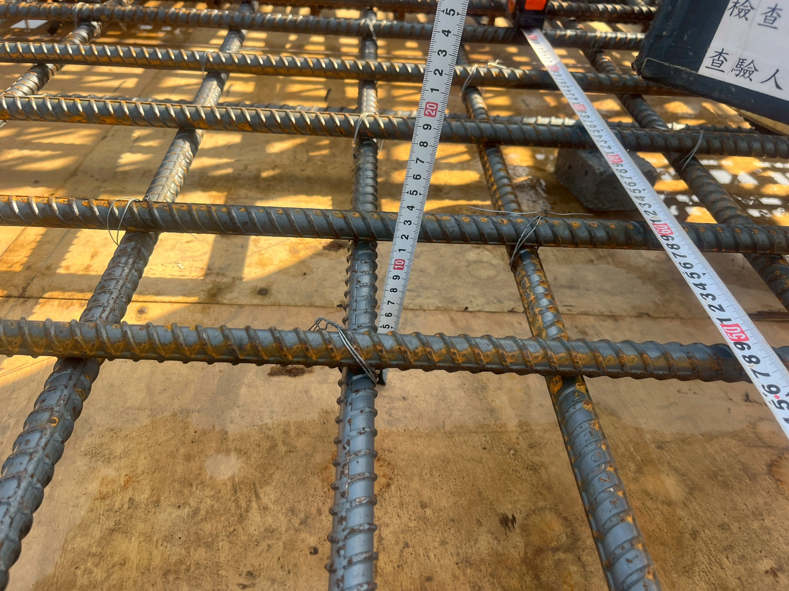

# 施工查驗照片紀錄

## 基本資料

| 欄位 | 內容 |
|---|---|
| 工程名稱 | 新北市塭仔圳塔寮坑溪南側低地排水設施新建工程 |
| 日期 | 115.4.27 |

## 查驗資料 1

| 欄位 | 內容 |
|---|---|
| 說明 | 施工抽查驗；檢查階段為施工後 |
| 查驗位置 | 前池（第三單元）頂板（下層）；照片可辨識位置標記：3-X3、3-X4、3-X5、3-Y3、3-Y6、3-Y7 |
| 查驗項目 | 鋼筋綁紮：長向、短向、間距、搭接及保護層 |
| 設計值 | 長向：#6；短向：#6；間距：15 cm；搭接：108 cm |
| 抽查值 | 長向：#6；短向：#6；間距量測：89 cm ÷ 6＝14.8 cm、88 cm ÷ 6＝14.6 cm、90 cm ÷ 6＝15 cm；保護層：8 cm |
| 查驗日期 | 115.4.27 |

### 對應照片

- `LINE_ALBUM_427前池三頂板下層筋綁紮查驗_260427_1.jpg`
- `LINE_ALBUM_427前池三頂板下層筋綁紮查驗_260427_9.jpg`
- `LINE_ALBUM_427前池三頂板下層筋綁紮查驗_260427_15.jpg`

