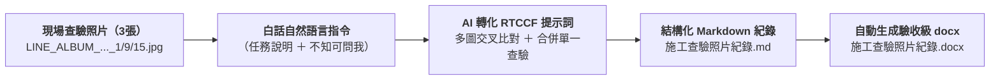

# 步驟一：白話自然語言發想提示詞（最純粹的口語表達）

> 💡 **核心工作流**：**現場白板照片 ➔ 白話口語下達任務 ➔ 轉化為精準 RTCCF 提示詞 ➔ 產出結構化 Markdown ➔ 自動生成驗收級 docx 檔**！  
> 🗣️ **一般人日常口語**：不需要生硬的提示詞工程術語，直接用日常最直白、簡單的大白話下指令！  
> 🛠️ **適用平台**：ChatGPT 任何對話視窗、Claude、Gemini（支援多模態圖片上傳辨識）。

---

## 🎯 核心轉換工作流



---

## 📋 提示詞複製專區（一般人口語化自然語言）

請直接複製下方這段最簡單、最口語的指令貼給 AI，並附上 3 張白板照片：

```text
這是我在工地拍攝的 3 張鋼筋綁紮施工查驗照片（附有現場白板與捲尺量測）：
- LINE_ALBUM_427前池三頂板下層筋綁紮查驗_260427_1.jpg
- LINE_ALBUM_427前池三頂板下層筋綁紮查驗_260427_9.jpg
- LINE_ALBUM_427前池三頂板下層筋綁紮查驗_260427_15.jpg

任務需求：
1. 請幫我辨識照片裡白板上的文字和數據，包含工程名稱、查驗日期、施工位置、查驗項目、設計值、抽查值、查驗人員等。
2. 這 3 張照片都是同一天、同一個位置的查驗，請幫我互相交叉比對文字，把看不清楚的字用看得清楚的那張補齊，並合併成「同一次查驗紀錄」，不要分成好幾筆！
3. 白板或捲尺上如果有看不清楚或不確定的地方，請主動詢問我，絕對不要自己通靈瞎猜。
4. 先幫我整理成乾淨的 Markdown 格式，最後要能自動生成符合驗收標準的 Word 檔（.docx），格式排版一定要一模一樣！

請幫我把這個任務轉成標準的「RTCCF 格式」提示詞。
⚠️ 注意：
1. 請不要太過於複雜（不要長篇大論、不要寫一堆假大空的套話），越精準直接越好！
2. 重點放在多張照片交叉比對、同次查驗合併、防通靈機制，以及最後產出格式規範。
```

---

## 💡 兩大實戰關鍵提醒

1. **同次查驗「合併成一筆」＋「不知道的可以問我」**：  
   營造監造常常針對同一個白板與鋼筋斷面拍下遠景、近景與特寫。若沒交代清楚，AI 很容易「一張照片當成一筆查驗」，造成重複建檔。加上一句「**同一次查驗合併成同一筆**」與「**不清楚的請主動問我**」，AI 就會主動交叉驗證並防呆！
2. **提醒 AI「不要太過於複雜」**：  
   避免 AI 耗費大量 Token 闡述營造法規、監造歷史或空洞引言，強制 AI 直奔欄位提取、多圖比對與輸出版型規範！
