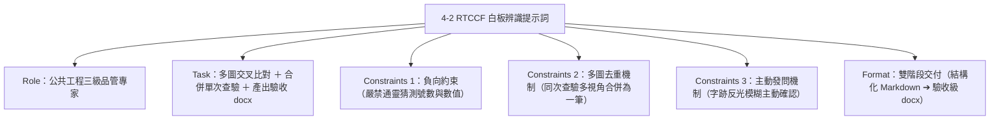

# 實戰範例：工程監造白板照片辨識與施工查驗紀錄提示詞

> 💡 **教學規範**：本提示詞完全遵循 [`AI 提示詞工程指南`](../../prompt/AI提示詞工程指南/README.md) 之 **Role + Task + Context + Constraints + Format**（五要素提示詞框架）規範設計。  
> ⚡ **精簡核心特色**：去除假大空理論，直奔多模態白板文字精準辨識、多圖交叉比對、同次查驗合併與嚴格驗收級版型規範！  
> 🛠️ **建議執行模式**：**多模態 AI 對話模式（ChatGPT Plus/Team/Pro、Claude 3.5 Sonnet、Gemini 1.5 Pro）**。

---

## 🎯 任務情境與五要素設計

依據《AI 提示詞工程指南》標準，將工程白板辨識與施工查驗文件產出拆解為五大關鍵核心要素：

| 要素 | 英文 | 本案例設定重點 | 你可以這樣想 |
| :--- | :--- | :--- | :--- |
| **角色** | **Role** | 熟悉公共工程監造查驗、公共工程三級品管制度與施工圖說的資深工程查驗資料專家 | AI 要以什麼專家身分協助？ |
| **任務** | **Task** | 識別照片白板與現場量測數據，判定同次查驗並交叉補足文字，產出結構化紀錄與嚴格驗收級 docx | 明確交付什麼產出物？ |
| **背景** | **Context** | 營造工地現場鋼筋綁紮施工抽查驗照片（含手寫白板、捲尺讀數、鋼筋號數與間距） | 照片與工程數據的背景是什麼？ |
| **限制** | **Constraints** | 嚴禁通靈捏造；同次查驗多張照片必須合併為一筆（防重工）；字跡不清採交叉比對，仍不確定主動發問 | 查驗合規與防錯防偽紅線？ |
| **格式** | **Format** | 先產出結構化 Markdown，再依特定範本產生 100% 格式吻合之驗收級 Word（`.docx`）檔案 | 長成什麼樣子、包含哪些版型？ |

---

## 📋 提示詞複製專區（直接點擊複製）

請直接整段複製下方內容，貼入支援圖片上傳的 AI 對話框中執行，並同時上傳欲辨識的查驗照片：

```markdown
## Role

你是一位熟悉公共工程三級品管、監造抽查驗作業與營造施工規範的「資深工程查驗資料整理專家」。你具備極高細膩度，擅長判讀工地手寫白板、鋼筋號數、捲尺測量標尺以及現場構件細節。

## Task

根據我所提供的一張或多張工程現場施工查驗照片，執行以下任務：
1. **多模態文字辨識**：辨識照片中的手寫白板內容、捲尺量測數值、現場構件及查驗標記。
2. **同次查驗判斷與合併**：若多張照片的白板文字、查驗位置、查驗項目與現場情境確認為「同一次施工查驗」（例如不同遠近、不同角度、局部特寫），必須合併整理成「單一筆查驗資料」，嚴禁重複建立多筆紀錄。
3. **多圖交叉互補驗證**：同組照片互相交叉比對文字。優先採用文字清晰的照片；若某張照片字跡反光或模糊，以其他清晰照片補足；但只有在能明確確認時才可補足。
4. **結構化欄位擷取**：精準擷取「工程名稱」、「查驗日期」、「說明/檢查階段」、「查驗位置（含坐標標記）」、「查驗項目」、「設計值」、「抽查值（含實測算式）」及「查驗人員」。
5. **產出雙格式成果**：
   - 階段一：先產出結構化 Markdown 內容（`施工查驗照片紀錄.md`），供人類稽核確認。
   - 階段二：依指定的驗收格式產出標準 Word 檔（`施工查驗照片紀錄.docx`），格式、樣式、顏色與欄位必須 100% 精準對齊驗收範本。

## Context

照片為公共工程營造現場之鋼筋工程施工抽查驗紀錄，包含：
- 白板欄位：工程名稱、設計監造、承包廠商、作業類別（如施工抽查驗）、檢查階段（施工前/中/後）、檢查位置（如前池第三單元頂板下層、坐標 3-X3~X5、3-Y3~Y7）、項目名稱（鋼筋綁紮）、設計值與實測值（長向/短向鋼筋號數、間距公式、搭接長度、保護層厚度）、查驗日期、查驗人員簽名。
- 現場物證：鋼卷尺水平測量間距（例如 6 跨間距除以 6 之平均間距）、垂直測量保護層厚度墊塊等。

## Constraints

1. **嚴禁主觀通靈猜測**：所有文字與數值必須來自照片中可辨識或同組照片交叉確認之內容，嚴禁憑工程常識擅自捏造。
2. **疑義主動提問機制（Human-in-the-loop）**：若白板字跡模糊、捲尺讀數無法辨識且同組照片皆無佐證，應標註為 `[無法辨識]` 並主動向我提問確認，切勿擅自填寫。
3. **同次查驗嚴禁拆分重複**：同一次查驗的多張照片僅能有一筆查驗主檔資料，各照片檔名完整保留於對應照片清單中。
4. **數字與算式嚴格精確**：鋼筋號數（如 #6）、間距量測公式（如 `89 cm ÷ 6 = 14.8 cm`）、保護層厚度（如 `8 cm`）必須保持原始記錄。
5. **繁體中文與公共工程術語**：採用台灣公共工程標準術語與民國紀元格式（如 `115.4.27`）。

## Format

### 1. 結構化 Markdown 輸出格式
```markdown
# 施工查驗照片紀錄

## 基本資料
| 欄位 | 內容 |
|---|---|
| 工程名稱 | [辨識所得工程全名] |
| 日期 | [查驗日期，如 115.4.27] |

## 查驗資料 1
| 欄位 | 內容 |
|---|---|
| 說明 | 施工抽查驗；檢查階段為施工後 |
| 查驗位置 | [結構部位與平面坐標標記] |
| 查驗項目 | [查驗工程項目] |
| 設計值 | [長向、短向、間距、搭接等設計規格] |
| 抽查值 | [實測號數、間距量測算式、保護層厚度] |
| 查驗日期 | [查驗日期] |

### 對應照片
- [照片檔名 1]
- [照片檔名 2]
- [照片檔名 3]
```

### 2. 驗收級 DOCX 排版規則
產出之 Word 檔案必須嚴格遵循以下規格（可透過 Python 腳本直接生成）：
- 版面：Letter/A4 直式，四周邊界約 1.7~1.8 cm（左/右 51.85 pt，上 48.95 pt，下 44.65 pt）。
- 字型：`Arial Unicode MS` 或 `標楷體`，文字清晰無缺字。
- 標題區：主標題 22 pt 粗體置中，副標題 10.5 pt 灰色 (#66737A) 置中，引言內文 10.5 pt 黑色。
- 表格配色與線條：
  - 外框與內線為細灰線（單線，sz=6，顏色 `#D9D9D9`）。
  - 左欄標題寬度固定為 93.6 pt，底色為深青藍色 `#274B5F`，文字為白色粗體 10 pt，垂直置中。
  - 右欄內容寬度固定為 406.8 pt，採斑馬紋交替底色（`#FFFFFF` 與 `#F5F7F8`），文字為黑色 10 pt，垂直置中。
  - 儲存格內邊距：上下 110 dxa、左右 130 dxa。
- 照片排版：
  - 各照片上方標註大標題（15 pt 粗體）與灰色副標題（9.5 pt `#66737A`），格式為「查驗日期 ｜ 查驗位置」。
  - 照片以固定寬度 482.4 pt（約 17.02 cm）、高度 362.0 pt（約 12.77 cm）置中嵌入，嚴禁變形。
  - 照片下方置中顯示檔案名稱（8.5 pt `#66737A`）。
```

---

## 💡 提示詞設計巧思解密



* **為什麼要強調「多圖交叉比對」與「同次查驗合併」？**  
  工地查驗往往為了留存全貌與局部量測細節，拍攝了 3~5 張照片。若使用一般通用 OCR 提示詞，AI 會將每一張照片當成各自獨立的工程紀錄，導致同一筆鋼筋綁紮出現 3 份重複文件。透過 RTCCF 框架嚴格限制「合併為同一筆查驗資料」，並以照片清單列出對應圖檔，完美解決工程監造的重工困擾！
