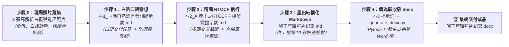

# 實戰範例：工程監造白板照片辨識與施工查驗紀錄生成

> 🟢 **採用代理平台**：ChatGPT / Claude / Gemini 多模態視覺平台  
> 🛠️ **建議執行模式**：**多模態視覺對話模式 ＋ Python Code Interpreter（或本地自動化腳本）**  
> 📦 **全套範例一鍵打包下載**：👉 [**`工程監造白板照片辨識_完整範例包.zip`**](./工程監造白板照片辨識_完整範例包.zip)

---

## 🏆 最終完成作品展示（實作成果搶先看）

> 📥 **驗收完成品直接下載與檢視**：  
> 👉 [**`115.04.27前池第3單元頂版下層筋綁紮查驗_施工查驗照片紀錄.docx`**](./115.04.27前池第3單元頂版下層筋綁紮查驗_施工查驗照片紀錄.docx)  
> *（這是本專案經過「現場多視角照片 ➔ 白話自然語言 ➔ RTCCF 多圖交叉比對 ➔ 結構化 Markdown ➔ Python 落地生成」後全自動產出的公共工程品管驗收級 Word 查驗文件）*

本專案針對營造工程現場最關鍵的「鋼筋綁紮施工抽查驗」，精準辨識 3 張現場白板與捲尺實測照片，並輸出 100% 符合公共工程品管驗收標準的專業文件：
1. **工程基本資料表**：擷取工程名稱（範例採去識別化偽名稱：**台南市排水設施新建工程**）與民國查驗日期（115.4.27）。
2. **完整查驗資料表**：涵蓋檢查階段（施工後）、結構查驗位置與精確軸力線標記（`3-X3、3-X4、3-X5、3-Y3、3-Y6、3-Y7`）、設計值規格（`#6` 鋼筋、間距 `15 cm`、搭接 `108 cm`）以及實際量測抽查值（`89 cm ÷ 6 = 14.8 cm`、`88 cm ÷ 6 = 14.6 cm`、`90 cm ÷ 6 = 15 cm`、保護層 `8 cm`）。
3. **現場照片序列**：自動將多張照片以高解析度嵌入、保持黃金比例（482.4 pt × 362.0 pt）置中排版，附上灰階檔名與查驗部位副標題，嚴格杜絕跨頁破裂與變形！

---

## 📊 完成作品外觀預覽

### 表格 1：【工程基本資料】
*高雅青藍色（#274B5F）標題欄與淺灰斑馬底色，呈現工程顧問公司等級之俐落質感：*

| 欄位 | 內容 |
| :---: | :--- |
| **工程名稱** | 台南市排水設施新建工程（範例偽名稱） |
| **日期** | 115.4.27 |

---

### 表格 2：【施工查驗詳細數據紀錄】
*同次查驗多張照片交叉補足，去除字跡反光，完整保留實測公式與物證：*

| 欄位 | 內容 |
| :---: | :--- |
| **說明** | 施工抽查驗；檢查階段為施工後 |
| **查驗位置** | 前池（第三單元）頂板（下層） 位置標記：3-X3、3-X4、3-X5、3-Y3、3-Y6、3-Y7 |
| **查驗項目** | 鋼筋綁紮：長向、短向、間距、搭接及保護層 |
| **設計值** | 長向：#6　　短向：#6 間距：15 cm　　搭接：108 cm |
| **抽查值** | 長向：#6　　短向：#6 間距量測：89 cm ÷ 6＝14.8 cm、88 cm ÷ 6＝14.6 cm、90 cm ÷ 6＝15 cm 保護層：8 cm |
| **查驗日期** | 115.4.27 |

---

### 📷 照片預覽：【三張現場查驗照片交叉驗證】

| 照片檔名 | 視角與功能說明 | 關鍵白板／現場物證 |
| :--- | :--- | :--- |
| **LINE_ALBUM_..._1.jpg** | 全景透視俯拍 | 人員持白板半蹲，捲尺沿主筋橫向展開量測間距（可見 3-X3~X5, 3-Y3~Y7） |
| **LINE_ALBUM_..._9.jpg** | 白板正視近景 | 白板文字極為清晰，可清楚辨識工程名稱、設計值 #6@15、抽查值算式與人員簽名 |
| **LINE_ALBUM_..._15.jpg** | 鋼筋保護層特寫 | 垂直立尺量測底筋至模板表面厚度（捲尺標尺讀數清晰顯示保護層約 8 cm） |

---

## 🎯 案例情境與兩大核心職場心法

在公共工程營造與監造管理中，品管工程師每天都需要將數十張甚至上百張工地照片整理為「施工查驗相片紀錄」。傳統人工登打作業面臨三大痛點：
1. **手寫白板字跡辨識繁瑣**：陽光反光、白板擦拭痕跡、字跡潦草，人工辨識打字極為耗時。
2. **同一次查驗多張照片重複建檔**：現場為了拍全景、白板特寫、捲尺特寫，通常會拍 3~5 張照片。如果直接交給一般 OCR，常被拆成 3 份不同紀錄，造成混亂與嚴重重工。
3. **數據嚴格驗收要求**：鋼筋號數（如 `#6`）、間距量測除法算式（如 `89 ÷ 6 = 14.8 cm`）關係到工程請款與安全查核，稍有猜測或錯誤即無法通過公部門驗收。

### 💡 職場實戰兩大核心心法

#### 心法一：下 Prompt 時明令「不要太過於複雜」
許多工程師在向 AI 下提示詞時，AI 常會自作聰明加入大量土木力學分析、營造法規通則等無關空話，反而忽略了欄位格式與數字精確度。  
👉 **解決方案**：在白話指令中明確限制——「**不要太過於複雜，去除假大空的套話，直接聚焦在白板文字辨識、多圖交叉補足與格式輸出**」，提煉出來的 RTCCF 就能短小精悍、直奔資料產出！

#### 心法二：多圖「交叉補足」＋「合併成同一筆」＋「不確定的主動詢問我」
真實工地的單張照片往往有角度死角（例如某張白板反光、某張只有捲尺）。  
👉 **解決方案**：在 Prompt 中下達三道防線：
1. **多圖交叉補足**：照片 1 的字跡若反光，以照片 9 補足。
2. **同次查驗合併**：明定 3 張照片屬於同一次查驗，整合為單一查驗主檔。
3. **主動發問確認（Human-in-the-loop）**：若有真正看不清的數值，嚴禁通靈捏造，必須標記 `[無法辨識]` 並主動向工程師詢問！

---

## ⚡ 核心人機協商閉環

### 1. 步驟 0：現場照片準備
* 照片清單：
  - `LINE_ALBUM_427前池三頂板下層筋綁紮查驗_260427_1.jpg`
  - `LINE_ALBUM_427前池三頂板下層筋綁紮查驗_260427_9.jpg`
  - `LINE_ALBUM_427前池三頂板下層筋綁紮查驗_260427_15.jpg`

### 2. 步驟 1：白話自然語言發想（最純粹的口語表達）
* 文件連結：[**`4-1_白話自然語言發想提示詞.md`**](./4-1_白話自然語言發想提示詞.md)
* 核心任務：用最直白的大白話向 AI 提出任務需求，交代多圖比對、同次查驗合併、不可亂猜並要求轉成 RTCCF。

### 3. 步驟 2：精簡 RTCCF 專業辨識提示詞執行
* 文件連結：[**`4-2_AI產出之RTCCF白板辨識與施工查驗紀錄提示詞.md`**](./4-2_AI產出之RTCCF白板辨識與施工查驗紀錄提示詞.md)
* 核心任務：AI 提煉出專業的 Role、Task、Context、Constraints、Format 五要素提示詞，直接上傳照片並執行多模態提取。

### 4. 步驟 3：產出結構化 Markdown 紀錄
* 文件連結：[**`115.04.27前池第3單元頂版下層筋綁紮查驗_施工查驗照片紀錄.md`**](./115.04.27前池第3單元頂版下層筋綁紮查驗_施工查驗照片紀錄.md)
* 核心任務：清晰列出查驗工程名稱、位置、項目、設計值與實測值，作為後續自動生成與版本控制的基礎資料來源。

### 5. 步驟 4：自動生成 100% 格式吻合之驗收級 docx
* 文件連結：[**`4-3_生成施工查驗照片紀錄Word發布檔提示詞.md`**](./4-3_生成施工查驗照片紀錄Word發布檔提示詞.md)
* 核心任務：將提示詞貼給具備代碼執行能力的 AI，自動在後台透過 Python `python-docx` 產出與驗收標準完全相同的 Word 發布檔，表格邊框、字體、色票、排版一模一樣！

---

## 📦 一鍵下載全部範例檔（ZIP 檔案）

為了方便學員與工程人員快速在本機實測與練習，本專案已將所有素材與成果打包成完整壓縮包：

* 📥 **點擊下載**：👉 [**`工程監造白板照片辨識_完整範例包.zip`**](./工程監造白板照片辨識_完整範例包.zip)

**壓縮包內包含**：
1. 3 張高解析工地現場施工查驗原始照片（`.jpg`）
2. 步驟一：白話自然語言發想提示詞（`4-1_白話自然語言發想提示詞.md`）
3. 步驟二：RTCCF 施工查驗提示詞（`4-2_AI產出之RTCCF白板辨識與施工查驗紀錄提示詞.md`）
4. 步驟三：生成 Word 發布檔提示詞（`4-3_生成施工查驗照片紀錄Word發布檔提示詞.md`）
5. 結構化查驗數據來源（`115.04.27前池第3單元頂版下層筋綁紮查驗_施工查驗照片紀錄.md`）
6. 驗收級施工查驗照片紀錄 Word 最終成果（`.docx`）
7. 完整說明指南（`README.md`）

解壓縮後，即可直接將 `4-3_生成施工查驗照片紀錄Word發布檔提示詞.md` 複製貼給具備代碼執行功能的 AI（如 ChatGPT Plus/Team 或 Claude），體驗秒級產出驗收文件的全自動化工作流！

---

[← 返回實戰範例導覽總表](../README.md) ｜ [前往進銷存出貨沖帳範例](../出貨沖帳/README.md)
