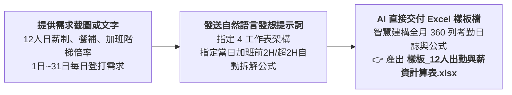

# 13-1 白話自然語言發想提示詞（一步到位產出 4 工作表薪資計算樣板）

> 💡 **核心精神**：使用者**完全不需要懂任何程式語法**，也不需要死記複雜的 Excel 函數！  
> 只要**「將會計需求截圖或文字 ＋ 白話自然語言提示詞 ➔ AI 直接產出具備 4 個連動工作表、含 1~31 日工時日誌與加班自動拆解公式的標準 Excel 樣板檔」**，一次到位完成！

---

## 🎯 核心工作流（極簡一步到位）



---

## 📋 自然語言提示詞（直接複製發送）

學員在 AI 對話視窗（ChatGPT Plus / Claude / Gemini Advanced）中，**上傳會計需求截圖（或貼上需求文字）**，並直接貼上以下這段純白話指令：

```text
你是一位精通企業薪資結構、勞基法出勤規範與微軟 Excel 自動化架構的資深會計顧問。

我手邊有一份中小企業「12 人日薪制員工」的薪資計算需求說明。我不懂複雜的程式語法，希望你能直接幫我設計並產出一份可重複使用的專業 Excel 薪資計算活頁簿：

1. 【活頁簿必須包含 4 個相互勾稽的工作表】：
   - ①「月薪資總表」：月底薪資匯總報表，包含正常薪資、餐費補貼、加班薪資、請假扣薪、遲到早退扣薪、勞保自付、健保自付、預支或其他扣款、實領薪資、勞退雇主提撥。底部自動加總 12 人合計，並保留「核准/覆核/審核/製表」主管簽章區。
   - ②「每日出勤」：1 日 ～ 30/31 日全月登打日誌（12人 × 30天 = 360 列，含凍結窗格）。會計每天看打卡單，只要輸入「正常工時」與「當日加班總時數(F欄)」，系統必須「當日自動拆分」為：
     * 【自動】加班前 2 小時（1.33倍）：公式 =IF(F5>0, MIN(F5, 2), 0)
     * 【自動】加班超過 2 小時（1.66倍）：公式 =IF(F5>2, F5-2, 0)
     會計完全不需心算！其餘請假時數、遲到早退分鐘、預支扣款由公式於月底自動 SUMIF 連動至總表。
   - ③「員工設定」：12 位員工基本參數庫，可個別設定日薪基準（預設 1,300 元/日）、正常時薪（162.5 元/時）、餐補（130 元/日）、勞健保投保級距、個人自付額與雇主提撥金額。
   - ④「使用說明」：清楚列出各工作表操作流程、勞基法加班費按日計算標準（前 2 小時 1.33 倍、超過 2 小時 1.66 倍）與維護注意事項。

2. 【計算規則與公式要求】：
   - 每日正常工時為 8 小時，正常時薪自動換算為：1,300 ÷ 8 ＝ 162.5 元。
   - 餐費補貼：每出勤工作 1 天補助 130 元。
   - 平日加班費：嚴格依勞基法按日分段計算，前 2 小時以時薪 × 1.33 計算；超過 2 小時以時薪 × 1.66 計算。
   - 請假扣薪：請假時數 × 162.5；遲到早退按分鐘數依比例折算扣除。
   - 勞退雇主提撥（6%）為法定成本，僅供成本統計，不可從員工實領薪資中扣除！
   - 「月薪資總表」必須以 SUMIF / VLOOKUP 自動從「每日出勤」與「員工設定」抓取資料，實現全自動連動。

3. 【執行方式】：
   - 常規會計欄位與合理數值請依常理自行判斷，不需要反覆向我提問。
   - 請套用專業財務配色（微軟正黑體、凍結窗格、千分位格式、深藍表頭、橘色登打區、藍色自動計算區與淡色分組底色）。
   - 請直接在對話中產出一份排版完全零跑版的 Excel 實體檔案，命名為「樣板_12人出勤與薪資計算表.xlsx」供我下載！
```

---

## 💡 為什麼需要「當日自動拆分」公式？

1. **落實勞基法按日計算原則**：  
   勞動基準法第 24 條明定延長工時係按日結算。如果到了月底才拿整月總時數拆分，算式必定違法。
2. **減輕會計 90% 心算負擔**：  
   傳統作法中，會計每天看到加班 3.5 小時，要手動在兩欄各寫 2 和 1.5，整個月登打 360 次極易疲勞出錯。有了 `=MIN(F5, 2)` 與 `=MAX(0, F5-2)`，會計只要敲入一個總數，公式自動搞定！
3. **跨表 SUMIF 精準加總**：  
   月薪資總表直接抓取每位員工全月份累積的「前2小時」與「超2小時」欄位加權，全表無縫連動！

---

## 🚀 產出成果對照

發送提示詞後，AI 會直接在對話中提供下載連結：  
👉 [**`樣板_12人出勤與薪資計算表.xlsx`**](./樣板_12人出勤與薪資計算表.xlsx)

### 4 大工作表結構解析：
* **Sheet 1【月薪資總表】**：
  * 欄位劃分：基本資料、應發項目、應扣項目、實領薪資、勞退雇主提撥(6%)。
  * 合計列：保留 `=SUM(...)` 雙底線加總算式。
  * 簽核區：核准、覆核、審核、製表。
* **Sheet 2【每日出勤】**：1日～30/31日考勤日誌（360列），內建 `IF/MIN` 當日加班前2H與超2H自動分流公式。
* **Sheet 3【員工設定】**：12 人基本工資、時薪、餐補、勞保級距/自付、健保級距/自付、勞退雇主提撥。
* **Sheet 4【使用說明】**：計算公式指南與操作 SOP。

取得該樣板檔後，即可接續進行 **[13-2 出勤統計與薪資試算審核](./13-2_AI產出之出勤統計與薪資試算審核提示詞.md)** 與 **[13-3 Python 自動套表](./13-3_樣板佔位符規範與Python自動套表提示詞.md)**！
