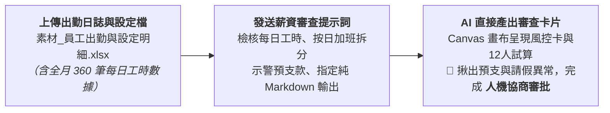

# 13-2 自然語言一步到位：出勤統計與薪資試算人機協作卡片

> 💡 **核心精神**：發放薪資是企業內控最關鍵的環節，**切忌直接丟出 Excel 盲目發放**！  
> 透過**「上傳出勤與設定明細 ＋ 自然語言審核指令 ➔ AI 在 Canvas 畫布產出 Markdown 薪資審查卡片」**，會計與主管花 30 秒快速核對「1日～31日每日加班拆分合規性」、「工時超時異常」、「大額預支扣款」與「全公司發放總額」，落實人機協作（Human-in-the-loop）內控把關！

---

## 🎯 核心工作流（極簡一步到位）



---

## 📋 自然語言審查提示詞（直接複製發送）

學員在 AI 對話視窗（ChatGPT Plus / Claude / Gemini Advanced）中，**上傳原始資料《素材_員工出勤與設定明細.xlsx》**，並直接貼上以下這段指令：

```text
你是一位精通企業薪酬制度、勞動基準法與會計審核流程的資深財務稽核專家。

這是我上傳的 2026 年 9 月份 12 位員工 1日～30日出勤日誌與設定資料「素材_員工出勤與設定明細.xlsx」。
請幫我執行第一階段的「出勤工時統計與薪資試算風控審核」：

1. 【工時彙整與薪資核算規則】：
   - 審查「每日出勤」工作表 360 列資料，確認每位員工當日加班是否已正確按日拆分為「前 2 小時（1.33倍）」與「超過 2 小時（1.66倍）」。
   - 計算各項金額：
     * 正常薪資 ＝ 出勤天數 × 1,300（或正常工時 × 162.5）
     * 餐費補貼 ＝ 出勤天數 × 130
     * 加班薪資 ＝ ROUND(SUMIF前2H × 162.5 × 1.33 ＋ SUMIF超2H × 162.5 × 1.66, 0)
     * 請假扣薪 ＝ ROUND(請假時數 × 162.5, 0)
     * 遲到早退扣薪 ＝ ROUND(遲到早退分鐘 × (162.5 / 60), 0)
     * 應扣總額 ＝ 請假扣 ＋ 遲到扣 ＋ 勞保自付 ＋ 健保自付 ＋ 預支扣款
     * 實領薪資 ＝ 應發總額 － 應扣總額
     * 雇主提撥 ＝ 勞退提繳工資 × 6%（雇主成本，不扣員工薪資）

2. 【內控風控檢核】：
   - 超時加班法規檢核：檢查是否有單日延長工時超過 4 小時之違法情事（勞基法第32條上限）。
   - 預支與大額代扣示警：若有預支或特殊代扣款項（如 NT$ 1,000 以上），標註「🚨 預支款項確認」。
   - 出勤異常提醒：標註請假超過 16 小時（2天以上）或遲到超過 30 分鐘者。
   - 平帳驗證：確認全公司應發總額、應扣總額與實領總額之算式平帳（應發 － 應扣 ＝ 實領）。

3. 【輸出格式限制（極度重要）】：
   - 請直接在 Canvas 雙欄畫布（或以純 Markdown 格式）產出審核卡片，【嚴禁產出 xlsx 檔案】，以求直觀、好閱讀且大幅節省 Token！
   - 輸出內容必須包含：
     (1) 本期薪資發放風控摘要卡（計薪週期、員工人數、全月總工時、應發總額、法定扣繳總額、實發總額、雇主提撥成本、預支筆數）
     (2) 12 位員工薪資試算核對清單（工號、姓名、出勤日、應發總額、應扣總額、實領薪資、雇主提撥、狀態標籤）
     (3) 異常出勤與預支扣款備忘清單
     (4) 審批結論與人機協作下一步指示
```

---

## 🛡️ AI 直接產出之「薪資風控審查卡片」成果（Markdown 格式）

發送上述提示詞後，AI 會在 Canvas 雙欄畫布（或對話視窗）中**直接產出**以下標準審查卡片：

### 一、本期薪資發放風控摘要卡
| 檢核項目 | 數值 / 結果 | 狀態 |
| :--- | :--- | :---: |
| 計薪週期 | 2026/09/01 ～ 2026/09/30（全月30日） | 🟢 正常 |
| 計薪人數 | 12 位（日薪制） | 🟢 名單吻合 |
| 原始打卡日誌紀錄 | 360 列 | 🟢 100% 完整登打 |
| 每日加班按日拆解 | 前2小時 134H / 超2小時 38H | 🟢 依規按日拆解 |
| 單日超時違規 (>4H) | 0 次 | 🟢 符合勞基法32條 |
| 全公司應發總額 | NT$ 391,248 | 🟢 算式正確 |
| 全公司應扣總額 | NT$ 24,960 | 🟢 包含勞健保與預支 |
| **全公司實發薪資總額** | **NT$ 366,288** | 🟢 借貸平帳（應發－應扣） |
| 全公司勞退雇主提撥成本 | NT$ 20,448 | 🟢 法定提撥 (6%) |
| 預支款項筆數 | 3 筆（共 NT$ 3,500） | 🚨 需主管確認覆核 |
| 出勤異常筆數（請假/遲到） | 4 筆 | ⚠️ 已依規扣薪 |

---

### 二、12 位員工薪資試算核對清單
| 工號 | 姓名 | 出勤日 | 正常工時 | 加班前2H | 加班超2H | 應發總額 | 應扣總額 | 實領薪資 | 雇主提撥 | 狀態標籤 |
| :---: | :---: | :---: | ---: | ---: | ---: | ---: | ---: | ---: | ---: | :---: |
| **EMP01** | 陳建宏 | 22 | 176 | 12 | 4 | 35,834 | 1,058 | **34,776** | 1,648 | 🟢 正常全勤 |
| **EMP02** | 林美玲 | 21 | 168 | 8 | 0 | 32,328 | 2,399 | **29,929** | 1,648 | ⚠️ 請假8H/遲到15分 |
| **EMP03** | 張志成 | 22 | 176 | 16 | 6 | 37,055 | 2,108 | **34,947** | 1,728 | 🚨 預支 $1,000 |
| **EMP04** | 黃國榮 | 22 | 176 | 20 | 8 | 38,768 | 1,167 | **37,601** | 1,818 | 🟢 高時數加班 |
| **EMP05** | 李雅婷 | 20 | 160 | 4 | 0 | 29,749 | 3,739 | **26,010** | 1,648 | ⚠️ 請假16H/遲到30分 |
| **EMP06** | 王俊傑 | 22 | 176 | 10 | 2 | 34,916 | 1,058 | **33,858** | 1,648 | 🟢 正常出勤 |
| **EMP07** | 吳佩芬 | 21 | 168 | 6 | 0 | 31,753 | 2,358 | **29,395** | 1,648 | ⚠️ 請假8H |
| **EMP08** | 劉家豪 | 22 | 176 | 18 | 10 | 38,668 | 3,224 | **35,444** | 1,908 | 🚨 預支 $2,000 |
| **EMP09** | 蔡佳蓉 | 22 | 176 | 14 | 2 | 36,017 | 1,085 | **34,932** | 1,648 | ⚠️ 遲到10分 |
| **EMP10** | 許博凱 | 19 | 152 | 8 | 0 | 29,468 | 5,008 | **24,460** | 1,728 | ⚠️ 請假24H |
| **EMP11** | 鄭淑芬 | 22 | 176 | 12 | 0 | 34,906 | 1,058 | **33,848** | 1,648 | 🟢 正常全勤 |
| **EMP12** | 謝宗翰 | 21 | 168 | 10 | 2 | 33,443 | 2,913 | **30,530** | 1,648 | 🚨 預支 $500/請假8H |
| **合計** | - | **256** | **2,048** | **134** | **34** | **391,248** | **24,960** | **366,288** | **20,448** | 🟢 **100% 平帳** |

---

### 三、異常出勤與預支扣款備忘清單
1. **🚨 預支代扣確認事項**：
   * **EMP03 張志成**：9/15 預支借款 NT$ 1,000（經辦已檢附借支單據）。
   * **EMP08 劉家豪**：9/10 預支借款 NT$ 2,000（經辦已檢附借支單據）。
   * **EMP12 謝宗翰**：9/15 預支借款 NT$ 500（經辦已檢附借支單據）。
2. **⚠️ 請假工時較長人員**：
   * **EMP10 許博凱**：9/8~9/10 請假 24 小時（3天），扣除請假薪資 NT$ 3,900，請確認假單是否核准。
   * **EMP05 李雅婷**：9/7~9/8 請假 16 小時（2天），扣除請假薪資 NT$ 2,600，遲到累計 30 分鐘扣薪 NT$ 81。

---

### 四、審批結論與人機協作下一步指示
* **會計審核意見**：本期 12 位員工出勤日誌已完整按日拆解加班前 2 小時與超過 2 小時，無超時違法情況，預支款項已全數歸戶扣回。
* **下一步指示**：出納與財務主管核閱確認上述數據無誤後，即可進行 **[13-3 Python 樣板自動套表](./13-3_樣板佔位符規範與Python自動套表提示詞.md)**，一鍵產出正式發放版 Excel 活頁簿！
