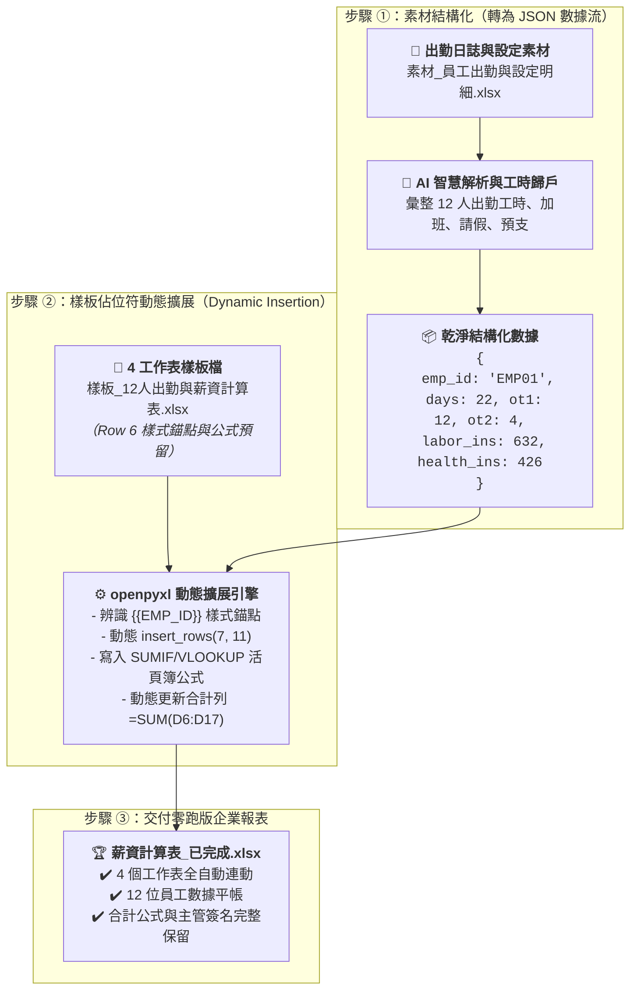

# 13-3 樣板佔位符規範與 AI 自動套表核心流程

> 🏆 **本單元核心靈魂**：**Template Placeholder（樣板佔位符）與跨表公式關聯動態擴展（Multi-Sheet Formula Expansion）**  
> 告別「每個月手動剪下貼上、公式參照全部跑掉」的脆弱試算表，邁向能隨意增減員工、每日登記即可全自動月結的企業級薪資自動化！

---

## 💡 為什麼專業的薪資自動化必須具備「Template Placeholder」觀念？

在中小企業或工廠中，會計每個月算薪水最常碰到的災難就是**「公式寫死、人一多表格就爛掉」**：
* ❌ **致命盲點 1：手動複製貼上導致公式範圍偏離**  
  若每個月手動新增或刪除員工，`SUM` 加總範圍往往漏算最後一位員工；或是在貼出勤資料時，不小心蓋掉原本設定好的勞保自付額。
* ❌ **致命盲點 2：寫死列數（Hardcoded Rows）破壞簽章區**  
  如果傳統程式寫成「合計固定在第 18 列、主管簽名在第 24 列」，當人員擴編到 20 人時，新增的資料會像推土機一樣直接壓爛合計與主管簽名欄！
* ✅ **Template Placeholder 解法（樣板驅動文件生成）**：
  1. **職責分離**：視覺版面（表頭文字、顏色主題、字型、公司抬頭、簽核欄）100% 由會計在 Excel 裡維護；AI 只認**樣式錨點（Row Template Anchor）**。
  2. **動態行擴展（Dynamic Row Expansion）**：在「月薪資總表」與「每日出勤」中設定樣式錨點，有幾位員工就動態向下推移幾列，自動繼承微軟正黑體、千分位格式（`#,##0`）與細黑框，並動態改寫 `=SUM(...)` 加總算式與簽章區！

---

## 📐 樣板佔位符設計規範（以《樣板_12人出勤與薪資計算表.xlsx》為例）

| 佔位符層次 | 標記欄位 | 說明與作用 |
| :--- | :--- | :--- |
| **純量佔位符**<br/>*(Scalar Placeholder)* | `{{PERIOD}}`<br/>`{{PAY_DATE}}` | 位於表頭或備註。全表動態字串搜尋替換，自動標註計薪月份與預定發放日。 |
| **動態樣板行錨點**<br/>*(Row Template Anchor)* | `{{EMP_ID}}`<br/>`{{EMP_NAME}}`<br/>`{{TITLE}}`<br/>`{{WORK_DAYS}}`<br/>`{{BASE_SALARY}}`<br/>`{{MEAL_ALLOWANCE}}`<br/>`{{OVERTIME_PAY}}`<br/>`{{TOTAL_PAYABLE}}`<br/>`{{LEAVE_DEDUCT}}`<br/>`{{LATE_DEDUCT}}`<br/>`{{LABOR_INS}}`<br/>`{{HEALTH_INS}}`<br/>`{{NET_SALARY}}` | 位於「月薪資總表」Row 6。該行預先設定好**千分位格式（`#,##0`）、綠色應發底色、橘色應扣底色、黃色實領底色**。AI 會提取其格式作為樣板，動態插入 N 位員工資料。 |
| **動態公式錨點**<br/>*(Dynamic Formulas)* | `=SUM(D6:D6)`<br/>`=SUMIF('每日出勤'!$B:$B, A6, ...)` | 合計列與跨表連動公式。AI 根據動態推移後的起始與結束列，自動改寫公式範圍，確保跨表查詢（`SUMIF` / `VLOOKUP`）100% 連動！ |

---

## 📋 自然語言套表提示詞（獨立執行版，傳送給 AI 執行）

學員在 AI 對話視窗（ChatGPT Plus / Claude / Gemini Advanced）中，**同時上傳《素材_員工出勤與設定明細.xlsx》與《樣板_12人出勤與薪資計算表.xlsx》**，並直接貼上以下這段指令：

```text
你是一位精通微軟 Excel 自動化與商業表單處理的專家。

我上傳了兩份檔案：
1. 原始出勤與員工設定檔：「素材_員工出勤與設定明細.xlsx」
2. 已設好佔位符的 4 工作表樣板：「樣板_12人出勤與薪資計算表.xlsx」

請幫我完成 12 位員工薪資計算表的自動套表與公式連動：
1. 讀取「素材_員工出勤與設定明細.xlsx」中的 12 位員工資料與 9 月份出勤統計。
2. 將資料填入樣板的資料佔位符（「月薪資總表」Row 6 與「每日出勤」Row 5 的樣式錨點），動態插入 12 位員工資料，千萬不能覆蓋或破壞底部的合計公式與「核准/覆核/審核/製表」主管簽章格線。
3. 表格公式請完整植入標準 Excel 連動公式：
   - 出勤天數：=SUMIF('每日出勤'!$B:$B, A6, '每日出勤'!$E:$E)/8
   - 正常薪資：=D6*1300
   - 餐費補貼：=D6*130
   - 加班薪資：=ROUND(SUMIF('每日出勤'!$B:$B, A6, '每日出勤'!$F:$F)*162.5*1.33 + SUMIF('每日出勤'!$B:$B, A6, '每日出勤'!$G:$G)*162.5*1.66, 0)
   - 應發總額：=E6+F6+G6
   - 請假扣薪：=ROUND(SUMIF('每日出勤'!$B:$B, A6, '每日出勤'!$H:$H)*162.5, 0)
   - 遲到早退扣：=ROUND(SUMIF('每日出勤'!$B:$B, A6, '每日出勤'!$I:$I)*(162.5/60), 0)
   - 勞保與健保自付：使用 VLOOKUP 自動抓取「員工設定」工作表之數值
   - 應扣總額：=I6+J6+K6+L6+M6+N6
   - 實領薪資：=H6-O6
   - 勞退雇主提撥：使用 VLOOKUP 抓取員工設定工作表（法定雇主成本，不扣員工實領）
4. 合計列請維持 SUM 自動加總公式，並完整傳承原本的字型、邊框與千分位格式。
5. 請直接執行並產出一份排版完全零跑版的 Excel 檔案「薪資計算表_已完成.xlsx」供我下載！
```

---

## 🗺️ AI 後台自動套表運作架構圖（不用懂代碼，秒懂原理！）

學生**完全不需要學習或閱讀任何一行 Python 程式碼**！AI 在背景之所以能產出排版零跑版的檔案，核心運作原理如下圖所示：



---

## 🚀 最終交付驗證清單

完成套表後，打開產出的 **[《薪資計算表_已完成.xlsx》](./薪資計算表_已完成.xlsx)**，可以進行以下 3 點內控驗證：
1. **動態公式檢驗**：點擊任一員工的「加班薪資」或「實領薪資」儲存格，查看上方公式列，確認為 `=ROUND(...)` 或 `=H6-O6` 動態公式，而非寫死之靜態數字。
2. **跨表連動檢驗**：在「每日出勤」工作表中修改某一員工的加班時數，返回「月薪資總表」，確認加班薪資與實領薪資會即時自動重新計算。
3. **版面完整度檢驗**：檢查底部的合計列雙底線、核准/覆核/審核/製表主管簽章欄位，確認完全沒有被擠壓變形或移位。
