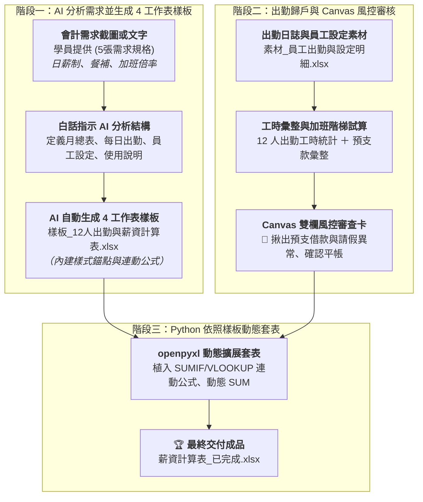

# 實戰範例：薪資計算與出勤自動化統計總表

> 🟢 **採用代理平台**：ChatGPT Agent / Claude.ai / Google Antigravity  
> 🛠️ **建議執行模式**：**雙軌人機協商**（**Canvas 雙欄畫布出勤風控審核** ➔ **Python Code Interpreter 樣板動態套表**）

---

## 📥 學員實戰素材下載專區

學生在進行本單元實作時，**只需要下載以下 1 個原始檔案**即可開始完整演練：

1. **員工出勤日誌與投保設定 Excel 檔**（必載輸入數據）：  
   👉 [**`素材_員工出勤與設定明細.xlsx`**](./素材_員工出勤與設定明細.xlsx) *(包含 12 位員工基本設定與 9 月份出勤工時數據)*

> 💡 **參考成果對照（由 AI 產生，無需下載亦可完成實作）**：  
> * [**`樣板_12人出勤與薪資計算表.xlsx`**](./樣板_12人出勤與薪資計算表.xlsx) *(由 AI 讀取會計需求後自動產出內建 4 工作表與佔位符之樣板檔)*  
> * [**`薪資計算表_已完成.xlsx`**](./薪資計算表_已完成.xlsx) *(經過 AI 雙軌審批與 Python 自動套表之最終完成活頁簿，含全自動連動公式)*  
> * [**`學員提供/`**](./學員提供/) *(學員最初提供的 5 張手機需求規格截圖，包含日薪、餐補、加班倍率與 4 工作表要求)*

---

## 🏆 最終完成作品展示（實作成果搶先看）

本專案解決中小企業、工廠與工程行會計每月 5 日發薪前最繁瑣的「日薪計算、階梯加班費換算、餐費補貼、出勤扣薪與勞健保代扣」工作，產出具備**法定勞動法規公式、動態跨表勾稽與主管審批簽章**的高水準成果：

1. **4 大工作表全自動連動**：
   * **月薪資總表**：全自動透過 `SUMIF` 與 `VLOOKUP` 匯總 12 位員工之應發、應扣、實領金額與雇主法定成本。
   * **每日出勤**：平日僅需輸入工時、加班、請假、遲到與預支款，系統自動跨表歸戶統計。
   * **員工設定**：個別維護 12 人投保級距與自付額，確保每月投保參數穩定一致。
   * **使用說明**：內建完整法規算式、操作流程與日常維護注意事項。
2. **勞動基準法階梯加班費精確計算**：
   * 正常時薪自動換算：`日薪 1,300 ÷ 8 小時 ＝ 162.5 元/小時`。
   * 加班費精確符合法定階梯倍率：前 2 小時以 **1.33 倍**（216.1 元）、超過 2 小時以 **1.66 倍**（269.8 元）分段加權計算。
3. **Template Placeholder 樣板動態擴展**：
   * 告別寫死座標（Hardcoded Coordinates），利用樣式錨點（`{{EMP_ID}}`）與動態插入列（`insert_rows`），不論員工增減至 20 人或 50 人，底部的「合計 SUM 算式」與「核准/覆核/審核/製表」簽核欄永遠整齊推移、格式 100% 不變形！

---

### 📊 完成作品外觀預覽：【月薪資總表】

*保留企業正式報表版面樣式、自動計算應發、應扣、實領金額與合計動態公式，並將簽核區域完整保留：*

| 員工編號 | 員工姓名 | 職稱 | 出勤天數 | 正常薪資 | 餐費補貼 | 加班薪資 | 應發總額 | 請假扣薪 | 遲到早退扣 | 勞保自付 | 健保自付 | 預支扣款 | 應扣總額 | 實領薪資 | 勞退雇主提撥(6%) |
| :---: | :---: | :---: | :---: | ---: | ---: | ---: | ---: | ---: | ---: | ---: | ---: | ---: | ---: | ---: | ---: |
| **EMP01** | 陳建宏 | 生產技術員 | 22 | 28,600 | 2,860 | 4,374 | **35,834** | 0 | 0 | 632 | 426 | 0 | 1,058 | <mark style="background-color: #FFF2CC;">**34,776**</mark> | 1,648 |
| **EMP02** | 林美玲 | 包裝作業員 | 21 | 27,300 | 2,730 | 2,298 | **32,328** | 1,300 | 41 | 632 | 426 | 0 | 2,399 | <mark style="background-color: #FFF2CC;">**29,929**</mark> | 1,648 |
| **EMP03** | 張志成 | 物料備料員 | 22 | 28,600 | 2,860 | 5,595 | **37,055** | 0 | 0 | 662 | 446 | **1,000** | 2,108 | <mark style="background-color: #FFF2CC;">**34,947**</mark> | 1,728 |
| **EMP04** | 黃國榮 | 機械操作員 | 22 | 28,600 | 2,860 | 7,308 | **38,768** | 0 | 0 | 697 | 470 | 0 | 1,167 | <mark style="background-color: #FFF2CC;">**37,601**</mark> | 1,818 |
| **EMP05** | 李雅婷 | 品管檢驗員 | 20 | 26,000 | 2,600 | 1,149 | **29,749** | 2,600 | 81 | 632 | 426 | 0 | 3,739 | <mark style="background-color: #FFF2CC;">**26,010**</mark> | 1,648 |
| ... | ... | ... | ... | ... | ... | ... | ... | ... | ... | ... | ... | ... | ... | ... | ... |
| **合計** | - | **12人** | **256** | **332,800** | **33,280** | **45,168** | **391,248** | **7,800** | **172** | **7,738** | **5,250** | **3,500** | **24,960** | **366,288** | **20,448** |

> 📝 **備註說明**：正常時薪以 1,300 ÷ 8 ＝ 162.5 元計；餐費補助每日 130 元；勞退雇主提撥 6% 係雇主法定成本，依法不得自員工薪資扣除。  
> ✍️ **簽核欄位**：核准：__________　覆核：__________　審核：__________　製表：__________

---

## 🎯 案例情境與三大核心職場心法

在許多製造業、營造業與中小企業中，會計每月初都面臨以下三大作業痛點：
1. **日薪與工時手動換算極易算錯**：出勤天數、餐費補助、加班前 2 小時（1.33 倍）與後續時數（1.66 倍）算法各異，傳統會計拿著計算機人工逐項核算，極易在四捨五入或公式套用時出錯。
2. **缺乏事前異常示警與借支風控**：員工若在月中預支借款（如預支 $1,000 或 $2,000），若會計未妥善登記，月底發薪經常忘記扣回，造成公司資金呆帳。
3. **表格容易被改壞**：傳統 Excel 若由多人共同維護，新增一列常常導致 SUM 公式漏算，或是把設定好的勞健保級距覆蓋損毀。

---

### 💡 職場實戰三大核心心法

#### 心法一：Template Placeholder（AI 一鍵生成 4 工作表連動樣板）
* **問題**：許多人想做跨表自動化的 Excel，但光是設計 4 個工作表的儲存格格式、色彩配色、欄寬與 `SUMIF` 公式就要耗費好幾天。
* **解法**：**直接將需求截圖與白話指令交給 AI！** AI 具備自動排版能力，能依據截圖中的規格（日薪 1,300、餐補 130、加班 1.33/1.66 倍、4 工作表），自動建構開箱即用的標準樣板檔【`樣板_12人出勤與薪資計算表.xlsx`】！

#### 心法二：雙軌人機協商（Canvas 畫布審核出勤異常 ➔ 落地產檔）
* **問題**：若直接產生薪資總表，主管難以一眼看出是否有同仁工時異常、大量遲到或有大筆預支款未平帳。
* **解法**：先透過自然語言在 **Canvas 雙欄畫布產出「薪資發放風控審查卡片」**，會計與主管花 30 秒核對「12 人發放總額」、「預支扣款名單」與「請假時數」，確認完全平帳後再發動 Python 執行套表，達成 100% 零錯帳！

#### 心法三：管理會計與法定成本分離（雇主提撥不混入實發）
* **問題**：許多初階會計容易把「勞退雇主提撥 6%」誤從員工薪水扣除，或漏算雇主人事成本。
* **解法**：在月薪資總表中獨立設置「四、雇主負擔成本」專區，公式單獨計算勞退提繳工資之 6%，既能供管理層掌握真實人力成本，又確保員工實領金額合規正確。

---

## ⚡ 核心人機協商閉環（需求截圖 ➔ AI 樣板 ➔ Canvas 畫布審核 ➔ Python 動態套表）

---

## 📖 核心章節導覽

### 1. 步驟 1：白話自然語言提示詞 ➔ AI 直接產出 4 工作表樣版檔
* 文件連結：[**`13-1_白話自然語言發想提示詞.md`**](./13-1_白話自然語言發想提示詞.md)
* 核心操作：**使用者完全不需要懂程式語法！** 只要發送一段明確的白話指令（涵蓋日薪、餐補、加班倍率與 4 工作表），AI 就會直接分析並交付標準的 [**`樣板_12人出勤與薪資計算表.xlsx`**](./樣板_12人出勤與薪資計算表.xlsx) 供直接下載。

### 2. 步驟 2：自然語言提示詞 ➔ AI 直接產出 Markdown 薪資審核卡片（人機協作）
* 文件連結：[**`13-2_AI產出之出勤統計與薪資試算審核提示詞.md`**](./13-2_AI產出之出勤統計與薪資試算審核提示詞.md)
* 核心操作：**發放薪資前先進行人機協作審核！** 上傳《素材_員工出勤與設定明細.xlsx》並發送自然語言指令，AI 直接在 Canvas 畫布產出風控卡片，秒級核對 12 人應發、應扣與實領總額，成功揪出預支與請假異常，確認 100% 平帳！

### 3. 步驟 3：自然語言提示詞 ➔ AI 自動套表交付完成檔（零代碼視覺化）
* 文件連結：[**`13-3_樣板佔位符規範與Python自動套表提示詞.md`**](./13-3_樣板佔位符規範與Python自動套表提示詞.md)
* 核心技術：**學生完全不需要學程式碼！** 透過樣式錨點（Row Template Anchor）動態向下插入列，底部的合計列公式與主管簽名欄完整保留，交付排版完全零跑版的 [**`薪資計算表_已完成.xlsx`**](./薪資計算表_已完成.xlsx)！

---

[← 返回實戰範例導覽總表](../README.md)
