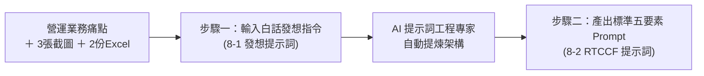

# 8-1 白話自然語言發想提示詞（最純粹的口語表達）

> 💡 **核心思維**：在飯店營運月會前夕，幕僚不需要親自手刻複雜的 Python 腳本或花整天拉樞紐分析表。直接以「總經理室營運幕僚」的白話口吻，向 AI 下達資料清洗、雙軸視覺化、商業洞察提煉與 PPT 自動排版的需求！
> 
> *註：本案例示範採用虛擬企業名稱「**星嵐大飯店（StarShore Hotel）**」進行去識別化呈現。*

---

## 🎯 階段流程圖



---

## 💬 複製即可使用之白話發想指令

```markdown
我是星嵐大飯店（StarShore Hotel）總經理室的營運分析師。每個月初我都要針對 VIP 黑卡會員（福福黑卡、波波黑卡）透過 LINE 客服的訂房成效，製作高階經營月報簡報給總經理與各館總監審核。

附件提供兩類實作素材：
1. 視覺設計參考圖（共 3 張）：
   - 《725043_0.jpg》：看板 1 參考設計（福福卡與波波卡雙欄偏好榜、TOP 3 房晚與次數）
   - 《725044_0.jpg》：看板 2 參考設計（間數與營收月度雙軸走勢圖、YoY 成長長條圖）
   - 《725045_0.jpg》：看板 3 參考設計（ADR 達成率柱狀圖、數據對照表、Key Takeaways 洞察框）
2. 營運原始數據資料（共 2 份 Excel）：
   - 《2026 黑卡透過LINE客服訂房紀錄(樞紐分析).xlsx》：包含 1~8 月共 1,163 筆真實訂房流水帳（會員別、入住館別、房晚數、間數、專案與房價）。
   - 《2026 黑卡透過LINE客服訂房每月紀錄.xlsx》：包含 2025 vs 2026 年度預算目標、月度達成率與平均房價（ADR）。

本次請幫我完成以下三項核心分析，並自動產出 16:9 品牌級 PowerPoint 簡報：

【任務一：會員與館別偏好榜（Slide 1）】
- 參考圖片《725043_0.jpg》的版面佈局（左欄福福黑卡、右欄波波黑卡）。
- 統計兩大客群在 1~8 月的總訂房次數、總房晚數、總間數，並計算最常入住館別 TOP 3（以訂房次數與房晚數排名，如台南館 TN、蘇澳館 SA、新竹湖濱館 HB）。

【任務二：量價走勢與 YoY 成長雙軸看板（Slide 2）】
- 參考圖片《725044_0.jpg》的雙軸走勢與長條對照排版。
- 統整 1~8 月每月訂房間數（RM Ns）與營業收入（REV）走勢；比較 2025 vs 2026 年 1~8 月累計表現，標示訂房間數年增率（+50.5%）與營業收入年增率（+56.7%），底部附上累計間數（1,562 間）與累計營收（890 萬元）指標卡片。

【任務三：ADR 達成率與商業洞察（Slide 3）】
- 參考圖片《725045_0.jpg》的圖表＋明細表＋決策洞察框結構。
- 計算各月份實際平均房價（ADR）相較於預算目標的達成率（整體達成率 109%）；比較 2026 vs 2025 年同期的 ADR 差異（+4.8%，+266 元），整理成完整月度比較表格。
- 【最重要的幕僚價值】：請在右下角以「重點摘要與商業洞察（Key Takeaways）」條列 4 點商業解讀（例如 5 月 ADR 成長高達 +25.1% 的專案成效，以及 3 月與 6 月負成長主要是受去年高基期影響）。

【請 AI 擔任提示詞工程專家，產出 RTCCF 標準提示詞】
我想請你扮演「AI 提示詞工程專家（Prompt Engineer）」。請依據上述的業務背景、3 張參考設計圖與 2 份 Excel 數據素材，幫我設計一份專業、嚴謹且符合《AI提示詞工程指南》之「Role + Task + Context + Constraints + Format」（RTCCF 五要素框架）的完整提示詞。

這份提示詞的目標是要讓 AI 執行以下三階段的自動化閉環：
1. 階段一：依據 3 張參考截圖逆向提取配色與版型，建立標準 16:9 品牌母片樣板（《樣板_星嵐大飯店月報母片.pptx》）。
2. 階段二：讀取兩份 Excel 數據，進行多維樞紐分析（TOP 3 偏好、雙軸走勢與 YoY、ADR 達成率），並提煉 4 點高階商業決策洞察（Key Takeaways），輸出結構化審核卡片。
3. 階段三：依據母片樣板，將數據與洞察精準注入，產出正式發布簡報（《星嵐大飯店_2026年1-8月黑卡訂房成效月報_已完成.pptx》）。

請直接產出該份標準 RTCCF 提示詞內容即可！
```

---

## 🎯 本提示詞三大職場防呆亮點

1. **以圖為本，AI 逆向建立母片樣板（解決企業缺乏 PPT 母片痛點）**：
   直接上傳 3 張參考截圖，讓 AI 多模態「眼見為憑」逆向提取配色、頁首尾與三頁版型，從無到有一鍵生成標準 16:9 母片樣板檔。
2. **多維度自動樞紐與高階商業洞察（So What?）**：
   跨表整合 1,163 筆流水帳，自動完成會員偏好排行、量價雙軸指標與 ADR 達成率，並主動條列 4 點商業決策洞察。
3. **數據與母片分離，自動動態注入**：
   母片定版後，AI 動態將真實數據注入版面，未來更換月份數據時只要重新注入，永久保證零跑版！

