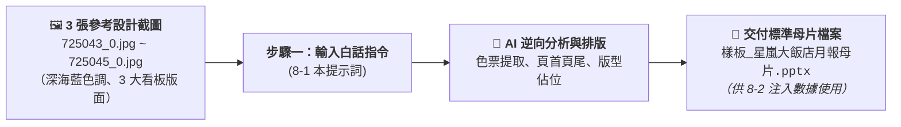

# 8-1 白話自然語言提示詞：以截圖直接生成 16:9 簡報母片樣板

> 💡 **核心精神**：學生手邊沒有現成的 PPT 母片！  
> 學員只要以最自然純粹的日常口吻，**上傳 3 張參考設計截圖（`725043_0.jpg` ~ `725045_0.jpg`）**，直接向 AI 下達指令，AI 就會逆向提煉配色與版型，**直接生成 16:9 標準簡報母片（`樣板_星嵐大飯店月報母片.pptx`）**！
> 
> *註：本案例示範採用虛擬企業名稱「**星嵐大飯店（StarShore Hotel）**」進行去識別化呈現。*

---

## 🎯 階段流程圖



---

## 💬 複製即可使用之白話發想指令

學員在 AI 對話框中，**上傳 3 張參考截圖（`725043_0.jpg`、`725044_0.jpg`、`725045_0.jpg`）**，並直接貼上以下這段白話自然語言指令：

```text
你好，我是星嵐大飯店（StarShore Hotel）總經理室的營運分析師。

我們公司每個月都要針對 VIP 黑卡會員的 LINE 訂房成效製作經營月報，但我手邊目前沒有現成的 PPT 母片樣板，只有 3 張以前月報的設計截圖。

我已經把這 3 張截圖上傳給你：
1. 725043_0.jpg：看板 1（福福卡與波波卡雙欄偏好榜、TOP 3 房晚排行）
2. 725044_0.jpg：看板 2（間數與營收月度雙軸走勢圖、YoY 成長長條圖）
3. 725045_0.jpg：看板 3（ADR 達成率柱狀圖、數據對照表、Key Takeaways 決策洞察框）

請你扮演專業的 PPT 視覺設計師與簡報架構師，幫我做一件事：
1. 參考這 3 張截圖的視覺風格，逆向提取品牌色調（深海藍、香檳金、淺灰卡片底色）。
2. 製作一個標準 16:9 比例的 PowerPoint 簡報母片樣板檔。
3. 每一頁都要有深藍質感的頂部 Header（包含星嵐大飯店 Logo 佔位、月報主副標題、Slogan "More Than A Stay"）以及底部 Footer 頁尾資訊。
4. 依據 3 張截圖的內容結構，建立 3 頁固定版型的佈局與內容佔位符：
   - 第 1 頁版型：雙欄佈局（左欄福福卡、右欄波波卡），保留指標卡片與 TOP 3 榜單佔位。
   - 第 2 頁版型：量價走勢看板，保留雙軸折線走勢、YoY 長條對比與底部累計指標卡片佔位。
   - 第 3 頁版型：ADR 達成率與商業洞察，保留月度柱狀圖、明細對照表與右下角決策洞察方框（Key Takeaways）。

請直接為我生成並提供可下載的 PowerPoint 母片樣板檔《樣板_星嵐大飯店月報母片.pptx》，謝謝！
```

---

## 🎯 執行成果

執行上述指令後，AI 會直接生成並提供標準母片樣板：
* 交付檔案：[`樣板_星嵐大飯店月報母片.pptx`](./樣板_星嵐大飯店月報母片.pptx)
* 成果亮點：具有 16:9 寬螢幕規格、深海藍尊榮色調、3 大看板版面配置，後續在步驟 8-2 即可直接呼叫此母片進行數據注入！


