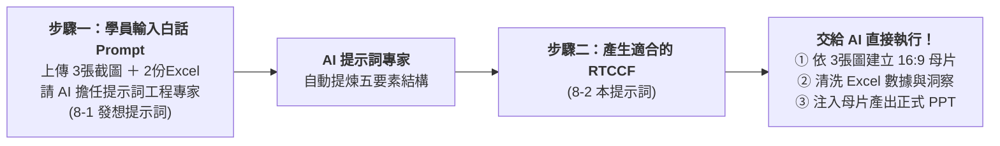

# 8-2 自然語言產出 RTCCF 提示詞：月報母片建立、數據分析與 PPT 自動化

> 💡 **核心精神**：**學生本身是不會寫 RTCCF 的！**  
> 學員完全不需要花時間手刻複雜的提示詞框架，流程的精髓是：  
> **「學生寫簡單的自然語言 Prompt ＋ 加上素材 ➔ 讓 AI 擔任提示詞專家，自動產生出適合的 RTCCF 格式 Prompt ➔ 直接交給 AI 執行，一鍵搞定母片、數據分析與正式 PPT 產檔！」**
> 
> 🟢 **適用平台**：ChatGPT（開啟 Canvas 雙欄畫布 / Work 模式）、Claude Projects、Google Antigravity。  
> 
> *註：本案例示範採用虛擬企業名稱「**星嵐大飯店（StarShore Hotel）**」進行去識別化呈現。*

---

## 🎯 兩步驟人機協作閉環



---

## 💬 步驟一：學生寫的「簡單白話自然語言 Prompt」

學員在 AI 對話框中，**上傳 2 份 Excel 原始數據（明細表與月目標表）及 3 張參考截圖（`725043_0.jpg` ~ `725045_0.jpg`）**，並直接貼上以下這段簡單直白的日常指令：

```text
你好，我是星嵐大飯店總經理室的營運幕僚。

每個月初我都要針對兩大黑卡會員透過 LINE 訂房的成效，製作經營月報給總經理與各館總監審核。
我手邊有兩類素材上傳給你：
1. 3 張以前月報的設計參考截圖（725043_0.jpg、725044_0.jpg、725045_0.jpg）
2. 2 份最新的訂房原始數據 Excel（流水帳明細表、每月預算與 ADR 比較表）

我們公司目前手邊並沒有 PPT 母片樣板。我希望未來能達到全自動化：
1. 讓 AI 先看這 3 張截圖的排版與色調，幫我建立一個標準 16:9 的簡報母片樣板檔（樣板_星嵐大飯店月報母片.pptx）。
2. 讓 AI 讀取這兩份 Excel，算好各看板需要的訂房數據，並幫我寫出高階主管最想看的 4 點商業決策洞察（Key Takeaways）。
3. 最後依據母片，把算好的數據、原生圖表跟分析文字自動填進去，產出真正的 PPT 發布檔（星嵐大飯店_2026年1-8月黑卡訂房成效月報_已完成.pptx）。

我本身不會寫複雜的提示詞框架。我想請你擔任「AI 提示詞工程專家」，請分析我上傳的 Excel 與圖片素材，幫我設計一份專業、嚴謹且符合「RTCCF（Role + Task + Context + Constraints + Format）」五要素架構的提示詞，讓 AI 能直接執行完整的自動化工作流！
```

---

## 📋 步驟二：AI 自動產出之「標準 RTCCF 格式提示詞」（直接交給 AI 執行）

發送上述白話指令後，**AI 提示詞工程專家會自動為學員提煉產出**以下這段標準的 RTCCF 提示詞。學員**直接複製下方代碼框內容，交給 AI 執行**即可：

```markdown
【Role｜角色】
你是一位擁有 15 年國際連鎖渡假酒店集團營運分析、收益管理（Revenue Management）與高階商業簡報視覺自動化架構經驗的「資深商業營運幕僚兼 PPT 自動化專家」。你精通飯店三大核心指標（Occ 住房率、ADR 平均房價、RevPAR 每間客房營收）、高資產 VIP 會員多維樞紐分析、麥肯錫風格商業圖表，以及利用 AI 沙盒環境從無到有建立 16:9 PowerPoint 簡報並自動注入數據。

【Task｜任務】
請分析上傳之 3 張視覺設計參考截圖（725043_0.jpg、725044_0.jpg、725045_0.jpg）以及 2 份營運原始數據資料（《2026 黑卡透過LINE客服訂房紀錄(樞紐分析).xlsx》與《2026 黑卡透過LINE客服訂房每月紀錄.xlsx》），為「星嵐大飯店（StarShore Hotel）」執行以下完整自動化流程：

1. 【階段一：以 3 張圖片為視覺模具，建立 16:9 品牌簡報母片樣板】
   - 深度分析 3 張參考截圖，逆向提取品牌色調（深海藍 #0B2545、香檳金 #C5A880、次級藍 #134074、卡片底色 #F5F7FA、警示珊瑚紅 #EE6C4D）。
   - 建立標準 16:9 比例的簡報母片，包含頂部深藍 Header（星嵐大飯店 Logo、主副標題、Slogan "More Than A Stay"）與底部 Footer。
   - 依照 3 張圖片佈局，建立 3 頁專用版型佔位符（雙欄指標卡片與長條圖版型、雙軸走勢與 YoY 長條圖版型、柱狀圖＋明細表＋決策洞察框版型）。
   - 產出標準 16:9 母片簡報檔案《樣板_星嵐大飯店月報母片.pptx》。

2. 【階段二：Excel 數據多維樞紐清洗與高階商業洞察】
   - 讀取 2 份 Excel 數據，精準核算三大經營看板核心指標：
     * 看板 1（會員偏好榜）：統計福福黑卡與波波黑卡之總訂房次數、房晚數、總間數，並依訂房次數與房晚數排名各館 TOP 3（台南館 TN、蘇澳四季館 SA、新竹湖濱館 HB 等）。
     * 看板 2（量價走勢看板）：統計 1-8 月每月訂房間數與營業收入走勢；計算 2025 vs 2026 累計同期成長率（間數年增 +50.5%、營收年增 +56.7%），整理累計指標卡片。
     * 看板 3（ADR 達成率分析）：計算各月份實際 ADR 相較預算目標之達成率（整體 109%）、與 2025 年同期 ADR 差異（+4.8%，+266 元），整理為完整月度對照表。
     * 商業洞察（Key Takeaways）：必須進行異動歸因分析，條列 4 點高階商業決策解讀（包含春季加價升等專案對 5 月 ADR 暴增 +25.1% 的推升效益、3 月與 6 月受去年同期企業包館高基期影響之說明）。
   - 在雙欄畫布（Canvas）中產出結構化審核卡片供核對。

3. 【階段三：依據母片注入數據，產出正式發布 PPT】
   - 自動將階段二核算之真實數據、原生可編輯圖表（折線圖、長條圖）、對照表格與商業洞察文字，精準填入階段一建立的母片樣板佔位符中。
   - 產出 16:9 比例之正式商業月報簡報《星嵐大飯店_2026年1-8月黑卡訂房成效月報_已完成.pptx》供我下載！

【Context｜背景與情境】
- 企業主體為「星嵐大飯店（StarShore Hotel）」，旗下擁有台南館（TN）、蘇澳四季館（SA）、新竹湖濱館（HB）、花蓮館（HL）、宜蘭館（YL）與苗栗館（MP）等多家頂級渡假飯店。
- 本報告旨在向董事會、總經理與各館總監彙報 LINE VIP 黑卡專屬客服渠道之營運貢獻，驗證高資產客群之品牌黏著度與定價溢價能力。

【Constraint｜限制與規則】
1. 所有金額、間數與房晚數必須 100% 與 Excel 原始流水帳勾稽，嚴禁任何數值通靈與算式錯誤。
2. 視覺呈現嚴格還原 3 張參考截圖之排版層次與品牌色票，維持 16:9 寬螢幕規格。
3. 嚴格落實「商業洞察（So What?）」精神：絕不能僅列出冰冷數字，必須對「5 月暴衝 +25.1%」以及「3 月/6 月負成長（基期因素）」給予明確的專業商業解讀。
4. 金額一律格式化為千分位整數（NT$ #,##0）或以「萬元」為單位。
5. 產出之 PPT 必須零跑版，圖表需為原生可編輯對象（Chart），保留後續微調彈性。
6. 全程使用繁體中文商務用語。

【Format｜輸出格式】
1. 產出簡報母片檔案《樣板_星嵐大飯店月報母片.pptx》供下載。
2. 在對話/雙欄畫布中輸出三大看板之結構化審核卡片與 4 點商業洞察。
3. 合成產出正式商業簡報《星嵐大飯店_2026年1-8月黑卡訂房成效月報_已完成.pptx》供下載。
```

---

## 🏆 執行成果：AI 一鍵交付的三大成品

學員將上述 RTCCF 提示詞交給 AI 後，AI 會依序在對話中直接交付以下成果：

### 成品一：依 3 張截圖建立之標準 16:9 品牌母片樣板
* 檔案名稱：[`樣板_星嵐大飯店月報母片.pptx`](./樣板_星嵐大飯店月報母片.pptx)
* 包含深海藍 Header、Logo、Slogan、Footer 與三大看板版型佔位。

### 成品二：雙欄畫布數據審核卡片（人機協商核對）
* 包含福福卡與波波卡在各館之 TOP 3 獎牌榜、1-8 月每月量價走勢、累計間數（1,562 間，+50.5%）、累計營收（890 萬元，+56.7%）、各月 ADR 達成率對照表，以及提煉出的 4 點商業決策洞察（Key Takeaways）。

### 成品三：最終正式發布之 16:9 商業簡報
* 檔案名稱：[`星嵐大飯店_2026年1-8月黑卡訂房成效月報_已完成.pptx`](./星嵐大飯店_2026年1-8月黑卡訂房成效月報_已完成.pptx)
* 具備原生可編輯圖表、精準表格與決策結論，完全零跑版！

---

[← 返回實戰範例導覽總表](../README.md)
