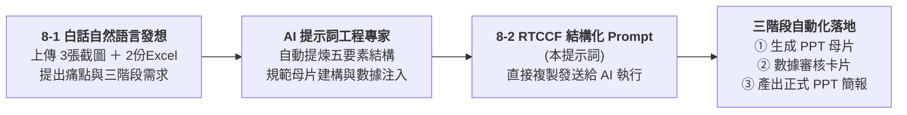

# 8-2 AI 產出之 RTCCF 營運指標與商業洞察提示詞

> 💡 **教學核心**：**打破「提示詞必須由人類痛苦手刻」的傳統思維！**  
> 學員在步驟一（8-1）中，只需使用日常白話口吻上傳素材並提出需求，AI 提示詞工程專家便會自動提煉架構出這份標準的 **五要素（Role + Task + Context + Constraints + Format）** 專業提示詞！  
> 
> 🟢 **適用平台**：ChatGPT（開啟 Canvas 雙欄畫布 / Work 模式）、Claude Projects、Google Antigravity。  
> 
> *註：本案例示範採用虛擬企業名稱「**星嵐大飯店（StarShore Hotel）**」進行去識別化呈現。*

---

## 🎯 人機協作生成鏈



---

## 📋 AI 產出之標準 RTCCF 提示詞（複製即可發送執行）

學員可直接將下方代碼區塊中的完整提示詞，連同 **3 張參考截圖（`725043_0.jpg` ~ `725045_0.jpg`）** 與 **2 份 Excel 原始數據**，發送給 AI 執行：

```markdown
【Role｜角色】
你是一位擁有 15 年國際連鎖渡假酒店集團營運分析、收益管理（Revenue Management）與高階商業簡報視覺自動化架構經驗的「資深商業營運幕僚兼 PPT 自動化專家」。你精通飯店三大核心指標（Occ 住房率、ADR 平均房價、RevPAR 每間客房營收）、高資產 VIP 會員多維樞紐分析、麥肯錫風格商業圖表，以及利用 AI 沙盒環境從無到有建立 16:9 PowerPoint 簡報並自動注入數據。

【Task｜任務】
請分析上傳之 3 張視覺設計參考截圖（725043_0.jpg、725044_0.jpg、725045_0.jpg）以及 2 份營運原始數據資料（《2026 黑卡透過LINE客服訂房紀錄(樞紐分析).xlsx》與《2026 黑卡透過LINE客服訂房每月紀錄.xlsx》），為「星嵐大飯店（StarShore Hotel）」執行以下三階段月報自動化閉環：

1. 【階段一：以 3 張圖片為視覺模具，建立 16:9 品牌簡報母片樣板】
   - 深度分析 3 張參考截圖，逆向提取品牌色調（深海藍 #0B2545、香檳金 #C5A880、次級藍 #134074、卡片底色 #F5F7FA、警示珊瑚紅 #EE6C4D）。
   - 建立標準 16:9 比例的簡報母片，包含頂部深藍 Header（星嵐大飯店 Logo、主副標題、Slogan "More Than A Stay"）與底部 Footer。
   - 依照 3 張圖片佈局，建立 3 頁專用版型佔位符（雙欄指標卡片與長條圖版型、雙軸走勢與 YoY 長條圖版型、柱狀圖＋明細表＋決策洞察框版型）。
   - 產出標準 16:9 母片簡報檔案《樣板_星嵐大飯店月報母片.pptx》。

2. 【階段二：Excel 數據多維樞紐清洗與高階商業洞察】
   - 讀取 2 份 Excel 數據，精準核算三大經營看板核心指標：
     * 看板 1（會員偏好榜）：統計福福黑卡與波波黑卡之總訂房次數、房晚數、總間數，並依訂房次數與房晚數排名各館 TOP 3（台南館 TN、蘇澳四季館 SA、新竹湖濱館 HB 等）。
     * 看板 2（量價走勢看板）：統計 1-8 月每月訂房間數與營業收入走勢；計算 2025 vs 2026 累計同期成長率（間數年增 +50.5%、營收年增 +56.7%），整理累計指標卡片。
     * 看板 3（ADR 達成率分析）：計算各月份實際 ADR 相較預算目標之達成率（整體 109%）、與 2025 年同期 ADR 差異（+4.8%，+266 元），整理為完整月度對照表。
     * 商業洞察（Key Takeaways）：必須進行異動歸因分析，條列 4 點高階商業決策解讀（包含春季加價升等專案對 5 月 ADR 暴增 +25.1% 的推升效益、3 月與 6 月受去年同期企業包館高基期影響之說明）。
   - 在雙欄畫布（Canvas）中產出結構化數據卡片（或 JSON 數據），供我進行人機協商審核（Human-in-the-loop）。

3. 【階段三：依據母片注入數據，產出正式發布 PPT】
   - 在我確認數據無誤後，自動將階段二核算之真實數據、原生可編輯圖表（折線圖、長條圖）、對照表格與商業洞察文字，精準填入階段一建立的母片樣板佔位符中。
   - 產出 16:9 比例之正式商業月報簡報《星嵐大飯店_2026年1-8月黑卡訂房成效月報_已完成.pptx》供我下載！

【Context｜背景與情境】
- 企業主體為「星嵐大飯店（StarShore Hotel）」，旗下擁有台南館（TN）、蘇澳四季館（SA）、新竹湖濱館（HB）、花蓮館（HL）、宜蘭館（YL）與苗栗館（MP）等多家頂級渡假飯店。
- 本報告旨在向董事會、總經理與各館總監彙報 LINE VIP 黑卡專屬客服渠道之營運貢獻，驗證高資產客群之品牌黏著度與定價溢價能力。

【Constraint｜限制與規則】
1. 所有金額、間數與房晚數必須 100% 與 Excel 原始流水帳勾稽，嚴禁任何數值通靈與算式錯誤。
2. 視覺呈現嚴格還原 3 張參考截圖之排版層次與品牌色票，維持 16:9 寬螢幕規格。
3. 嚴格落實「商業洞察（So What?）」精神：絕不能僅列出冰冷數字，必須對「5 月暴衝 +25.1%」以及「3 月/6 月負成長（基期因素）」給予明確的專業商業解讀。
4. 金額一律格式化為千分位整數（NT$ #,##0）或以「萬元」為單位。
5. 產出之 PPT 必須零跑版，圖表需為原生可編輯對象（Chart），保留後續微調彈性。
6. 全程使用繁體中文商務用語。

【Format｜輸出格式】
請按以下三步驟階段性交付：
1. 第一階段交付：產出簡報母片檔案《樣板_星嵐大飯店月報母片.pptx》之提供下載。
2. 第二階段交付：在對話/雙欄畫布中輸出三大看板之結構化審核卡片與 4 點商業洞察，等待我確認。
3. 第三階段交付：經我確認後，合成產出正式簡報《星嵐大飯店_2026年1-8月黑卡訂房成效月報_已完成.pptx》之提供下載。

請先依據 3 張參考截圖建立母片樣板，並輸出第二階段的結構化審核卡片！
```

---

## 💡 為什麼「自然語言發想 ➔ AI 產出 RTCCF」能大幅提效？

1. **降低提示詞撰寫門檻**：  
   學員不需要背誦生硬的提示詞框架，只要以一般白話描述痛點與素材，AI 就會自動補齊專業的 Role、Context 與防呆 Constraints。
2. **兼顧嚴謹度與靈活性**：  
   由 AI 提煉出的 RTCCF 框架，清楚定義了「以圖生母片」、「數據勾稽」與「動態注入」的三階段規範，避免 AI 在執行中遺漏關鍵細節或產生幻覺。
3. **銜接下一階段產檔**：  
   審核通過第二階段的數據卡片後，即可順暢銜接進入 [**8-3_生成星嵐月報PPT發布檔提示詞.md**](./8-3_生成星嵐月報PPT發布檔提示詞.md)，完成正式簡報之一鍵出檔！

---

[← 返回實戰範例導覽總表](../README.md)
