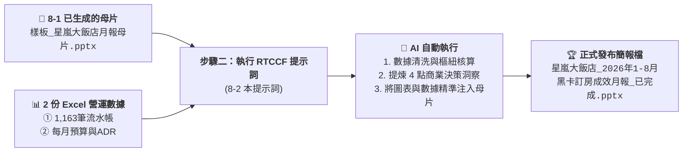

# 8-2 RTCCF 提示詞：Excel 數據清洗、商業洞察與母片注入自動化出檔

> 💡 **核心架構**：  
> 在步驟 8-1 中，學生已經透過簡單白話指令請 AI 依截圖建立了 [`樣板_星嵐大飯店月報母片.pptx`](./樣板_星嵐大飯店月報母片.pptx)！  
> 現在，學員只要**提供該母片樣板 ＋ 2 份 Excel 原始數據**，直接執行由 AI 提示詞工程專家所架構的「**RTCCF 標準提示詞**」，AI 便會自動完成多維樞紐運算、提煉 4 點商業決策洞察（Key Takeaways），並直接將數據注入母片，產出正式發布簡報！
> 
> 🟢 **適用平台**：ChatGPT（開啟 Canvas 雙欄畫布 / Work 模式）、Claude Projects、Google Antigravity。  
> 
> *註：本案例示範採用虛擬企業名稱「**星嵐大飯店（StarShore Hotel）**」進行去識別化呈現。*

---

## 🎯 階段流程圖



---

## 💬 複製即可使用之標準 RTCCF 提示詞

學員在 AI 對話框中，**上傳步驟 8-1 已生成之母片檔《樣板_星嵐大飯店月報母片.pptx》以及 2 份 Excel 數據（《2026 黑卡透過LINE客服訂房紀錄(樞紐分析).xlsx》、《2026 黑卡透過LINE客服訂房每月紀錄.xlsx》）**，並直接貼上以下這段標準 RTCCF 提示詞：

```markdown
【Role｜角色】
你是一位擁有 15 年國際連鎖渡假酒店集團營運分析、收益管理（Revenue Management）與高階商業簡報視覺自動化架構經驗的「資深商業營運幕僚兼 PPT 自動化專家」。你精通飯店三大核心指標（Occ 住房率、ADR 平均房價、RevPAR 每間客房營收）、高資產 VIP 會員多維樞紐分析、麥肯錫風格商業圖表，以及利用現成母片樣板精準注入數據與原生圖表。

【Task｜任務】
我已上傳步驟 8-1 建立好的 PowerPoint 母片樣板檔《樣板_星嵐大飯店月報母片.pptx》，以及 2 份營運原始數據資料（《2026 黑卡透過LINE客服訂房紀錄(樞紐分析).xlsx》與《2026 黑卡透過LINE客服訂房每月紀錄.xlsx》）。
請為「星嵐大飯店（StarShore Hotel）」執行數據清洗、商業洞察提煉，並依據母片樣板自動注入數據，產出正式發布檔：

1. 【第一階段：Excel 數據多維樞紐清洗與核心指標計算】
   - 讀取 2 份 Excel 數據，精準核算三大經營看板核心指標：
     * 看板 1（會員偏好榜）：統計福福黑卡與波波黑卡之總訂房次數、房晚數、總間數，並依訂房次數與房晚數排名各館 TOP 3（台南館 TN、蘇澳四季館 SA、新竹湖濱館 HB 等）。
     * 看板 2（量價走勢看板）：統計 1-8 月每月訂房間數與營業收入走勢；計算 2025 vs 2026 累計同期成長率（間數年增 +50.5%、營收年增 +56.7%），整理累計指標卡片。
     * 看板 3（ADR 達成率分析）：計算各月份實際 ADR 相較預算目標之達成率（整體 109%）、與 2025 年同期 ADR 差異（+4.8%，+266 元），整理為完整月度對照表。
   - 【提煉高階商業決策洞察（Key Takeaways）】：必須進行異動歸因分析，條列 4 點商業解讀（包含春季加價升等專案對 5 月 ADR 暴增 +25.1% 的推升效益、3 月與 6 月受去年同期企業包館高基期影響之說明）。
   - 在雙欄畫布（Canvas）中產出結構化審核卡片供我核對。

2. 【第二階段：依據母片樣板動態注入，產出正式簡報】
   - 讀取上傳之《樣板_星嵐大飯店月報母片.pptx》，識別 3 頁版型之版面佔位符。
   - 將核算之真實數據、原生可編輯圖表（折線圖、長條圖）、對照表格與商業洞察文字，精準填入對應版位中。
   - 保持 16:9 比例與品牌配色，直接輸出正式商業月報簡報《星嵐大飯店_2026年1-8月黑卡訂房成效月報_已完成.pptx》供我下載！

【Context｜背景與情境】
- 企業主體為「星嵐大飯店（StarShore Hotel）」，旗下擁有台南館（TN）、蘇澳四季館（SA）、新竹湖濱館（HB）、花蓮館（HL）、宜蘭館（YL）與苗栗館（MP）等多家頂級渡假飯店。
- 本報告旨在向董事會、總經理與各館總監彙報 LINE VIP 黑卡專屬客服渠道之營運貢獻，驗證高資產客群之品牌黏著度與定價溢價能力。

【Constraint｜限制與規則】
1. 所有金額、間數與房晚數必須 100% 與 Excel 原始流水帳勾稽，嚴禁任何數值通靈與算式錯誤。
2. 嚴格依據上傳的母片樣板進行數據與圖表注入，絕不可破壞原本的 Header、Logo 與版面比例，維持零跑版。
3. 嚴格落實「商業洞察（So What?）」精神：絕不能僅列出冰冷數字，必須對「5 月暴衝 +25.1%」以及「3 月/6 月負成長（基期因素）」給予明確的專業商業解讀。
4. 金額一律格式化為千分位整數（NT$ #,##0）或以「萬元」為單位。
5. 產出之 PPT 圖表需為原生可編輯對象（Chart），保留後續微調彈性。
6. 全程使用繁體中文商務用語。

【Format｜輸出格式】
1. 在對話/雙欄畫布中輸出三大看板之結構化數據審核卡片與 4 點商業洞察。
2. 合成產出正式商業簡報《星嵐大飯店_2026年1-8月黑卡訂房成效月報_已完成.pptx》供下載。
```

---

## 🏆 執行成果：AI 交付成品

學員將上述 RTCCF 提示詞交給 AI 後，AI 會在對話中直接交付以下成果：

### 成品一：雙欄畫布數據審核卡片（人機協商核對）
* 包含福福卡與波波卡在各館之 TOP 3 獎牌榜、1-8 月每月量價走勢、累計間數（1,562 間，+50.5%）、累計營收（890 萬元，+56.7%）、各月 ADR 達成率對照表，以及提煉出的 4 點商業決策洞察（Key Takeaways）。

### 成品二：最終正式發布之 16:9 商業簡報
* 交付檔案：[`星嵐大飯店_2026年1-8月黑卡訂房成效月報_已完成.pptx`](./星嵐大飯店_2026年1-8月黑卡訂房成效月報_已完成.pptx)
* 成果亮點：完整套用 8-1 生成之品牌母片樣板，具備原生可編輯圖表、精準數據表格與決策結論，完全零跑版！

---

[← 返回實戰範例導覽總表](../README.md)

