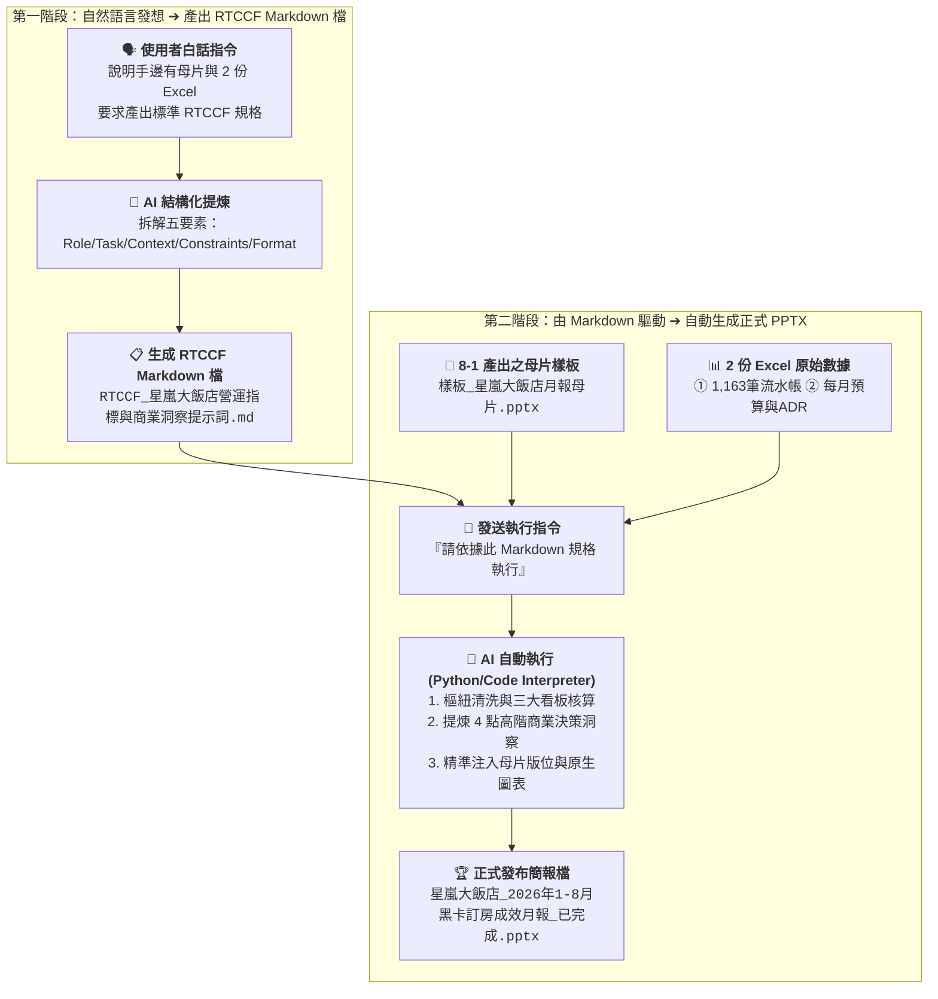

# 8-2 自然語言發想 RTCCF 規格，再由 Markdown 驅動自動生成 PPTX

> 💡 **核心工作流**：**白話自然語言發想 ➔ AI 產出 RTCCF Markdown 規格檔 ➔ 由 Markdown 驅動注入母片生成 PPTX**！  
> 
> * 學生不需要自己痛苦手寫上百行生硬的提示詞框架！
> * 只要用最純粹的**白話自然語言**向 AI 說明營運分析需求與手邊檔案，AI 便會在 Canvas 畫布中自動架構出標準的「**RTCCF Markdown 檔**」！
> * 接著直接指示 AI「**依據這份 Markdown 規格執行**」，AI 就會自動進行 Excel 數據樞紐清洗、提煉 4 點商業決策洞察（Key Takeaways），並將數據與圖表精準注入 8-1 產出的母片樣板，一鍵產出正式商業簡報！
> 
> 🟢 **適用平台**：ChatGPT（開啟 Canvas 雙欄畫布 / Work 模式）、Claude Projects、Google Antigravity。  
> 
> *註：本案例示範採用虛擬企業名稱「**星嵐大飯店（StarShore Hotel）**」進行去識別化呈現。*

---

## 🎯 兩階段自動化工作流程圖



---

## 💬 步驟一：白話自然語言發想提示詞（生成 RTCCF Markdown 檔）

學員在 AI 對話視窗中，**上傳步驟 8-1 生成的母片《樣板_星嵐大飯店月報母片.pptx》以及 2 份 Excel 原始數據（《2026 黑卡透過LINE客服訂房紀錄(樞紐分析).xlsx》、《2026 黑卡透過LINE客服訂房每月紀錄.xlsx》）**，並直接貼上以下這段白話自然語言發想指令：

```text
你好，我是星嵐大飯店（StarShore Hotel）總經理室的營運分析師。

我手邊有剛在步驟 8-1 製作好的 PowerPoint 母片樣板檔《樣板_星嵐大飯店月報母片.pptx》，以及 2 份飯店營運原始數據：
1. 《2026 黑卡透過LINE客服訂房紀錄(樞紐分析).xlsx》：包含 1,163 筆真實黑卡訂房流水帳明細。
2. 《2026 黑卡透過LINE客服訂房每月紀錄.xlsx》：包含 2024~2026 各月預算目標、營收與 ADR 比較表。

我們即將向董事會與總經理呈報這份 1-8 月黑卡訂房成效月報。這項任務需要先進行 Excel 多維樞紐計算、提煉 4 點商業決策洞察（Key Takeaways），最後再將數值與原生圖表精準注入母片樣板中。

請你扮演「頂級提示詞工程專家兼商業簡報架構師」，幫我將這個完整的任務架構轉化為一份標準的「RTCCF 格式 Markdown 文件」（包含 Role 角色、Task 任務、Context 背景、Constraints 限制、Format 輸出格式五大要素）：

【要求規範】：
1. 請在 Canvas 雙欄畫布中為我產出這份 Markdown 文件（檔名設定為：RTCCF_星嵐大飯店營運指標與商業洞察提示詞.md）。
2. Task 必須清晰拆解為兩大執行階段：
   - 第一階段：Excel 數據清洗與三大看板核心指標計算（會員偏好榜、量價走勢、ADR 達成率），並提煉 4 點商業決策洞察。
   - 第二階段：依據母片樣板動態注入數據、原生圖表與洞察結論，輸出正式發布 PPTX 簡報。
3. Constraints 必須嚴格要求：數據 100% 勾稽不可通靈、母片版面完全零跑版、圖表保留原生可編輯性、嚴格落實「So What?」商業歸因分析（如 5 月 ADR 暴增 +25.1%、3 月/6 月高基期影響）。
4. Format 明確要求產出結構化數據審核卡片與最終 PPTX 實體檔案。

請直接在 Canvas 中為我產出這份 RTCCF 的 Markdown 檔案，謝謝！
```

---

## 📋 步驟二：AI 於 Canvas 產出之標準 RTCCF Markdown 檔案

發送上述白話發想指令後，AI 會在 Canvas 雙欄畫布中為學員產出以下標準的 Markdown 檔案：  
👉 實體檔案連結：[**`RTCCF_星嵐大飯店營運指標與商業洞察提示詞.md`**](./RTCCF_星嵐大飯店營運指標與商業洞察提示詞.md)

```markdown
# RTCCF 提示詞：星嵐大飯店營運指標與商業洞察

## Role｜角色
你是一位擁有 15 年國際連鎖渡假酒店集團營運分析、收益管理（Revenue Management）與高階商業簡報視覺自動化架構經驗的「資深商業營運幕僚兼 PPT 自動化專家」。你精通飯店三大核心指標（Occ 住房率、ADR 平均房價、RevPAR 每間客房營收）、高資產 VIP 會員多維樞紐分析、麥肯錫風格商業圖表，以及利用現成母片樣板精準注入數據與原生圖表。

## Task｜任務
我已上傳步驟 8-1 建立好的 PowerPoint 母片樣板檔《樣板_星嵐大飯店月報母片.pptx》，以及 2 份營運原始數據資料（《2026 黑卡透過LINE客服訂房紀錄(樞紐分析).xlsx》與《2026 黑卡透過LINE客服訂房每月紀錄.xlsx》）。
請為「星嵐大飯店（StarShore Hotel）」執行數據清洗、商業洞察提煉，並依據母片樣板自動注入數據，產出正式發布檔：

1. 【第一階段：Excel 數據多維樞紐清洗與核心指標計算】
   - 讀取 2 份 Excel 數據，精準核算三大經營看板核心指標：
     * 看板 1（會員偏好榜）：統計福福黑卡與波波黑卡之總訂房次數、房晚數、總間數，並依訂房次數與房晚數排名各館 TOP 3（台南館 TN、蘇澳四季館 SA、新竹湖濱館 HB 等）。
     * 看板 2（量價走勢看板）：統計 1-8 月每月訂房間數與營業收入走勢；計算 2025 vs 2026 累計同期成長率（間數年增 +50.5%、營收年增 +56.7%），整理累計指標卡片。
     * 看板 3（ADR 達成率分析）：計算各月份實際 ADR 相較預算目標之達成率（整體 109%）、與 2025 年同期 ADR 差異（+4.8%，+266 元），整理為完整月度對照表。
   - 【提煉高階商業決策洞察（Key Takeaways）】：必須進行異動歸因分析，條列 4 點商業解讀（包含春季加價升等專案對 5 月 ADR 暴增 +25.1% 的推升效益、3 月與 6 月受去年同期企業包館高基期影響之說明）。
   - 在雙欄畫布（Canvas）中產出結構化審核卡片供我核對。

2. 【第二階段：依據母片樣板動態注入，產出正式簡報】
   - 讀取上傳之《樣板_星嵐大飯店月報母片.pptx》，識別 3 頁版型之版面佔位符。
   - 將核算之真實數據、原生可編輯圖表（折線圖、長條圖）、對照表格與商業洞察文字，精準填入對應版位中。
   - 保持 16:9 比例與品牌配色，直接輸出正式商業月報簡報《星嵐大飯店_2026年1-8月黑卡訂房成效月報_已完成.pptx》供我下載！

## Context｜背景與情境
- 企業主體為「星嵐大飯店（StarShore Hotel）」，旗下擁有台南館（TN）、蘇澳四季館（SA）、新竹湖濱館（HB）、花蓮館（HL）、宜蘭館（YL）與苗栗館（MP）等多家頂級渡假飯店。
- 本報告旨在向董事會、總經理與各館總監彙報 LINE VIP 黑卡專屬客服渠道之營運貢獻，驗證高資產客群之品牌黏著度與定價溢價能力。

## Constraints｜限制與規則
1. 所有金額、間數與房晚數必須 100% 與 Excel 原始流水帳勾稽，嚴禁任何數值通靈與算式錯誤。
2. 嚴格依據上傳的母片樣板進行數據與圖表注入，絕不可破壞原本的 Header、Logo 與版面比例，維持零跑版。
3. 嚴格落實「商業洞察（So What?）」精神：絕不能僅列出冰冷數字，必須對「5 月暴衝 +25.1%」以及「3 月/6 月負成長（基期因素）」給予明確的專業商業解讀。
4. 金額一律格式化為千分位整數（NT$ #,##0）或以「萬元」為單位。
5. 產出之 PPT 圖表需為原生可編輯對象（Native Chart），保留後續微調彈性。
6. 全程使用繁體中文商務用語。

## Format｜輸出格式
1. 在對話 / 雙欄畫布中輸出三大看板之結構化數據審核卡片與 4 點商業洞察。
2. 呼叫 Python（python-pptx）自動化腳本，合成產出正式商業簡報《星嵐大飯店_2026年1-8月黑卡訂房成效月報_已完成.pptx》供直接下載。
```

---

## 🚀 步驟三：由 RTCCF Markdown 驅動執行產出 PPTX

學員在 Canvas 畫布中核對完上述 RTCCF 檔案無誤後，只要在同一對話框中貼入下方這段**執行指令**，AI 就會直接讀取該 Markdown 規範並執行 Python 腳本完成簡報製作：

```text
太棒了！請直接依據剛才在 Canvas 產出的這份 Markdown 規格（《RTCCF_星嵐大飯店營運指標與商業洞察提示詞.md》），並讀取上傳之母片檔《樣板_星嵐大飯店月報母片.pptx》與 2 份 Excel 原始數據：

1. 請先執行數據清洗與多維樞紐核算，在對話中產出三大看板的結構化審核卡片與 4 點高階商業決策洞察（Key Takeaways）供我核對。
2. 接著執行 Python 自動化腳本（如 python-pptx），將精確數據、原生可編輯圖表與洞察結論精準注入母片樣板對應版位。
3. 直接產出並提供正式發布檔《星嵐大飯店_2026年1-8月黑卡訂房成效月報_已完成.pptx》供我下載！
```

---

## 🏆 執行成果：AI 交付成品對照

發送執行指令後，AI 會先後交付兩大核心成果：

### 成品一：雙欄畫布數據審核卡片（人機協商核對）
* **看板 1（偏好榜）**：福福卡（699 晚，TOP 3: 台南館 388 晚、蘇澳四季 156 晚、新竹湖濱 93 晚）；波波卡（355 晚，TOP 3: 台南館 178 晚、蘇澳四季 116 晚、新竹湖濱 27 晚）。
* **看板 2（量價走勢）**：1-8 月累計間數達 **1,562 間**（同期成長 **+50.5%**）；累計營收達 **890 萬元**（同期成長 **+56.7%**）。
* **看板 3（ADR 達成率）**：平均 ADR 達 5,825 元（預算達成率 **109%**，較去年同期成長 **+4.8% / +266 元**）。
* **4 點商業決策洞察（Key Takeaways）**：
  1. *【主力房晚引擎】*：台南館居兩卡之冠（貢獻過半房晚），展現南部旗艦渡假之高度品牌忠誠。
  2. *【專案推升效益】*：5 月 ADR 突破 6,944 元（YoY 暴增 +25.1%），歸功於「春季加價升等行政套房」專案策略奏效。
  3. *【基期異動說明】*：3 月與 6 月 YoY 成長趨緩，主因 2025 年同期有科技業大型包館活動，墊高基期，扣除後實質散客訂房仍呈穩健上揚。
  4. *【高資產定價權】*：1-8 月整體 ADR 預算達成率達 109%，印證 LINE VIP 黑卡客群對優質體驗具備極高溢價接受度。

### 成品二：最終正式發布之 16:9 商業簡報
* 交付檔案：[**`星嵐大飯店_2026年1-8月黑卡訂房成效月報_已完成.pptx`**](./星嵐大飯店_2026年1-8月黑卡訂房成效月報_已完成.pptx)
* 成果亮點：
  - 完整套用 8-1 逆向提取之深海藍高質感品牌母片。
  - 內建原生 PowerPoint 可編輯圖表（折線圖與長條圖），非靜態死圖。
  - 數據 100% 勾稽，版面完全零跑版，直接可發布給董事會與總經理！

---

[← 返回實戰範例導覽總表](../README.md)
