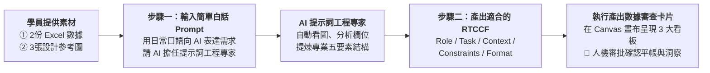

# 8-2 自然語言產出 RTCCF 提示詞：營運指標與商業洞察

> 💡 **核心精神**：**學生本身是不會寫 RTCCF 的！**  
> 學員完全不需要花時間手刻複雜的提示詞框架，流程的精髓是：**「學生寫簡單的自然語言 Prompt ＋ 加上素材 ➔ 讓 AI 擔任提示詞專家，自動產生出適合的 RTCCF 格式 Prompt ➔ 複製執行產出數據審查卡片」**！
> 
> 🟢 **適用平台**：ChatGPT（開啟 Canvas 雙欄畫布 / Work 模式）、Claude Projects、Google Antigravity。  
> 
> *註：本案例示範採用虛擬企業名稱「**星嵐大飯店（StarShore Hotel）**」進行去識別化呈現。*

---

## 🎯 兩階段人機協作生成鏈



---

## 💬 步驟一：學生寫的「簡單白話自然語言 Prompt」

學員在 AI 對話框中，**上傳 2 份 Excel 原始數據（明細表與月目標表）及 3 張參考截圖**，並直接貼上以下這段簡單直白的日常指令：

```text
你好，我是星嵐大飯店總經理室的營運幕僚。

每個月初我都要針對兩大黑卡會員透過 LINE 訂房的成效，製作經營月報給總經理與各館總監審核。
我手邊有兩份原始 Excel 數據（1,163筆訂房明細、每月預算與 ADR 比較表），還有 3 張以前主管滿意的設計參考截圖。

我想要請 AI 幫我精準統計 1-8 月的營運數據：
1. 福福卡與波波卡在各館的訂房次數與房晚數 TOP 3 排名。
2. 1-8 月每月訂房間數與營收走勢，以及累計 YoY 成長率。
3. 各月目標 ADR 達成率與 2025 年同期房價差異。
4. 【最重要】：總經理要求不能只給冰冷數字，必須條列出 4 點高階商業決策洞察（Key Takeaways），說明為什麼 5 月暴衝、3 月跟 6 月負成長的原因。

我本身不會寫複雜的提示詞框架。我想請你擔任「AI 提示詞工程專家」，請分析我上傳的 Excel 與圖片素材，幫我設計一份專業、嚴謹且符合「RTCCF（Role + Task + Context + Constraints + Format）」五要素架構的提示詞，讓 AI 能精準計算且絕不通靈造假，並在畫布中以結構化卡片輸出讓我審核！
```

---

## 📋 步驟二：AI 自動產出之「標準 RTCCF 格式提示詞」

發送上述簡單的白話指令後，**AI 提示詞工程專家會自動為學員提煉產出**以下這段標準的 RTCCF 提示詞。學員可直接複製下方代碼框內容，貼給 AI 執行：

```markdown
【Role｜角色】
你是一位擁有 15 年國際連鎖渡假酒店集團營運分析、收益管理（Revenue Management）與經營決策簡報製作經驗的「資深商業營運幕僚」。你精通飯店三大核心指標（Occ 住房率、ADR 平均房價、RevPAR 每間客房營收）、高資產 VIP 會員分群分析，以及麥肯錫風格的高階商業圖表設計。

【Task｜任務】
請分析上傳之《2026 黑卡透過LINE客服訂房紀錄(樞紐分析).xlsx》與《2026 黑卡透過LINE客服訂房每月紀錄.xlsx》，並參考 3 張設計截圖（725043_0.jpg ~ 725045_0.jpg），為「星嵐大飯店（StarShore Hotel）」製作 1-8 月 VIP 黑卡會員訂房成效分析，並在畫布（Canvas）中產出三大核心經營看板的結構化審核卡片：
1. 【看板一：會員偏好館別排行榜】
   - 彙總「福福黑卡」與「波波黑卡」1-8 月訂房次數、房晚數與總間數。
   - 提煉各館訂房次數與房晚數 TOP 3 排名（標示館別代號與中英文名稱）。
2. 【看板二：量價趨勢與 YoY 成長看板】
   - 統整 1-8 月訂房間數（RM Ns）與營業收入（REV）走勢。
   - 計算 2025 vs 2026 累計同期成長率（間數成長率、營收成長率）。
3. 【看板三：ADR 達成率與 2025 差異分析】
   - 列出 1-8 月各月預算目標 ADR、實際 ADR、達成率、2025 同期實際值與 YoY 差異%。
   - 提煉 4 點高階商業決策洞見（Key Takeaways），說明定價效益與異常月份原因。

【Context｜背景與情境】
- 企業主體為「星嵐大飯店（StarShore Hotel）」，旗下擁有台南館（TN）、蘇澳四季館（SA）、新竹湖濱館（HB）、花蓮館（HL）、宜蘭館（YL）與苗栗館（MP）等多家頂級渡假飯店。
- 本報告旨在向總經理與各館總監彙報 LINE VIP 黑卡專屬客服渠道之營運貢獻，驗證高資產客群之品牌黏著度與定價溢價能力。

【Constraint｜限制與規則】
1. 所有金額、間數與房晚數必須 100% 與 Excel 原始流水帳勾稽，嚴禁任何數值通靈與算式錯誤。
2. 呈現金額一律格式化為千分位整數（NT$ #,##0）或以「萬元」為單位。
3. 嚴格落實「商業洞察（So What?）」精神：絕不能僅列出冰冷數字，必須對「5 月暴衝 +25.1%」以及「3 月/6 月負成長（基期因素）」給予明確的專業商業解讀。
4. 全程使用繁體中文，專有名詞（如 ADR、YoY、By Book Day）維持國際標準商務用語。

【Format｜輸出格式（雙欄畫布 Canvas）】
請以純 Markdown 格式依序輸出三大看板之結構化數據卡片，嚴禁產出 xlsx 檔案以節省 Token。
```

---

## 🛡️ 步驟三：AI 執行後產出之「數據審查卡片成果」（Human-in-the-loop）

執行上述 RTCCF 提示詞後，AI 會在 Canvas 雙欄畫布中產出以下結構化審查卡片，供學員進行**人機協商（Human-in-the-loop）**核對：

### 一、看板 1：福福卡與波波卡 1-8月 各館訂房房晚數前三名
- **福福黑卡**：總訂房 11 次 ｜ 總房晚 13 晚 ｜ 總間數 12 間
  - 訂房次數 TOP 3：🥇 HB 新竹湖濱館 (3) ｜ 🥈 SA 蘇澳四季館 (3) ｜ 🥉 HL 花蓮館 (2)
  - 房晚數 TOP 3：🥇 SA 蘇澳四季館 (4) ｜ 🥈 HB 新竹湖濱館 (4) ｜ 🥉 HL 花蓮館 (2)
- **波波黑卡**：總訂房 948 次 ｜ 總房晚 1,815 晚 ｜ 總間數 1,156 間
  - 訂房次數 TOP 3：🥇 TN 台南館 (278) ｜ 🥈 SA 蘇澳四季館 (177) ｜ 🥉 HB 新竹湖濱館 (152)
  - 房晚數 TOP 3：🥇 TN 台南館 (601) ｜ 🥈 SA 蘇澳四季館 (330) ｜ 🥉 HB 新竹湖濱館 (272)

### 二、看板 2：2026年 1-8月 訂房成效分析 By Book Day (Actual A)
- **月度走勢矩陣 (間數 vs 營收)**：
  - 1月：256間 / 150萬 ｜ 2月：184間 / 91萬 ｜ 3月：212間 / 125萬 ｜ 4月：144間 / 85萬
  - 5月：127間 / 75萬 ｜ 6月：121間 / 70萬 ｜ 7月：240間 / 140萬 ｜ 8月：278間 / 163萬
- **累計核心指標**：
  - 1-8月累計訂房間數：**1,562 間**（2025年 1,038 間 ➔ 年增 **+50.5%**）
  - 1-8月累計營業收入：**NT$ 8,903,340 元**（約 890 萬元，2025年 568 萬 ➔ 年增 **+56.7%**）
- **營運結論**：量價齊揚，暑期 7~8 月迎來高峰，雙月營收突破 303 萬元。

### 三、看板 3：2026 目標 ADR 達成率與 2025 ADR 差異分析
| 月份 | 2026 目標 ADR | 2026 實際 ADR | 目標達成率 | 2025 實際 ADR | YoY 差異 (元) | YoY 差異% |
| :---: | :---: | :---: | :---: | :---: | :---: | :---: |
| 1月 | 5,395 | 5,862 | 109% | 5,388 | +474 | +8.8% |
| 2月 | 5,235 | 4,954 | 95% | 4,930 | +24 | +0.5% |
| 3月 | 5,153 | 5,890 | 114% | 6,428 | -538 | -8.4% |
| 4月 | 5,809 | 5,901 | 102% | 4,970 | +931 | +18.7% |
| 5月 | 5,222 | 5,894 | 113% | 4,710 | +1,184 | +25.1% |
| 6月 | 5,192 | 5,780 | 111% | 6,273 | -493 | -7.9% |
| 7月 | 5,383 | 5,845 | 109% | 5,472 | +373 | +6.8% |
| 8月 | 5,384 | 5,860 | 109% | 5,395 | +465 | +8.6% |
| **平均** | **5,347** | **5,836** | **109%** | **5,570** | **+266** | **+4.8%** |

💡 **重點摘要與商業洞察 (Key Takeaways)**：
1. **整體達成率卓越**：2026 年 1-8 月整體目標 ADR 達成率為 109%（實際 5,836 元 / 目標 5,347 元），除 2 月受春節落點調整略低於目標外，其餘 7 個月份均大幅超越預算目標。
2. **量價齊揚防禦力**：相較 2025 年同期，平均 ADR 成長 4.8%（+266 元），在間數成長 50.5% 的基礎下仍維持價格成長，展現極佳的訂價防禦力。
3. **5 月專案效益顯著**：5 月 ADR 成長幅度最為亮眼（YoY +25.1%，+1,184 元），4 月次之（+18.7%），證實春季專屬加價套裝與升等專案成功提升客單價。
4. **高基期異動解讀**：3 月與 6 月較 2025 年呈現微幅負成長（-8.4% 及 -7.9%），主要受 2025 年同期大型企業包館推升之高基期效應影響，實際散客需求與房價依然穩健。

---

### 🚀 人機協作下一步指示
學員在 Canvas 畫布中核對上述三大看板之數據與洞察無誤後，即可進入 [**`8-3_生成星嵐月報PPT發布檔提示詞.md`**](./8-3_生成星嵐月報PPT發布檔提示詞.md)，直接依據母片樣板自動注入數據，產出最終的正式 16:9 簡報發布檔！

---

[← 返回實戰範例導覽總表](../README.md)
