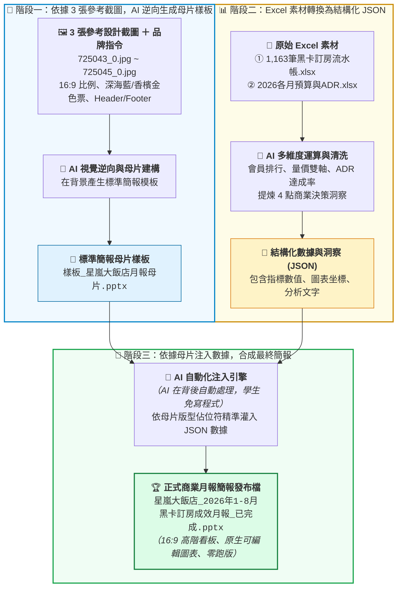

# 8-3 生成星嵐月報 PPT 發布檔提示詞

> 🏆 **本單元核心思維**：**從無到有「AI 建立品牌母片 ➔ 注入結構化數據 ➔ 一鍵生成正式簡報」**  
> 解決企業「手邊沒有標準 PPT 母片、每月初手動截圖貼投影片」的混亂與低效，由 AI 全程自動化完成！
> 
> *註：本案例示範採用虛擬企業名稱「**星嵐大飯店（StarShore Hotel）**」進行去識別化呈現。*

---

## 🏗️ 核心架構：AI 母片生成與動態數據注入工作流

學生**不需要學習或手寫任何 Python 程式碼**！在現代 AI 的進階分析環境中，AI 會在背後自動完成程式撰寫、母片生成與數據注入，底層運作邏輯如下圖所示：



---

## 💬 學生實戰指令：讓 AI 自動生成母片並注入數據

學生只需在 ChatGPT Plus / Claude / Google Antigravity 對話框中，**同時上傳 3 張參考截圖（725043_0.jpg ~ 725045_0.jpg）與兩份 Excel 素材**，並發送以下提示詞，AI 便會在背後自動調用工具完成母片建構與數據合成：

```markdown
我是星嵐大飯店總經理室的營運幕僚。我目前手邊只有 3 張參考設計截圖（725043_0.jpg、725044_0.jpg、725045_0.jpg）與兩份原始 Excel 數據，公司尚未提供統一的 PPT 母片樣板。

請幫我執行完整的自動化月報流程：

【步驟一：請依據 3 張參考截圖建立標準 16:9 品牌母片樣板】
1. 深度分析 3 張參考截圖的排版與色調，套用星嵐大飯店品牌色系：
   - 主色深海藍：#0B2545
   - 強調色香檳金：#C5A880
   - 次級藍：#134074
   - 警示紅：#EE6C4D
   - 背景淺灰：#F5F7FA
2. 建立全域統一的頁首（Header）橫幅與頁尾（Footer）：
   - Header 左側標註「STARSHORE HOTEL 星嵐大飯店」，右側標註「More Than A Stay」
   - Footer 標註「STARSHORE HOTEL 星嵐大飯店 | 美好，從星嵐開始」
3. 依照 3 張圖片分別建立專屬版型佔位（雙欄卡片版型、雙軸趨勢版型、表格與決策洞察版型）。
👉 先行生成簡報母片檔案《樣板_星嵐大飯店月報母片.pptx》。

【步驟二：讀取 Excel 數據並結構化提取】
讀取上傳之《2026 黑卡透過LINE客服訂房紀錄(樞紐分析).xlsx》與《2026 黑卡透過LINE客服訂房每月紀錄.xlsx》：
1. 統計 1-8 月福福黑卡與波波黑卡之總次數、房晚、間數及各館 TOP 3。
2. 統計 1-8 月每月訂房間數與營收走勢，以及累計 YoY 成長率。
3. 統計 1-8 月各月 ADR 預算達成率、與 2025 年同期差異，並提煉 4 點商業決策洞察（Key Takeaways）。
👉 將以上指標在對話中以結構化卡片（或 JSON 結構）呈現讓我審查確認。

【步驟三：依據母片注入數據，產出最終正式簡報】
確認數據無誤後，請依據步驟一生成的母片樣板，自動將步驟二的真實數據、原生可編輯圖表（折線圖、長條圖）、數據對照表與商業洞察文字填入對應版面。
👉 產出正式商業簡報《星嵐大飯店_2026年1-8月黑卡訂房成效月報_已完成.pptx》供我下載！
```

---

## 🎯 為什麼「AI 先做母片 ➔ 再灌數據」是職場最高境界？

1. **從 0 到 1 建立企業規範**：  
   許多企業或部門一開始根本沒有標準 PPT 母片。透過 AI 自動生成母片，能為整個團隊瞬間建立統一的品牌視覺標準（CI/VI）。
2. **視覺與數據完全解耦**：  
   母片負責「骨架與外觀（配色、字型、頁首尾）」，JSON 數據負責「內容與真實數值」。未來下個月有新數據時，只要重複注入相同母片，永遠保證零跑版！
3. **學生免學複雜程式碼**：  
   學生不需理解 `python-pptx` 的 API 細節或坐標幾吋幾公分，用自然語言就能指揮 AI 完成底層所有的合成工作！

---

[← 返回實戰範例導覽總表](../README.md)
