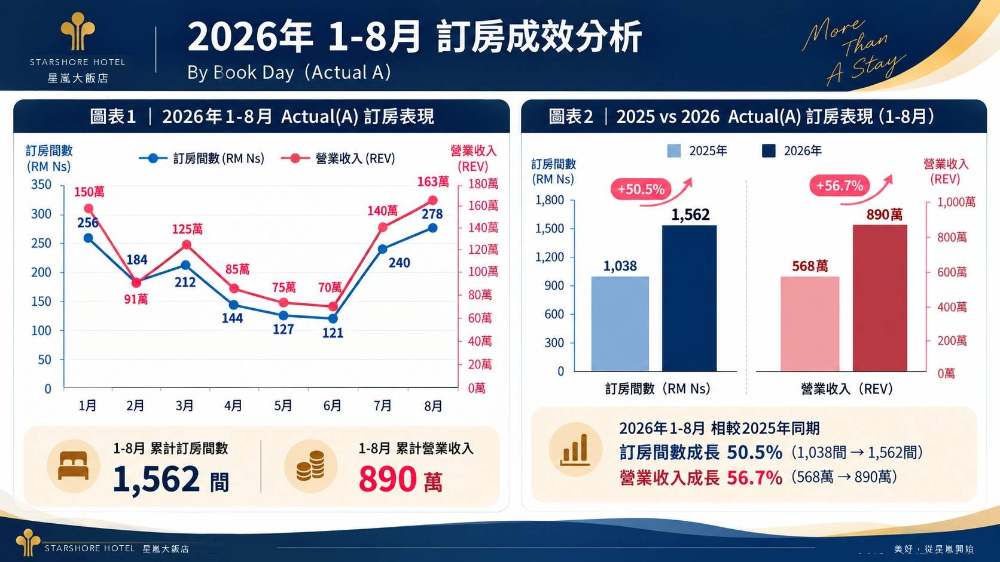
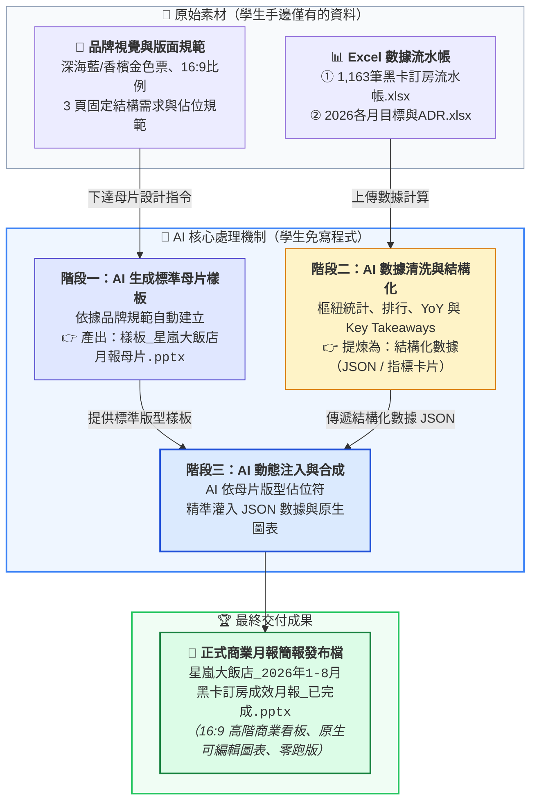

# 實戰範例：飯店訂房營運月報統計與 PPT 自動化簡報

> [!NOTE]
> 🛡️ **去識別化與隱私保護聲明**：  
> 本實戰案例之原始數據源自國內知名連鎖渡假酒店之真實營運月報素材。為保護商業機密與顧客隱私，本教學之說明文件、提示詞指令範本及最終產出的簡報檔案，均統一採用虛擬企業名稱「**星嵐大飯店（StarShore Hotel）**」進行去識別化示範，完整保留數據結構與高階分析決策之實戰精髓！

> 🟢 **採用代理平台**：ChatGPT Agent / Claude.ai / Google Antigravity  
> 🛠️ **建議執行模式**：**雙軌人機協商**（**Canvas 雙欄樞紐統計與商業洞察提煉** ➔ **Python-pptx 16:9 自動排版出檔**）

---

## 📥 專案檔案下載快速導覽（實作素材 vs AI 生成母片 vs 完成成果）

> 💡 **學習情境**：在真實職場中，學生手邊往往只有業務系統匯出的原始 Excel 數據，**公司根本沒有提供現成的 PPT 母片**！本專案將引導學生透過 AI 完成「**從無到有建立母片 ➔ 數據清洗與洞察 ➔ 依母片注入數據產檔**」的完整閉環。
>
> * 📦 **【實作起點】練習必備原始素材（請下載這 2 個 Excel 檔案開始實作）**：  
>   1. 👉 [**`2026 黑卡透過LINE客服訂房紀錄(樞紐分析).xlsx`**](./素材/2026%20黑卡透過LINE客服訂房紀錄(樞紐分析).xlsx) *(包含 1,163 筆真實訂房明細、會員別、房晚、間數與各館統計)*  
>   2. 👉 [**`2026 黑卡透過LINE客服訂房每月紀錄.xlsx`**](./素材/2026%20黑卡透過LINE客服訂房每月紀錄.xlsx) *(包含 2024~2026 各月預算目標、營收達成率與 ADR 比較表)*  
>   *(視覺參考圖片請參考 [素材/](./素材/) 資料夾中之參考截圖)*
>
> * 📐 **【中繼產物】由 AI 自動生成之品牌簡報母片樣板**：  
>   👉 [**`樣板_星嵐大飯店月報母片.pptx`**](./樣板_星嵐大飯店月報母片.pptx) *(AI 依據品牌規範指令自動建立之標準 16:9 母片樣板，含 Header、Footer、Logo 與三頁專屬版型)*
>
> * 🏆 **【對照標準答案】最終完成發布檔**：  
>   👉 [**`星嵐大飯店_2026年1-8月黑卡訂房成效月報_已完成.pptx`**](./星嵐大飯店_2026年1-8月黑卡訂房成效月報_已完成.pptx) *(AI 依據母片樣板自動注入真實數據與高階商業洞察後合成之正式 16:9 商業月報簡報)*

---

## 🏆 最終完成作品展示（實作成果搶先看）

本專案解決大型渡假飯店、連鎖餐飲或零售集團每個月初最耗時的「**百萬流水帳人工拉樞紐、圖表手動截圖貼 PPT、缺乏高階商業決策洞察**」等職場大痛點，產出具備**品牌標準色系、量價雙軸圖表、自動樞紐排名與商業洞察（Key Takeaways）**的經營層簡報：

---

### 📊 簡報三大商業看板成果展示

#### 看板 1：【福福卡與波波卡 1-8月 各館訂房房晚數前三名】
*雙欄並列兩大頂級會員客群，直觀呈現訂房次數與房晚數的 TOP 3 獎牌榜：*

#### 看板 2：【2026年 1-8月 訂房成效分析 By Book Day】
*左側為間數與營收之雙軸走勢圖（捕捉 2 月淡季與 7~8 月暑假高峰）；右側為 YoY 成長長條圖（間數 +50.5%，營收 +56.7%）：*

#### 看板 3：【2026 目標 ADR 達成率與 2025 ADR 差異分析】
*上層為 ADR 達成柱狀折線圖；下層左側為明細對照表，右側為提煉出的 4 大商業決策洞察（Key Takeaways）：*

---

## 🎯 案例情境與四大核心職場心法

在飯店營運月會前夕，幕僚分析師手邊往往只有訂房系統匯出的數千筆流水帳，每個月重複面臨以下四重折磨：
1. **手動拉樞紐耗時半天**：必須跨表彙整「會員別」、「館別」、「月份」、「房價」與「晚數」，稍有一列公式出錯就全盤皆輸。
2. **圖表量級落差排版醜**：訂房間數（幾百間）與營業收入（幾百萬元）量級懸殊，若不懂「雙軸複合圖表（Dual-Axis）」繪製，圖表會變成一條貼在地面的扁平線。
3. **被長官痛批「缺乏洞察」**：只把數字抄到 PPT 上，主管看了只會問「So What? 這代表什麼？5 月為何暴衝？3 月為何負成長？」。
4. **手動截圖排版枯燥易錯**：每個月初花兩天機械式「截圖 ➔ 貼到 PPT ➔ 拉對齊線 ➔ 手打數字」，極度欠缺工作效率與敏捷度。

### 💡 職場實戰四大核心心法

#### 心法一：海量流水帳 AI 自動多維樞紐（免除手動拉表）
* **問題**：1,163 筆訂房流水帳包含多重欄位，傳統手動拉樞紐容易漏選篩選條件或混淆房晚與間數。
* **解法**：直接下達精準白話指令，讓 AI 底層使用 Python pandas 進行 GroupBy，一鍵產出「福福卡 vs 波波卡」在「次數、晚數、間數」的多維交叉統計矩陣。

#### 心法二：量價雙軸圖表與品牌調性設計（Brand Visual Identity）
* **問題**：Excel 預設配色俗氣，且單一坐標軸無法呈現「間數趨勢」與「金額趨勢」。
* **解法**：引進星嵐大飯店品牌標準色票（深海藍 `#0B2545`、香檳金 `#C5A880`、珊瑚紅 `#EE6C4D`），並使用雙軸折線與柱狀圖，讓董事會一眼看出「量價齊揚」的強勁成長動能。

#### 心法三：超越冰冷數字——AI 主動提煉商業洞察（Key Takeaways）
* **問題**：老闆要看的是「數據背後的原因」與「決策行動指南」，而不是冰冷報表。
* **解法**：Prompt 明確要求 AI 進行**異動歸因分析**，主動指出：
  1. 5 月 ADR 成長 +25.1% 是受春季升等專案與客單價策略推升。
  2. 3 月與 6 月較去年同期負成長，係因去年大型企業包館的高基期效應，散客基礎依然穩固。

#### 心法四：終結手動截圖，python-pptx 一鍵自動產出 16:9 簡報
* **問題**：每月初手動截圖貼 PPT，佔去分析師 70% 的工作時間。
* **解法**：AI 依據母片樣板，在背景自動執行數據注入與排版，包含原生圖表、數據表格、指標卡片與結論文字，**10 秒鐘自動出檔**，徹底釋放高階幕僚的生產力！

---

## ⚡ 核心人機協商閉環（AI 建立母片 ➔ 數據清洗與結構化 ➔ 依母片注入產出正式 PPT）

### 1. 步驟 0：原始素材準備
* 數據素材 1：[`2026 黑卡透過LINE客服訂房紀錄(樞紐分析).xlsx`](./素材/2026%20黑卡透過LINE客服訂房紀錄(樞紐分析).xlsx)（1,163 筆真實訂房紀錄、各館統計）
* 數據素材 2：[`2026 黑卡透過LINE客服訂房每月紀錄.xlsx`](./素材/2026%20黑卡透過LINE客服訂房每月紀錄.xlsx)（各月份預算、達成率與 ADR 比較）
* 參考看板圖：[`725043_0.jpg`](./素材/725043_0.jpg)、[`725044_0.jpg`](./素材/725044_0.jpg)、[`725045_0.jpg`](./素材/725045_0.jpg)

### 2. 步驟 1：白話自然語言發想（指揮 AI 三步驟出檔）
* 文件連結：[**`8-1_白話自然語言發想提示詞.md`**](./8-1_白話自然語言發想提示詞.md)
* 核心亮點：分析師口吻：「**我們手邊只有 Excel 沒有 PPT 母片，請 AI 先幫我建構 16:9 品牌母片樣板，接著在畫布呈現核算之數據與洞察，最後將 Excel 資訊加入並依據母片產生真正的 PPT！**」。

### 3. 步驟 2：精煉 RTCCF 營運指標與商業洞察審查
* 文件連結：[**`8-2_AI產出之RTCCF營運指標與商業洞察提示詞.md`**](./8-2_AI產出之RTCCF營運指標與商業洞察提示詞.md)
* 核心亮點：在 AI 雙欄畫布（Canvas）中生成統計卡片，列出精準數據，並提煉出 4 點高階決策建議（包含春季專案效益與高基期解讀）。

### 4. 步驟 3：依據母片注入數據，自動生成正式簡報（免寫程式）
* 文件連結：[**`8-3_生成星嵐月報PPT發布檔提示詞.md`**](./8-3_生成星嵐月報PPT發布檔提示詞.md)
* 核心技術：不需手寫任何程式碼！透過視覺架構圖解構「素材 ➔ JSON ➔ AI 母片 ＋ 程式注入 ➔ 最終 PPT」，學生只要複製提示詞，AI 便會在沙盒環境自動完成母片生成與數據注入！

---

## 📁 範例交付成品與素材清單

| 檔案名稱 | 檔案類型 | 角色與說明 |
| :--- | :---: | :--- |
| 📦 [**2026 黑卡透過LINE客服訂房紀錄(樞紐分析).xlsx**](./素材/2026%20黑卡透過LINE客服訂房紀錄(樞紐分析).xlsx) | 📁 **實作原始數據** | **【實作起點】** 包含 1,163 筆真實訂房明細、會員別、房晚、間數與各館統計（請下載此檔開始實作） |
| 📦 [**2026 黑卡透過LINE客服訂房每月紀錄.xlsx**](./素材/2026%20黑卡透過LINE客服訂房每月紀錄.xlsx) | 📁 **實作目標數據** | **【實作起點】** 包含 2024~2026 各月預算目標、營收達成率與 ADR 比較表（請下載此檔供對標分析） |
| 📐 [**樣板_星嵐大飯店月報母片.pptx**](./樣板_星嵐大飯店月報母片.pptx) | 📐 **AI 中繼產物** | **【步驟一產出】** AI 依據品牌規範自動生成之標準 16:9 母片樣板檔（含 Header、Footer 與版型佔位） |
| 📊 [**星嵐大飯店_2026年1-8月黑卡訂房成效月報_已完成.pptx**](./星嵐大飯店_2026年1-8月黑卡訂房成效月報_已完成.pptx) | 🏆 **最終完成成果** | **【步驟三產出】** AI 依據母片樣板自動注入數據與洞察後合成之正式 16:9 商業簡報 |
| 🖼️ [**725043_0.jpg**](./素材/725043_0.jpg) | 🖼️ **視覺參考** | 看板 1：福福卡與波波卡 1-8月 各館訂房房晚數前三名截圖 |
| 🖼️ [**725044_0.jpg**](./素材/725044_0.jpg) | 🖼️ **視覺參考** | 看板 2：2026年 1-8月 訂房成效分析 By Book Day 雙軸圖截圖 |
| 🖼️ [**725045_0.jpg**](./素材/725045_0.jpg) | 🖼️ **視覺參考** | 看板 3：2026 目標 ADR 達成率與 2025 ADR 差異分析截圖 |
| 💬 [**8-1_白話自然語言發想提示詞.md**](./8-1_白話自然語言發想提示詞.md) | 💬 **人機協商** | 分析師日常最自然口吻的業務需求與三階段產檔指令 |
| 📋 [**8-2_AI產出之RTCCF營運指標與商業洞察提示詞.md**](./8-2_AI產出之RTCCF營運指標與商業洞察提示詞.md) | 📋 **數據洞察** | Canvas 雙欄畫布多維指標矩陣與 4 點商業決策洞見（Key Takeaways） |
| ⚙️ [**8-3_生成星嵐月報PPT發布檔提示詞.md**](./8-3_生成星嵐月報PPT發布檔提示詞.md) | ⚙️ **核心教學** | AI 母片建構與動態數據注入架構圖，解說從無到有一鍵出檔之全自動化指令 |

---

[← 返回實戰範例導覽總表](../README.md)

