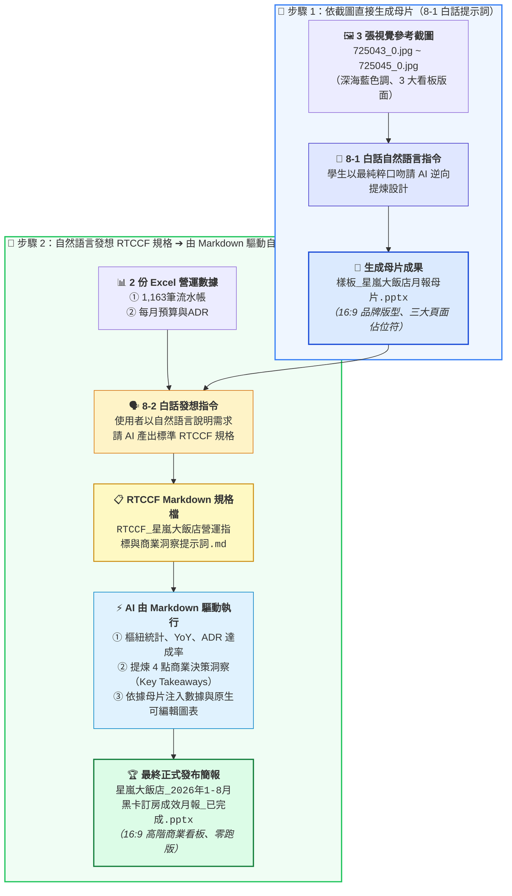

# 實戰範例：飯店訂房營運月報統計與 PPT 自動化簡報

> [!NOTE]
> 🛡️ **去識別化與隱私保護聲明**：  
> 本實戰案例之原始數據源自國內知名連鎖渡假酒店之真實營運月報素材。為保護商業機密與顧客隱私，本教學之說明文件、提示詞指令範本及最終產出的簡報檔案，均統一採用虛擬企業名稱「**星嵐大飯店（StarShore Hotel）**」進行去識別化示範，完整保留數據結構與高階分析決策之實戰精髓！

> 🟢 **採用代理平台**：ChatGPT Agent / Claude.ai / Google Antigravity  
> 🛠️ **建議執行模式**：**雙軌人機協商**（**Canvas 雙欄樞紐統計與商業洞察提煉** ➔ **Python-pptx 16:9 自動排版出檔**）

---

## 📥 專案檔案下載快速導覽（實作素材 vs AI 生成母片 vs 完成成果）

> 💡 **學習情境**：在真實職場中，學生手邊往往只有業務系統匯出的原始 Excel 數據，**公司根本沒有提供現成的 PPT 母片**！本專案將引導學生透過 AI 完成「**從無到有建立母片 ➔ 數據清洗與洞察 ➔ 依母片注入數據產檔**」的完整閉環。
>
> * 🗂️ **【一鍵全打包下載】實作素材懶人包（推薦一次下載解壓縮）**：  
>   👉 [**`素材.zip`**](./素材.zip) *(打包全部 5 個檔案：2 份 Excel 原始數據 ＋ 3 張參考看板設計圖)*
>
> * 📦 **【個別檔案下載】練習必備原始素材（亦可依需求單獨下載）**：  
>   1. 👉 [**`2026 黑卡透過LINE客服訂房紀錄(樞紐分析).xlsx`**](./素材/2026%20黑卡透過LINE客服訂房紀錄(樞紐分析).xlsx) *(包含 1,163 筆真實訂房明細、會員別、房晚、間數與各館統計)*  
>   2. 👉 [**`2026 黑卡透過LINE客服訂房每月紀錄.xlsx`**](./素材/2026%20黑卡透過LINE客服訂房每月紀錄.xlsx) *(包含 2024~2026 各月預算目標、營收達成率與 ADR 比較表)*  
>   3. 🖼️ 視覺設計參考圖：[**`725043_0.jpg`**](./素材/725043_0.jpg)（看板1）、[**`725044_0.jpg`**](./素材/725044_0.jpg)（看板2）、[**`725045_0.jpg`**](./素材/725045_0.jpg)（看板3）
>
> * 📐 **【中繼產物】由 AI 自動生成之品牌簡報母片樣板**：  
>   👉 [**`樣板_星嵐大飯店月報母片.pptx`**](./樣板_星嵐大飯店月報母片.pptx) *(AI 依據品牌規範指令自動建立之標準 16:9 母片樣板，含 Header、Footer、Logo 與三頁專屬版型)*
>
> * 🏆 **【對照標準答案】最終完成發布檔**：  
>   👉 [**`星嵐大飯店_2026年1-8月黑卡訂房成效月報_已完成.pptx`**](./星嵐大飯店_2026年1-8月黑卡訂房成效月報_已完成.pptx) *(AI 依據母片樣板自動注入真實數據與高階商業洞察後合成之正式 16:9 商業月報簡報)*

---

## 🖼️ 現有視覺設計素材展示（AI 母片建構之參考依據）

學生手邊現有這 3 張由營運團隊留下的參考截圖（已打包在 [`素材.zip`](./素材.zip) 及 [`素材/`](./素材/) 資料夾中）。在自動化流程中，這 3 張圖片是**「提供給 AI 學習的視覺模具素材」**，AI 將眼見為憑逆向提取其品牌色調、深海藍 Header、Footer 與三頁版型結構，藉此建立出統一的 PPT 母片樣板：

---

### 📋 現有 3 張參考看板素材說明

#### 素材 1：【福福卡與波波卡 1-8月 各館訂房房晚數前三名】（`725043_0.jpg`）
*雙欄並列兩大頂級會員客群，呈現指標方塊與 TOP 3 獎牌長條圖之排版參考：*

#### 素材 2：【2026年 1-8月 訂房成效分析 By Book Day】（`725044_0.jpg`）
*左側為間數與營收之雙軸趨勢圖，右側為 YoY 成長長條圖之排版參考：*

#### 素材 3：【2026 目標 ADR 達成率與 2025 ADR 差異分析】（`725045_0.jpg`）
*上層為 ADR 達成柱狀圖，下層左側為明細表、右側為 4 大商業決策洞察框之結構參考：*

---

## 🎯 案例情境與四大核心職場心法

在飯店營運月會前夕，幕僚分析師手邊往往只有訂房系統匯出的數千筆流水帳，每個月重複面臨以下四重折磨：
1. **手動拉樞紐耗時半天**：必須跨表彙整「會員別」、「館別」、「月份」、「房價」與「晚數」，稍有一列公式出錯就全盤皆輸。
2. **圖表量級落差排版醜**：訂房間數（幾百間）與營業收入（幾百萬元）量級懸殊，若不懂「雙軸複合圖表（Dual-Axis）」繪製，圖表會變成一條貼在地面的扁平線。
3. **被長官痛批「缺乏洞察」**：只把數字抄到 PPT 上，主管看了只會問「So What? 這代表什麼？5 月為何暴衝？3 月為何負成長？」。
4. **手動截圖排版枯燥易錯**：每個月初花兩天機械式「截圖 ➔ 貼到 PPT ➔ 拉對齊線 ➔ 手打數字」，極度欠缺工作效率與敏捷度。

### 💡 職場實戰四大核心心法

#### 心法一：海量流水帳 AI 自動多維樞紐（免除手動拉表）
* **問題**：1,163 筆訂房流水帳包含多重欄位，傳統手動拉樞紐容易漏選篩選條件或混淆房晚與間數。
* **解法**：直接下達精準白話指令，讓 AI 底層使用 Python pandas 進行 GroupBy，一鍵產出「福福卡 vs 波波卡」在「次數、晚數、間數」的多維交叉統計矩陣。

#### 心法二：量價雙軸圖表與品牌調性設計（Brand Visual Identity）
* **問題**：Excel 預設配色俗氣，且單一坐標軸無法呈現「間數趨勢」與「金額趨勢」。
* **解法**：引進星嵐大飯店品牌標準色票（深海藍 `#0B2545`、香檳金 `#C5A880`、珊瑚紅 `#EE6C4D`），並使用雙軸折線與柱狀圖，讓董事會一眼看出「量價齊揚」的強勁成長動能。

#### 心法三：超越冰冷數字——AI 主動提煉商業洞察（Key Takeaways）
* **問題**：老闆要看的是「數據背後的原因」與「決策行動指南」，而不是冰冷報表。
* **解法**：Prompt 明確要求 AI 進行**異動歸因分析**，主動指出：
  1. 5 月 ADR 成長 +25.1% 是受春季升等專案與客單價策略推升。
  2. 3 月與 6 月較去年同期負成長，係因去年大型企業包館的高基期效應，散客基礎依然穩固。

#### 心法四：終結手動截圖，python-pptx 一鍵自動產出 16:9 簡報
* **問題**：每月初手動截圖貼 PPT，佔去分析師 70% 的工作時間。
* **解法**：AI 依據母片樣板，在背景自動執行數據注入與排版，包含原生圖表、數據表格、指標卡片與結論文字，**10 秒鐘自動出檔**，徹底釋放高階幕僚的生產力！

---

## ⚡ 核心人機協商閉環（8-1 白話指令直接產母片 ➔ 8-2 結合母片執行 RTCCF 自動化出檔）

### 1. 步驟 0：原始素材準備
* 數據素材 1：[`2026 黑卡透過LINE客服訂房紀錄(樞紐分析).xlsx`](./素材/2026%20黑卡透過LINE客服訂房紀錄(樞紐分析).xlsx)（1,163 筆真實訂房紀錄、各館統計）
* 數據素材 2：[`2026 黑卡透過LINE客服訂房每月紀錄.xlsx`](./素材/2026%20黑卡透過LINE客服訂房每月紀錄.xlsx)（各月份預算、達成率與 ADR 比較）
* 參考看板圖：[`725043_0.jpg`](./素材/725043_0.jpg)、[`725044_0.jpg`](./素材/725044_0.jpg)、[`725045_0.jpg`](./素材/725045_0.jpg)
* 素材懶人包：[`素材.zip`](./素材.zip)（一鍵打包下載全部 5 個素材檔案）

### 2. 步驟 1：白話自然語言提示詞（以截圖直接生成母片）
* 文件連結：[**`8-1_白話自然語言發想提示詞.md`**](./8-1_白話自然語言發想提示詞.md)
* 核心亮點：學生手邊沒有現成的 PPT 母片！直接上傳 3 張參考截圖，以最自然的口話請 AI 逆向提取配色與版型，**直接生成 16:9 品牌母片樣板檔（`樣板_星嵐大飯店月報母片.pptx`）**！

### 3. 步驟 2：自然語言發想 RTCCF 規格，再由 Markdown 驅動自動生成 PPTX
* 文件連結：[**`8-2_AI產出之RTCCF營運指標與商業洞察提示詞.md`**](./8-2_AI產出之RTCCF營運指標與商業洞察提示詞.md)
* 核心亮點：**手邊有了 8-1 產出的母片與 2 份 Excel 數據**，學生使用**自然語言**請 AI 在 Canvas 畫布中架構標準的 **RTCCF Markdown 規格檔**（[`RTCCF_星嵐大飯店營運指標與商業洞察提示詞.md`](./RTCCF_星嵐大飯店營運指標與商業洞察提示詞.md)），接著直接指示 AI「**依此 Markdown 規格執行**」，AI 便會自動完成多維樞紐統計、提煉 4 點商業決策洞察（Key Takeaways），並將數據直接注入母片，產出正式發布檔（`星嵐大飯店_2026年1-8月黑卡訂房成效月報_已完成.pptx`）！

---

[← 返回實戰範例導覽總表](../README.md)

