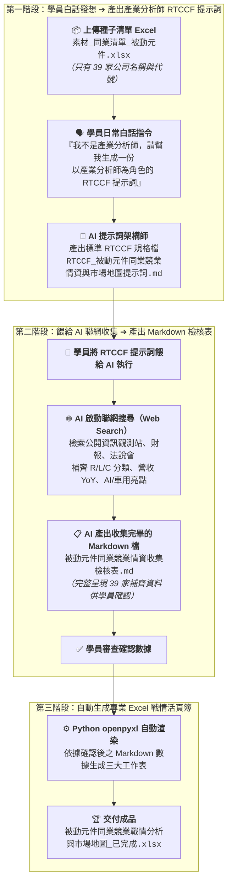

# 9-1 白話自然語言發想提示詞（生成產業分析師 RTCCF 規格與聯網收集資料）

> 💡 **核心精神**：學員**並不是專業的「產業分析師」**，手邊往往只有一張只有公司名稱與股票代號的 Excel 簡易名單！  
> 學員**不需要自己辛苦手動去查 39 次財報**，只要上傳這份 Excel 檔，用日常的大白話向 AI 下達發想指令：  
> 1. 請 AI 幫忙架構一份**以「資深產業研究首席分析師」為角色（Role）的 RTCCF 格式 Markdown 提示詞規格檔**。  
> 2. 再將這份 RTCCF 提示詞餵給 AI，**AI 就會自動啟動聯網搜尋，將 39 家同業的缺漏資料全部補齊，並產出一份收集完畢的 Markdown 檢核檔讓學員確認**！  
> 3. 學員確認數據無誤後，再自動生成具備企業級美化排版的 Excel 戰情發布檔。

---

## 🎯 核心工作流：從白話指令到聯網情資檢核



---

## 💬 複製即可使用之白話發想指令（一般學員日常口吻）

學員在 AI 對話視窗（ChatGPT Plus / Claude / Gemini Advanced）中，**先上傳《素材_同業清單_被動元件.xlsx》**，並直接貼上以下這段大白話發想指令：

```text
你好，我手頭上有一份主管給我的 Excel 清單：《素材_同業清單_被動元件.xlsx》，裡面收錄了台灣 39 家被動元件上市與上櫃同業名單（包含國巨、華新科、禾伸堂、興勤、臺慶科、鈺邦等）。

但是這份原始素材只有「股票代號、公司名稱、市場別」以及非常簡略口語的幾句產品描述，資訊極度缺乏。主管要求我做出一份專業的「被動元件同業競業情資矩陣與市場地圖」，包含產業鏈六大板塊標準分類、最新營收成長 YoY%、動能紅綠燈評級、AI 伺服器與車用商機佈局亮點，以及呈報經營層的高階戰情決策建議。

我並不是專業的「產業分析師」，我手邊也沒有 39 家公司的詳細財報資料。

請你扮演「頂級提示詞架構師兼商業顧問」，幫我將這個工作需求轉化為一份標準的「RTCCF 格式 Markdown 文件」（包含 Role、Task、Context、Constraints、Format 五大要素），方便我儲存並與 AI 進行人機協作：

【請幫我在 RTCCF 提示詞中設定以下核心邏輯】：
1. 【Role 角色設定】：將執行任務的 AI 角色設定為「擁有 15 年全球電子零組件與半導體供應鏈研究經驗的資深科技產業首席分析師」。
2. 【Task 任務與聯網收集要求】：
   - 指示該分析師 AI「必須透過聯網搜尋（Web Search）」，自動去檢索台灣公開資訊觀測站（MOPS）、最新財報新聞與券商法說會報告，將 39 家同業缺漏的所有深度情資補齊：
     * 將產品重組為電子工程標準的六大板塊：電容、電感、電阻與保護、頻率射頻、上游材料、代理通路。
     * 補齊最新營收年增率（YoY%）走勢。
     * 評估並劃分動能等級（🔥高成長領先組、🟢穩健獲利組、⚠️轉型承壓組）。
     * 挖掘每家同業在 AI 伺服器（如高容固態電容、TLVR 大電流電感）與車用電子（如 800V 高壓、車規 NTC 熱敏）的具體佈局亮點。
     * 撰寫呈報經營層的四張高階決策建議卡片（景氣循環、三強暴衝原因、龍頭戰略動態、本公司攻防策略）。
3. ⚠️【關鍵確認機制：先產 Markdown 檢核檔讓使用者確認】：
   - 要求 AI 在收集完所有資料後，**「絕對不要直接跳去寫程式產出 Excel」**！
   - **必須先產出一份結構化 Markdown 檔案（如《被動元件同業競業情資收集檢核表.md》）**，將收集補齊後的 39 家完整資料、生態地圖與戰情摘要條列清楚，主動停下來讓我（使用者）確認。
   - 等我確認資料精準無誤後，第二階段才使用 Python openpyxl 生成具有深海藍排版與動能標籤的專業 Excel 發布檔（《被動元件同業競業戰情分析與市場地圖_已完成.xlsx》）。

請直接為我輸出這份標準的「RTCCF 格式 Markdown 提示詞規格」，讓我可以直接複製或另存為檔案，謝謝！
```

---

## 💡 為什麼要採用這個三層工作流？

1. **降低學員進入門檻（No-code / No-expert）**：  
   學員不需要一開始就懂專業名詞，透過白話發想指令，讓 AI 幫忙構建「專家級 RTCCF 提示詞」，扮演了最佳的智囊跳板。
2. **免除手動翻查 39 次財報的痛苦**：  
   在 RTCCF 中明確要求 AI「聯網搜尋補齊資料」，將繁重耗時的資料抓取工作完全交給 AI 的 Web Search 功能。
3. **Markdown 數據檢核關卡（Human-in-the-loop）**：  
   AI 聯網收集完後，先以 Markdown 格式條列呈現。使用者可以一眼掃視 39 家的營收與分類是否正確，避免「黑盒子直出 Excel 卻充斥錯誤數據」的窘境！
