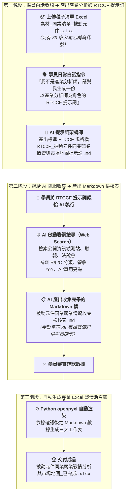

# 9-1 白話自然語言發想提示詞（生成產業分析師 RTCCF 規格與聯網收集資料）

> 💡 **核心精神**：學員**並不是專業的「產業分析師」**，手邊往往只有一張只有公司名稱與股票代號的 Excel 簡易名單！  
> 學員**不需要自己辛苦手動去查 39 次財報**，只要上傳這份 Excel 檔，用日常的大白話向 AI 下達發想指令：  
> 1. 請 AI 幫忙架構一份**以「資深產業研究首席分析師」為角色（Role）的 RTCCF 格式 Markdown 提示詞規格檔**。  
> 2. 再將這份 RTCCF 提示詞餵給 AI，**AI 就會自動啟動聯網搜尋，將 39 家同業的缺漏資料全部補齊，並產出一份收集完畢的 Markdown 檢核檔讓學員確認**！  
> 3. 學員確認數據無誤後，再自動生成具備企業級美化排版的 Excel 戰情發布檔。

---

## 🎯 核心工作流：從白話指令到聯網情資檢核



---

## 💬 複製即可使用之白話發想指令（一般學員真實口吻）

學員在 AI 對話視窗（ChatGPT Plus / Claude / Gemini Advanced）中，**先上傳《素材_同業清單_被動元件.xlsx》**，並直接貼上以下這段最純粹的大白話發想指令：

```text
你好，主管剛剛丟給我一份 Excel 檔案《素材_同業清單_被動元件.xlsx》，裡面只有 39 家公司的代號、名稱和簡單幾句產品說明。主管要我做出一份「台灣被動元件同業競爭情報與市場地圖」給大老闆看。

但我根本不是產業分析師，完全不懂被動元件，手邊也沒有這 39 家公司的財報，不知道該怎麼分析。

請你扮演頂級的提示詞架構師，以一位「資深科技產業首席分析師」的專業角度，幫我寫一份標準的 RTCCF 格式 Markdown 提示詞規格檔：

1. 這份提示詞要指示 AI 去上網搜尋（Web Search），把這 39 家公司缺少的資料全部補齊（包含：專業的次產業分類、最近營運好不好、營收有沒有成長、有沒有吃到 AI 伺服器或電動車等新商機、以及給老闆的具體經營建議）。
2. 特別注意：提示詞裡一定要規定 AI「查完資料後，先整理成一份 Markdown 檔案給我確認數據」，等我確認沒問題之後，才可以幫我生成專業的 Excel 報表。

請直接產出完整的 Markdown 規格內容，讓我能直接儲存為 Markdown 檔案格式（建議檔名：`RTCCF_被動元件同業競業情資與市場地圖提示詞.md`），方便我在本地儲存、檢視與人機協作微調，謝謝！
```

---

## 💾 步驟成果：儲存為 Markdown 檔案格式（.md）

AI 回覆產出標準 RTCCF 提示詞後，學員請進行以下操作：
1. **複製 AI 產出內容**：點擊 AI 對話框右上角的複製按鈕。
2. **儲存為 Markdown 檔案**：在本地專案資料夾中新建檔案，儲存為 [**`RTCCF_被動元件同業競業情資與市場地圖提示詞.md`**](./RTCCF_被動元件同業競業情資與市場地圖提示詞.md)。
3. **進行人機協作（Human-in-the-loop）**：學員可在任何文字編輯器（VS Code / 筆記軟體）中開啟這份 `.md` 檔案，自由檢視、補充備註或微調關注指標。
4. **進入步驟 9-2**：確認內容後，將該 Markdown 提示詞整段餵給 AI，AI 就會自動去網路上收集 39 家公司的所有資料，並先產生一份 Markdown 收集檢核檔供您確認！

---

## 💡 為什麼要儲存為 Markdown 檔案格式？

1. **落實人機協作（Human-in-the-loop）**：  
   儲存為 `.md` 檔案後，學員可以在本地直接檢閱修改，不需要每次都重新向 AI 溝通，讓提示詞成為可被版本控管與反覆優化的資產。
2. **標準化提示詞資產沉澱**：  
   這份 `.md` 檔案能作為企業內部的標準作業規格（SOP）。未來如果有新的 50 家或 100 家同業名單，只要換上新名單，重複使用這份 Markdown 提示詞即可一鍵完成！
3. **清晰的兩階段執行防線**：  
   Markdown 檔案格式讓 AI 能夠以最結構化的方式理解「先產 Markdown 檢核表讓人類確認 ➔ 人類確認無誤後才生成 Excel」，徹底杜絕 AI 黑盒子數據通靈！
