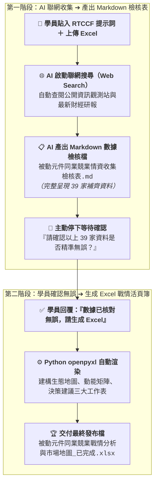

# 9-2 AI 產出之 RTCCF 產業鏈重組與情資矩陣提示詞（聯網收集與人機協作）

> 💡 **核心定位**：本文件是由學員在 [步驟 9-1](./9-1_白話自然語言發想提示詞.md) 輸入白話指令後，由 AI 自動架構生成的標準 **RTCCF 提示詞規格檔**。  
> 
> * 🎯 **角色設定**：將 AI 賦予為「**擁有 15 年經驗的資深科技產業首席分析師**」。  
> * 🌐 **核心能力**：指示 AI **啟動網路搜尋（Web Search）**，針對原始 Excel 中僅有名稱的 39 家同業，自動去公開資訊觀測站與法說會研報中補齊次產業標準分類、最新營收 YoY、動能紅綠燈與 AI/車用商機。  
> * 📋 **數據防錯機制**：**AI 收集完後，必須先產出 1 份 Markdown 檔案供學員確認數據**，確認後才執行步驟 9-3 生成 Excel 戰情發布檔！  
> 
> 📁 獨立規格檔下載：👉 [**`RTCCF_被動元件同業競業情資與市場地圖提示詞.md`**](./RTCCF_被動元件同業競業情資與市場地圖提示詞.md)

---

## 🎯 兩階段執行流程圖



---

## 📋 RTCCF 提示詞全文（可直接儲存或複製貼給 AI）

```markdown
## Role｜角色

你是一位擁有 15 年全球電子零組件與半導體供應鏈研究經驗、精通科技產業競爭情報（Competitive Intelligence）與企業策略定位的「資深科技產業研究首席分析師」。你熟悉 R（電阻）、L（電感）、C（電容）三大被動元件規格升級路徑、車規認證門檻、AI 伺服器電源架構（如 TLVR 電感、高階固態電容），並精通運用公開資訊觀測站（MOPS）、券商研報與即時財經資訊進行產業鏈重組與競爭動能分群。

## Task｜任務

我已經上傳了原始種子清單 Excel 檔：《素材_同業清單_被動元件.xlsx》（收錄台灣 39 家上市與上櫃同業名單）。  
由於原始資料僅有公司代號、名稱與極簡略的產品文字，請扮演首席產業分析師，為我執行「聯網搜尋補齊資料 ➔ Markdown 檢核確認 ➔ 產出 Excel 戰情活頁簿」的兩階段分析任務：

### 階段一：啟動聯網搜尋（Web Search）補齊資料，並產出 Markdown 檢核表（人類確認關卡）
1. 聯網檢索與資料補齊：
   - 請啟動網路搜尋功能，針對這 39 家同業檢索台灣公開資訊觀測站、最新財報公告、法人法說會簡報與科技財經研報，補齊以下關鍵欄位：
     * 產業次領域標準化分類（Taxonomy）：將 39 家同業精確重組為六大標準板塊（電容、電感與磁性元件、電阻與電路保護、頻率與射頻元件、上游材料與設備、代理通路與模組）。
     * 最新營運動能對標：查詢最新營收年增率（YoY%）走勢。
     * 動能分群評級：依據成長率與產品位階，劃分三大動能等級（🔥高成長領先組、🟢穩健獲利組、⚠️轉型承壓組）。
     * AI 伺服器與車用商機佈局亮點：精準標註每家同業切入高階市場的代表性題材與關鍵零組件。
     * 呈報經營層之戰情摘要（Executive Briefing）：提煉產業總體景氣循環、成長三強（鈺邦、勤凱、臺慶科）暴衝歸因、龍頭（國巨、華新科）戰略，以及本公司三大攻防指引。
2. 產出結構化 Markdown 檔案：
   - 將上述所有補齊的資料整理為一份完整的《被動元件同業競業情資收集檢核表.md》。
3. 停下來等待審核：
   - 在對話框中輸出該 Markdown 檔案，並主動詢問我：「以上 39 家同業的補齊情資與動能數據已完成，請確認資料是否無誤？確認後將為您自動生成包含三大工作表的正式 Excel 發布檔」。
   - 在使用者確認前，嚴禁直接產出 Excel 檔案！

### 階段二：確認後自動生成專業 Excel 戰情發布檔
當我回覆「確認資料無誤」之後，請撰寫並執行 Python openpyxl 腳本，產出包含三個專屬工作表的高質感發布檔《被動元件同業競業戰情分析與市場地圖_已完成.xlsx》：
1. 工作表 1【被動元件產業生態地圖】：呈現六大板塊、代表廠商、核心規格與 AI/車用商機。
2. 工作表 2【39家同業營運動能矩陣】：收錄 39 家完整清單，依動能評級套用淺綠、淺灰、淺黃標籤底色。
3. 工作表 3【戰情摘要與主管決策建議】：呈現四大經營層決策指引卡片。

## Context｜背景與情境

- 分析對象為台灣被動元件產業鏈 39 家上市櫃代表性企業。
- 原始名單資訊嚴重不足，學員為一般業務幕僚，無法手動逐一翻查 39 家財報，極度仰賴 AI 透過 Web Search 自動補齊。
- 最終成果供董事長、總經理與策略委員會審閱，需具備頂級管顧（McKinsey/BCG）風格之視覺質感與數據嚴謹度。

## Constraints｜限制與規則

1. 嚴格禁止數據通靈與省略：
   - 39 家廠商之股票代號、市場別與公司名稱必須 100% 忠實對齊原始 Excel 清單，嚴禁遺漏任何一家。
   - 營收 YoY 與產品佈局必須基於聯網搜尋或真實財經研報，不可胡亂編造數據。
2. 嚴格落實兩階段流程：
   - 必須先輸出 Markdown 檢核表讓使用者確認，嚴禁在第一階段跳過確認直接出 Excel 檔。
3. 產業分類具備電子工程專業度：
   - MLCC、固態鋁電解、鉭電容特性不同，一體成型電感與傳統電感規格有異，必須精準歸類。
4. 語言與樣式標準：
   - 全程使用台灣繁體中文科技商務術語。
   - Excel 樣式遵循深海藍表頭（#0B2545）、白色粗體標題與微軟正黑體排版。

## Format｜輸出格式規範

1. 第一階段輸出：Markdown 數據檢核表（被動元件同業競業情資收集檢核表.md）
2. 第二階段輸出：包含三大工作表之正式 Excel 活頁簿（被動元件同業競業戰情分析與市場地圖_已完成.xlsx）。
```

---

## 🔍 第一階段交付示範：AI 產出之 Markdown 數據檢核表

當學員將上述 RTCCF 提示詞貼給 AI 後，AI **第一步會自動聯網檢索，並產出如下的 Markdown 檢核表，停下來讓學員確認**：

```markdown
# 📊 被動元件同業競業情資收集檢核表（39 家同業）

## 一、被動元件產業生態六大板塊
1. 電容 (Capacitors)：國巨、華新科、禾伸堂、立隆電、鈺邦、凱美、金山電
   * 核心規格：高容高壓 MLCC、固態鋁電解、車規電容
   * AI/車用商機：AI 伺服器電源突波推升鈺邦固態電容大增；車用 800V 高壓平台推身高階 MLCC
2. 電感與磁性元件 (Inductors)：臺慶科、台達電、鈞寶、千如、今展科、聯寶、鈺鎧、年程
   * 核心規格：一體成型大電流功率電感 (Molding Choke)、微型繞線電感
   * AI/車用商機：AI GPU 功耗破千瓦帶動 TLVR 電感單價倍增；臺慶科車用電感切入歐美 Tier 1
3. 電阻與電路保護 (Resistors & Protection)：國巨、大毅、光頡、艾華、興勤、聚鼎
4. 頻率與射頻元件 (Frequency & RF)：希華、泰藝、加高、安碁、佳邦
5. 上游材料與設備 (Materials & Tools)：勤凱、信昌電、立敦、九豪、鑫科、越峰、崇越
6. 代理通路與模組 (Distribution)：日電貿、蜜望實、雷科、能率網通

## 二、39 家同業營運動能矩陣（精華截錄）
| 代號 | 公司名稱 | 市場 | 次領域 | 動能評級 | 最新營收 YoY | AI / 車用佈局亮點 |
| :---: | :--- | :---: | :--- | :---: | ---: | :--- |
| 6449 | 鈺邦 | 上市 | 電容 (固態) | 🔥 高成長領先 | +28.9% | AI 伺服器主板固態電容市占全球第一，單月營收創新高 |
| 4760 | 勤凱科技 | 上櫃 | 上游材料 | 🔥 高成長領先 | +26.4% | 導電銀漿/銅漿切入半導體玻璃基板與被動元件電極端 |
| 3357 | 臺慶科 | 上櫃 | 電感 (功率) | 🔥 高成長領先 | +24.1% | 一體成型功率電感獲 AI 伺服器大單，車用營收逼近 35% |
| 3090 | 日電貿 | 上市 | 代理通路 | 🔥 高成長領先 | +21.5% | 代理基美 (KEMET) 鉭電容，大啖 AI 伺服器急單紅利 |
| 2327 | 國巨 | 上市 | 電容/電阻/電感 | 🔥 高成長領先 | +15.8% | 全球前三大被動元件巨頭，主攻高階車規與工控 |
| 2492 | 華新科 | 上市 | 電容/電阻/電感 | 🟢 穩健獲利 | +6.2% | 聚焦車規 MLCC 與高頻元件，稼動率穩步回升 |
| 6155 | 鈞寶 | 上市 | 電感/磁性 | ⚠️ 轉型承壓 | -1.8% | 鐵粉芯磁性元件，正積極送樣網通與車用濾波器 |
...（完整收錄 39 家名單）

## 三、高階經營層戰情摘要
1. 景氣循環：2026 被動元件產業揮別庫存去化週期，進入 AI 伺服器與電動車雙引擎驅動之超級循環。
2. 成長三強：鈺邦 (+28.9%)、勤凱 (+26.4%)、臺慶科 (+24.1%) 均突破 20% 年增。
3. 龍頭動態：國巨標準品營收降至 25% 以下，全力轉型高毛利特規品；華新科以集團垂直整合擴張。
4. 本公司策略指引：避開成熟品價格戰、加速核心材料本土雙源驗證、建立高階現貨策略庫存。

👉 **【請使用者確認】**：請審查以上 39 家同業的分類與營運動能是否符合需求？確認無誤後，請回覆「確認資料無誤」，我將立即執行 Python openpyxl 產出高質感 Excel 發布檔！
```

---

## 🚀 第二階段：使用者確認回覆指令

當學員檢視上述 Markdown 內容無誤後，只要在對話視窗發送以下這句話，AI 即會啟動步驟 9-3 的 Python 腳本產出 Excel：

```text
資料收集非常完整且精準，已經核對無誤！
請依據 RTCCF 規範中的第二階段，開始執行 Python openpyxl 腳本，為我產出包含三大工作表的正式 Excel 發布檔《被動元件同業競業戰情分析與市場地圖_已完成.xlsx》，謝謝！
```
