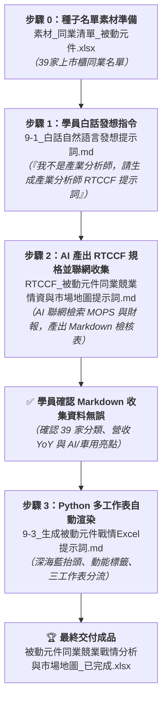

# 實戰範例：電子同業競業情資矩陣與市場地圖自動化

> 🟢 **採用代理平台**：ChatGPT Agent / Claude.ai / Google Antigravity  
> 🛠️ **建議執行模式**：**雙軌人機協商**（**Canvas 雙欄產業鏈本體重組與動能分群** ➔ **Python openpyxl 多工作表戰情活頁簿自動渲染**）

---

## 📥 專案檔案下載快速導覽（實作素材 vs 完成成果）

> 💡 **學習建議**：想要親自動手實作的學員，請下載 **「實作必備原始素材」** 39 家同業名單 Excel 檔至專案中；想直接檢視最終戰情分析與市場地圖，請下載 **「完成成果活頁簿」**。
>
> * 📦 **【實作起點】練習必備原始素材（請下載此檔案開始實作）**：  
>   👉 [**`素材_同業清單_被動元件.xlsx`**](./素材_同業清單_被動元件.xlsx) *(原始台灣 39 家被動元件上市與上櫃同業種子名單，含股票代號與原始產品描述，請下載此檔開始實作重組與評估)*
>
> * 🏆 **【對照標準答案】最終完成發布檔**：  
>   👉 [**`被動元件同業競業戰情分析與市場地圖_已完成.xlsx`**](./被動元件同業競業戰情分析與市場地圖_已完成.xlsx) *(包含「生態地圖」、「39家動能矩陣」、「主管決策建議」三大工作表之企業級戰情活頁簿)*

---

## 🏆 最終完成作品展示（實作成果搶先看）

本專案解決科技製造業、電子零組件廠商與證券投研部門「**手握數十家同業名單，但分類混亂零散、缺乏財報動能對標、主管只看得到清單看不到決策洞見**」的核心痛點，產出包含 **3 個專業工作表（Sheet）** 的高階商業戰情活頁簿：

1. **工作表 1【被動元件產業生態地圖】**：依據全球電子工程標準規範，將 39 家上市櫃同業重構為 **R（電阻）、L（電感）、C（電容）、保護頻率、上游材料、代理通路** 六大生態板塊，並清晰標註各板塊在「AI 伺服器」與「車用 800V 高壓平台」的關鍵規格催化劑！
2. **工作表 2【39家同業營運動能矩陣】**：完整對標 39 家同業的市場別、次領域、最新營收 YoY 走勢與 AI/車用題材佈局，並自動標註「**🔥高成長領先組（淺綠底色）**」、「**🟢穩健獲利組（淺灰底色）**」與「**⚠️轉型承壓組（淺黃底色）**」動能紅綠燈，主管 3 秒內掌握產業競合全貌！
3. **工作表 3【戰情摘要與主管決策建議】**：專供董事長與經營團隊審閱的 Executive Briefing 卡片，包含產業景氣循環解讀、三強成長暴衝分析（鈺邦 +28.9%、勤凱 +26.4%、臺慶科 +24.1%）、龍頭國巨戰略動態，以及本公司「避開成熟紅海、材料本土雙源、搶佔現貨急單」三大具體攻防指引。

---

### 📊 完成作品外觀預覽 1：【被動元件產業生態地圖】（宏觀全景）

| 次產業板塊 | 代表廠商 (上市/上櫃) | 核心技術與產品規格 | AI 伺服器 / 車用電子大趨勢與商機 |
| :--- | :--- | :--- | :--- |
| **電容 (Capacitor)** | 國巨、華新科、禾伸堂、立隆電、鈺邦、凱美、金山電 | 高容/高壓 MLCC、固態鋁電解 (V-Chip/Hybrid)、車規高可靠度電容 | 🔥 AI 伺服器主板負載瞬變推升鈺邦固態電容大增；車用 800V 高壓平台推升高階車規 MLCC |
| **電感與磁性元件** | 臺慶科、台達電、鈞寶、千如、今展科、聯寶、鈺鎧、年程 | 一體成型大電流功率電感 (Molding Choke)、微型高頻繞線電感 | 🔥 AI GPU 功耗破千瓦推升 TLVR 與高階電感單價翻倍；臺慶科車用電感切入歐美 Tier 1 |
| **電阻與電路保護** | 國巨、大毅、光頡、艾華、興勤、聚鼎 | 薄膜精密電阻 (抗硫化/高耐壓)、熱敏電阻 (NTC/PTC)、PPTC | 🔥 興勤為全球熱敏保護龍頭，電動車電池包保護元件獨大；光頡薄膜電阻攻入歐美車儀表 |
| **頻率與射頻元件** | 希華、泰藝、加高、安碁、佳邦 | 石英晶體諧振器、溫補振盪器 (TCXO)、天線模組與 RF 元件 | 🔥 5G 網通與 AI 伺服器對超低抖動晶體需求急迫；佳邦車聯網雙頻天線領先 |
| **上游材料與設備** | 勤凱、信昌電、立敦、九豪、鑫科、越峰、崇越 | 被動元件導電漿料 (銀/銅漿)、介電瓷粉、氧化鋁陶瓷基板 | 🔥 勤凱導電銅漿打入半導體玻璃基板；信昌電具備介電瓷粉垂直整合特規 MLCC |
| **代理通路與整合** | 日電貿、蜜望實、雷科、能率網通 | 全系列被動元件現貨庫存調度、日系代理、封裝捲帶設備 | 🔥 AI 伺服器建置急單湧現推升鉭電容現貨溢價；雷科受惠晶片電阻擴產設備需求 |

---

### 📈 完成作品外觀預覽 2：【39家同業營運動能矩陣】（微觀對標）

| 股票代號 | 公司名稱 | 市場別 | 次產業領域 | 動能評級 | 營收 YoY | AI 伺服器 / 車用商機佈局亮點 |
| :---: | :--- | :---: | :--- | :---: | ---: | :--- |
| **6449** | **鈺邦** | 上市 | 電容 (固態) | <mark style="background-color: #D4EDDA;">🔥 高成長領先</mark> | **+28.9%** | AI 伺服器主板固態電容市占全球第一，單月營收續創歷史新高 |
| **4760** | **勤凱科技** | 上櫃 | 上游材料 | <mark style="background-color: #D4EDDA;">🔥 高成長領先</mark> | **+26.4%** | 導電銀漿/銅漿切入半導體玻璃基板與被動元件電極端 |
| **3357** | **臺慶科** | 上櫃 | 電感 (功率) | <mark style="background-color: #D4EDDA;">🔥 高成長領先</mark> | **+24.1%** | 一體成型功率電感獲 AI 伺服器大單，車用營收占比逼近 35% |
| **3090** | **日電貿** | 上市 | 代理通路 | <mark style="background-color: #D4EDDA;">🔥 高成長領先</mark> | **+21.5%** | 代理基美 (KEMET) 鉭電容，大啖 AI 伺服器建置急單紅利 |
| **2327** | **國巨** | 上市 | 電容/電阻/電感 | <mark style="background-color: #D4EDDA;">🔥 高成長領先</mark> | **+15.8%** | 全球第三大被動元件巨頭，主打高階車規、工控與航太 |
| **2492** | **華新科** | 上市 | 電容/電阻/電感 | <mark style="background-color: #E2E3E5;">🟢 穩健獲利</mark> | **+6.2%** | 聚焦車規 MLCC 與網通高頻元件，稼動率穩步回升 |
| **6155** | **鈞寶** | 上市 | 電感/磁性 | <mark style="background-color: #FFF3CD;">⚠️ 轉型承壓</mark> | **-1.8%** | 鐵粉芯磁性元件，正積極送樣網通與車用濾波器 |

---

## 🎯 案例情境與四大核心職場心法

在 B2B 科技製造業或投資法人機構中，策略幕僚手頭經常只有一張「39 檔同業股票代碼名單（種子清單）」。若沒有良好的分析框架與 AI 輔助，分析師會陷入以下痛點：
1. **口語描述零散**：原始資料只寫「MLCC、晶片電阻、電感等」或「電容材料」，主管無法一眼看清產業價值鏈。
2. **缺乏動態指標**：只有名字沒有量化動能，看不出誰在受惠 AI 伺服器與電動車，誰在面臨消費性電子衰退。
3. **沒有高階決策建議**：只丟一張長表格給總經理，缺乏「So What?」與應對策略，無法轉化為企業競爭優勢。

### 💡 職場實戰四大核心心法

#### 心法一：非結構化文字之「產業本體論標準化（Taxonomy）」
* **問題**：每家公司的產品線寫法五花八門，手動分類耗時且容易主觀失真。
* **解法**：下達 Prompt 要求 AI 遵循國際標準規範，自動將 39 家同業拆解為「R/L/C、材料、保護、通路」六大板塊，建立專業級產業生態地圖。

#### 心法二：種子清單動態擴充與動能分群（Clustering Analysis）
* **問題**：只有股票代號無法做決策。
* **解法**：教導學員利用 AI / Python 串接最新營運指標，自動分群出「🔥 高成長領先（受惠高階規格升級）」、「🟢 穩健獲利」與「⚠️ 轉型承壓」，讓主管秒懂同業位階。

#### 心法三：超越冰冷報表——提煉經營層「So What?」策略指南
* **問題**：老闆最討厭看流水帳，老闆要的是「對本公司的威脅與行動方案」。
* **解法**：在戰情卡片中直指痛點：避開成熟型電阻紅海、借鏡勤凱推動材料本土雙源、借鏡日電貿掌握高階鉭電現貨急單溢價。

#### 心法四：三層次分流交付（宏觀地圖 ➔ 微觀矩陣 ➔ 決策指引）
* **問題**：一張滿滿的工作表讓閱讀者抓不到重心。
* **解法**：使用 Python `openpyxl` 建立「多工作表戰情活頁簿」，讓宏觀產業地圖、微觀同業對標表與主管決策備忘錄各司其職，呈現國際管顧級的高階質感！

---

## ⚡ 核心人機協商閉環（種子清單 ➔ RTCCF 聯網收集 ➔ Markdown 檢核 ➔ openpyxl 渲染）

### 1. 步驟 0：素材準備
* 數據素材：[**`素材_同業清單_被動元件.xlsx`**](./素材_同業清單_被動元件.xlsx)（39 家被動元件上市與上櫃同業種子清單）

### 2. 步驟 1：白話自然語言發想（一般學員視角）
* 文件連結：[**`9-1_白話自然語言發想提示詞.md`**](./9-1_白話自然語言發想提示詞.md)
* 核心亮點：學員不是產業分析師，手邊只有 39 家公司代號。透過大白話引導 AI 產出一份以「資深科技產業首席分析師」為角色的 RTCCF 提示詞，指示 AI 聯網搜尋補齊所有資料，並先產出 Markdown 檢核檔讓學員確認！

### 3. 步驟 2：AI 產出之 RTCCF 產業鏈重組與情資矩陣（聯網收集與人機協作）
* 文件連結：[**`9-2_AI產出之RTCCF產業鏈重組與情資矩陣提示詞.md`**](./9-2_AI產出之RTCCF產業鏈重組與情資矩陣提示詞.md)
* 獨立規格檔：[**`RTCCF_被動元件同業競業情資與市場地圖提示詞.md`**](./RTCCF_被動元件同業競業情資與市場地圖提示詞.md)
* 核心亮點：AI 角色設定為資深產業分析師，啟動 Web Search 檢索公開資訊觀測站與法說會，補齊 39 家資料並輸出《被動元件同業競業情資收集檢核表.md》供學員審查確認。

### 4. 步驟 3：Python openpyxl 多工作表自動渲染
* 文件連結：[**`9-3_生成被動元件競業戰情Excel發布檔提示詞.md`**](./9-3_生成被動元件競業戰情Excel發布檔提示詞.md)
* 核心技術：提示詞內嵌完整生產級 `openpyxl` 渲染腳本，建立深海藍企業抬頭、動能紅綠燈底色與自適應欄寬。

---

## 📁 範例交付成品與素材清單

| 檔案名稱 | 檔案類型 | 角色與說明 |
| :--- | :---: | :--- |
| 📦 [**素材_同業清單_被動元件.xlsx**](./素材_同業清單_被動元件.xlsx) | 📁 **實作原始數據** | **【實作起點】** 原始台灣 39 家被動元件上市與上櫃同業種子清單（含代碼與原始產品描述，請下載此檔開始實作） |
| 📗 [**被動元件同業競業戰情分析與市場地圖_已完成.xlsx**](./被動元件同業競業戰情分析與市場地圖_已完成.xlsx) | 🏆 **最終完成成果** | **【對照標準答案】** 包含「生態地圖」、「39家動能矩陣」、「主管決策建議」三大工作表之企業級戰情活頁簿 |
| 💬 [**9-1_白話自然語言發想提示詞.md**](./9-1_白話自然語言發想提示詞.md) | 💬 **人機協商** | 一般學員日常口吻，上傳 Excel 並要求產出產業分析師 RTCCF 提示詞 |
| 📋 [**9-2_AI產出之RTCCF產業鏈重組與情資矩陣提示詞.md**](./9-2_AI產出之RTCCF產業鏈重組與情資矩陣提示詞.md) | 📋 **提示詞架構** | 說明 RTCCF 架構、AI 聯網收集機制與 Markdown 數據檢核流程 |
| 📄 [**RTCCF_被動元件同業競業情資與市場地圖提示詞.md**](./RTCCF_被動元件同業競業情資與市場地圖提示詞.md) | 📄 **可儲存規格檔** | 可獨立儲存之標準 RTCCF 提示詞，以產業分析師為角色並要求聯網檢索 |
| ⚙️ [**9-3_生成被動元件競業戰情Excel發布檔提示詞.md**](./9-3_生成被動元件競業戰情Excel發布檔提示詞.md) | ⚙️ **核心教學** | 詳細解說多工作表戰情架構、動能標籤上色技巧，內嵌完整執行腳本 |

---

[← 返回實戰範例導覽總表](../README.md)

