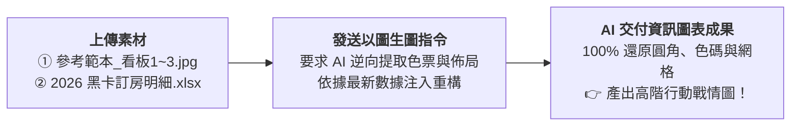

# 9-1 以圖生圖白話自然語言發想提示詞

> 💡 **核心思維**：在職場上，當主管或客戶指定「我要做出跟這張圖一樣排版與質感的報告」時，學生**完全不需要手動去刻繪圖軟體或調整像素**！  
> 只要**「上傳參考設計截圖 ＋ 上傳最新 Excel 數據 ＋ 一段白話指令 ➔ AI 自動逆向工程排版並填入真實數據」**，一次到位完成！

---

## 🎯 核心工作流（以圖為樣板）



---

## 📋 自然語言提示詞（直接複製發送）

學生在 AI 對話視窗（ChatGPT Plus / Claude / Gemini Advanced）中，**同時上傳參考圖片（如《參考範本_看板1_各館房晚前三名.jpg》）與 Excel 數據《2026 黑卡透過LINE客服訂房紀錄(樞紐分析).xlsx》**，並直接貼上以下指令：

```text
你是一位精通商業資訊圖表（Infographic）設計與現代網頁視覺排版的資深設計師。

我上傳了兩份素材：
1. 視覺設計參考圖：「參考範本_看板1_各館房晚前三名.jpg」
2. 本期訂房原始數據：「2026 黑卡透過LINE客服訂房紀錄(樞紐分析).xlsx」

請幫我依據參考圖片的版面結構，使用最新 Excel 數據產出一張一模一樣效果的高清行動戰情圖：

1. 【視覺風格與配色逆向提取】：
   - 請嚴格參考圖片中的品牌識別：頂部深海藍（#0B2545）橫幅、左側星嵐大飯店 Logo 與右側手寫標語「More Than A Stay」、底部頁尾橫條。
   - 中間採用雙欄並列的白色圓角卡片設計，分別呈現「福福卡」與「波波卡」。
   - 卡片內部包含頂部三大 KPI 指標方塊（總訂房次數、總房晚數、總間數），以及下方的金銀銅牌 TOP 3 水平長條圖。
2. 【數據精準計算與填充】：
   - 請讀取 Excel 數據，統計 1~8 月兩大黑卡會員在各館的真實訂房次數與房晚數，並精準排序出前三名（新竹湖濱館、蘇澳館、花蓮館、台南館等）。
   - 長條圖的長度比例必須嚴格對齊實際數據，金額與次數以清晰銳利的中文字體呈現。
3. 【交付方式】：
   - 請以現代 HTML/CSS 網頁技術進行高保真渲染，並自動拍下一張 1920×1080 的高清 PNG 圖片供我下載！
```

---

## 💡 為什麼「以圖為樣板」在職場上無往不利？

1. **徹底解決「溝通成本」**：  
   向 AI 描述「我要有質感的藍色、大方簡約的卡片」往往會得到千奇百怪的結果；但**直接丟一張圖片給 AI 當作錨點（Visual Grounding）**，AI 就能 100% 理解你想要的具體視覺樣式！
2. **格式永遠統一**：  
   每個月更換最新 Excel 資料時，只要附帶同一張參考圖片，AI 就會維持一模一樣的卡片排版、色票與字級，絕對不會發生風格漂移。
3. **數據驅動，拒絕通靈**：  
   AI 不是靠幻想畫圖，而是把參考圖片當成「視覺模具」，把 Excel 真實計算結果像灌模一樣注入其中，保證數據 100% 精準！
